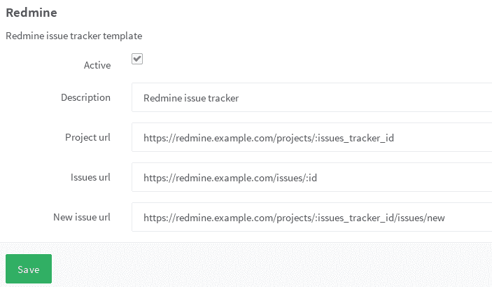

# Service templates

> 原文：[https://docs.gitlab.com/ee/user/project/integrations/services_templates.html](https://docs.gitlab.com/ee/user/project/integrations/services_templates.html)

*   [Enable a service template](#enable-a-service-template)
*   [Service for external issue trackers](#service-for-external-issue-trackers)

# Service templates

使用服务模板，GitLab 管理员可以提供用于在项目级别配置集成的默认值.

启用服务模板时，默认值将应用于**所有**尚未启用集成或未保存自定义值的项目. 这些值已预先填充在每个项目的配置页面上，以进行适用的集成.

如果禁用模板，这些值将不再显示为默认值，而已为集成保存的所有值将保持不变.

## Enable a service template

导航到**管理区域>服务模板，**然后选择要创建的服务模板.

## Service for external issue trackers

下图显示了 Redmine 的示例服务模板.

对于每个项目，您仍然需要通过将上述屏幕快照中的`:issues_tracker_id`替换为外部问题跟踪器使用的 ID 来配置问题跟踪 URL.