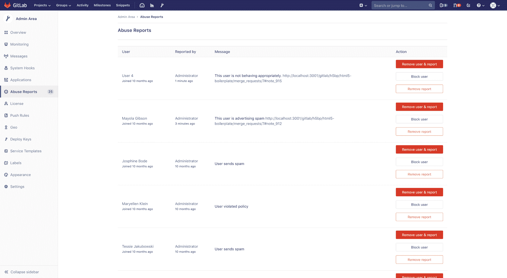
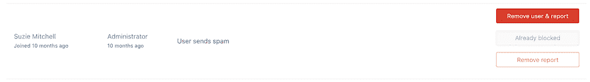

# Abuse reports

> 原文：[https://docs.gitlab.com/ee/user/admin_area/abuse_reports.html](https://docs.gitlab.com/ee/user/admin_area/abuse_reports.html)

*   [Reporting abuse](#reporting-abuse)
*   [Resolving abuse reports](#resolving-abuse-reports)
    *   [Blocking users](#blocking-users)

# Abuse reports[](#abuse-reports-core-only "Permalink")

查看和解决来自 GitLab 用户的滥用情况报告.

GitLab 管理员可以在管理区域中查看和[解决](#resolving-abuse-reports)滥用报告.

## Reporting abuse[](#reporting-abuse "Permalink")

要了解有关报告滥用情况的更多信息，请参阅[滥用报告用户文档](../abuse_reports.html) .

## Resolving abuse reports[](#resolving-abuse-reports "Permalink")

要访问滥用报告，请进入**管理区域>滥用报告** .

解决滥用情况报告的方法有 3 种，每种方法都有一个按钮：

*   删除用户和报告. 这将：
    *   从实例中[删除报告的用户](../profile/account/delete_account.html) .
    *   从列表中删除滥用报告.
*   [Block user](#blocking-users).
*   删除报告. 这将：
    *   从列表中删除滥用报告.
    *   删除报告用户的访问限制.

以下是" **滥用情况报告"**页面的示例：

[](img/abuse_reports_page.png)

### Blocking users[](#blocking-users "Permalink")

被阻止的用户无法登录或访问任何存储库，但是保留了他们的所有数据.

阻止用户：

*   Leaves them in the abuse report list.
*   将**阻止用户**按钮更改为禁用的**已阻止**按钮.

将通过[以下消息](https://gitlab.com/gitlab-org/gitlab/blob/master/app/workers/email_receiver_worker.rb#L38)通知用户：

```
Your account has been blocked. If you believe this is in error, contact a staff member. 
```

屏蔽后，您仍然可以：

*   删除用户并在必要时报告.
*   删除报告.

以下是" **滥用报告"**页面上列出的被阻止用户的示例：

[](img/abuse_report_blocked_user.png)

**注意：**用户可以[阻止](../../api/users.html#block-user)和[畅通](../../api/users.html#unblock-user)使用 GitLab API.