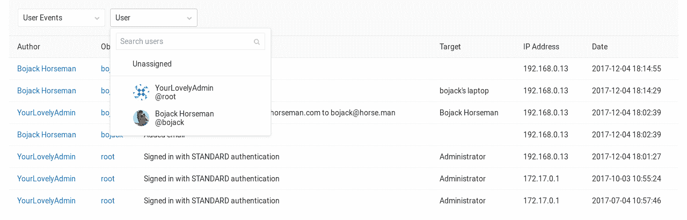

# Audit Events

> 原文：[https://docs.gitlab.com/ee/administration/audit_events.html](https://docs.gitlab.com/ee/administration/audit_events.html)

*   [Overview](#overview)
*   [Use cases](#use-cases)
*   [List of events](#list-of-events)
    *   [Impersonation data](#impersonation-data-premium)
    *   [Group events](#group-events-starter)
    *   [Project events](#project-events-starter)
    *   [Instance events](#instance-events-premium-only)
    *   [Missing events](#missing-events)
    *   [Disabled events](#disabled-events)
        *   [Repository push](#repository-push)

# Audit Events[](#audit-events-starter "Permalink")

GitLab 为拥有者和管理员提供了一种在[付费计划中](https://about.gitlab.com/pricing/)查看 GitLab 服务器中所做的更改的方法.

GitLab 系统管理员还可以利用文件系统上的日志. 有关更多详细信息，请参见[日志系统文档](logs.html) .

## Overview[](#overview "Permalink")

**审核事件**是 GitLab 所有者和管理员用于跟踪重要事件的工具，例如谁执行了某些操作及其发生的时间. 例如，这些操作可以是更改用户权限级别，添加新用户或删除用户.

## Use cases[](#use-cases "Permalink")

*   检查谁更改了 GitLab 项目的特定用户的权限级别.
*   跟踪哪些用户有权访问 GitLab 中的特定项目组，以及谁授予他们该权限级别.

## List of events[](#list-of-events "Permalink")

记录了两种事件：

*   事件范围为组或项目，组和项目经理使用这些事件来查找谁进行了更改.
*   实例事件的范围涵盖整个 GitLab 实例，由合规团队用于执行正式审核.

### Impersonation data[](#impersonation-data-premium "Permalink")

[Introduced](https://gitlab.com/gitlab-org/gitlab/-/issues/536) in [GitLab Premium](https://about.gitlab.com/pricing/) 13.0.

模拟是管理员使用凭据以其他用户身份执行操作的地方.

### Group events[](#group-events-starter "Permalink")

**注意：**您需要拥有者[权限](../user/permissions.html)才能查看组"审核事件"页面.

要查看组的审核事件，请导航至**组>设置>审核事件** . 从那里，您可以看到以下操作：

*   组名或路径已更改
*   组存储库大小限制已更改
*   创建或删除组
*   组更改可见性
*   用户已添加到组中并具有哪些[权限](../user/permissions.html)
*   用户通过[组 SAML](../user/group/saml_sso/index.html)登录
*   分配给组的用户的权限更改
*   从群组中删除了用户
*   项目存储库已导入组
*   [与组共享](../user/project/members/share_project_with_groups.html)并具有[权限的项目](../user/permissions.html)
*   删除项目中先前共享的组
*   启用或禁用 LFS
*   共享跑步者的分钟数限制已更改
*   启用或禁用会员锁定
*   请求访问已启用或已禁用
*   2FA 执行或宽限期已更改
*   允许创建项目的角色已更改

组事件也可以通过[组审核事件 API](../api/audit_events.html#group-audit-events-starter)访问

### Project events[](#project-events-starter "Permalink")

**注意：**您需要维护者[权限](../user/permissions.html)或更高[权限](../user/permissions.html)才能查看项目"审核事件"页面.

要查看项目的审核事件，请导航至**项目>设置>审核事件** . 从那里，您可以看到以下操作：

*   添加或删除了部署密钥
*   创建，删除，重命名，移动（转移），更改路径的项目
*   项目更改的可见性级别
*   用户已添加到项目中并具有哪些[权限](../user/permissions.html)
*   分配给项目的用户的权限更改
*   用户已从项目中删除
*   已下载项目导出
*   项目资源库已下载
*   项目已存档
*   项目未归档
*   添加，删除或更新的受保护分支
*   版本已添加到项目
*   版本已更新
*   发布里程碑关联已更改
*   更新了批准提交者合并请求的权限（在 GitLab 12.9 中[引入](https://gitlab.com/gitlab-org/gitlab/-/issues/7531) ）
*   更新了批准作者合并请求的权限（在 GitLab 12.9 中[引入](https://gitlab.com/gitlab-org/gitlab/-/issues/7531) ）
*   更新了所需的批准数量（在 GitLab 12.9 中[引入](https://gitlab.com/gitlab-org/gitlab/-/issues/7531) ）
*   在项目批准组中添加或删除用户和组（在 GitLab 13.2 中[引入](https://gitlab.com/gitlab-org/gitlab/-/issues/213603) ）

也可以通过[Project Audit Events API](../api/audit_events.html#project-audit-events-starter)访问[项目事件](../api/audit_events.html#project-audit-events-starter)

### Instance events[](#instance-events-premium-only "Permalink")

[Introduced](https://gitlab.com/gitlab-org/gitlab/-/issues/2336) in [GitLab Premium](https://about.gitlab.com/pricing/) 9.3.

服务器范围的审核日志记录引入了在 GitLab 服务器的整个实例中观察用户操作的功能，从而易于了解谁为审核目的以及何时更改了内容.

要查看服务器范围的管理日志，请访问**管理区域>监视>审核日志** .

除了组和项目事件，还记录以下用户操作：

*   登录失败
*   登录事件和身份验证类型（例如标准，LDAP 或 OmniAuth）
*   添加了 SSH 密钥
*   添加或删除电子邮件
*   修改密码
*   要求重设密码
*   授予 OAuth 访问权限
*   开始或停止模拟用户
*   更改的用户名（在 GitLab 12.8 中[引入](https://gitlab.com/gitlab-org/gitlab/-/issues/7797) ）
*   用户已删除（在 GitLab 12.8 中[引入](https://gitlab.com/gitlab-org/gitlab/-/issues/251) ）
*   添加了用户（在 GitLab 12.8 中[引入](https://gitlab.com/gitlab-org/gitlab/-/issues/251) ）
*   通过管理区（在 GitLab 12.8 中[引入](https://gitlab.com/gitlab-org/gitlab/-/issues/251) ）阻止了用户
*   通过 API（在 GitLab 12.9 中[引入](https://gitlab.com/gitlab-org/gitlab/-/merge_requests/25872) ）阻止了用户

通过从过滤器下拉框中选择审核数据类型，可以过滤特定的操作. 您可以进一步按特定的组，项目或用户筛选（用于身份验证事件）.

[](img/audit_log.png)

实例事件也可以通过[Instance Audit Events API](../api/audit_events.html#instance-audit-events-premium-only)访问

### Missing events[](#missing-events "Permalink")

在审核事件中未跟踪某些事件. 有关未跟踪哪些事件的更多详细信息，以及将这些事件添加到 GitLab 中的进展，请参见以下史诗：

*   [Project settings and activity](https://gitlab.com/groups/gitlab-org/-/epics/474)
*   [Group settings and activity](https://gitlab.com/groups/gitlab-org/-/epics/475)
*   [Instance-level settings and activity](https://gitlab.com/groups/gitlab-org/-/epics/476)

### Disabled events[](#disabled-events "Permalink")

#### Repository push[](#repository-push "Permalink")

当前的审计事件体系结构不准备接收大量记录. 这可能会使您的项目或审核日志的用户界面非常繁忙，并且`audit_events` PostgreSQL 表占用的磁盘空间将大大增加. 默认情况下禁用它，以防止 GitLab 实例具有很高的 Git 写入流量时性能降低.

在即将发布的版本中，默认情况下将启用 Git 推送事件的审核日志. 请按照[＃7865](https://gitlab.com/gitlab-org/gitlab/-/issues/7865)进行更新.

如果您仍然希望在实例中启用**存储库推送**事件，请执行以下步骤.

**在所有安装中；**

1.  进入 Rails 控制台：

    ```
    sudo gitlab-rails console 
    ```

2.  Flip the switch and enable the feature flag:

    ```
    Feature.enable(:repository_push_audit_event) 
    ```