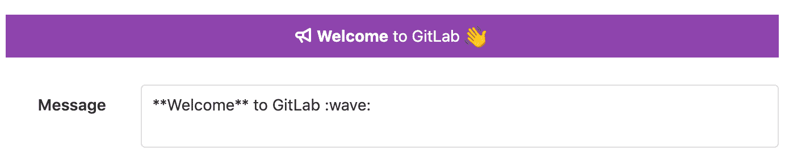
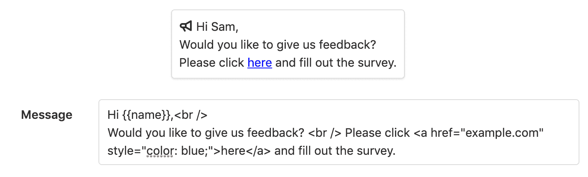

# Broadcast Messages

> 原文：[https://docs.gitlab.com/ee/user/admin_area/broadcast_messages.html](https://docs.gitlab.com/ee/user/admin_area/broadcast_messages.html)

*   [Banners](#banners)
*   [Notifications](#notifications)
*   [Adding a broadcast message](#adding-a-broadcast-message)
*   [Editing a broadcast message](#editing-a-broadcast-message)
*   [Deleting a broadcast message](#deleting-a-broadcast-message)

# Broadcast Messages[](#broadcast-messages-core-only "Permalink")

GitLab 可以向 GitLab 实例的所有用户显示广播消息. 广播消息有两种类型：

*   banners
*   notifications

您可以使用`a`和`br` HTML 标记来设置消息内容的样式. `br`标签插入换行符. `a` HTML 标记接受具有以下 CSS 属性的`class`和`style`属性：

*   `color`
*   `border`
*   `background`
*   `padding`
*   `margin`
*   `text-decoration`

## Banners[](#banners "Permalink")

标语显示在页面顶部和 Git 远程响应中.

[](img/broadcast_messages_banner_v12_10.png)

```
$ git push
...
remote:
remote: **Welcome** to GitLab :wave:
remote:
... 
```

## Notifications[](#notifications "Permalink")

通知显示在页面的右下角，并且可以包含占位符. 占位符替换为活动用户的属性. 占位符必须用花括号括起来，例如`{{name}}` . 可用的占位符是：

*   `{{email}}`
*   `{{name}}`
*   `{{user_id}}`
*   `{{username}}`
*   `{{instance_id}}`

如果用户未登录，则与用户相关的值将为空.

[](img/broadcast_messages_notification_v12_10.png)

广播消息可以使用[广播消息 API](../../api/broadcast_messages.html)进行管理.

**注意：**如果一次激活了多个横幅消息，则会按创建顺序将它们显示在堆栈中. 如果一次激活了多个通知消息，则仅显示最新消息.

## Adding a broadcast message[](#adding-a-broadcast-message "Permalink")

要向您的 GitLab 实例上的用户显示消息，请添加广播消息.

要添加广播消息：

1.  导航到" **管理区域">"消息"**页面.
2.  将消息的文本添加到" **消息"**字段. 支持 Markdown 和表情符号.
3.  如果需要，请单击" **自定义颜色"**链接以编辑消息的背景颜色和字体颜色.
4.  如果需要，添加**目标路径**以仅在与该路径匹配的 URL 上显示广播消息. 您可以使用通配符`*`来匹配多个 URL，例如`/users/*/issues` .
5.  选择消息的开始日期和结束日期.
6.  单击**添加广播消息**按钮.

**注意：**广播消息过期后，将不再显示在 UI 中，而是仍列在广播消息列表中. 如果设置了"可**禁用** "选项，则用户还可以关闭广播消息.

## Editing a broadcast message[](#editing-a-broadcast-message "Permalink")

如果需要更改广播消息，则可以对其进行编辑.

要编辑广播消息：

1.  导航到" **管理区域">"消息"**页面.
2.  从广播消息列表中，单击相应的按钮以编辑消息.
3.  进行所需的更改后，单击" **更新广播消息"**按钮.

**提示：**过期的邮件可以通过更改其结束日期来再次激活.

## Deleting a broadcast message[](#deleting-a-broadcast-message "Permalink")

可以删除不再需要的广播消息.

要删除广播消息：

1.  导航到" **管理区域">"消息"**页面.
2.  从广播消息列表中，单击相应的按钮以删除该消息.

删除后，广播消息将从广播消息列表中删除.

**注意：**广播消息可以在激活时删除.