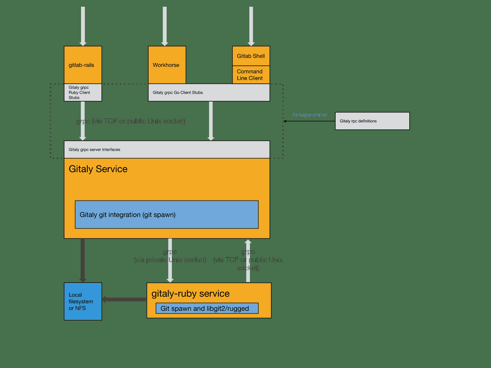

# Gitaly

> 原文：[https://docs.gitlab.com/ee/administration/gitaly/](https://docs.gitlab.com/ee/administration/gitaly/)

*   [Architecture](#architecture)
*   [Configure Gitaly](#configure-gitaly)
*   [Run Gitaly on its own server](#run-gitaly-on-its-own-server)
    *   [Network architecture](#network-architecture)
    *   [Install Gitaly](#install-gitaly)
    *   [Configure authentication](#configure-authentication)
    *   [Configure Gitaly servers](#configure-gitaly-servers)
    *   [Configure Gitaly clients](#configure-gitaly-clients)
        *   [Mixed configuration](#mixed-configuration)
    *   [Disable Gitaly where not required (optional)](#disable-gitaly-where-not-required-optional)
*   [Enable TLS support](#enable-tls-support)
    *   [Observe type of Gitaly connections](#observe-type-of-gitaly-connections)
*   [`gitaly-ruby`](#gitaly-ruby)
    *   [Configure number of `gitaly-ruby` workers](#configure-number-of-gitaly-ruby-workers)
*   [Limit RPC concurrency](#limit-rpc-concurrency)
*   [Rotate Gitaly authentication token](#rotate-gitaly-authentication-token)
    *   [Verify authentication monitoring](#verify-authentication-monitoring)
    *   [Enable “auth transitioning” mode](#enable-auth-transitioning-mode)
    *   [Update Gitaly authentication token](#update-gitaly-authentication-token)
    *   [Ensure there are no authentication failures](#ensure-there-are-no-authentication-failures)
    *   [Disable “auth transitioning” mode](#disable-auth-transitioning-mode)
    *   [Verify authentication is enforced](#verify-authentication-is-enforced)
*   [Direct Git access bypassing Gitaly](#direct-git-access-bypassing-gitaly)
*   [Direct access to Git in GitLab](#direct-access-to-git-in-gitlab)
    *   [History](#history)
    *   [How it works](#how-it-works)
    *   [Transition to Gitaly Cluster](#transition-to-gitaly-cluster)
*   [Troubleshooting Gitaly](#troubleshooting-gitaly)
    *   [Checking versions when using standalone Gitaly servers](#checking-versions-when-using-standalone-gitaly-servers)
    *   [`gitaly-debug`](#gitaly-debug)
    *   [Commits, pushes, and clones return a 401](#commits-pushes-and-clones-return-a-401)
    *   [Client side gRPC logs](#client-side-grpc-logs)
    *   [Observing `gitaly-ruby` traffic](#observing-gitaly-ruby-traffic)
    *   [Repository changes fail with a `401 Unauthorized` error](#repository-changes-fail-with-a-401-unauthorized-error)
    *   [Command line tools cannot connect to Gitaly](#command-line-tools-cannot-connect-to-gitaly)
    *   [Gitaly not listening on new address after reconfiguring](#gitaly-not-listening-on-new-address-after-reconfiguring)
    *   [Permission denied errors appearing in Gitaly logs when accessing repositories from a standalone Gitaly server](#permission-denied-errors-appearing-in-gitaly-logs-when-accessing-repositories-from-a-standalone-gitaly-server)
    *   [Praefect](#praefect)

# Gitaly[](#gitaly "Permalink")

[Gitaly](https://gitlab.com/gitlab-org/gitaly)是提供对 Git 存储库的高级 RPC 访问的服务. 没有它，任何 GitLab 组件都无法读取或写入 Git 数据.

在 Gitaly 文档中：

*   **Gitaly 服务器**是指任何本身运行 Gitaly 的节点.
*   **Gitaly 客户端**指的是任何运行向 Gitaly 服务器发出请求的进程的节点. 流程包括但不限于：
    *   [GitLab Rails 应用程序](https://gitlab.com/gitlab-org/gitlab) .
    *   [GitLab 外壳](https://gitlab.com/gitlab-org/gitlab-shell) .
    *   [亚搏体育 app Labhorse](https://gitlab.com/gitlab-org/gitlab-workhorse) .

GitLab 最终用户无法直接访问 Gitaly. Gitaly 仅管理 GitLab 的 Git 存储库访问. 其他类型的 GitLab 数据无法使用 Gitaly 访问.

**警告：**从 GitLab 13.0 起，不支持 Gitaly 对 NFS 的支持. 在 GitLab 14.0 中，计划删除对 NFS 的 Gitaly 支持. 尽快升级到[Gitaly Cluster](praefect.html) .

## Architecture[](#architecture "Permalink")

以下是有关如何使用 Gitaly 的高级体系结构概述.

[](img/architecture_v12_4.png)

## Configure Gitaly[](#configure-gitaly "Permalink")

Gitaly 服务本身是通过[TOML 配置文件配置的](reference.html) .

要更改 Gitaly 设置，请执行以下操作：

**对于所有 GitLab**

1.  编辑`/etc/gitlab/gitlab.rb`并添加或更改[Gitaly 设置](https://gitlab.com/gitlab-org/omnibus-gitlab/blob/1dd07197c7e5ae23626aad5a4a070a800b670380/files/gitlab-config-template/gitlab.rb.template#L1622-1676) .
2.  保存文件并[重新配置 GitLab](../restart_gitlab.html#omnibus-gitlab-reconfigure) .

**对于源安装**

1.  编辑`/home/git/gitaly/config.toml`并添加或更改[Gitaly 设置](https://gitlab.com/gitlab-org/gitaly/blob/master/config.toml.example) .
2.  保存文件并[重新启动 GitLab](../restart_gitlab.html#installations-from-source) .

以下配置选项也可用：

*   Enabling [TLS support](#enable-tls-support).
*   配置[`gitaly-ruby`工人](#configure-number-of-gitaly-ruby-workers)的[数量](#configure-number-of-gitaly-ruby-workers) .
*   Limiting [RPC concurrency](#limit-rpc-concurrency).

## Run Gitaly on its own server[](#run-gitaly-on-its-own-server "Permalink")

默认情况下，Gitaly 与 Gitaly 客户端在同一服务器上运行，并按[上述配置](#configure-gitaly) . 单服务器安装最好由以下默认配置使用：

*   [Omnibus GitLab](https://docs.gitlab.com/omnibus/).
*   GitLab [源代码安装指南](../../install/installation.html) .

However, Gitaly can be deployed to its own server, which can benefit GitLab installations that span multiple machines.

**注意：**配置为在自己的服务器上运行时， [必须先升级](https://docs.gitlab.com/omnibus/update/) Gitaly 服务器，然后才能在群集中的 Gitaly 客户端上[进行升级](https://docs.gitlab.com/omnibus/update/) .

在自己的服务器上设置 Gitaly 的过程是：

1.  [Install Gitaly](#install-gitaly).
2.  [Configure authentication](#configure-authentication).
3.  [Configure Gitaly servers](#configure-gitaly-servers).
4.  [Configure Gitaly clients](#configure-gitaly-clients).
5.  [Disable Gitaly where not required](#disable-gitaly-where-not-required-optional) (optional).

在自己的服务器上运行 Gitaly 时，请注意有关 GitLab 版本的以下内容：

*   从 GitLab 11.4 起，除了[Elasticsearch indexer](https://gitlab.com/gitlab-org/gitlab-elasticsearch-indexer)之外，Gitaly 能够满足所有 Git 请求，而无需为 Git 存储库数据共享 NFS 挂载.
*   从 GitLab 11.8 开始，Elasticsearch 索引器还使用 Gitaly 进行数据访问. NFS 仍可用于块级 Git 数据的冗余，但仅需安装在 Gitaly 服务器上.
*   从 GitLab 11.8 到 12.2，可以在不使用 NFS 的 Gitaly 设置中使用 Elasticsearch. 为了在这些版本中使用 Elasticsearch，必须在您的 GitLab 配置中启用[存储库索引器](../../integration/elasticsearch.html#elasticsearch-repository-indexer) .
*   [从 GitLab 12.3 开始](https://gitlab.com/gitlab-org/gitlab/-/issues/6481) ，新的索引器是默认的，不需要任何配置.

### Network architecture[](#network-architecture "Permalink")

以下列表描述了 Gitaly 的网络体系结构：

*   GitLab Rails shards repositories into [repository storages](../repository_storage_paths.html).
*   `/config/gitlab.yml`包含从存储名称到`(Gitaly address, Gitaly token)`对的`(Gitaly address, Gitaly token)` .
*   `/config/gitlab.yml`的`storage name` -> `(Gitaly address, Gitaly token)`映射是 Gitaly 网络拓扑的唯一事实来源.
*   `(Gitaly address, Gitaly token)`对应于 Gitaly 服务器.
*   Gitaly 服务器托管一个或多个存储.
*   一个 Gitaly 客户端可以使用一个或多个 Gitaly 服务器.
*   必须以对**所有** Gitaly 客户端正确解析的方式指定 Gitaly 地址.
*   Gitaly 客户包括：
    *   美洲狮或独角兽.
    *   Sidekiq.
    *   亚搏体育 app Labhorse.
    *   GitLab 外壳.
    *   Elasticsearch 索引器.
    *   Gitaly 本身.
*   一个 Gitaly 服务器必须能够通过其自身发出 RPC 调用**本身** `(Gitaly address, Gitaly token)`在指定的一对`/config/gitlab.yml` .
*   认证通过静态令牌完成，该令牌在 Gitaly 和 GitLab Rails 节点之间共享.

**危险：** Gitaly 服务器不得暴露于公共互联网，因为默认情况下 Gitaly 的网络流量未加密. 强烈建议使用防火墙，以限制对 Gitaly 服务器的访问. 另一种选择是[使用 TLS](#enable-tls-support) .

在以下各节中，我们描述如何使用秘密令牌`abc123secret`配置两个 Gitaly 服务器：

*   `gitaly1.internal`.
*   `gitaly2.internal`.

我们假设您的 GitLab 安装具有三个存储库存储：

*   `default`.
*   `storage1`.
*   `storage2`.

如果需要，一台服务器最多只能使用一个存储库.

**注意：** Gitaly 文档中引用的令牌只是管理员选择的任意密码. 它与为 GitLab API 创建的令牌或其他类似的 Web API 令牌无关.

### Install Gitaly[](#install-gitaly "Permalink")

使用 Omnibus GitLab 在每台 Gitaly 服务器上安装 Gitaly 或从源代码安装它：

*   对于 Omnibus GitLab，请[下载并安装](https://about.gitlab.com/install/)所需的 Omnibus GitLab 软件包，但**不要**提供`EXTERNAL_URL=`值.
*   要从源代码安装，请遵循[Install Gitaly 上](../../install/installation.html#install-gitaly)的步骤.

### Configure authentication[](#configure-authentication "Permalink")

Gitaly 和 GitLab 使用两个共享的机密进行身份验证：

*   一种用于向 Gitaly 验证 gRPC 请求的身份.
*   A second for authentication callbacks from GitLab Shell to the GitLab internal API.

**对于所有 GitLab**

要配置 Gitaly 令牌：

1.  在 Gitaly 客户端上，编辑`/etc/gitlab/gitlab.rb` ：

    ```
    gitlab_rails['gitaly_token'] = 'abc123secret' 
    ```

2.  保存文件并[重新配置 GitLab](../restart_gitlab.html#omnibus-gitlab-reconfigure) .
3.  在 Gitaly 服务器上，编辑`/etc/gitlab/gitlab.rb` ：

    ```
    gitaly['auth_token'] = 'abc123secret' 
    ```

4.  [Reconfigure GitLab](../restart_gitlab.html#omnibus-gitlab-reconfigure).

有两种方法可以配置 GitLab Shell 令牌.

方法 1：

1.  将`/etc/gitlab/gitlab-secrets.json`从 Gitaly 客户端复制到 Gitaly 服务器（和任何其他 Gitaly 客户端）上的相同路径.
2.  在 Gitaly 服务器上[重新配置 GitLab](../restart_gitlab.html#omnibus-gitlab-reconfigure) .

方法 2：

1.  在 Gitaly 客户端上，编辑`/etc/gitlab/gitlab.rb` ：

    ```
    gitlab_shell['secret_token'] = 'shellsecret' 
    ```

2.  保存文件并[重新配置 GitLab](../restart_gitlab.html#omnibus-gitlab-reconfigure) .
3.  在 Gitaly 服务器上，编辑`/etc/gitlab/gitlab.rb` ：

    ```
    gitlab_shell['secret_token'] = 'shellsecret' 
    ```

4.  [Reconfigure GitLab](../restart_gitlab.html#omnibus-gitlab-reconfigure).

**对于源安装**

1.  将`/home/git/gitlab/.gitlab_shell_secret`从 Gitaly 客户端复制到 Gitaly 服务器（和任何其他 Gitaly 客户端）上的相同路径.
2.  在 Gitaly 客户端上，编辑`/home/git/gitlab/config/gitlab.yml` ：

    ```
    gitlab:
      gitaly:
        token: 'abc123secret' 
    ```

3.  保存文件并[重新启动 GitLab](../restart_gitlab.html#installations-from-source) .
4.  在 Gitaly 服务器上，编辑`/home/git/gitaly/config.toml` ：

    ```
    [auth]
    token = 'abc123secret' 
    ```

5.  保存文件并[重新启动 GitLab](../restart_gitlab.html#installations-from-source) .

### Configure Gitaly servers[](#configure-gitaly-servers "Permalink")

在 Gitaly 服务器上，您必须配置存储路径并启用网络侦听器.

如果要减少启用身份验证时发生停机的风险，可以暂时禁用强制实施. 有关更多信息，请参阅有关配置[Gitaly 身份验证](https://gitlab.com/gitlab-org/gitaly/blob/master/doc/configuration/README.md#authentication)的文档.

**对于所有 GitLab**

1.  Edit `/etc/gitlab/gitlab.rb`:

    ```
    # /etc/gitlab/gitlab.rb

    # Avoid running unnecessary services on the Gitaly server
    postgresql['enable'] = false
    redis['enable'] = false
    nginx['enable'] = false
    puma['enable'] = false
    sidekiq['enable'] = false
    gitlab_workhorse['enable'] = false
    grafana['enable'] = false
    gitlab_exporter['enable'] = false

    # If you run a separate monitoring node you can disable these services
    alertmanager['enable'] = false
    prometheus['enable'] = false

    # If you don't run a separate monitoring node you can
    # enable Prometheus access & disable these extra services.
    # This makes Prometheus listen on all interfaces. You must use firewalls to restrict access to this address/port.
    # prometheus['listen_address'] = '0.0.0.0:9090'
    # prometheus['monitor_kubernetes'] = false

    # If you don't want to run monitoring services uncomment the following (not recommended)
    # node_exporter['enable'] = false

    # Prevent database connections during 'gitlab-ctl reconfigure'
    gitlab_rails['rake_cache_clear'] = false
    gitlab_rails['auto_migrate'] = false

    # Configure the gitlab-shell API callback URL. Without this, `git push` will
    # fail. This can be your 'front door' GitLab URL or an internal load
    # balancer.
    # Don't forget to copy `/etc/gitlab/gitlab-secrets.json` from Gitaly client to Gitaly server.
    gitlab_rails['internal_api_url'] = 'https://gitlab.example.com'

    # Make Gitaly accept connections on all network interfaces. You must use
    # firewalls to restrict access to this address/port.
    # Comment out following line if you only want to support TLS connections
    gitaly['listen_addr'] = "0.0.0.0:8075" 
    ```

2.  对于每个相应的 Gitaly 服务器，将以下内容附加到`/etc/gitlab/gitlab.rb` ：

    On `gitaly1.internal`:

    ```
    git_data_dirs({
      'default' => {
        'path' => '/var/opt/gitlab/git-data'
      },
      'storage1' => {
        'path' => '/mnt/gitlab/git-data'
      },
    }) 
    ```

    On `gitaly2.internal`:

    ```
    git_data_dirs({
      'storage2' => {
        'path' => '/srv/gitlab/git-data'
      },
    }) 
    ```

3.  保存文件并[重新配置 GitLab](../restart_gitlab.html#omnibus-gitlab-reconfigure) .
4.  运行`sudo /opt/gitlab/embedded/service/gitlab-shell/bin/check -config /opt/gitlab/embedded/service/gitlab-shell/config.yml`以确认 Gitaly 可以执行对 GitLab 内部 API 的回调.

**对于源安装**

1.  Edit `/home/git/gitaly/config.toml`:

    ```
    listen_addr = '0.0.0.0:8075'

    internal_socket_dir = '/var/opt/gitlab/gitaly'

    [logging]
    format = 'json'
    level = 'info'
    dir = '/var/log/gitaly' 
    ```

2.  对于每个相应的 Gitaly 服务器，将以下内容附加到`/home/git/gitaly/config.toml` ：

    On `gitaly1.internal`:

    ```
    [[storage]]
    name = 'default'
    path = '/var/opt/gitlab/git-data/repositories'

    [[storage]]
    name = 'storage1'
    path = '/mnt/gitlab/git-data/repositories' 
    ```

    On `gitaly2.internal`:

    ```
    [[storage]]
    name = 'storage2'
    path = '/srv/gitlab/git-data/repositories' 
    ```

3.  Edit `/home/git/gitlab-shell/config.yml`:

    ```
    gitlab_url: https://gitlab.example.com 
    ```

4.  保存文件并[重新启动 GitLab](../restart_gitlab.html#installations-from-source) .
5.  运行`sudo -u git /home/git/gitlab-shell/bin/check -config /home/git/gitlab-shell/config.yml`以确认 Gitaly 可以执行对 GitLab 内部 API 的回调.

### Configure Gitaly clients[](#configure-gitaly-clients "Permalink")

最后一步，您必须更新 Gitaly 客户端，使其从使用本地 Gitaly 服务切换为使用刚配置的 Gitaly 服务器.

这可能会有风险，因为任何阻止您的 Gitaly 客户端访问 Gitaly 服务器的操作都将导致所有 Gitaly 请求失败. 例如，任何类型的网络，防火墙或名称解析问题.

此外，如果以前手动启用，则必须[禁用 Rugged](../high_availability/nfs.html#improving-nfs-performance-with-gitlab) .

Gitaly 作以下假设：

*   你`gitaly1.internal` Gitaly 服务器可以达到`gitaly1.internal:8075`从 Gitaly 客户端，以及 Gitaly 服务器可以读取和写入`/mnt/gitlab/default`和`/mnt/gitlab/storage1` .
*   你`gitaly2.internal` Gitaly 服务器可以达到`gitaly2.internal:8075`从 Gitaly 客户端，以及 Gitaly 服务器可以读取和写入`/mnt/gitlab/storage2` .
*   您的`gitaly1.internal`和`gitaly2.internal` Gitaly 服务器可以相互访问.

除非您使用特殊的[混合配置进行](#mixed-configuration)设置，否则不能将 Gitaly 服务器定义为本地 Gitaly 服务器（不带`gitaly_address` ），而`gitaly_address`一些服务器定义为远程服务器（带`gitaly_address` ）.

**对于所有 GitLab**

1.  Edit `/etc/gitlab/gitlab.rb`:

    ```
    git_data_dirs({
      'default' => { 'gitaly_address' => 'tcp://gitaly1.internal:8075' },
      'storage1' => { 'gitaly_address' => 'tcp://gitaly1.internal:8075' },
      'storage2' => { 'gitaly_address' => 'tcp://gitaly2.internal:8075' },
    }) 
    ```

2.  保存文件并[重新配置 GitLab](../restart_gitlab.html#omnibus-gitlab-reconfigure) .
3.  运行`sudo gitlab-rake gitlab:gitaly:check`确认 Gitaly 客户端可以连接到 Gitaly 服务器.
4.  拖尾日志以查看请求：

    ```
    sudo gitlab-ctl tail gitaly 
    ```

**对于源安装**

1.  Edit `/home/git/gitlab/config/gitlab.yml`:

    ```
    gitlab:
      repositories:
        storages:
          default:
            gitaly_address: tcp://gitaly1.internal:8075
            path: /some/dummy/path
          storage1:
            gitaly_address: tcp://gitaly1.internal:8075
            path: /some/dummy/path
          storage2:
            gitaly_address: tcp://gitaly2.internal:8075
            path: /some/dummy/path 
    ```

    **注意：** `/some/dummy/path`应该设置为存在的本地文件夹，但是该文件夹中不会存储任何数据. 解决[此问题](https://gitlab.com/gitlab-org/gitaly/-/issues/1282)后，将不再需要[此操作](https://gitlab.com/gitlab-org/gitaly/-/issues/1282) .
2.  Save the file and [restart GitLab](../restart_gitlab.html#installations-from-source).
3.  运行`sudo -u git -H bundle exec rake gitlab:gitaly:check RAILS_ENV=production`确认 Gitaly 客户端可以连接到 Gitaly 服务器.
4.  拖尾日志以查看请求：

    ```
    tail -f /home/git/gitlab/log/gitaly.log 
    ```

尾随 Gitaly 服务器上的 Gitaly 登录时，您应该会看到请求进入.触发 Gitaly 请求的一种可靠方法是通过 HTTP 或 HTTPS 从 GitLab 克隆存储库.

**危险：**如果已针对每个存储库或全局配置了[服务器挂钩](../server_hooks.html) ，则必须将它们移至 Gitaly 服务器. 如果您有多个 Gitaly 服务器，则将服务器挂钩复制到所有 Gitaly 服务器.

#### Mixed configuration[](#mixed-configuration "Permalink")

GitLab 可以与许多 Gitaly 服务器之一驻留在同一服务器上，但是不支持混合本地和远程配置的配置. 以下设置不正确，因为：

*   所有地址都必须可从其他 Gitaly 服务器访问.
*   `storage1`分配了一个`gitaly_address` Unix 套接字，该套接字对于某些 Gitaly 服务器无效.

```
git_data_dirs({
  'default' => { 'gitaly_address' => 'tcp://gitaly1.internal:8075' },
  'storage1' => { 'path' => '/mnt/gitlab/git-data' },
  'storage2' => { 'gitaly_address' => 'tcp://gitaly2.internal:8075' },
}) 
```

要组合本地和远程 Gitaly 服务器，请为本地 Gitaly 服务器使用一个外部地址. 例如：

```
git_data_dirs({
  'default' => { 'gitaly_address' => 'tcp://gitaly1.internal:8075' },
  # Address of the GitLab server that has Gitaly running on it
  'storage1' => { 'gitaly_address' => 'tcp://gitlab.internal:8075', 'path' => '/mnt/gitlab/git-data' },
  'storage2' => { 'gitaly_address' => 'tcp://gitaly2.internal:8075' },
}) 
```

`path`只能包含在本地 Gitaly 服务器上的存储分片中. 如果不包含，则默认的 Git 存储目录将用于该存储碎片.

### Disable Gitaly where not required (optional)[](#disable-gitaly-where-not-required-optional "Permalink")

如果您将 Gitaly [作为远程服务](#run-gitaly-on-its-own-server)运行，则可能要禁用默认情况下在您的 GitLab 服务器上运行的本地 Gitaly 服务，而仅在需要时运行它.

仅当您在自定义群集配置中运行 GitLab 时，才在 GitLab 实例上禁用 Gitaly 才有意义，在该配置中，Gitaly 在与 GitLab 实例不同的机器上运行. 在群集中的所有计算机上禁用 Gitaly 并不是有效的配置（某些计算机充当 Gitaly 服务器）.

To disable Gitaly on a GitLab server:

**对于所有 GitLab**

1.  Edit `/etc/gitlab/gitlab.rb`:

    ```
    gitaly['enable'] = false 
    ```

2.  保存文件并[重新配置 GitLab](../restart_gitlab.html#omnibus-gitlab-reconfigure) .

**对于源安装**

1.  Edit `/etc/default/gitlab`:

    ```
    gitaly_enabled=false 
    ```

2.  保存文件并[重新启动 GitLab](../restart_gitlab.html#installations-from-source) .

## Enable TLS support[](#enable-tls-support "Permalink")

在 GitLab 11.8 中[引入](https://gitlab.com/gitlab-org/gitlab-foss/-/merge_requests/22602) .

Gitaly 支持 TLS 加密. 要与侦听安全连接的 Gitaly 实例进行通信，必须在 GitLab 配置中相应存储条目的`gitaly_address`中使用`tls://` URL 方案.

您必须提供自己的证书，因为不会自动提供. 与每个 Gitaly 服务器相对应的证书必须安装在该 Gitaly 服务器上.

此外，证书（或其证书颁发机构）必须安装在所有以下组件上：

*   Gitaly 服务器，包括使用证书的 Gitaly 服务器.
*   与之通信的 Gitaly 客户.

该过程记录在[GitLab 自定义证书配置中，](https://docs.gitlab.com/omnibus/settings/ssl.html)并在下面重复进行.

请注意以下几点：

*   证书必须指定用于访问 Gitaly 服务器的地址. 如果你是：
    *   通过主机名寻址 Gitaly 服务器，您可以为此使用"公用名"字段，也可以将其添加为"使用者备用名".
    *   通过其 IP 地址寻址 Gitaly 服务器，必须将其作为主题备用名称添加到证书中. [gRPC 不支持在证书中使用 IP 地址作为公用名](https://github.com/grpc/grpc/issues/2691) .
*   您可以同时为 Gitaly 服务器配置未加密的侦听地址`listen_addr`和已加密的侦听地址`tls_listen_addr` . 这使您可以根据需要从未加密的流量逐渐过渡到加密的流量.

要使用 TLS 配置 Gitaly：

**对于所有 GitLab**

1.  为 Gitaly 服务器创建证书.
2.  在 Gitaly 客户端上，将证书（或其证书颁发机构）复制到`/etc/gitlab/trusted-certs` ：

    ```
    sudo cp cert.pem /etc/gitlab/trusted-certs/ 
    ```

3.  在 Gitaly 客户端上，如下所示在`/etc/gitlab/gitlab.rb`编辑`git_data_dirs` ：

    ```
    git_data_dirs({
      'default' => { 'gitaly_address' => 'tls://gitaly1.internal:9999' },
      'storage1' => { 'gitaly_address' => 'tls://gitaly1.internal:9999' },
      'storage2' => { 'gitaly_address' => 'tls://gitaly2.internal:9999' },
    }) 
    ```

4.  保存文件并[重新配置 GitLab](../restart_gitlab.html#omnibus-gitlab-reconfigure) .
5.  在 Gitaly 服务器上，创建`/etc/gitlab/ssl`目录，然后在其中复制密钥和证书：

    ```
    sudo mkdir -p /etc/gitlab/ssl
    sudo chmod 755 /etc/gitlab/ssl
    sudo cp key.pem cert.pem /etc/gitlab/ssl/
    sudo chmod 644 key.pem cert.pem 
    ```

6.  将所有 Gitaly 服务器证书（或其证书颁发机构）复制到`/etc/gitlab/trusted-certs`以便 Gitaly 服务器在调用自身或其他 Gitaly 服务器时将信任该证书：

    ```
    sudo cp cert1.pem cert2.pem /etc/gitlab/trusted-certs/ 
    ```

7.  编辑`/etc/gitlab/gitlab.rb`并添加：

    ```
    gitaly['tls_listen_addr'] = "0.0.0.0:9999"
    gitaly['certificate_path'] = "/etc/gitlab/ssl/cert.pem"
    gitaly['key_path'] = "/etc/gitlab/ssl/key.pem" 
    ```

8.  保存文件并[重新配置 GitLab](../restart_gitlab.html#omnibus-gitlab-reconfigure) .
9.  通过[观察 Gitaly 连接的类型，](#observe-type-of-gitaly-connections)验证通过 TLS 提供服务的 Gitaly 通信.
10.  （可选）通过以下方式提高安全性：
    1.  通过注释或删除禁用非 TLS 连接`gitaly['listen_addr']`中`/etc/gitlab/gitlab.rb` .
    2.  保存文件.
    3.  [重新配置 GitLab](../restart_gitlab.html#omnibus-gitlab-reconfigure) .

**对于源安装**

1.  为 Gitaly 服务器创建证书.
2.  在 Gitaly 客户端上，将证书复制到系统受信任的证书中：

    ```
    sudo cp cert.pem /usr/local/share/ca-certificates/gitaly.crt
    sudo update-ca-certificates 
    ```

3.  在 Gitaly 客户端上，如下所示在`/home/git/gitlab/config/gitlab.yml`编辑`storages` ：

    ```
    gitlab:
      repositories:
        storages:
          default:
            gitaly_address: tls://gitaly1.internal:9999
            path: /some/dummy/path
          storage1:
            gitaly_address: tls://gitaly1.internal:9999
            path: /some/dummy/path
          storage2:
            gitaly_address: tls://gitaly2.internal:9999
            path: /some/dummy/path 
    ```

    **注意：** `/some/dummy/path`应该设置为存在的本地文件夹，但是该文件夹中不会存储任何数据. 解决[Gitaly 问题＃1282](https://gitlab.com/gitlab-org/gitaly/-/issues/1282)之后，将不再需要此操作.
4.  保存文件并[重新启动 GitLab](../restart_gitlab.html#installations-from-source) .
5.  在 Gitaly 服务器上，创建或编辑`/etc/default/gitlab`并添加：

    ```
    export SSL_CERT_DIR=/etc/gitlab/ssl 
    ```

6.  在 Gitaly 服务器上，创建`/etc/gitlab/ssl`目录，然后在其中复制密钥和证书：

    ```
    sudo mkdir -p /etc/gitlab/ssl
    sudo chmod 755 /etc/gitlab/ssl
    sudo cp key.pem cert.pem /etc/gitlab/ssl/
    sudo chmod 644 key.pem cert.pem 
    ```

7.  将所有 Gitaly 服务器证书（或其证书颁发机构）复制到系统受信任证书文件夹，以便 Gitaly 服务器在调用自身或其他 Gitaly 服务器时将信任该证书.

    ```
    sudo cp cert.pem /usr/local/share/ca-certificates/gitaly.crt
    sudo update-ca-certificates 
    ```

8.  编辑`/home/git/gitaly/config.toml`并添加：

    ```
    tls_listen_addr = '0.0.0.0:9999'

    [tls]
    certificate_path = '/etc/gitlab/ssl/cert.pem'
    key_path = '/etc/gitlab/ssl/key.pem' 
    ```

9.  保存文件并[重新启动 GitLab](../restart_gitlab.html#installations-from-source) .
10.  通过[观察 Gitaly 连接的类型，](#observe-type-of-gitaly-connections)验证通过 TLS 提供服务的 Gitaly 通信.
11.  （可选）通过以下方式提高安全性：
    1.  通过注释掉或删除`/home/git/gitaly/config.toml` `listen_addr`来禁用非 TLS 连接.
    2.  保存文件.
    3.  [重新启动 GitLab](../restart_gitlab.html#installations-from-source) .

### Observe type of Gitaly connections[](#observe-type-of-gitaly-connections "Permalink")

可以使用[Prometheus](../monitoring/prometheus/index.html)观察 Gitaly 为生产环境提供服务的连接类型. 使用以下 Prometheus 查询：

```
sum(rate(gitaly_connections_total[5m])) by (type) 
```

## `gitaly-ruby`[](#gitaly-ruby "Permalink")

开发 Gitaly 是为了替代 GitLab 中的 Ruby 应用程序代码.

为了节省时间并避免重写现有应用程序逻辑的风险，我们选择将一些应用程序代码从 GitLab 复制到 Gitaly.

为了能够运行该代码，创建了`gitaly-ruby` ，它是主要 Gitaly Go 流程的" sidecar"流程. 在`gitaly-ruby`中实现的一些示例如下：

*   处理 Wiki 的 RPC.
*   代表用户创建提交的 RPC，例如合并提交.

### Configure number of `gitaly-ruby` workers[](#configure-number-of-gitaly-ruby-workers "Permalink")

`gitaly-ruby`容量比 Go 中实现的 Gitaly 少得多. 如果您的 Gitaly 服务器必须处理大量请求，则仅设置一个活动的`gitaly-ruby`车的默认设置可能不够.

如果您看到 Gitaly 出现`ResourceExhausted`错误，则很可能是您的`gitaly-ruby`能力不足.

您可以使用以下设置来增加 Gitaly 服务器上的`gitaly-ruby`进程数：

**对于所有 GitLab**

1.  Edit `/etc/gitlab/gitlab.rb`:

    ```
    # Default is 2 workers. The minimum is 2; 1 worker is always reserved as
    # a passive stand-by.
    gitaly['ruby_num_workers'] = 4 
    ```

2.  保存文件并[重新配置 GitLab](../restart_gitlab.html#omnibus-gitlab-reconfigure) .

**对于源安装**

1.  Edit `/home/git/gitaly/config.toml`:

    ```
    [gitaly-ruby]
    num_workers = 4 
    ```

2.  保存文件并[重新启动 GitLab](../restart_gitlab.html#installations-from-source) .

## Limit RPC concurrency[](#limit-rpc-concurrency "Permalink")

克隆流量可能会对您的 Gitaly 服务造成很大的压力. 大部分工作在以下任一 RPC 中完成：

*   `SSHUploadPack` （用于 Git SSH）.
*   `PostUploadPack` （用于 Git HTTP）.

为了防止此类工作负载使您的 Gitaly 服务器不堪重负，您可以在 Gitaly 的配置文件中设置并发限制. 例如：

```
# in /etc/gitlab/gitlab.rb

gitaly['concurrency'] = [
  {
    'rpc' => "/gitaly.SmartHTTPService/PostUploadPack",
    'max_per_repo' => 20
  },
  {
    'rpc' => "/gitaly.SSHService/SSHUploadPack",
    'max_per_repo' => 20
  }
] 
```

这限制了给定 RPC 正在进行的 RPC 调用的数量. 该限制适用于每个存储库. 在上面的示例中：

*   Gitaly 服务器提供服务的每个存储库最多可以同时`PostUploadPack` 20 个`PostUploadPack` RPC 调用，而`SSHUploadPack`则相同.
*   如果另一个请求进入了已用完其 20 个插槽的存储库，则该请求将排队.

您可以使用 Gitaly 日志和 Prometheus 观察此队列的行为：

*   在 Gitaly 日志中，查找字符串（或结构化日志字段） `acquire_ms` . 具有此字段的消息正在报告有关并发限制器的信息.
*   在 Prometheus 中，查找以下指标：

    *   `gitaly_rate_limiting_in_progress`.
    *   `gitaly_rate_limiting_queued`.
    *   `gitaly_rate_limiting_seconds`.

**注意：**尽管 Prometheus 度量标准的名称包含`rate_limiting` ，但它是并发限制器，而不是速率限制器. 如果 Gitaly 客户端非常快地连续发出 1000 个请求，则并发不会超过 1，并且并发限制器无效.

## Rotate Gitaly authentication token[](#rotate-gitaly-authentication-token "Permalink")

在生产环境中轮换凭证通常需要停机，导致停机或两者兼而有之.

但是，您可以旋转 Gitaly 凭据而不会中断服务. 旋转 Gitaly 身份验证令牌涉及：

*   [Verifying authentication monitoring](#verify-authentication-monitoring).
*   [Enabling “auth transitioning” mode](#enable-auth-transitioning-mode).
*   [Updating Gitaly authentication tokens](#update-gitaly-authentication-token).
*   [Ensuring there are no authentication failures](#ensure-there-are-no-authentication-failures).
*   [Disabling “auth transitioning” mode](#disable-auth-transitioning-mode).
*   [Verifying authentication is enforced](#verify-authentication-is-enforced).

如果您在单个服务器上运行 GitLab，则此过程也适用. 在这种情况下，" Gitaly 服务器"和" Gitaly 客户端"是指同一台计算机.

### Verify authentication monitoring[](#verify-authentication-monitoring "Permalink")

旋转 Gitaly 身份验证令牌之前，请验证您可以使用 Prometheus 监视 GitLab 安装的身份验证行为. 使用以下 Prometheus 查询：

```
sum(rate(gitaly_authentications_total[5m])) by (enforced, status) 
```

在正确配置了身份验证并且您拥有实时流量的系统中，您将看到以下内容：

```
{enforced="true",status="ok"}  4424.985419441742 
```

可能还存在速率为 0 的其他数字.我们只关心非零数字.

唯一的非零数字应具有`enforced="true",status="ok"` . 如果您还有其他非零数字，则说明您的配置有问题.

`status="ok"`数字反映您当前的请求率. 在上面的示例中，Gitaly 每秒处理大约 4000 个请求.

既然您已经确定可以监视 GitLab 安装的 Gitaly 身份验证行为，则可以开始其余过程.

### Enable “auth transitioning” mode[](#enable-auth-transitioning-mode "Permalink")

通过将 Gitaly 服务器置于"身份验证过渡"模式，从而暂时禁用 Gitaly 服务器上的 Gitaly 身份验证，如下所示：

```
# in /etc/gitlab/gitlab.rb
gitaly['auth_transitioning'] = true 
```

进行此更改后，您的[Prometheus 查询](#verify-authentication-monitoring)应返回如下内容：

```
{enforced="false",status="would be ok"}  4424.985419441742 
```

因为`enforced="false"` ，所以可以安全地开始部署新令牌.

### Update Gitaly authentication token[](#update-gitaly-authentication-token "Permalink")

要在每个 Gitaly 客户端**和** Gitaly 服务器上更新为新的 Gitaly 身份验证令牌，请执行以下操作：

1.  更新配置：

    ```
    # in /etc/gitlab/gitlab.rb

    gitaly['auth_token'] = '<new secret token>' 
    ```

2.  重新启动 Gitaly：

    ```
    gitlab-ctl restart gitaly 
    ```

如果在实施此更改的同时运行[Prometheus 查询](#verify-authentication-monitoring) ，您将看到被`enforced="false",status="denied"`计数器的非零值.

### Ensure there are no authentication failures[](#ensure-there-are-no-authentication-failures "Permalink")

设置新令牌并重新启动所有涉及的服务之后，您将[临时看到以下内容](#verify-authentication-monitoring)的组合：

*   `status="would be ok"`.
*   `status="denied"`.

在所有 Gitaly 客户端和 Gitaly 服务器获取了新令牌之后，应`enforced="false",status="would be ok"` **唯一的非零费率** `enforced="false",status="would be ok"` .

### Disable “auth transitioning” mode[](#disable-auth-transitioning-mode "Permalink")

要重新启用 Gitaly 身份验证，请禁用"身份验证转换"模式. 如下更新您的 Gitaly 服务器上的配置：

```
# in /etc/gitlab/gitlab.rb
gitaly['auth_transitioning'] = false 
```

**警告：**如果不完成此步骤，则**没有 Gitaly 身份验证** .

### Verify authentication is enforced[](#verify-authentication-is-enforced "Permalink")

刷新您的[Prometheus 查询](#verify-authentication-monitoring) . 现在，您应该会看到与开始时相似的结果. 例如：

```
{enforced="true",status="ok"}  4424.985419441742 
```

请注意， `enforced="true"`表示正在执行身份验证.

## Direct Git access bypassing Gitaly[](#direct-git-access-bypassing-gitaly "Permalink")

虽然可以使用 Git 客户端直接访问磁盘上存储的 Gitaly 存储库，但由于不断改进和更改 Gitaly，因此不建议这样做. 这些改进可能会使假设无效，从而导致性能下降，不稳定甚至数据丢失.

Gitaly 进行了优化，例如[`info/refs`广告缓存](https://gitlab.com/gitlab-org/gitaly/blob/master/doc/design_diskcache.md) ，它依赖于 Gitaly 通过官方 gRPC 接口控制和监视对存储库的访问. 同样，Praefect 具有优化功能，例如容错和分布式读取，这些优化取决于 gRPC 接口和数据库来确定存储库状态.

由于这些原因， **直接访问存储库需要您自担风险，并且不受支持** .

## Direct access to Git in GitLab[](#direct-access-to-git-in-gitlab "Permalink")

直接访问 Git 使用 GitLab 中称为" Rugged patch"的代码.

### History[](#history "Permalink")

在 Gitaly 存在之前，现在 Gitaly 客户端用来直接访问 Git 存储库的是：

*   如果是单机 Omnibus GitLab 安装，则在本地磁盘上
*   如果是水平缩放的 GitLab 安装，请使用 NFS.

除了运行简单的`git`命令之外，GitLab 还使用了一个名为[Rugged](https://github.com/libgit2/rugged)的 Ruby 库. Rugged 是围绕[libgit2](https://libgit2.org/)的包装， [libgit2](https://libgit2.org/)是 C 库形式的 Git 的独立实现.

随着时间的流逝，很明显 Rugged（特别是与[Unicorn](https://yhbt.net/unicorn/)结合使用）非常有效. 因为`libgit2`是一个库而不是一个外部进程，所以之间的开销很小：

*   GitLab 应用程序代码试图在 Git 存储库中查找数据.
*   Git 实现本身.

由于 Rugged 和 Unicorn 的组合是如此有效，因此 GitLab 的应用程序代码最终会进行大量重复的 Git 对象查找. 例如，查找`master`在一个请求中提交了十几次. 我们可以编写效率低下的代码而不会降低性能.

当我们将这些 Git 查找迁移到 Gitaly 调用时，我们突然发现每个 Git 查找的固定成本要高得多. 即使 Gitaly 能够重新使用已经在运行的`git`进程（例如，查找提交），您仍然可以：

*   往返于 Gitaly 的网络费用.
*   在 Gitaly 中，是将 Gitaly 连接到`git`进程的 Unix 管道上的写入/读取往返.

使用 GitLab.com 进行测量，我们减少了每个请求的 Gitaly 呼叫次数，直到不再感觉到 Rugged 效率的下降. 这也有助于我们直接在 Git 文件服务器上运行 Gitaly 本身，而不是通过 NFS 挂载. 这给了我们提速，抵消了不再使用 Rugged 带来的负面影响.

不幸的是，GitLab 的其他部署无法像我们在 GitLab.com 上那样删除 NFS，这两个方面都是最糟糕的：

*   NFS 的速度较慢.
*   The increased inherent overhead of Gitaly.

在 Gitaly 迁移项目期间从 GitLab 中删除的代码影响了这些部署. 作为这些基于 NFS 的部署的性能变通办法，我们重新引入了一些旧的 Rugged 代码. 重新引入的代码被非正式地称为" Rugged patch".

### How it works[](#how-it-works "Permalink")

执行直接 Git 访问的 Ruby 方法位于[功能标志的](../../development/gitaly.html#legacy-rugged-code)后面，默认情况下处于禁用状态. 设置功能标记以获得最佳性能并不方便，因此我们添加了一种自动机制，可以直接访问 Git.

当 GitLab 调用具有"加固补丁"的函数时，它将执行两项检查：

*   数据库中是否设置了此补丁程序的功能标志？ 如果是这样，功能标记设置将控制 GitLab 对"坚固补丁"代码的使用.
*   如果未设置功能标志，则 GitLab 尝试直接访问 Gitaly 服务器下方的文件系统. 如果可以，它将使用" Rugged patch".

这两个检查的结果都被缓存.

为了查看 GitLab 是否可以直接访问存储库文件系统，我们使用以下启发式：

*   Gitaly 确保文件系统在其根目录中具有一个带有 UUID 的元数据文件.
*   Gitaly 通过`ServerInfo` RPC 将此 UUID 报告给 GitLab.
*   GitLab Rails 尝试直接读取元数据文件. 如果存在，并且 UUID 匹配，则假定我们具有直接访问权限.

默认情况下，在 Omnibus GitLab 中启用直接 Git 访问，因为它会在 GitLab 配置文件`config/gitlab.yml`填写正确的存储库路径. 这满足了 UUID 检查.

### Transition to Gitaly Cluster[](#transition-to-gitaly-cluster "Permalink")

为了消除复杂性，我们必须删除 GitLab 中的直接 Git 访问. 但是，只要某些 GitLab 安装需要 NFS 上的 Git 存储库，我们就无法删除它.

我们在 GitLab 中删除直接 Git 访问的工作有两个方面：

*   减少 GitLab 进行的低效率 Gitaly 查询的数量.
*   说服容错或水平扩展的 GitLab 实例的管理员从 NFS 迁移.

第二个方面是唯一真正的解决方案. 为此，我们开发了[Gitaly Cluster](praefect.html) .

## Troubleshooting Gitaly[](#troubleshooting-gitaly "Permalink")

### Checking versions when using standalone Gitaly servers[](#checking-versions-when-using-standalone-gitaly-servers "Permalink")

使用独立的 Gitaly 服务器时，必须确保它们与 GitLab 的版本相同，以确保完全兼容. 检查您的 GitLab 实例上的**管理区域> Gitaly 服务器** ，并确认所有 Gitaly 服务器都是`Up to date` .

[](img/gitlab_gitaly_version_mismatch_v12_4.png)

### `gitaly-debug`[](#gitaly-debug "Permalink")

`gitaly-debug`命令提供用于" Gitaly"和" Git"性能的"生产调试"工具. 它旨在帮助生产工程师和支持工程师调查 Gitaly 性能问题.

如果您使用的是 GitLab 11.6 或更高版本，则此工具应已安装在您的 GitLab / Gitaly 服务器上，位于`/opt/gitlab/embedded/bin/gitaly-debug` . 如果要研究旧版本的 GitLab，可以离线编译此工具，然后将可执行文件复制到服务器：

```
git clone https://gitlab.com/gitlab-org/gitaly.git
cd cmd/gitaly-debug
GOOS=linux GOARCH=amd64 go build -o gitaly-debug 
```

要查看`gitaly-debug`的帮助页面以`gitaly-debug`受支持的子命令列表，请运行：

```
gitaly-debug -h 
```

### Commits, pushes, and clones return a 401[](#commits-pushes-and-clones-return-a-401 "Permalink")

```
remote: GitLab: 401 Unauthorized 
```

您将需要将`gitlab-secrets.json`文件与 Gitaly 客户端（GitLab 应用程序节点）同步.

### Client side gRPC logs[](#client-side-grpc-logs "Permalink")

Gitaly 使用[gRPC](https://grpc.io/) RPC 框架. Ruby gRPC 客户端具有自己的日志文件，当您看到 Gitaly 错误时，该文件可能包含有用的信息. 您可以使用`GRPC_LOG_LEVEL`环境变量控制 gRPC 客户端的日志级别. 默认级别为`WARN` .

您可以使用以下命令运行 gRPC 跟踪：

```
sudo GRPC_TRACE=all GRPC_VERBOSITY=DEBUG gitlab-rake gitlab:gitaly:check 
```

### Observing `gitaly-ruby` traffic[](#observing-gitaly-ruby-traffic "Permalink")

[`gitaly-ruby`](#gitaly-ruby)是[`gitaly-ruby`](#gitaly-ruby)的内部实现细节，因此，对`gitaly-ruby`流程内部发生的情况`gitaly-ruby` .

如果已设置 Prometheus 来抓取 Gitaly 进程，则可以通过查询`grpc_client_handled_total`来`grpc_client_handled_total` `gitaly-ruby`各个 RPC 的请求率和错误代码. 严格来说，此度量标准并未区分`gitaly-ruby`和其他 RPC，但实际上（自 GitLab 11.9 起），Gitaly 本身进行的所有 gRPC 调用都是从 Gitaly 主过程到其`gitaly-ruby`边车之一的内部调用.

假设您的`grpc_client_handled_total`计数器仅观察到 Gitaly，以下查询将显示 RPC 在内部（最有可能）实现为对`gitaly-ruby`调用：

```
sum(rate(grpc_client_handled_total[5m])) by (grpc_method) > 0 
```

### Repository changes fail with a `401 Unauthorized` error[](#repository-changes-fail-with-a-401-unauthorized-error "Permalink")

如果您在自己的服务器上运行 Gitaly，并注意到用户可以成功克隆和获取存储库（通过 SSH 和 HTTPS），但是在未获得`401 Unauthorized`情况下，无法推送到它们或在 Web UI 中对存储库进行更改消息，那么 Gitaly 可能由于拥有[错误的 secrets 文件](#configure-gitaly-servers)而无法通过 Gitaly 客户端进行身份验证.

确认以下所有内容均正确：

*   When any user performs a `git push` to any repository on this Gitaly server, it fails with the following error (note the `401 Unauthorized`):

    ```
    remote: GitLab: 401 Unauthorized
    To <REMOTE_URL>
    ! [remote rejected] branch-name -> branch-name (pre-receive hook declined)
    error: failed to push some refs to '<REMOTE_URL>' 
    ```

*   当任何用户使用 GitLab UI 从存储库添加或修改文件时，该文件都会立即失败，并显示红色`401 Unauthorized`横幅.
*   创建一个新项目并[使用 README 对其进行初始化会](../../gitlab-basics/create-project.html#blank-projects)成功创建该项目，但不会创建 README.
*   [将日志尾随在](https://docs.gitlab.com/omnibus/settings/logs.html) Gitaly 客户端上并重现该错误时，到达`/api/v4/internal/allowed`端点时会出现`401`错误：

    ```
    # api_json.log
    {
      "time": "2019-07-18T00:30:14.967Z",
      "severity": "INFO",
      "duration": 0.57,
      "db": 0,
      "view": 0.57,
      "status": 401,
      "method": "POST",
      "path": "\/api\/v4\/internal\/allowed",
      "params": [
        {
          "key": "action",
          "value": "git-receive-pack"
        },
        {
          "key": "changes",
          "value": "REDACTED"
        },
        {
          "key": "gl_repository",
          "value": "REDACTED"
        },
        {
          "key": "project",
          "value": "\/path\/to\/project.git"
        },
        {
          "key": "protocol",
          "value": "web"
        },
        {
          "key": "env",
          "value": "{\"GIT_ALTERNATE_OBJECT_DIRECTORIES\":[],\"GIT_ALTERNATE_OBJECT_DIRECTORIES_RELATIVE\":[],\"GIT_OBJECT_DIRECTORY\":null,\"GIT_OBJECT_DIRECTORY_RELATIVE\":null}"
        },
        {
          "key": "user_id",
          "value": "2"
        },
        {
          "key": "secret_token",
          "value": "[FILTERED]"
        }
      ],
      "host": "gitlab.example.com",
      "ip": "REDACTED",
      "ua": "Ruby",
      "route": "\/api\/:version\/internal\/allowed",
      "queue_duration": 4.24,
      "gitaly_calls": 0,
      "gitaly_duration": 0,
      "correlation_id": "XPUZqTukaP3"
    }

    # nginx_access.log
    [IP] - - [18/Jul/2019:00:30:14 +0000] "POST /api/v4/internal/allowed HTTP/1.1" 401 30 "" "Ruby" 
    ```

要解决此问题，请确认 Gitaly 服务器上的 gitlab [`gitlab-secrets.json`文件](#configure-gitaly-servers)与 Gitaly 客户端上的[文件](#configure-gitaly-servers)匹配. 如果不匹配，请更新 Gitaly 服务器上的密码文件以匹配 Gitaly 客户端，然后[重新配置](../restart_gitlab.html#omnibus-gitlab-reconfigure) .

### Command line tools cannot connect to Gitaly[](#command-line-tools-cannot-connect-to-gitaly "Permalink")

如果使用命令行（CLI）工具连接到 Gitaly 服务器时遇到问题，并且某些操作导致出现`14: Connect Failed`错误消息，则意味着 gRPC 无法访问您的 Gitaly 服务器.

确认您可以通过 TCP 到达 Gitaly：

```
sudo gitlab-rake gitlab:tcp_check[GITALY_SERVER_IP,GITALY_LISTEN_PORT] 
```

如果 TCP 连接失败，请检查您的网络设置和防火墙规则. 如果 TCP 连接成功，则您的网络和防火墙规则正确.

如果您在命令行环境（例如 Bash）中使用代理服务器，则这些代理服务器可能会干扰您的 gRPC 通信.

如果使用 Bash 或兼容的命令行环境，请运行以下命令来确定是否配置了代理服务器：

```
echo $http_proxy
echo $https_proxy 
```

如果这些变量中的任何一个都有值，则您的 Gitaly CLI 连接可能正在通过无法连接到 Gitaly 的代理进行路由.

要删除代理设置，请运行以下命令（取决于哪些变量具有值）：

```
unset http_proxy
unset https_proxy 
```

### Gitaly not listening on new address after reconfiguring[](#gitaly-not-listening-on-new-address-after-reconfiguring "Permalink")

当更新`gitaly['listen_addr']`或`gitaly['prometheus_listen_addr']`值时，Gitaly 可能会在`sudo gitlab-ctl reconfigure`后继续侦听旧地址.

发生这种情况时，执行`sudo gitlab-ctl restart`将解决此问题. 解决[此问题](https://gitlab.com/gitlab-org/gitaly/-/issues/2521)后，将不再需要[此操作](https://gitlab.com/gitlab-org/gitaly/-/issues/2521) .

### Permission denied errors appearing in Gitaly logs when accessing repositories from a standalone Gitaly server[](#permission-denied-errors-appearing-in-gitaly-logs-when-accessing-repositories-from-a-standalone-gitaly-server "Permalink")

如果即使文件权限正确也发生此错误，则 Gitaly 服务器可能正在发生[时钟漂移](https://en.wikipedia.org/wiki/Clock_drift) .

请确保 Gitaly 客户端和服务器已同步，并在可能的情况下使用 NTP 时间服务器保持同步.

### Praefect[](#praefect "Permalink")

Praefect 是 Gitaly 的路由器和事务管理器，并且是运行 Gitaly 集群的必需组件. 有关更多信息，请参见[Gitaly Cluster](praefect.html) .