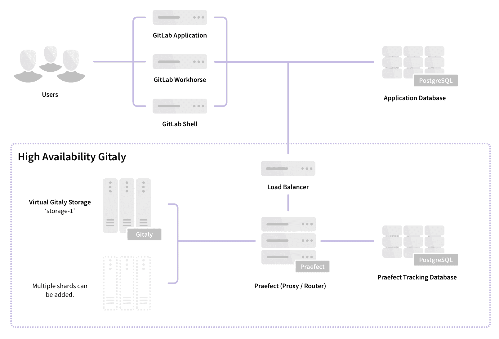

# Gitaly Cluster

> 原文：[https://docs.gitlab.com/ee/administration/gitaly/praefect.html](https://docs.gitlab.com/ee/administration/gitaly/praefect.html)

*   [Requirements for configuring a Gitaly Cluster](#requirements-for-configuring-a-gitaly-cluster)
*   [Setup Instructions](#setup-instructions)
    *   [Preparation](#preparation)
        *   [Secrets](#secrets)
    *   [PostgreSQL](#postgresql)
    *   [Praefect](#praefect)
*   [Enabling TLS support](#enabling-tls-support)
    *   [Gitaly](#gitaly)
    *   [Load Balancer](#load-balancer)
    *   [GitLab](#gitlab)
    *   [Grafana](#grafana)
*   [Distributed reads](#distributed-reads)
*   [Automatic failover and leader election](#automatic-failover-and-leader-election)
*   [Primary Node Failure](#primary-node-failure)
    *   [Checking for data loss](#checking-for-data-loss)
    *   [Checking repository checksums](#checking-repository-checksums)
    *   [Recovering lost writes](#recovering-lost-writes)
    *   [Enabling Writes](#enabling-writes)
*   [Backend Node Recovery](#backend-node-recovery)
*   [Migrating existing repositories to Praefect](#migrating-existing-repositories-to-praefect)
*   [Debugging Praefect](#debugging-praefect)

# Gitaly Cluster[](#gitaly-cluster "Permalink")

[Gitaly](index.html) （为 Git 存储库提供存储的服务）可以在群集配置中运行，以提高容错能力. 在这种配置中，每个 Git 存储库都存储在集群中的每个 Gitaly 节点上. 可以配置多个集群（或分片）.

**注意：**可以使用[GitLab Core](https://about.gitlab.com/pricing/#self-managed)和更高层来创建 Gitaly 群集. 但是，技术支持仅限于 GitLab Premium 和 Ultimate 客户. 在 GitLab.com 中不可用.

Praefect 是 Gitaly 的路由器和事务管理器，并且是运行 Gitaly 集群的必需组件.

[](img/praefect_architecture_v12_10.png)

使用 Gitaly 群集可通过以下方式提高容错能力：

*   复制写操作以预热备用 Gitaly 节点.
*   检测 Gitaly 节点故障.
*   自动将 Git 请求路由到可用的 Gitaly 节点.

Gitaly 群集的可用性目标是：

*   **恢复点目标（RPO）：**不到 1 分钟.

    写入异步复制. 尚未复制到新提升的主数据库的所有写入都将丢失.

    计划实现[高度一致性，](https://gitlab.com/groups/gitlab-org/-/epics/1189)以将其改进为"无损失".

*   **恢复时间目标（RTO）：**少于 10 秒.

    每秒通过每个 Praefect 节点运行的运行状况检查来检测中断. 故障转移要求每个 Praefect 节点上连续十次失败的运行状况检查.

    计划进行[更快的中断检测](https://gitlab.com/gitlab-org/gitaly/-/issues/2608) ，以将其[缩短](https://gitlab.com/gitlab-org/gitaly/-/issues/2608)到不到 1 秒.

当前版本支持：

*   辅助副本的最终一致性.
*   Automatic failover from the primary to the secondary.
*   如果复制队列不为空，则报告可能的数据丢失.
*   仅当检测到可能的数据丢失时，才将新升级的主要读标记为标记.

遵循[HA Gitaly 史诗](https://gitlab.com/groups/gitlab-org/-/epics/1489)进行的改进，包括[横向分发读取](https://gitlab.com/groups/gitlab-org/-/epics/2013) .

## Requirements for configuring a Gitaly Cluster[](#requirements-for-configuring-a-gitaly-cluster "Permalink")

建议的 Gitaly 群集最低配置要求：

*   1 个负载均衡器
*   1 个 PostgreSQL 服务器（PostgreSQL 11 或更高版本）
*   节点长官 3
*   3 个 Gitaly 节点（1 个主要节点，2 个辅助节点）

有关实现的详细信息，请参见[设计文档](https://gitlab.com/gitlab-org/gitaly/-/blob/master/doc/design_ha.md) .

## Setup Instructions[](#setup-instructions "Permalink")

如果使用 Omnibus 软件包[安装了](https://about.gitlab.com/install/) GitLab（强烈建议），请按照以下步骤操作：

1.  [Preparation](#preparation)
2.  [Configuring the Praefect database](#postgresql)
3.  [Configuring the Praefect proxy/router](#praefect)
4.  [配置每个 Gitaly 节点](#gitaly) （ [每个 Gitaly 节点](#gitaly)一次）
5.  [Configure the load balancer](#load-balancer)
6.  [Updating the GitLab server configuration](#gitlab)
7.  [Configure Grafana](#grafana)

### Preparation[](#preparation "Permalink")

在开始之前，您应该已经有一个正常的 GitLab 实例. [了解如何安装 GitLab](https://about.gitlab.com/install/) .

设置 PostgreSQL 服务器（PostgreSQL 11 或更高版本）. 尚不支持通过 Omnibus GitLab 发行版进行配置. 请关注此[问题](https://gitlab.com/gitlab-org/gitaly/-/issues/2476)以进行更新.

通过[安装 GitLab](https://about.gitlab.com/install/)准备所有新节点.

*   1 个 Praefect 节点（需要最少的存储）
*   3 个 Gitaly 节点（高 CPU，高内存，快速存储）
*   1 个 GitLab 服务器

您将需要每个节点的 IP /主机地址.

1.  `LOAD_BALANCER_SERVER_ADDRESS` ：负载均衡器的 IP /主机地址
2.  `POSTGRESQL_SERVER_ADDRESS` ：PostgreSQL 服务器的 IP /主机地址
3.  `PRAEFECT_HOST` ：Praefect 服务器的 IP /主机地址
4.  `GITALY_HOST` ：每个 Gitaly 服务器的 IP /主机地址
5.  `GITLAB_HOST` ：GitLab 服务器的 IP /主机地址

如果使用的是云提供商，则可以通过云提供商的管理控制台查找每个服务器的地址.

如果您使用的是 Google Cloud Platform，SoftLayer 或提供虚拟私有云（VPC）的任何其他供应商，则可以将每个云实例的私有地址（对应于 Google Cloud Platform 的"内部地址"）用于`PRAEFECT_HOST` ， `GITALY_HOST` ，和`GITLAB_HOST` .

#### Secrets[](#secrets "Permalink")

组件之间的通信由不同的秘密保护，下面将对此进行描述. 在开始之前，请为每个密钥生成一个唯一的秘密，并记录下来. 在完成设置过程时，这将很容易用安全令牌替换这些占位符令牌.

1.  `GITLAB_SHELL_SECRET_TOKEN` ：当接受 Git 推送时，Git 挂钩将其用于向 GitLab 发出回调 HTTP API 请求. 出于遗留原因，此秘密已与 GitLab Shell 共享.
2.  `PRAEFECT_EXTERNAL_TOKEN` ：承载此令牌的 Gitaly 客户端只能访问 Praefect 群集上托管的存储库.
3.  `PRAEFECT_INTERNAL_TOKEN` ：此令牌用于 Praefect 群集内的复制流量. 这与`PRAEFECT_EXTERNAL_TOKEN`不同，因为 Gitaly 客户端必须不能直接访问 Praefect 群集的内部节点. 可能导致数据丢失.
4.  `PRAEFECT_SQL_PASSWORD` ：Praefect 使用此密码连接到 PostgreSQL.

我们将在以下说明中指出需要这些秘密的地方.

### PostgreSQL[](#postgresql "Permalink")

**注意：**如果使用[Geo，](../geo/replication/index.html)请勿将 GitLab 应用程序数据库和 Praefect 数据库存储在同一 PostgreSQL 服务器上. 复制状态是每个 GitLab 实例的内部状态，不应复制.

要完成本节，您将需要：

*   完美节点 1
*   1 个 PostgreSQL 服务器（PostgreSQL 11 或更高版本）
    *   具有创建数据库权限的 SQL 用户

在本节中，我们将使用 Omnibus GitLab 安装的`psql`从 Praefect 节点配置 PostgreSQL 服务器.

1.  SSH 进入**Praefect**节点并以 root 用户身份登录：

    ```
    sudo -i 
    ```

2.  以管理员权限连接到 PostgreSQL 服务器. 这可能是`postgres`用户. 使用数据库`template1`是因为它默认在所有 PostgreSQL 服务器上创建.

    ```
    /opt/gitlab/embedded/bin/psql -U postgres -d template1 -h POSTGRESQL_SERVER_ADDRESS 
    ```

    创建一个将由 Praefect 使用的新用户`praefect` . 将`PRAEFECT_SQL_PASSWORD`替换为您在准备步骤中生成的强密码.

    ```
    CREATE ROLE praefect WITH LOGIN CREATEDB PASSWORD 'PRAEFECT_SQL_PASSWORD'; 
    ```

3.  这次以`praefect`用户身份重新连接到 PostgreSQL 服务器：

    ```
    /opt/gitlab/embedded/bin/psql -U praefect -d template1 -h POSTGRESQL_SERVER_ADDRESS 
    ```

    创建一个新的数据库`praefect_production` . 通过同时连接为创建数据库`praefect`的用户，我们有信心，他们有机会.

    ```
    CREATE DATABASE praefect_production WITH ENCODING=UTF8; 
    ```

现在已配置 Praefect 使用的数据库.

### Praefect[](#praefect "Permalink")

要完成本节，您将需要：

*   [配置的 PostgreSQL 服务器](#postgresql) ，包括：
    *   IP /主机地址（ `POSTGRESQL_SERVER_ADDRESS` ）
    *   密码（ `PRAEFECT_SQL_PASSWORD` ）

Praefect 应该在专用节点上运行. 不要在应用程序服务器或 Gitaly 节点上运行 Praefect.

1.  SSH 进入**Praefect**节点并以 root 用户身份登录：

    ```
    sudo -i 
    ```

2.  通过编辑`/etc/gitlab/gitlab.rb`禁用所有其他服务：

    ```
    # Disable all other services on the Praefect node
    postgresql['enable'] = false
    redis['enable'] = false
    nginx['enable'] = false
    prometheus['enable'] = false
    grafana['enable'] = false
    puma['enable'] = false
    sidekiq['enable'] = false
    gitlab_workhorse['enable'] = false
    gitaly['enable'] = false

    # Enable only the Praefect service
    praefect['enable'] = true

    # Prevent database connections during 'gitlab-ctl reconfigure'
    gitlab_rails['rake_cache_clear'] = false
    gitlab_rails['auto_migrate'] = false 
    ```

3.  通过编辑`/etc/gitlab/gitlab.rb` **Praefect**配置为侦听网络接口：

    ```
    praefect['listen_addr'] = '0.0.0.0:2305'

    # Enable Prometheus metrics access to Praefect. You must use firewalls
    # to restrict access to this address/port.
    praefect['prometheus_listen_addr'] = '0.0.0.0:9652' 
    ```

4.  配置强劲`auth_token`通过编辑**提督** `/etc/gitlab/gitlab.rb` . 群集外部的客户端（如 GitLab Shell）将需要与 Praefect 群集进行通信：

    ```
    praefect['auth_token'] = 'PRAEFECT_EXTERNAL_TOKEN' 
    ```

5.  通过编辑`/etc/gitlab/gitlab.rb`将**Praefect**配置为连接到 PostgreSQL 数据库.

    您将需要用数据库的 IP /主机地址替换`POSTGRESQL_SERVER_ADDRESS` ，并用上面设置的强密码`PRAEFECT_SQL_PASSWORD` .

    ```
    praefect['database_host'] = 'POSTGRESQL_SERVER_ADDRESS'
    praefect['database_port'] = 5432
    praefect['database_user'] = 'praefect'
    praefect['database_password'] = 'PRAEFECT_SQL_PASSWORD'
    praefect['database_dbname'] = 'praefect_production' 
    ```

    如果要使用 TLS 客户端证书，则可以使用以下选项：

    ```
    # Connect to PostreSQL using a TLS client certificate
    # praefect['database_sslcert'] = '/path/to/client-cert'
    # praefect['database_sslkey'] = '/path/to/client-key'

    # Trust a custom certificate authority
    # praefect['database_sslrootcert'] = '/path/to/rootcert' 
    ```

    默认情况下，Praefect 将拒绝与 PostgreSQL 建立未加密的连接. 您可以通过取消注释以下行来覆盖它：

    ```
    # praefect['database_sslmode'] = 'disable' 
    ```

6.  通过编辑`/etc/gitlab/gitlab.rb`将**Praefect**群集配置为连接到群集中的每个 Gitaly 节点.

    虚拟存储的名称必须与 GitLab 配置中配置的存储名称匹配. 在随后的步骤中，我们将存储名称配置为`default`名称，因此我们也在此处使用`default`名称. 该集群具有三个 Gitaly 节点`gitaly-1` ， `gitaly-2`和`gitaly-3` ，它们将是彼此的副本.

    **注意：**如果您已经在名为`default`现有存储上存储了数据，则应使用其他名称配置虚拟存储，然后[将数据迁移到 Praefect 存储](#migrating-existing-repositories-to-praefect) .

    将`PRAEFECT_INTERNAL_TOKEN`替换为一个强秘密，Praefect 将在与集群中的 Gitaly 节点通信时使用此秘密. 此令牌与`PRAEFECT_EXTERNAL_TOKEN` .

    将`GITALY_HOST`替换为每个 Gitaly 节点的 IP /主机地址.

    可以将更多 Gitaly 节点添加到群集以增加副本数. 还可以为大型 GitLab 实例添加更多集群.

    **注意：** `gitaly-1`节点当前称为主要节点. 这可用于从一个节点到另一个节点的手动故障. 这将在被删除[的未来](https://gitlab.com/gitlab-org/gitaly/-/issues/2634) .

    ```
    # Name of storage hash must match storage name in git_data_dirs on GitLab
    # server ('praefect') and in git_data_dirs on Gitaly nodes ('gitaly-1')
    praefect['virtual_storages'] = {
      'default' => {
        'gitaly-1' => {
          'address' => 'tcp://GITALY_HOST:8075',
          'token'   => 'PRAEFECT_INTERNAL_TOKEN',
          'primary' => true
        },
        'gitaly-2' => {
          'address' => 'tcp://GITALY_HOST:8075',
          'token'   => 'PRAEFECT_INTERNAL_TOKEN'
        },
        'gitaly-3' => {
          'address' => 'tcp://GITALY_HOST:8075',
          'token'   => 'PRAEFECT_INTERNAL_TOKEN'
        }
      }
    } 
    ```

7.  在 GitLab 13.1 和更高版本中[引入](https://gitlab.com/groups/gitlab-org/-/epics/2013) ，启用了 read 的[分发](#distributed-reads) .

8.  将更改保存到`/etc/gitlab/gitlab.rb`并[重新配置 Praefect](../restart_gitlab.html#omnibus-gitlab-reconfigure) ：

    ```
    gitlab-ctl reconfigure 
    ```

9.  为了确保 Praefect [已更新其 Prometheus 监听地址](https://gitlab.com/gitlab-org/gitaly/-/issues/2734) ，请[重新启动 Gitaly](../restart_gitlab.html#omnibus-gitlab-restart) ：

    ```
    gitlab-ctl restart praefect 
    ```

10.  验证 Praefect 可以到达 PostgreSQL：

    ```
    sudo -u git /opt/gitlab/embedded/bin/praefect -config /var/opt/gitlab/praefect/config.toml sql-ping 
    ```

    如果检查失败，请确保已正确执行了步骤. 如果您编辑`/etc/gitlab/gitlab.rb` ，请记住在尝试`sql-ping`命令之前再次运行`sudo gitlab-ctl reconfigure` .

**必须为每个 Praefect 节点完成上述步骤！**

## Enabling TLS support[](#enabling-tls-support "Permalink")

在 GitLab 13.2 中[引入](https://gitlab.com/gitlab-org/gitaly/-/issues/1698) .

Praefect 支持 TLS 加密. 要与侦听安全连接的 Praefect 实例进行通信，您必须：

*   在 GitLab 配置中相应存储条目的`gitaly_address`中使用`tls://` URL 方案.
*   带上您自己的证书，因为这不会自动提供. 与每个 Praefect 服务器相对应的证书必须安装在该 Praefect 服务器上.

此外，必须按照[GitLab 自定义证书配置中](https://docs.gitlab.com/omnibus/settings/ssl.html)所述的过程（并在下面重复），将证书或其证书颁发机构安装在所有 Gitaly 服务器和与其通信的所有 Praefect 客户端上.

请注意以下几点：

*   证书必须指定用于访问 Praefect 服务器的地址. 如果通过以下方式寻址 Praefect 服务器：

    *   主机名，您可以为此使用"公用名"字段，也可以将其添加为"使用者备用名".
    *   IP 地址，您必须将其添加为证书的使用者备用名称.
*   您可以同时为 Praefect 服务器配置未加密的侦听地址`listen_addr`和已加密的侦听地址`tls_listen_addr` . 如果需要，这使您可以从未加密的流量逐渐过渡到加密的流量.

要使用 TLS 配置 Praefect：

**对于所有 GitLab**

1.  Prefect 为服务器创建证书.
2.  在 Praefect 服务器上，创建`/etc/gitlab/ssl`目录，然后在其中复制密钥和证书：

    ```
    sudo mkdir -p /etc/gitlab/ssl
    sudo chmod 755 /etc/gitlab/ssl
    sudo cp key.pem cert.pem /etc/gitlab/ssl/
    sudo chmod 644 key.pem cert.pem 
    ```

3.  编辑`/etc/gitlab/gitlab.rb`并添加：

    ```
    praefect['tls_listen_addr'] = "0.0.0.0:3305"
    praefect['certificate_path'] = "/etc/gitlab/ssl/cert.pem"
    praefect['key_path'] = "/etc/gitlab/ssl/key.pem" 
    ```

4.  保存文件并[重新配置 GitLab](../restart_gitlab.html#omnibus-gitlab-reconfigure) .
5.  在 Praefect 客户端（包括每个 Gitaly 服务器）上，将证书或其证书颁发机构复制到`/etc/gitlab/trusted-certs` ：

    ```
    sudo cp cert.pem /etc/gitlab/trusted-certs/ 
    ```

6.  在 Praefect 客户端（Gitaly 服务器除外）上，在`/etc/gitlab/gitlab.rb`编辑`git_data_dirs` ，如下所示：

    ```
    git_data_dirs({
      'default' => { 'gitaly_address' => 'tls://praefect1.internal:3305' },
      'storage1' => { 'gitaly_address' => 'tls://praefect2.internal:3305' },
    }) 
    ```

7.  保存文件并[重新配置 GitLab](../restart_gitlab.html#omnibus-gitlab-reconfigure) .

**对于源安装**

1.  Prefect 为服务器创建证书.
2.  在 Praefect 服务器上，创建`/etc/gitlab/ssl`目录，然后在其中复制密钥和证书：

    ```
    sudo mkdir -p /etc/gitlab/ssl
    sudo chmod 755 /etc/gitlab/ssl
    sudo cp key.pem cert.pem /etc/gitlab/ssl/
    sudo chmod 644 key.pem cert.pem 
    ```

3.  在 Praefect 客户端（包括每个 Gitaly 服务器）上，将证书或其证书颁发机构复制到系统信任的证书中：

    ```
    sudo cp cert.pem /usr/local/share/ca-certificates/praefect.crt
    sudo update-ca-certificates 
    ```

4.  在 Praefect 客户端（Gitaly 服务器除外）上，按如下所示编辑`/home/git/gitlab/config/gitlab.yml` `storages` ：

    ```
    gitlab:
      repositories:
        storages:
          default:
            gitaly_address: tls://praefect1.internal:3305
            path: /some/dummy/path
          storage1:
            gitaly_address: tls://praefect2.internal:3305
            path: /some/dummy/path 
    ```

    **注意：** `/some/dummy/path`应该设置为存在的本地文件夹，但是该文件夹中不会存储任何数据. 解决[此问题](https://gitlab.com/gitlab-org/gitaly/-/issues/1282)后，将不再需要[此操作](https://gitlab.com/gitlab-org/gitaly/-/issues/1282) .
5.  保存文件并[重新启动 GitLab](../restart_gitlab.html#installations-from-source) .
6.  将所有 Praefect 服务器证书或其证书颁发机构复制到每台 Gitaly 服务器上的系统受信任证书，以便 Praefect 服务器在被 Gitaly 服务器调用时将信任该证书：

    ```
    sudo cp cert.pem /usr/local/share/ca-certificates/praefect.crt
    sudo update-ca-certificates 
    ```

7.  编辑`/home/git/praefect/config.toml`并添加：

    ```
    tls_listen_addr = '0.0.0.0:3305'

    [tls]
    certificate_path = '/etc/gitlab/ssl/cert.pem'
    key_path = '/etc/gitlab/ssl/key.pem' 
    ```

8.  保存文件并[重新启动 GitLab](../restart_gitlab.html#installations-from-source) .

### Gitaly[](#gitaly "Permalink")

**注意：**为**每个** Gitaly 节点完成这些步骤.

要完成本节，您将需要：

*   [Configured Praefect node](#praefect)
*   将 3 个（或更多）安装了 GitLab 的服务器配置为 Gitaly 节点. 这些应该是专用节点，不要在这些节点上运行其他服务.

分配给 Praefect 群集的每个 Gitaly 服务器都需要配置. 该配置与普通的[独立 Gitaly 服务器相同](index.html) ，除了：

*   存储名称公开给 Praefect，而不是 GitLab
*   秘密令牌是与 Praefect 共享的，而不是与 GitLab 共享的

Praefect 群集中所有 Gitaly 节点的配置可以相同，因为我们依靠 Praefect 正确地路由操作.

应特别注意：

*   本节中配置的`gitaly['auth_token']`必须与 Praefect 节点上`praefect['virtual_storages']`下的`token`值匹配. 这是在上[一节中](#praefect)设置的. 本文档始终使用占位符`PRAEFECT_INTERNAL_TOKEN` .
*   本节中配置的`git_data_dirs`中的存储名称必须与 Praefect 节点上`praefect['virtual_storages']`下的存储名称匹配. 这是在上[一节中](#praefect)设置的. 本文档使用`gitaly-1` ， `gitaly-2`和`gitaly-3`作为 Gitaly 存储名称.

有关 Gitaly 服务器配置的更多信息，请参阅我们的[Gitaly 文档](index.html#configure-gitaly-servers) .

1.  SSH 进入**Gitaly**节点并以 root 用户身份登录：

    ```
    sudo -i 
    ```

2.  Disable all other services by editing `/etc/gitlab/gitlab.rb`:

    ```
    # Disable all other services on the Praefect node
    postgresql['enable'] = false
    redis['enable'] = false
    nginx['enable'] = false
    grafana['enable'] = false
    puma['enable'] = false
    sidekiq['enable'] = false
    gitlab_workhorse['enable'] = false
    prometheus_monitoring['enable'] = false

    # Enable only the Gitaly service
    gitaly['enable'] = true

    # Enable Prometheus if needed
    prometheus['enable'] = true

    # Prevent database connections during 'gitlab-ctl reconfigure'
    gitlab_rails['rake_cache_clear'] = false
    gitlab_rails['auto_migrate'] = false 
    ```

3.  配置**Gitaly**通过编辑来听网络接口`/etc/gitlab/gitlab.rb` ：

    ```
    # Make Gitaly accept connections on all network interfaces.
    # Use firewalls to restrict access to this address/port.
    gitaly['listen_addr'] = '0.0.0.0:8075'

    # Enable Prometheus metrics access to Gitaly. You must use firewalls
    # to restrict access to this address/port.
    gitaly['prometheus_listen_addr'] = '0.0.0.0:9236' 
    ```

4.  配置强劲`auth_token`通过编辑**Gitaly** `/etc/gitlab/gitlab.rb` . 客户端将需要与该 Gitaly 节点进行通信. 通常，此令牌对于所有 Gitaly 节点都是相同的.

    ```
    gitaly['auth_token'] = 'PRAEFECT_INTERNAL_TOKEN' 
    ```

5.  配置`git push`操作所需的 GitLab Shell `secret_token`和`internal_api_url` .

    如果您已经[在自己的服务器上](index.html)配置了[Gitaly](index.html)

    ```
    gitlab_shell['secret_token'] = 'GITLAB_SHELL_SECRET_TOKEN'

    # Configure the gitlab-shell API callback URL. Without this, `git push` will
    # fail. This can be your front door GitLab URL or an internal load balancer.
    # Examples: 'https://example.gitlab.com', 'http://1.2.3.4'
    gitlab_rails['internal_api_url'] = 'http://GITLAB_HOST' 
    ```

6.  通过在`/etc/gitlab/gitlab.rb`设置`git_data_dirs`来配置 Git 数据的存储位置. 每个 Gitaly 节点应具有唯一的存储名称（例如`gitaly-1` ）.

    与其为每个 Gitaly 节点唯一地配置`git_data_dirs`将每个 Gitaly 节点上所有 Gitaly 节点的配置都包括在内通常会更容易. 由于 Praefect `virtual_storages`配置将每个存储名称（例如`gitaly-1` ）映射到特定节点，并且相应地路由了请求，因此支持此操作. 这意味着舰队中的每个 Gitaly 节点都可以共享相同的配置.

    ```
    # You can include the data dirs for all nodes in the same config, because
    # Praefect will only route requests according to the addresses provided in the
    # prior step.
    git_data_dirs({
      "gitaly-1" => {
        "path" => "/var/opt/gitlab/git-data"
      },
      "gitaly-2" => {
        "path" => "/var/opt/gitlab/git-data"
      },
      "gitaly-3" => {
        "path" => "/var/opt/gitlab/git-data"
      }
    }) 
    ```

7.  将更改保存到`/etc/gitlab/gitlab.rb`并[重新配置 Gitaly](../restart_gitlab.html#omnibus-gitlab-reconfigure) ：

    ```
    gitlab-ctl reconfigure 
    ```

8.  为了确保 Gitaly [更新了其 Prometheus 监听地址](https://gitlab.com/gitlab-org/gitaly/-/issues/2734) ，请[重新启动 Gitaly](../restart_gitlab.html#omnibus-gitlab-restart) ：

    ```
    gitlab-ctl restart gitaly 
    ```

**必须对每个 Gitaly 节点完成上述步骤！**

配置完所有 Gitaly 节点后，您可以运行 Praefect 连接检查器以验证 Praefect 可以连接到 Praefect 配置中的所有 Gitaly 服务器.

1.  SSH into the **Praefect** node and run the Praefect connection checker:

    ```
    sudo /opt/gitlab/embedded/bin/praefect -config /var/opt/gitlab/praefect/config.toml dial-nodes 
    ```

### Load Balancer[](#load-balancer "Permalink")

在高可用的 Gitaly 配置中，需要一个负载平衡器来将内部流量从 GitLab 应用程序路由到 Praefect 节点. 有关使用负载均衡器或进行确切配置的细节超出了 GitLab 文档的范围.

我们希望，如果您要管理像 GitLab 这样的 HA 系统，那么您已经选择了负载均衡器. 一些示例包括[HAProxy](https://www.haproxy.org/) （开源）， [Google 内部负载均衡器](https://cloud.google.com/load-balancing/docs/internal/) ， [AWS Elastic 负载均衡器](https://aws.amazon.com/elasticloadbalancing/) ，F5 Big-IP LTM 和 Citrix Net Scaler. 本文档将概述您需要配置哪些端口和协议.

| LB 端口 | 后端端口 | Protocol |
| --- | --- | --- |
| 2305 | 2305 | TCP |

### GitLab[](#gitlab "Permalink")

要完成本节，您将需要：

*   [Configured Praefect node](#praefect)
*   [Configured Gitaly nodes](#gitaly)

Praefect 集群需要作为存储位置公开给 GitLab 应用程序. 这是通过更新`git_data_dirs`完成的.

应特别注意：

*   本节中添加到`git_data_dirs`的存储名称必须与 Praefect 节点上`praefect['virtual_storages']`下的存储名称匹配. 这是在本指南的[Praefect](#praefect)部分中设置的. 本文档使用`storage-1`作为 Praefect 存储名称.

1.  SSH 进入**GitLab**节点并以 root 身份登录：

    ```
    sudo -i 
    ```

2.  配置`external_url`以便可以通过编辑`/etc/gitlab/gitlab.rb`通过适当的端点访问`/etc/gitlab/gitlab.rb` GitLab 提供文件：

    您需要将`GITLAB_SERVER_URL`替换为当前 GitLab 实例所服务的实际外部 URL：

    ```
    external_url 'GITLAB_SERVER_URL' 
    ```

3.  禁用在 GitLab 主机上运行的默认 Gitaly 服务. 不需要它，因为 GitLab 将连接到配置的集群.

    **注意**如果现有数据存储在默认的 Gitaly 存储中，则应首先[迁移 Praefect 存储中的数据](#migrating-existing-repositories-to-praefect) .

    ```
    gitaly['enable'] = false 
    ```

4.  通过编辑`/etc/gitlab/gitlab.rb`将 Praefect 集群添加为存储位置.

    您将需要更换：

    *   带有负载均衡器的 IP 地址或主机名的`LOAD_BALANCER_SERVER_ADDRESS` .
    *   `PRAEFECT_EXTERNAL_TOKEN`带有真正的秘密

    ```
    git_data_dirs({
      "default" => {
        "gitaly_address" => "tcp://LOAD_BALANCER_SERVER_ADDRESS:2305",
        "gitaly_token" => 'PRAEFECT_EXTERNAL_TOKEN'
      }
    }) 
    ```

5.  配置`gitlab_shell['secret_token']`以便通过编辑`/etc/gitlab/gitlab.rb`正确验证`git push`期间来自 Gitaly 节点的回调：

    您将需要用真实的机密替换`GITLAB_SHELL_SECRET_TOKEN` .

    ```
    gitlab_shell['secret_token'] = 'GITLAB_SHELL_SECRET_TOKEN' 
    ```

6.  通过编辑`/etc/gitlab/gitlab.rb`添加 Prometheus 监视设置.

    您将需要更换：

    *   `PRAEFECT_HOST`带有 Praefect 节点的 IP 地址或主机名
    *   `GITALY_HOST` ，每个 Gitaly 节点的 IP 地址或主机名

    ```
    prometheus['scrape_configs'] = [
      {
        'job_name' => 'praefect',
        'static_configs' => [
          'targets' => [
            'PRAEFECT_HOST:9652', # praefect-1
            'PRAEFECT_HOST:9652', # praefect-2
            'PRAEFECT_HOST:9652', # praefect-3
          ]
        ]
      },
      {
        'job_name' => 'praefect-gitaly',
        'static_configs' => [
          'targets' => [
            'GITALY_HOST:9236', # gitaly-1
            'GITALY_HOST:9236', # gitaly-2
            'GITALY_HOST:9236', # gitaly-3
          ]
        ]
      }
    ] 
    ```

7.  将更改保存到`/etc/gitlab/gitlab.rb`并[重新配置 GitLab](../restart_gitlab.html#omnibus-gitlab-reconfigure) ：

    ```
    gitlab-ctl reconfigure 
    ```

8.  验证每个`gitlab-shell`实例上的每个`gitlab-shell`都可以到达 GitLab. 在每个 Gitaly 实例上运行：

    ```
    /opt/gitlab/embedded/service/gitlab-shell/bin/check -config /opt/gitlab/embedded/service/gitlab-shell/config.yml 
    ```

9.  验证 GitLab 是否可以达到 Praefect：

    ```
    gitlab-rake gitlab:gitaly:check 
    ```

10.  在**管理区域>设置>存储库>存储库**中检查 Praefect 存储已配置为存储新存储库. 按照本指南， `default`存储应具有权重 100 以存储所有新存储库.

11.  通过创建一个新项目来验证一切正常. 选中"使用自述文件初始化存储库"框，以使存储库中包含已查看的内容. 如果项目已创建，并且您可以看到 README 文件，那么它将起作用！

### Grafana[](#grafana "Permalink")

Grafana 包含在 GitLab 中，可用于监视您的 Praefect 集群. 有关详细文档，请参见[Grafana 仪表板服务](https://docs.gitlab.com/omnibus/settings/grafana.html) .

快速入门：

1.  SSH into the **GitLab** node and login as root:

    ```
    sudo -i 
    ```

2.  通过编辑`/etc/gitlab/gitlab.rb`启用 Grafana 登录表单.

    ```
    grafana['disable_login_form'] = false 
    ```

3.  将更改保存到`/etc/gitlab/gitlab.rb`并[重新配置 GitLab](../restart_gitlab.html#omnibus-gitlab-reconfigure) ：

    ```
    gitlab-ctl reconfigure 
    ```

4.  设置 Grafana 管理员密码. 此命令将提示您输入新密码：

    ```
    gitlab-ctl set-grafana-password 
    ```

5.  在您的 Web 浏览器中，在您的 GitLab 服务器上打开`/-/grafana` （例如`https://gitlab.example.com/-/grafana` ）.

    使用您设置的密码和用户名`admin`登录.

6.  转到**浏览**并查询`gitlab_build_info`以验证您是否正在从所有计算机中获取指标.

恭喜你！ 您已经配置了可观察的高可用性 Praefect 集群.

## Distributed reads[](#distributed-reads "Permalink")

在[beta 版本的](https://about.gitlab.com/handbook/product/#alpha-beta-ga) GitLab 13.1 中引入，功能标志`gitaly_distributed_reads`设置为禁用.

Praefect supports distribution of read operations across Gitaly nodes that are configured for the virtual node.

为了进行[性能测试](https://gitlab.com/gitlab-org/quality/performance/-/issues/231) ，分布式读取当前处于[beta 状态](https://about.gitlab.com/handbook/product/#alpha-beta-ga) ，默认情况下处于禁用状态. 要启用分布式读取，必须在 Ruby 控制台中启用`gitaly_distributed_reads` [功能标志](../feature_flags.html) ：

```
Feature.enable(:gitaly_distributed_reads) 
```

如果启用，则所有带有`ACCESSOR`选项（如[GetBlob）的](https://gitlab.com/gitlab-org/gitaly/-/blob/v12.10.6/proto/blob.proto#L16) RPC 都将重定向到最新且运行状况良好的 Gitaly 节点.

在这种情况下*，最新*意味着：

*   没有为此节点安排任何复制操作.
*   最后的复制操作处于*完成*状态.

如果没有这样的节点，或者在选择节点期间发生任何其他错误，那么将选择主节点来处理请求.

要跟踪读取操作的分布，可以使用`gitaly_praefect_read_distribution` Prometheus 计数器度量. 它有两个标签：

*   `virtual_storage`.
*   `storage`.

它们反映了为此 Praefect 实例定义的配置.

## Automatic failover and leader election[](#automatic-failover-and-leader-election "Permalink")

Praefect 会定期检查每个后端 Gitaly 节点的运行状况. 如果发现当前主节点运行状况不佳，此信息可用于自动故障转移到新的主节点.

*   **PostgreSQL（推荐）：**默认启用，等效于： `praefect['failover_election_strategy'] = sql` . 此配置选项将允许多个 Praefect 节点通过 PostgreSQL 数据库进行协调，以选择一个主要的 Gitaly 节点. 如果大多数 Praefect 节点在 10 秒内仍无法访问当前主节点，此配置将导致 Praefect 节点选择一个新的主节点，监视其运行状况，并选择一个新的主节点.
*   **手动：**禁用自动故障转移. 可以在 Praefect 节点上的`/etc/gitlab/gitlab.rb`重新配置主节点. 通过将`primary = true`移至另一个 Gitaly 节点，将其修改为`praefect['virtual_storages']`字段. 在上述步骤中，将`gitaly-1`设置为主数据库. 在配置中需要`praefect['failover_enabled'] = false` .
*   **内存：**通过在 Praefect 节点上的`/etc/gitlab/gitlab.rb`设置`praefect['failover_election_strategy'] = 'local'` `/etc/gitlab/gitlab.rb` . 如果对于当前的主后端 Gitaly 节点，足够数量的运行状况检查失败，则将选择新的主节点. **不要与多个 Praefect 节点一起使用！** 与多个 Praefect 节点一起使用可能会导致大脑分裂.

将来我们可能会实施对 Consul 的支持以及云原生策略.

## Primary Node Failure[](#primary-node-failure "Permalink")

Praefect 通过将健康的辅助节点升级为新的主节点来从发生故障的主 Gitaly 节点中恢复. 为了最大程度地减少数据丢失，Praefect 会选择从主节点进行最少重复写入的辅助节点. 仍然会有一些未复制的写入，从而导致数据丢失.

故障转移事件发生后，Praefect 会将虚拟存储切换为只读模式. 通过防止对新选举的主数据库进行新的可能冲突的写入，这可以简化数据恢复工作. 这使管理员可以尝试在允许新写入之前恢复丢失的数据.

如果您更喜欢写可用性而不是一致性，则可以通过在`/etc/gitlab/gitlab.rb`设置`praefect['failover_read_only_after_failover'] = false`并[重新配置 Praefect](../restart_gitlab.html#omnibus-gitlab-reconfigure)来关闭此行为.

### Checking for data loss[](#checking-for-data-loss "Permalink")

Praefect `dataloss`子命令可通过检查未完成的复制作业来帮助识别丢失的写操作. 这对于确定故障转移后可能的数据丢失情况很有用. 此命令必须在 Praefect 节点上执行.

```
sudo /opt/gitlab/embedded/bin/praefect -config /var/opt/gitlab/praefect/config.toml dataloss [-virtual-storage <virtual-storage>] 
```

如果未指定虚拟存储，则将检查每个已配置的虚拟存储的数据丢失.

```
sudo /opt/gitlab/embedded/bin/praefect -config /var/opt/gitlab/praefect/config.toml dataloss 
```

```
Virtual storage: default
  Current read-only primary: gitaly-2
  Previous write-enabled primary: gitaly-1
    Nodes with data loss from failing over from gitaly-1:
      @hashed/2c/62/2c624232cdd221771294dfbb310aca000a0df6ac8b66b696d90ef06fdefb64a3.git: gitaly-0
      @hashed/4b/22/4b227777d4dd1fc61c6f884f48641d02b4d121d3fd328cb08b5531fcacdabf8a.git: gitaly-0, gitaly-2 
```

当前，如果已直接从先前启用写操作的主数据库复制到该`dataloss`仅考虑该存储库为最新. 虽然从最新的辅助数据库进行协调可以恢复数据，但在数据丢失报告中不可见. 这是通过[Gitaly＃2866](https://gitlab.com/gitlab-org/gitaly/-/issues/2866)进行的改进.

**注意数据** `dataloss`仍处于 beta 状态，并且输出格式可能会更改.

### Checking repository checksums[](#checking-repository-checksums "Permalink")

要在所有 Gitaly 节点上检查项目的存储库校验和，请在主 GitLab 节点上运行[副本 Rake 任务](../raketasks/praefect.html#replica-checksums) .

### Recovering lost writes[](#recovering-lost-writes "Permalink")

Praefect `reconcile`子命令可用于恢复先前的主数据库恢复联机后丢失的写入. 仅当虚拟存储仍处于只读模式时才有可能.

```
sudo /opt/gitlab/embedded/bin/praefect -config /var/opt/gitlab/praefect/config.toml reconcile -virtual <virtual-storage> -reference <previous-primary> -target <current-primary> -f 
```

有关`reconcile`子命令的更多详细信息，请参阅" [后端节点恢复"](#backend-node-recovery)部分.

### Enabling Writes[](#enabling-writes "Permalink")

在启用写入之前，应该进行任何数据恢复尝试，以消除冲突写入的任何可能性. 可以使用 Praefect `enable-writes`子命令为写入重新启用虚拟存储.

```
sudo /opt/gitlab/embedded/bin/praefect -config /var/opt/gitlab/praefect/config.toml enable-writes -virtual-storage <virtual-storage> 
```

## Backend Node Recovery[](#backend-node-recovery "Permalink")

当 Praefect 后端节点发生故障并且不再能够复制更改时，后端节点将开始从主节点开始漂移. 如果该节点最终恢复，则需要将其与当前主节点协调. 主节点被视为分片状态的唯一真实来源. Praefect `reconcile`子命令允许在后端节点和当前主节点之间进行手动协调.

Run the following command on the Praefect server after all placeholders (`<virtual-storage>` and `<target-storage>`) have been replaced:

```
sudo /opt/gitlab/embedded/bin/praefect -config /var/opt/gitlab/praefect/config.toml reconcile -virtual <virtual-storage> -target <target-storage> 
```

*   将占位符`<virtual-storage>`替换为包含要检查的后端节点存储的虚拟存储.
*   将占位符`<target-storage>`替换为后端存储名称.

该命令将返回与当前主数据库不一致的存储库列表. 这些不一致性中的每一个还将与随附的复制作业 ID 一起记录.

## Migrating existing repositories to Praefect[](#migrating-existing-repositories-to-praefect "Permalink")

如果您的 GitLab 实例已经有存储库，则不会自动迁移它们.

可以使用[Repository API](../../api/projects.html#edit-project)从一个存储位置移动存储[库](../../api/projects.html#edit-project) ：

```
curl --request PUT --header "PRIVATE-TOKEN: <your_access_token>" --data "repository_storage=praefect" https://example.gitlab.com/api/v4/projects/123 
```

## Debugging Praefect[](#debugging-praefect "Permalink")

如果收到错误，请检查`/var/log/gitlab/gitlab-rails/production.log` .

以下是常见的错误和潜在原因：

*   500 响应码
    *   **ActionView :: Template :: Error（7：权限被拒绝）**
        *   `praefect['auth_token']`和`gitlab_rails['gitaly_token']`在 GitLab 服务器上不匹配.
    *   **无法保存项目.** **错误：7：权限被拒绝**
        *   GitLab 服务器上的`praefect['storage_nodes']`秘密令牌与一台或多台 Gitaly 服务器上的`gitaly['auth_token']`中的值不匹配.
*   503 响应码
    *   **GRPC ::不可用（14：无法连接到所有地址）**
        *   GitLab 无法到达 Praefect.
    *   **GRPC ::不可用（14：所有 SubCon 都在 TransientFailure 中...）**
        *   Praefect 无法到达其一个或多个子 Gitaly 节点. 尝试运行 Praefect 连接检查器进行诊断.