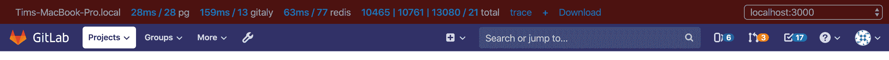
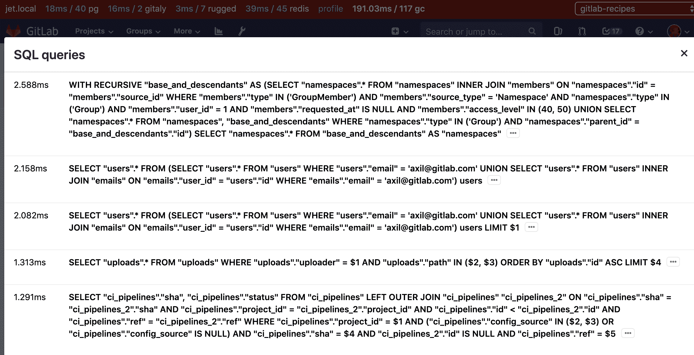
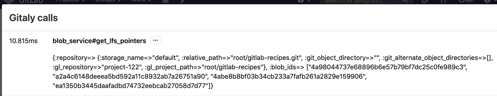
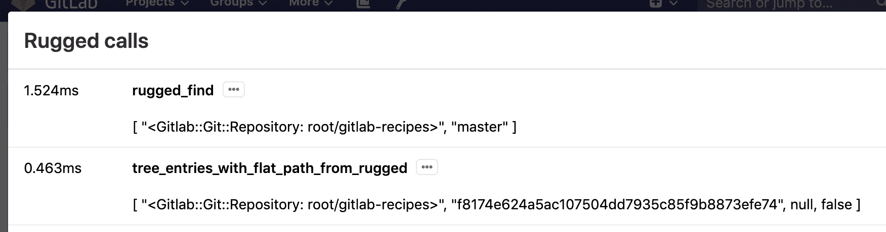
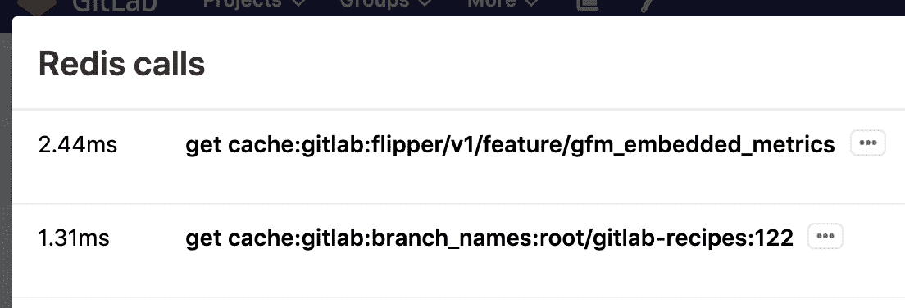
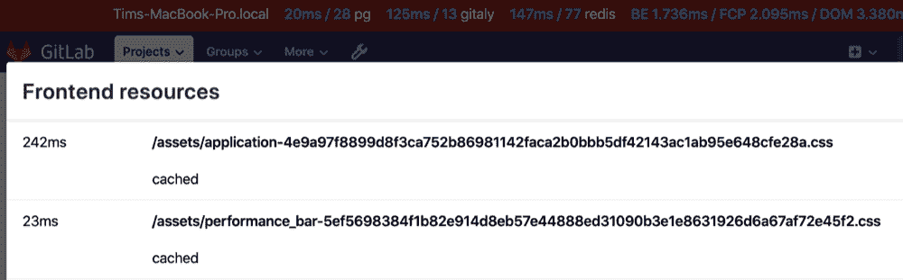
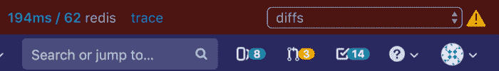
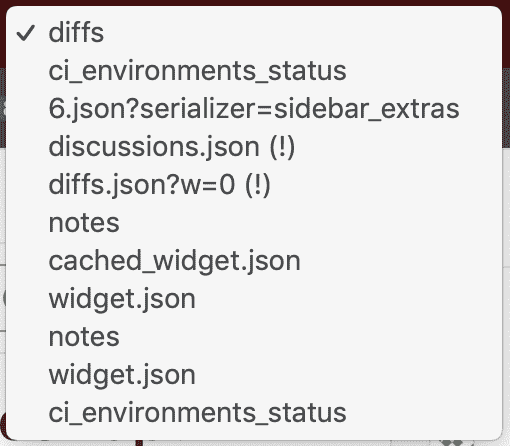

# Performance Bar

> 原文：[https://docs.gitlab.com/ee/administration/monitoring/performance/performance_bar.html](https://docs.gitlab.com/ee/administration/monitoring/performance/performance_bar.html)

*   [Request warnings](#request-warnings)
*   [Enable the Performance Bar via the Admin panel](#enable-the-performance-bar-via-the-admin-panel)
*   [Keyboard shortcut for the Performance Bar](#keyboard-shortcut-for-the-performance-bar)

# Performance Bar

您可以显示 GitLab 性能栏以查看页面性能的统计信息. 激活后，其外观如下：

从左到右，它显示：

*   **当前主机** ：服务于该页面的当前主机.
*   **数据库查询** ：花费的时间（毫秒）和数据库查询的总数，以`00ms / 00pg`的格式显示. 单击以显示更多信息的模式窗口： 
*   **Gitaly 通话** ：所花费的时间（以毫秒为单位）和[Gitaly](../../gitaly/index.html)通话的总数. 单击以显示更多信息的模式窗口： 
*   **坚固通话** ：花费的时间（以毫秒为单位）和[坚固](../../high_availability/nfs.html#improving-nfs-performance-with-gitlab)通话的总数. 单击以显示更多信息的模式窗口： 
*   **Redis 呼叫** ：花费的时间（以毫秒为单位）和 Redis 呼叫的总数. 单击以显示更多信息的模式窗口： 
*   **Elasticsearch 调用** ：花费的时间（以毫秒为单位）和 Elasticsearch 调用的总数. 单击以显示更多信息的模式窗口.
*   页面的**加载时间** ：如果您的浏览器支持加载时间（Chromium 和 Chrome），则以毫秒为单位的多个值（以斜杠分隔）. 单击以显示更多信息的模式窗口. 值从左到右：
    *   **后端** ：加载基本页面所需的时间.
    *   [**First Contentful Paint**](https://s0web0dev.icopy.site/first-contentful-paint/) ：直到用户看到某些东西为止的时间.
    *   [**DomContentLoaded**](https://developers.google.com/web/fundamentals/performance/critical-rendering-path/measure-crp)事件.
    *   页面加载**的请求总数** ： 
*   **跟踪** ：如果集成了 Jaeger，则**Trace**链接到 Jaeger 跟踪页面，其中包含当前请求的`correlation_id` .
*   **+** ：用于将请求的详细信息添加到性能栏的链接. 可以通过其完整 URL（已认证为当前用户）或其`X-Request-Id`标头的值来添加`X-Request-Id` .
*   **下载** ：下载用于生成 Performance Bar 报告的原始 JSON 的链接.
*   **请求选择器** ：显示在性能栏右侧的选择框，通过该选择框，您可以查看当前页面打开时发出的所有请求的这些指标. 每个唯一 URL 仅捕获前两个请求.

## Request warnings

超出预定义限制的请求显示警告 指标旁边的图标和说明. 在此示例中，Gitaly 通话时间超过了阈值：

如果当前页面上的任何请求生成警告，则警告图标将显示在" **请求"选择器**旁边：

带有警告的**请求**在**请求选择器中**的路径后显示`(!)` ：

## Enable the Performance Bar via the Admin panel

默认情况下，GitLab 性能栏是禁用的. 要为给定的组启用它：

1.  以具有管理员[权限](../../../user/permissions.html)的用户身份登录.
2.  在菜单栏中，单击 **管理区域**图标.
3.  导航 **设置>指标和分析** （ `admin/application_settings/metrics_and_profiling` ），然后展开" **分析-性能栏** "部分.
4.  Click **启用对性能栏的访问**.
5.  在**允许的组**字段中，提供允许访问 GitLab 性能栏的组的完整路径.
6.  Click **保存更改**.

## Keyboard shortcut for the Performance Bar

启用 GitLab 性能栏后，按[`p` + `b`键盘快捷键](../../../user/shortcuts.html)将其显示，然后再次将其隐藏.