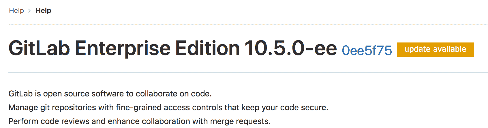

# Usage statistics

> 原文：[https://docs.gitlab.com/ee/user/admin_area/settings/usage_statistics.html](https://docs.gitlab.com/ee/user/admin_area/settings/usage_statistics.html)

*   [Network configuration](#network-configuration)
*   [Version Check](#version-check-core-only)
    *   [Request flow example](#request-flow-example)
*   [Usage Ping](#usage-ping-core-only)
*   [Instance statistics visibility](#instance-statistics-visibility-core-only)

# Usage statistics

GitLab Inc.将定期收集有关您的实例的信息，以执行各种操作.

所有统计信息均已退出. 您可以在**管理区域>设置>指标和配置文件** **使用情况统计信息中**启用/禁用它们.

## Network configuration

允许从您的 GitLab 实例到 IP 地址`104.196.17.203:443`网络流量将使用情况统计信息发送到 GitLab Inc.

如果您的 GitLab 实例位于代理之后，请设置适当的[代理配置变量](https://docs.gitlab.com/omnibus/settings/environment-variables.html) .

## Version Check

如果启用，版本检查将通过状态通知您是否有新版本以及其重要性. 这显示在所有登录用户的帮助页面（即`/help` ）和管理页面上. 状态为：

*   绿色：您正在运行最新版本的 GitLab.
*   橙色：提供了 GitLab 的更新版本.
*   红色：您正在运行的 GitLab 版本容易受到攻击. 您应该尽快安装具有安全修复程序的最新版本.

GitLab Inc.收集您实例的版本和主机名（通过 HTTP 引用），作为版本检查的一部分. 没有收集其他信息.

除其他事项外，该信息还用于标识需要将补丁反向移植到哪些版本，以确保活动的 GitLab 实例保持安全.

如果禁用版本检查，则不会收集此信息. 在**管理区域>设置>度量标准和性能分析>使用情况统计信息中**启用或禁用版本检查.

### Request flow example

以下示例显示了自我管理的 GitLab 实例与 GitLab 版本应用程序之间的基本请求/响应流：

sequenceDiagram 参与者 GitLab 实例参与者版本应用程序 GitLab 实例->>版本应用程序：是否有版本更新？ 循环版本检查版本应用程序->>版本应用程序：记录版本信息结束版本应用程序->> GitLab 实例：响应（PNG / SVG）

## Usage Ping

See [Usage Ping guide](../../../development/telemetry/usage_ping.html).

## Instance statistics visibility

启用使用情况 ping 后，GitLab 将从其他实例收集数据，并能够向用户显示您实例的[使用情况统计信息](../../instance_statistics/index.html) .

要使其仅对管理员可见，请进入**管理区域>设置>指标和分析** ，展开**使用情况统计信息** ，然后将**实例统计信息可见性**选项设置为**仅管理员** .