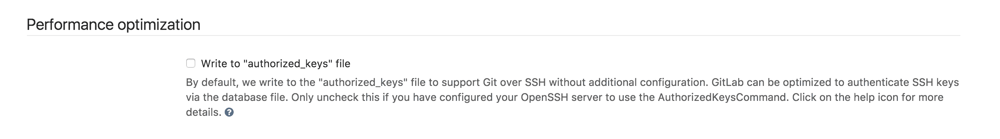

# Fast lookup of authorized SSH keys in the database

> 原文：[https://docs.gitlab.com/ee/administration/operations/fast_ssh_key_lookup.html](https://docs.gitlab.com/ee/administration/operations/fast_ssh_key_lookup.html)

*   [Fast lookup is required for Geo](#fast-lookup-is-required-for-geo-premium)
*   [Setting up fast lookup via GitLab Shell](#setting-up-fast-lookup-via-gitlab-shell)
*   [How to go back to using the `authorized_keys` file](#how-to-go-back-to-using-the-authorized_keys-file)
*   [Compiling a custom version of OpenSSH for CentOS 6](#compiling-a-custom-version-of-openssh-for-centos-6)
*   [SELinux support and limitations](#selinux-support-and-limitations)

# Fast lookup of authorized SSH keys in the database[](#fast-lookup-of-authorized-ssh-keys-in-the-database "Permalink")

版本历史

*   在[GitLab Starter](https://about.gitlab.com/pricing/) 9.3 中[引入](https://gitlab.com/gitlab-org/gitlab/-/issues/1631) .
*   [在](https://gitlab.com/gitlab-org/gitlab/-/issues/3953) GitLab 社区版 10.4 中[可用](https://gitlab.com/gitlab-org/gitlab/-/issues/3953) .

**注意：**本文档介绍了`authorized_keys`文件的替代品. 对于普通（非部署密钥）用户，请考虑使用[SSH 证书](ssh_certificates.html) . 它们甚至更快，但不是临时替代品.

随着用户数量的增加，常规的 SSH 操作变得缓慢，这是因为 OpenSSH 通过线性搜索来搜索授权用户的密钥. 在最坏的情况下，例如，当用户无权访问 GitLab 时，OpenSSH 将扫描整个文件以搜索密钥. 这会花费大量时间和磁盘 I / O，这将延迟用户尝试推送或拉到存储库的时间. 更糟糕的是，如果用户频繁添加或删除密钥，则操作系统可能无法缓存`authorized_keys`文件，这将导致磁盘被重复访问.

GitLab Shell 通过提供一种通过 GitLab 数据库中的快速索引查找来授权 SSH 用户的方法来解决此问题. 本页介绍如何启用快速查找授权的 SSH 密钥.

> **警告：**由于`AuthorizedKeysCommand`必须能够接受指纹，因此需要 OpenSSH 6.9+版本. 这些说明将中断使用较旧版本的 OpenSSH 的安装，例如截至 2017 年 9 月的 CentOS 6 附带的安装.如果要将此功能用于 CentOS 6，请遵循[有关如何构建和安装自定义 OpenSSH 软件包的说明](#compiling-a-custom-version-of-openssh-for-centos-6) .

## Fast lookup is required for Geo[](#fast-lookup-is-required-for-geo-premium "Permalink")

默认情况下，GitLab 管理一个`authorized_keys`文件，其中包含允许访问 GitLab 的用户的所有公共 SSH 密钥. 但是，为了维护单个事实来源，需要将[Geo](../geo/replication/index.html)配置为通过数据库查找执行 SSH 指纹查找.

作为[设置 Geo 的](../geo/replication/index.html#setup-instructions)一部分，您将需要对主节点和辅助节点都遵循以下概述的步骤，但是请注意，只需在主节点上取消选中`Write to "authorized keys" file`复选框，因为它将被选中.如果数据库复制正在工作，则会自动在辅助服务器上反映出来.

## Setting up fast lookup via GitLab Shell[](#setting-up-fast-lookup-via-gitlab-shell "Permalink")

GitLab Shell 提供了一种通过对 GitLab 数据库进行快速索引查找来授权 SSH 用户的方法. GitLab Shell 使用 SSH 密钥的指纹来检查用户是否有权访问 GitLab.

将以下内容添加到您的`sshd_config`文件中. 通常位于`/etc/ssh/sshd_config` ，但如果使用 Omnibus Docker，它将为`/assets/sshd_config` ：

```
Match User git    # Apply the AuthorizedKeysCommands to the git user only
  AuthorizedKeysCommand /opt/gitlab/embedded/service/gitlab-shell/bin/gitlab-shell-authorized-keys-check git %u %k
  AuthorizedKeysCommandUser git
Match all    # End match, settings apply to all users again 
```

重新加载 OpenSSH：

```
# Debian or Ubuntu installations
sudo service ssh reload

# CentOS installations
sudo service sshd reload 
```

通过注释掉您在`authorized_keys`中的用户密钥（以`#`开头以对其进行注释），并尝试拉出存储库来确认 SSH 是否正常工作.

A successful pull would mean that GitLab was able to find the key in the database, since it is not present in the file anymore.

**注意：**对于 Omnibus Docker，默认情况下在 GitLab 11.11 及更高版本中设置了`AuthorizedKeysCommand` .**注意：**对于从源安装，该命令位于`/home/git/gitlab-shell/bin/gitlab-shell-authorized-keys-check`是否遵循[从源安装的](../../install/installation.html#install-gitlab-shell)说明. 您可能要考虑在其他地方创建包装脚本，因为此命令需要由`root`拥有，而不能由 group 或其他用户写入. 您也可以考虑根据需要更改此命令的所有权，但这可能需要在`gitlab-shell`升级期间临时更改所有权.**注意：**在确认 SSH 可以正常工作之前，请不要禁用写操作，因为该文件很快就会过时.

In the case of lookup failures (which are common), the `authorized_keys` file will still be scanned. So Git SSH performance will still be slow for many users as long as a large file exists.

您可以通过取消选中 GitLab 安装的`Write to "authorized_keys" file` **管理区域">"设置">"网络">"性能优化** `Write to "authorized_keys" file`中的`Write to "authorized_keys" file`来禁用对`authorized_keys`文件的更多写入.

[](img/write_to_authorized_keys_setting.png)

再次，通过在 UI 中删除用户的 SSH 密钥，添加一个新的 SSH 密钥，然后尝试提取存储库来确认 SSH 是否正常工作.

然后，您可以备份和删除您的`authorized_keys`文件以获得最佳性能. 当前用户的密钥已经存在于数据库中，因此无需迁移或要求用户重新添加其密钥.

## How to go back to using the `authorized_keys` file[](#how-to-go-back-to-using-the-authorized_keys-file "Permalink")

这是一个简短的概述. 请参阅以上说明以获取更多上下文.

1.  [Rebuild the `authorized_keys` file](../raketasks/maintenance.html#rebuild-authorized_keys-file)
2.  启用对"应用程序设置"中的`authorized_keys`文件的写入
3.  如果使用的是 Omnibus Docker，请从`/etc/ssh/sshd_config`或`/assets/sshd_config`删除`AuthorizedKeysCommand`行.
4.  Reload `sshd`: `sudo service sshd reload`
5.  删除`/opt/gitlab-shell/authorized_keys`文件

## Compiling a custom version of OpenSSH for CentOS 6[](#compiling-a-custom-version-of-openssh-for-centos-6 "Permalink")

对于 Ubuntu 16.04 用户而言，无需构建自定义版本的 OpenSSH，因为 Ubuntu 16.04 随 OpenSSH 7.2 一起提供.

CentOS 7.4 用户也不需要，因为该版本随 OpenSSH 7.4 一起提供. 如果您使用的是 CentOS 7.0-7.3，我们强烈建议您升级到 CentOS 7.4，而不要遵循此过程. 这应该和运行`yum update`一样简单.

CentOS 6 用户必须构建自己的 OpenSSH 软件包才能通过数据库启用 SSH 查找. 以下说明可用于构建 OpenSSH 7.5：

1.  首先，下载软件包并安装所需的软件包：

    ```
    sudo su -
    cd /tmp
    curl --remote-name https://cdn.openbsd.org/pub/OpenBSD/OpenSSH/portable/openssh-7.5p1.tar.gz
    tar xzvf openssh-7.5p1.tar.gz
    yum install rpm-build gcc make wget openssl-devel krb5-devel pam-devel libX11-devel xmkmf libXt-devel 
    ```

2.  通过将文件复制到正确的位置来准备构建：

    ```
    mkdir -p /root/rpmbuild/{SOURCES,SPECS}
    cp ./openssh-7.5p1/contrib/redhat/openssh.spec /root/rpmbuild/SPECS/
    cp openssh-7.5p1.tar.gz /root/rpmbuild/SOURCES/
    cd /root/rpmbuild/SPECS 
    ```

3.  接下来，正确设置规格设置：

    ```
    sed -i -e "s/%define no_gnome_askpass 0/%define no_gnome_askpass 1/g" openssh.spec
    sed -i -e "s/%define no_x11_askpass 0/%define no_x11_askpass 1/g" openssh.spec
    sed -i -e "s/BuildPreReq/BuildRequires/g" openssh.spec 
    ```

4.  建立 RPM：

    ```
    rpmbuild -bb openssh.spec 
    ```

5.  确保已构建 RPM：

    ```
    ls -al /root/rpmbuild/RPMS/x86_64/ 
    ```

    您应该看到以下内容：

    ```
    total 1324
    drwxr-xr-x. 2 root root   4096 Jun 20 19:37 .
    drwxr-xr-x. 3 root root     19 Jun 20 19:37 ..
    -rw-r--r--. 1 root root 470828 Jun 20 19:37 openssh-7.5p1-1.x86_64.rpm
    -rw-r--r--. 1 root root 490716 Jun 20 19:37 openssh-clients-7.5p1-1.x86_64.rpm
    -rw-r--r--. 1 root root  17020 Jun 20 19:37 openssh-debuginfo-7.5p1-1.x86_64.rpm
    -rw-r--r--. 1 root root 367516 Jun 20 19:37 openssh-server-7.5p1-1.x86_64.rpm 
    ```

6.  安装软件包. OpenSSH 软件包将用其自己的版本替换`/etc/pam.d/sshd` ，这可能会阻止用户登录，因此请确保在安装后备份并还原了该文件：

    ```
    timestamp=$(date +%s)
    cp /etc/pam.d/sshd pam-ssh-conf-$timestamp
    rpm -Uvh /root/rpmbuild/RPMS/x86_64/*.rpm
    yes | cp pam-ssh-conf-$timestamp /etc/pam.d/sshd 
    ```

7.  验证安装的版本. 在另一个窗口中，尝试登录到服务器：

    ```
    ssh -v <your-centos-machine> 
    ```

    您应该看到以下一行：" debug1：远程协议版本 2.0，远程软件版本 OpenSSH_7.5"

    如果没有，则可能需要重新启动`sshd` （例如`systemctl restart sshd.service` ）.

8.  *重要！* 退出之前，请打开与服务器的新 SSH 会话，以确保一切正常！ 如果您需要降级，只需安装较旧的软件包即可：

    ```
    # Only run this if you run into a problem logging in
    yum downgrade openssh-server openssh openssh-clients 
    ```

## SELinux support and limitations[](#selinux-support-and-limitations "Permalink")

在 GitLab 10.5 中[引入](https://gitlab.com/gitlab-org/omnibus-gitlab/-/issues/2855) .

GitLab 支持[SELinux 的](https://en.wikipedia.org/wiki/Security-Enhanced_Linux) `authorized_keys`数据库查询.

由于 SELinux 策略是静态的，因此 GitLab 目前不支持更改内部 Unicorn 端口的功能. 管理员必须为环境创建一个特殊的`.te`文件，因为它不是动态生成的.