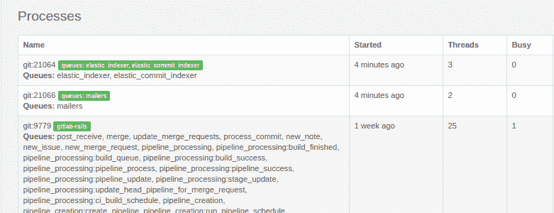

# Run multiple Sidekiq processes

> 原文：[https://docs.gitlab.com/ee/administration/operations/extra_sidekiq_processes.html](https://docs.gitlab.com/ee/administration/operations/extra_sidekiq_processes.html)

*   [Available Sidekiq queues](#available-sidekiq-queues)
*   [Start multiple processes](#start-multiple-processes)
*   [Negate settings](#negate-settings)
*   [Queue selector (experimental)](#queue-selector-experimental)
    *   [Available attributes](#available-attributes)
    *   [Available operators](#available-operators)
    *   [Example queries](#example-queries)
    *   [Disable Sidekiq cluster](#disable-sidekiq-cluster)
*   [Ignore all GitHub import queues](#ignore-all-github-import-queues)
*   [Number of threads](#number-of-threads)
*   [Manage concurrency](#manage-concurrency)
    *   [When running Sidekiq cluster (default)](#when-running-sidekiq-cluster-default)
    *   [When running a single Sidekiq process](#when-running-a-single-sidekiq-process)
*   [Modify the check interval](#modify-the-check-interval)
*   [Troubleshoot using the CLI](#troubleshoot-using-the-cli)
    *   [Monitor the `sidekiq-cluster` command](#monitor-the-sidekiq-cluster-command)
    *   [PID files](#pid-files)
    *   [Environment](#environment)

# Run multiple Sidekiq processes[](#run-multiple-sidekiq-processes-core-only "Permalink")

GitLab 允许您启动多个 Sidekiq 进程. 这些过程可用于消耗一组专用队列. 这可以用来确保某些队列始终具有专用的工作程序，而不管需要处理的作业数量如何.

**注意：**此页面中的信息仅适用于 Omnibus GitLab.

## Available Sidekiq queues[](#available-sidekiq-queues "Permalink")

For a list of the existing Sidekiq queues, check the following files:

*   [Queues for both GitLab Community and Enterprise Editions](https://gitlab.com/gitlab-org/gitlab/blob/master/app/workers/all_queues.yml)
*   [Queues for GitLab Enterprise Editions only](https://gitlab.com/gitlab-org/gitlab/blob/master/ee/app/workers/all_queues.yml)

以上文件中的每个条目都代表一个队列，可以在其上启动 Sidekiq 进程.

## Start multiple processes[](#start-multiple-processes "Permalink")

版本历史

*   在 GitLab 12.10 中[引入](https://gitlab.com/gitlab-org/omnibus-gitlab/-/merge_requests/4006) ，使用 Sidekiq 集群启动多个进程.
*   [Sidekiq 集群移至](https://gitlab.com/groups/gitlab-com/gl-infra/-/epics/181) GitLab 12.10 中的 GitLab [Core](https://about.gitlab.com/pricing/#self-managed) .
*   [Sidekiq 集群](https://gitlab.com/gitlab-org/omnibus-gitlab/-/merge_requests/4140)在 GitLab 13.0 中[成为默认设置](https://gitlab.com/gitlab-org/omnibus-gitlab/-/merge_requests/4140) .

To start multiple processes:

1.  使用`sidekiq['queue_groups']`数组设置，指定使用`sidekiq-cluster`创建多少个进程以及它们应处理的队列. 数组中的每个项目都相当于一个附加的 Sidekiq 进程，并且每个项目中的值确定了它要处理的队列.

    例如，以下设置创建三个 Sidekiq 过程，一到上运行`elastic_indexer` ，一到上运行`mailers` ，以及一个进程中运行的所有的队列：

    ```
    sidekiq['queue_groups'] = [
      "elastic_indexer",
      "mailers",
      "*"
    ] 
    ```

    要让附加的 Sidekiq 进程处理多个队列，请将多个队列名称添加到其项目中，并以逗号分隔. 例如：

    ```
    sidekiq['queue_groups'] = [
      "elastic_indexer, elastic_commit_indexer",
      "mailers",
      "*"
    ] 
    ```

    [在 GitLab 12.9](https://gitlab.com/gitlab-org/gitlab/-/merge_requests/26594)和更高版本中，特殊队列名称`*`表示所有队列. 这将启动两个进程，每个进程处理所有队列：

    ```
    sidekiq['queue_groups'] = [
      "*",
      "*"
    ] 
    ```

    `*`不能与具体的队列名称结合使用- `*, mailers`将只处理`mailers`队列.

    当`sidekiq-cluster`仅在单个节点上运行时，请使用`*`确保在所有队列上至少运行一个进程. 这意味着一个进程将自动在将来创建的队列中拾取作业.

    如果`sidekiq-cluster`在多个节点上运行，则还可以使用[`--negate`](#negate-settings)并列出所有已在处理的队列.

2.  保存文件并重新配置 GitLab，以使更改生效：

    ```
    sudo gitlab-ctl reconfigure 
    ```

添加了额外的 Sidekiq 进程后，导航至 GitLab 中的**管理区域>监视>后台作业** （ `/admin/background_jobs` ）.

[](img/sidekiq-cluster.png)

## Negate settings[](#negate-settings "Permalink")

若要使其他 Sidekiq 进程在您列出的队列**之外**的每个队列上工作：

1.  在按照步骤[启动额外的流程之后](#start-multiple-processes) ，请编辑`/etc/gitlab/gitlab.rb`并添加：

    ```
    sidekiq['negate'] = true 
    ```

2.  保存文件并重新配置 GitLab，以使更改生效：

    ```
    sudo gitlab-ctl reconfigure 
    ```

## Queue selector (experimental)[](#queue-selector-experimental "Permalink")

[Introduced](https://gitlab.com/gitlab-com/gl-infra/scalability/-/issues/45) in [GitLab Starter](https://about.gitlab.com/pricing/) 12.8.

**注意：**由于这被标记为**实验性的** ，因此随时可能更改，包括**破坏向后兼容性** . 这样我们就可以对 GitLab.com 部署所需的更改做出反应. 我们存在一个跟踪问题，希望从此功能中[删除实验性名称](https://gitlab.com/gitlab-com/gl-infra/scalability/-/issues/147) ； 如果您有兴趣在自己的部署中使用它，请在此处发表评论.

除了按名称选择队列之外，如上所述， `experimental_queue_selector`选项还允许使用以下组件以更通用的方式选择队列组：

*   可以选择的属性.
*   用于构造查询的运算符.

### Available attributes[](#available-attributes "Permalink")

*   在 GitLab 13.1 中[引入](https://gitlab.com/gitlab-com/gl-infra/scalability/-/issues/261) ， `tags` .

从[所有可用属性](https://gitlab.com/gitlab-org/gitlab/-/blob/master/app/workers/all_queues.yml)的[列表中](https://gitlab.com/gitlab-org/gitlab/-/blob/master/app/workers/all_queues.yml) ， `experimental_queue_selector`允许通过以下属性选择队列：

*   `feature_category`队列所属的[GitLab 功能类别](https://about.gitlab.com/direction/maturity/#category-maturity) . 例如， `merge`队列属于`source_code_management`类别.
*   `has_external_dependencies`队列是否连接到外部服务. 例如，所有进口商都将此设置为`true` .
*   `urgency` -快速运行此队列的重要性. 可以`high` ， `low`或`throttled` . 例如， `authorized_projects`队列用于刷新用户权限，并且紧急度很高.
*   `name` -队列名. 其他属性通常更有用，因为它们更通用，但这在需要选择特定队列的情况下可用.
*   `resource_boundary`如果队列受`cpu` ， `memory`或`unknown`绑定. 例如， `project_export`队列受内存限制，因为它必须先将数据加载到内存中，然后再保存以进行导出.
*   `tags` -队列的短暂注释. 预计这些版本会在发行版本之间频繁更改，并且可能会完全删除.

`has_external_dependencies`是布尔值属性：只有确切的字符串`true`才被视为 true，其他所有内容都被视为 false.

`tags`是一个集合，这意味着`=`检查相交的集合，而`!=`检查不相交的集合. 例如， `tags=a,b`选择具有标签`a` ， `b`或两者都有的队列. `tags!=a,b`选择没有这些标签的队列.

### Available operators[](#available-operators "Permalink")

`experimental_queue_selector`支持以下运算符，从最高优先级到最低优先级列出：

*   `|` -逻辑或运算符. 例如， `query_a|query_b` （此处的`query_a`和`query_b`是由其他运算符组成的查询）将包括与任一查询匹配的队列.
*   `&` -逻辑 AND 运算符. 例如， `query_a&query_b` （此处的`query_a`和`query_b`是由其他运算符组成的查询）将仅包括与两个查询均匹配的队列.
*   `!=` -NOT IN 运算符. 例如， `feature_category!=issue_tracking`将所有队列排除在`issue_tracking`功能类别之外.
*   `=` -IN 运算符. 例如， `resource_boundary=cpu`包括所有受 CPU 约束的队列.
*   `,` -串联集合运算符. 例如， `feature_category=continuous_integration,pages`包含来自`continuous_integration`类别或`pages`类别的所有队列. 使用 OR 运算符也可以使用此示例，但是它具有更高的简洁性，并且具有较低的优先级.

此语法的运算符优先级是固定的：不可能使 AND 的优先级高于 OR.

[In GitLab 12.9](https://gitlab.com/gitlab-org/gitlab/-/merge_requests/26594) and later, as with the standard queue group syntax above, a single `*` as the entire queue group selects all queues.

### Example queries[](#example-queries "Permalink")

In `/etc/gitlab/gitlab.rb`:

```
sidekiq['enable'] = true
sidekiq['experimental_queue_selector'] = true
sidekiq['queue_groups'] = [
  # Run all non-CPU-bound queues that are high urgency
  'resource_boundary!=cpu&urgency=high',
  # Run all continuous integration and pages queues that are not high urgency
  'feature_category=continuous_integration,pages&urgency!=high',
  # Run all queues
  '*'
] 
```

### Disable Sidekiq cluster[](#disable-sidekiq-cluster "Permalink")

**警告：**在 GitLab 14.0 中， [计划](https://gitlab.com/gitlab-com/gl-infra/scalability/-/issues/240)将 Sidekiq 群集作为启动 Sidekiq 的唯一方法.

默认情况下，Sidekiq 服务将运行`sidekiq-cluster` . 若要禁用此行为，请将以下内容添加到 Sidekiq 配置中：

```
sidekiq['enable'] = true
sidekiq['cluster'] = false 
```

所有上述提及的`sidekiq`配置选项均可用. 默认情况下，它们的配置如下：

```
sidekiq['experimental_queue_selector'] = false
sidekiq['interval'] = nil
sidekiq['max_concurrency'] = 50
sidekiq['min_concurrency'] = nil
sidekiq['negate'] = false
sidekiq['queue_groups'] = ['*']
sidekiq['shutdown_timeout'] = 25 
```

如果您决定如上所述配置集群，则必须禁用`sidekiq_cluster` .

禁用`sidekiq_cluster` ，必须将`sidekiq_cluster`的配置复制到`sidekiq` . 任何配置成用于`sidekiq_cluster`将被覆盖由用于选项`sidekiq`设定时`sidekiq['cluster'] = true` .

使用此功能时，名为`sidekiq`的服务现在将在运行`sidekiq-cluster` .

将遵守为 Sidekiq 配置的[并发](#manage-concurrency)和其他选项.

默认情况下， `sidekiq-cluster` `/var/log/gitlab/sidekiq`像常规的 Sidekiq 日志一样进入`/var/log/gitlab/sidekiq` .

## Ignore all GitHub import queues[](#ignore-all-github-import-queues "Permalink")

[从 GitHub 导入时](../../user/project/import/github.html) ，Sidekiq 可能会使用其所有资源来执行那些操作. 要设置一个单独的`sidekiq-cluster`进程以忽略所有与 GitHub 导入相关的队列：

1.  编辑`/etc/gitlab/gitlab.rb`并添加：

    ```
    sidekiq['enable'] = true
    sidekiq['negate'] = true
    sidekiq['queue_groups'] = [
      "github_import_advance_stage",
      "github_importer:github_import_import_diff_note",
      "github_importer:github_import_import_issue",
      "github_importer:github_import_import_note",
      "github_importer:github_import_import_lfs_object",
      "github_importer:github_import_import_pull_request",
      "github_importer:github_import_refresh_import_jid",
      "github_importer:github_import_stage_finish_import",
      "github_importer:github_import_stage_import_base_data",
      "github_importer:github_import_stage_import_issues_and_diff_notes",
      "github_importer:github_import_stage_import_notes",
      "github_importer:github_import_stage_import_lfs_objects",
      "github_importer:github_import_stage_import_pull_requests",
      "github_importer:github_import_stage_import_repository"
    ] 
    ```

2.  保存文件并重新配置 GitLab，以使更改生效：

    ```
    sudo gitlab-ctl reconfigure 
    ```

## Number of threads[](#number-of-threads "Permalink")

在`sidekiq`下定义的每个进程都以等于队列数的线程数开始，再加上一个备用线程. 例如，处理`process_commit`和`post_receive`队列的进程将总共使用三个线程.

## Manage concurrency[](#manage-concurrency "Permalink")

设置最大并发数时，请记住，这通常不应超过可用的 CPU 内核数. 以下示例中的值是任意的，不是特别的建议.

Each thread requires a Redis connection, so adding threads may increase Redis latency and potentially cause client timeouts. See the [Sidekiq documentation about Redis](https://github.com/mperham/sidekiq/wiki/Using-Redis) for more details.

### When running Sidekiq cluster (default)[](#when-running-sidekiq-cluster-default "Permalink")

在 GitLab 13.0 和更高版本中，默认运行 Sidekiq 群集.

1.  编辑`/etc/gitlab/gitlab.rb`并添加：

    ```
    sidekiq['min_concurrency'] = 15
    sidekiq['max_concurrency'] = 25 
    ```

2.  保存文件并重新配置 GitLab，以使更改生效：

    ```
    sudo gitlab-ctl reconfigure 
    ```

`min_concurrency`和`max_concurrency`是独立的； 一个可以不设置另一个. 将`min_concurrency`设置为 0 将禁用该限制.

对于每个队列组，令 N 为队列数多一. 并发因子将设置为：

1.  `N` ，如果它介于`min_concurrency`和`max_concurrency`之间.
2.  `max_concurrency` ，如果`N`超过此值.
3.  `min_concurrency` ，如果`N`小于此值.

如果`min_concurrency`等于`max_concurrency` ，那么无论队列数量如何，都将使用此值.

当`min_concurrency`大于`max_concurrency` ，它将被视为等于`max_concurrency` .

### When running a single Sidekiq process[](#when-running-a-single-sidekiq-process "Permalink")

在 GitLab 12.10 及更早版本中，默认运行单个 Sidekiq 进程.

**警告：**计划在 GitLab [14.0 中](https://gitlab.com/gitlab-com/gl-infra/scalability/-/issues/240)删除直接运行 Sidekiq.

1.  编辑`/etc/gitlab/gitlab.rb`并添加：

    ```
    sidekiq['cluster'] = false
    sidekiq['concurrency'] = 25 
    ```

2.  保存文件并重新配置 GitLab，以使更改生效：

    ```
    sudo gitlab-ctl reconfigure 
    ```

这将设置 Sidekiq 进程的并发性（线程数）.

## Modify the check interval[](#modify-the-check-interval "Permalink")

修改其他 Sidekiq 进程的检查间隔：

1.  编辑`/etc/gitlab/gitlab.rb`并添加：

    ```
    sidekiq['interval'] = 5 
    ```

2.  保存文件并[重新配置 GitLab，](../restart_gitlab.html#omnibus-gitlab-reconfigure)以使更改生效.

这告诉其他进程多久检查一次排队的作业.

## Troubleshoot using the CLI[](#troubleshoot-using-the-cli "Permalink")

**警告：**建议使用`/etc/gitlab/gitlab.rb`来配置 Sidekiq 进程. 如果遇到问题，应联系 GitLab 支持. 使用命令行需要您自担风险.

为了进行调试，可以使用命令`/opt/gitlab/embedded/service/gitlab-rails/bin/sidekiq-cluster`启动额外的 Sidekiq 进程. 此命令使用以下语法获取参数：

```
/opt/gitlab/embedded/service/gitlab-rails/bin/sidekiq-cluster [QUEUE,QUEUE,...] [QUEUE, ...] 
```

每个单独的参数表示一组必须由 Sidekiq 进程处理的队列. 多个队列可以通过相同的过程来处理，方法是用逗号而不是空格将它们分开.

除了队列，还可以提供队列名称空间，以使进程自动侦听该名称空间中的所有队列，而无需显式列出所有队列名称. 有关队列名称空间的更多信息，请参见[Sidekiq 样式指南中](../../development/sidekiq_style_guide.html#queue-namespaces)的相关部分.

例如，假设您要启动两个额外的进程：一个进程处理`process_commit`队列，另一个进程处理`post_receive`队列. 可以按以下步骤完成：

```
/opt/gitlab/embedded/service/gitlab-rails/bin/sidekiq-cluster process_commit post_receive 
```

如果您想启动一个处理两个队列的进程，则可以使用以下语法：

```
/opt/gitlab/embedded/service/gitlab-rails/bin/sidekiq-cluster process_commit,post_receive 
```

如果您想让一个 Sidekiq 进程处理`process_commit`和`post_receive`队列，以及一个进程来处理`gitlab_shell`队列，则可以使用以下命令：

```
/opt/gitlab/embedded/service/gitlab-rails/bin/sidekiq-cluster process_commit,post_receive gitlab_shell 
```

### Monitor the `sidekiq-cluster` command[](#monitor-the-sidekiq-cluster-command "Permalink")

一旦启动了所需数量的 Sidekiq 进程， `sidekiq-cluster`命令将不会终止. 相反，该进程将继续运行并将所有信号转发到子进程. 这使停止所有 Sidekiq 进程变得容易，因为您只需将信号发送到`sidekiq-cluster`进程即可，而不必将其发送到各个进程.

如果`sidekiq-cluster`进程崩溃或收到`SIGKILL` ，则子进程将在几秒钟后终止. 这样可以确保您不会遇到僵尸 Sidekiq 进程.

所有这些使监视过程变得相当容易. 只需将`sidekiq-cluster`到您选择的主管（例如 runit），就可以了.

如果子进程死亡， `sidekiq-cluster`命令将发出信号通知所有剩余进程终止，然后终止自身. 这样就不需要`sidekiq-cluster`来重新实现复杂的过程监控/重新启动代码. 相反，您应该确保主管在必要时重新启动`sidekiq-cluster`过程.

### PID files[](#pid-files "Permalink")

`sidekiq-cluster`命令可以将其 PID 存储在文件中. 默认情况下，不会写入任何 PID 文件，但是可以通过将`--pidfile`选项传递给`sidekiq-cluster`来更改此文件. 例如：

```
/opt/gitlab/embedded/service/gitlab-rails/bin/sidekiq-cluster --pidfile /var/run/gitlab/sidekiq_cluster.pid process_commit 
```

请记住，PID 文件将包含`sidekiq-cluster`命令的 PID，而不包含已启动的 Sidekiq 进程的 PID.

### Environment[](#environment "Permalink")

可以通过将`--environment`标志传递给`sidekiq-cluster`命令或将`RAILS_ENV`设置为非空值来设置 Rails 环境. 可以在`/opt/gitlab/etc/gitlab-rails/env/RAILS_ENV`找到默认值.