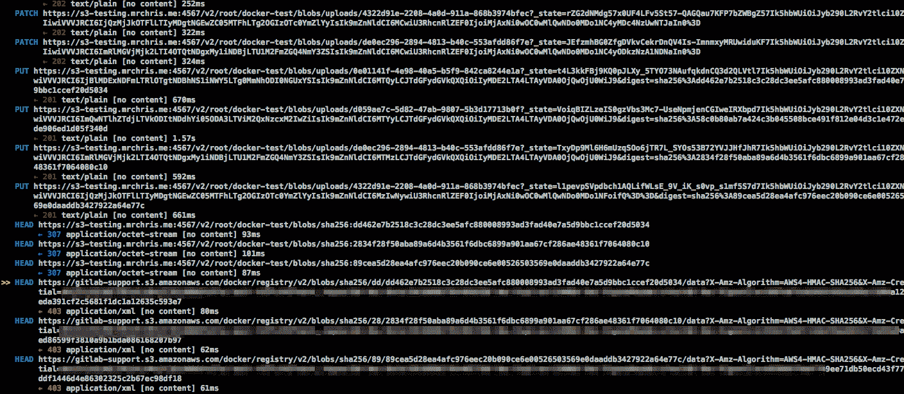

# GitLab Container Registry administration

> 原文：[https://docs.gitlab.com/ee/administration/packages/container_registry.html](https://docs.gitlab.com/ee/administration/packages/container_registry.html)

*   [Enable the Container Registry](#enable-the-container-registry)
*   [Container Registry domain configuration](#container-registry-domain-configuration)
    *   [Configure Container Registry under an existing GitLab domain](#configure-container-registry-under-an-existing-gitlab-domain)
    *   [Configure Container Registry under its own domain](#configure-container-registry-under-its-own-domain)
*   [Disable Container Registry site-wide](#disable-container-registry-site-wide)
*   [Disable Container Registry for new projects site-wide](#disable-container-registry-for-new-projects-site-wide)
*   [Configure storage for the Container Registry](#configure-storage-for-the-container-registry)
    *   [Use filesystem](#use-filesystem)
    *   [Use object storage](#use-object-storage)
        *   [Migrate to object storage without downtime](#migrate-to-object-storage-without-downtime)
    *   [Disable redirect for storage driver](#disable-redirect-for-storage-driver)
    *   [Storage limitations](#storage-limitations)
*   [Change the registry’s internal port](#change-the-registrys-internal-port)
*   [Disable Container Registry per project](#disable-container-registry-per-project)
*   [Use an external container registry with GitLab as an auth endpoint](#use-an-external-container-registry-with-gitlab-as-an-auth-endpoint)
*   [Configure Container Registry notifications](#configure-container-registry-notifications)
*   [Container Registry garbage collection](#container-registry-garbage-collection)
    *   [Understanding the content-addressable layers](#understanding-the-content-addressable-layers)
    *   [Recycling unused tags](#recycling-unused-tags)
    *   [Removing unused layers not referenced by manifests](#removing-unused-layers-not-referenced-by-manifests)
    *   [Performing garbage collection without downtime](#performing-garbage-collection-without-downtime)
    *   [Running the garbage collection on schedule](#running-the-garbage-collection-on-schedule)
*   [Troubleshooting](#troubleshooting)
    *   [Using self-signed certificates with Container Registry](#using-self-signed-certificates-with-container-registry)
    *   [`unauthorized: authentication required` when pushing large images](#unauthorized-authentication-required-when-pushing-large-images)
    *   [AWS S3 with the GitLab registry error when pushing large images](#aws-s3-with-the-gitlab-registry-error-when-pushing-large-images)
    *   [Supporting older Docker clients](#supporting-older-docker-clients)
    *   [Docker connection error](#docker-connection-error)
    *   [Image push errors](#image-push-errors)
    *   [Enable the Registry debug server](#enable-the-registry-debug-server)
    *   [Advanced Troubleshooting](#advanced-troubleshooting)
        *   [Unexpected 403 error during push](#unexpected-403-error-during-push)
        *   [mitmproxy](#mitmproxy)
        *   [Running the Docker daemon with a proxy](#running-the-docker-daemon-with-a-proxy)
        *   [Running the Docker client](#running-the-docker-client)

# GitLab Container Registry administration[](#gitlab-container-registry-administration "Permalink")

Version history

*   在 GitLab 8.8 中[引入](https://gitlab.com/gitlab-org/gitlab-foss/-/merge_requests/4040) .
*   在 GitLab 8.9 中添加了对 Container Registry manifest `v1`支持，以支持 1.10 之前的 Docker 版本.

**注意：**本文档是管理员指南. 要了解如何使用 GitLab 容器注册表，请参阅[用户文档](../../user/packages/container_registry/index.html) .

通过将容器注册表集成到 GitLab 中，每个项目都可以拥有自己的空间来存储其 Docker 映像.

您可以在[https://docs.docker.com/registry/introduction/上](https://s0docs0docker0com.icopy.site/registry/introduction/)了解有关 Docker 注册表的更多信息.

## Enable the Container Registry[](#enable-the-container-registry "Permalink")

**所有装置 GitLab**

如果您使用 Omnibus 安装包安装了 GitLab，则默认情况下容器注册表可能可用或可能不可用.

如果出现以下情况，容器注册表将自动启用，并在您的 GitLab 域上的端口 5050 上可用：

*   您正在使用内置的[Let's Encrypt 集成](https://docs.gitlab.com/omnibus/settings/ssl.html) ，并且
*   您使用的是 GitLab 12.5 或更高版本.

否则，不会启用容器注册表. 要启用它：

*   您可以为您的[GitLab 域](#configure-container-registry-under-an-existing-gitlab-domain)配置它，或者
*   您可以为[其他域](#configure-container-registry-under-its-own-domain)配置它.

**注意：**默认情况下，容器注册表在 HTTPS 下工作. 您可以使用 HTTP，但不建议使用 HTTP，它不在本文档的讨论范围之内. 如果要实现此目的，请阅读[不安全的注册表文档](https://s0docs0docker0com.icopy.site/registry/insecure/) .

**从源安装**

如果您从源代码安装了 GitLab：

1.  您将必须自己[安装注册表](https://s0docs0docker0com.icopy.site/registry/deploying/) .
2.  安装完成后，您必须在`gitlab.yml`中配置注册表的设置才能启用它.
3.  使用在[`lib/support/nginx/registry-ssl`](https://gitlab.com/gitlab-org/gitlab/blob/master/lib/support/nginx/registry-ssl)下找到的示例 NGINX 配置文件，并对其进行编辑以匹配`host` ， `port`和 TLS 证书路径.

`gitlab.yml`的内容是：

```
registry:
  enabled: true
  host: registry.gitlab.example.com
  port: 5005
  api_url: http://localhost:5000/
  key: config/registry.key
  path: shared/registry
  issuer: gitlab-issuer 
```

where:

| Parameter | Description |
| --- | --- |
| `enabled` | `true` `false` . 在 GitLab 中启用注册表. 默认情况下为`false` . |
| `host` | 注册表将在其下运行的主机 URL，并且用户将可以使用该 URL. |
| `port` | 外部注册表域将在其上侦听的端口. |
| `api_url` | The internal API URL under which the Registry is exposed to. It defaults to `http://localhost:5000`. |
| `key` | 私钥位置是一对 Registry 的`rootcertbundle` . 阅读[令牌身份验证配置文档](https://s0docs0docker0com.icopy.site/registry/configuration/) . |
| `path` | 该目录应与 Registry 的`rootdirectory`指定的目录相同. 阅读[存储配置文档](https://s0docs0docker0com.icopy.site/registry/configuration/) . GitLab 用户，Web 服务器用户和注册表用户必须可读此路径. 在[＃configure-container-for-container-registry 中](#configure-storage-for-the-container-registry)了解更多信息. |
| `issuer` | This should be the same value as configured in Registry’s `issuer`. Read the [token auth configuration documentation](https://s0docs0docker0com.icopy.site/registry/configuration/). |

**注意：**如果从源代码安装，则 GitLab 不会随附注册表初始化文件. 因此，如果您修改注册表， [重新启动 GitLab](../restart_gitlab.html#installations-from-source)将不会重新启动注册表. 阅读有关如何实现这一目标的上游文档.

**绝对**要确保您的[注册表配置](https://s0docs0docker0com.icopy.site/registry/configuration/)将`container_registry`作为服务，并将`https://gitlab.example.com/jwt/auth`作为领域：

```
auth:
  token:
    realm: https://gitlab.example.com/jwt/auth
    service: container_registry
    issuer: gitlab-issuer
    rootcertbundle: /root/certs/certbundle 
```

**注意：**如果未设置`auth` ，则用户无需身份验证即可拉取 Docker 映像.

## Container Registry domain configuration[](#container-registry-domain-configuration "Permalink")

There are two ways you can configure the Registry’s external domain. Either:

*   [使用现有的 GitLab 域](#configure-container-registry-under-an-existing-gitlab-domain) ，在这种情况下，注册表将不得不侦听端口并重用 GitLab 的 TLS 证书，
*   [将完全独立的域](#configure-container-registry-under-its-own-domain)与该[域](#configure-container-registry-under-its-own-domain)的新 TLS 证书一起使用.

由于容器注册表需要 TLS 证书，所以最终归结为获得新证书的难易程度或代价.

在首次配置 Container Registry 之前，请考虑到这一点.

### Configure Container Registry under an existing GitLab domain[](#configure-container-registry-under-an-existing-gitlab-domain "Permalink")

如果将注册表配置为使用现有的 GitLab 域，则可以在端口上公开注册表，以便可以重复使用现有的 GitLab TLS 证书.

假设 GitLab 域是`https://gitlab.example.com` ，注册表暴露给外界的端口是`5050` ，如果您正在使用 Omnibus GitLab，则需要在`gitlab.rb`或`gitlab.yml`进行设置或分别从源代码安装 GitLab.

**注意：**请小心选择与注册表侦听的端口不同的端口（默认为`5000` ），否则您将遇到冲突.

**所有装置 GitLab**

1.  您的`/etc/gitlab/gitlab.rb`应该包含注册表 URL 以及 GitLab 使用的现有 TLS 证书和密钥的路径：

    ```
    registry_external_url 'https://gitlab.example.com:5050' 
    ```

    请注意， `registry_external_url`如何在现有 GitLab URL 下的 HTTPS 上侦听，但在其他端口上.

    如果您的 TLS 证书不在`/etc/gitlab/ssl/gitlab.example.com.crt`并且密钥不在`/etc/gitlab/ssl/gitlab.example.com.key`取消注释以下行：

    ```
    registry_nginx['ssl_certificate'] = "/path/to/certificate.pem"
    registry_nginx['ssl_certificate_key'] = "/path/to/certificate.key" 
    ```

2.  保存文件并[重新配置 GitLab，](../restart_gitlab.html#omnibus-gitlab-reconfigure)以使更改生效.

3.  验证使用：

    ```
    openssl s_client -showcerts -servername gitlab.example.com -connect gitlab.example.com:5050 > cacert.pem 
    ```

**注意：**如果您的证书提供者提供了 CA Bundle 证书，则将它们附加到 TLS 证书文件中.

**从源安装**

1.  打开`/home/git/gitlab/config/gitlab.yml` ，找到`registry`项，并使用以下设置进行配置：

    ```
    registry:
      enabled: true
      host: gitlab.example.com
      port: 5050 
    ```

2.  保存文件并[重新启动 GitLab，](../restart_gitlab.html#installations-from-source)以使更改生效.
3.  还要在 NGINX 中进行相关更改（域，端口，TLS 证书路径）.

用户现在应该可以使用以下命令使用其 GitLab 凭据登录到 Container Registry：

```
docker login gitlab.example.com:5050 
```

### Configure Container Registry under its own domain[](#configure-container-registry-under-its-own-domain "Permalink")

如果将注册表配置为使用其自己的域，则将需要该特定域的 TLS 证书（例如， `registry.example.com` ），或者如果托管在现有 GitLab 域的子域（例如， `registry.example.com` ）下，则可能需要通配符证书`registry.gitlab.example.com` ）.

**注意：**除手动生成的 SSL 证书（在此处说明）外， [Omnibus 安装](https://docs.gitlab.com/omnibus/settings/ssl.html)还[支持](https://docs.gitlab.com/omnibus/settings/ssl.html)由 Let's Encrypt 自动生成的证书.

假设您希望在`https://registry.gitlab.example.com`上访问容器注册表.

**所有装置 GitLab**

1.  将您的 TLS 证书和密钥放在`/etc/gitlab/ssl/registry.gitlab.example.com.crt`和`/etc/gitlab/ssl/registry.gitlab.example.com.key` ，并确保它们具有正确的权限：

    ```
    chmod 600 /etc/gitlab/ssl/registry.gitlab.example.com.* 
    ```

2.  TLS 证书到位后，使用以下命令编辑`/etc/gitlab/gitlab.rb` ：

    ```
    registry_external_url 'https://registry.gitlab.example.com' 
    ```

    请注意， `registry_external_url`如何在 HTTPS 上进行侦听.

3.  保存文件并[重新配置 GitLab，](../restart_gitlab.html#omnibus-gitlab-reconfigure)以使更改生效.

如果您具有[通配符证书](https://en.wikipedia.org/wiki/Wildcard_certificate) ，则除了 URL 外，还需要指定证书的路径，在这种情况下，/ `/etc/gitlab/gitlab.rb`将如下所示：

```
registry_nginx['ssl_certificate'] = "/etc/gitlab/ssl/certificate.pem"
registry_nginx['ssl_certificate_key'] = "/etc/gitlab/ssl/certificate.key" 
```

**从源安装**

1.  打开`/home/git/gitlab/config/gitlab.yml` ，找到`registry`项，并使用以下设置进行配置：

    ```
    registry:
      enabled: true
      host: registry.gitlab.example.com 
    ```

2.  保存文件并[重新启动 GitLab，](../restart_gitlab.html#installations-from-source)以使更改生效.
3.  还要在 NGINX 中进行相关更改（域，端口，TLS 证书路径）.

用户现在应该能够使用其 GitLab 凭据登录到 Container Registry：

```
docker login registry.gitlab.example.com 
```

## Disable Container Registry site-wide[](#disable-container-registry-site-wide "Permalink")

**注意：**按照以下步骤在 Rails GitLab 应用程序中禁用注册表，不会删除任何现有的 Docker 映像. 这由注册表应用程序本身处理.

**所有的 GitLab**

1.  打开`/etc/gitlab/gitlab.rb`并将`registry['enable']`为`false` ：

    ```
    registry['enable'] = false 
    ```

2.  保存文件并[重新配置 GitLab，](../restart_gitlab.html#omnibus-gitlab-reconfigure)以使更改生效.

**从源安装**

1.  打开`/home/git/gitlab/config/gitlab.yml` ，找到`registry`项并将其设置`enabled`以`false` ：

    ```
    registry:
      enabled: false 
    ```

2.  保存文件并[重新启动 GitLab，](../restart_gitlab.html#installations-from-source)以使更改生效.

## Disable Container Registry for new projects site-wide[](#disable-container-registry-for-new-projects-site-wide "Permalink")

如果启用了容器注册表，那么它将在所有新项目中可用. 要禁用此功能并使项目的所有者自行启用容器注册表，请按照以下步骤操作.

**所有装置 GitLab**

1.  编辑`/etc/gitlab/gitlab.rb`并添加以下行：

    ```
    gitlab_rails['gitlab_default_projects_features_container_registry'] = false 
    ```

2.  保存文件并[重新配置 GitLab，](../restart_gitlab.html#omnibus-gitlab-reconfigure)以使更改生效.

**从源安装**

1.  打开`/home/git/gitlab/config/gitlab.yml` ，找到`default_projects_features`条目并进行配置，以便`container_registry`设置为`false` ：

    ```
    ## Default project features settings
    default_projects_features:
      issues: true
      merge_requests: true
      wiki: true
      snippets: false
      builds: true
      container_registry: false 
    ```

2.  保存文件并[重新启动 GitLab，](../restart_gitlab.html#installations-from-source)以使更改生效.

## Configure storage for the Container Registry[](#configure-storage-for-the-container-registry "Permalink")

您可以通过配置存储驱动程序来将 Container Registry 配置为使用各种存储后端. 默认情况下，GitLab 容器注册表配置为使用[文件系统驱动程序](#use-filesystem)配置.

支持的不同驱动程序是：

| Driver | Description |
| --- | --- |
| filesystem | 使用本地文件系统上的路径 |
| Azure | Microsoft Azure Blob 存储 |
| gcs | 谷歌云存储 |
| s3 | Amazon Simple Storage Service. 确保使用正确的[S3 权限范围](https://s0docs0docker0com.icopy.site/registry/storage-drivers/s3/)配置存储桶. |
| swift | OpenStack Swift 对象存储 |
| oss | 阿里云 OSS |

在[Docker Registry 文档中](https://s0docs0docker0com.icopy.site/registry/configuration/)阅读有关单个驱动程序配置选项的更多信息.

### Use filesystem[](#use-filesystem "Permalink")

如果要将图像存储在文件系统上，则可以更改 Container Registry 的存储路径，请按照以下步骤操作.

此路径可用于：

*   运行容器注册表守护程序的用户.
*   运行 GitLab 的用户.

**警告：**您应该确认所有的 GitLab，注册表和 Web 服务器用户都可以访问该目录.

**所有装置 GitLab**

在 Omnibus 中存储图像的默认位置是`/var/opt/gitlab/gitlab-rails/shared/registry` . 要更改它：

1.  Edit `/etc/gitlab/gitlab.rb`:

    ```
    gitlab_rails['registry_path'] = "/path/to/registry/storage" 
    ```

2.  保存文件并[重新配置 GitLab，](../restart_gitlab.html#omnibus-gitlab-reconfigure)以使更改生效.

**从源安装**

在源安装中存储映像的默认位置是`/home/git/gitlab/shared/registry` . 要更改它：

1.  打开`/home/git/gitlab/config/gitlab.yml` ，找到`registry`项并更改`path`设置：

    ```
    registry:
      path: shared/registry 
    ```

2.  保存文件并[重新启动 GitLab，](../restart_gitlab.html#installations-from-source)以使更改生效.

### Use object storage[](#use-object-storage "Permalink")

如果要将图像存储在对象存储中，则可以更改 Container Registry 的存储驱动程序.

[Read more about using object storage with GitLab](../object_storage.html).

**警告：** GitLab 不会备份未存储在文件系统上的 Docker 映像. 请记住，如果需要，请与您的对象存储提供程序一起启用备份.**注：** `regionendpoint`配置 S3 兼容的服务，如 MinIO 时才需要. 它采用一个 URL，例如`http://127.0.0.1:9000` .

**所有装置 GitLab**

在 Omnibus 中配置`s3`存储驱动程序：

1.  Edit `/etc/gitlab/gitlab.rb`:

    ```
    registry['storage'] = {
      's3' => {
        'accesskey' => 's3-access-key',
        'secretkey' => 's3-secret-key-for-access-key',
        'bucket' => 'your-s3-bucket',
        'region' => 'your-s3-region',
        'regionendpoint' => 'your-s3-regionendpoint'
      }
    } 
    ```

2.  保存文件并[重新配置 GitLab，](../restart_gitlab.html#omnibus-gitlab-reconfigure)以使更改生效.

**注意：** `your-s3-bucket`应该仅是存在的存储桶的名称，并且不能包含子目录.

**从源安装**

存储驱动程序的配置在[部署 Docker 注册表](https://s0docs0docker0com.icopy.site/registry/deploying/)时创建的注册表配置 YML 文件中完成.

`s3`存储驱动程序示例：

```
storage:
  s3:
    accesskey: 's3-access-key'
    secretkey: 's3-secret-key-for-access-key'
    bucket: 'your-s3-bucket'
    region: 'your-s3-region'
    regionendpoint: 'your-s3-regionendpoint'
  cache:
    blobdescriptor: inmemory
  delete:
    enabled: true 
```

**注意：** `your-s3-bucket`应该仅是存在的存储桶的名称，并且不能包含子目录.

#### Migrate to object storage without downtime[](#migrate-to-object-storage-without-downtime "Permalink")

若要在不停止 Container Registry 的情况下迁移存储，请将 Container Registry 设置为只读模式. 在大型实例上，这可能需要将 Container Registry 置于只读模式一段时间. 在此期间，您可以从 Container Registry 中拉出，但不能推送.

1.  可选：要减少要迁移的数据量，请运行[垃圾收集工具，而无需停机](#performing-garbage-collection-without-downtime) .
2.  例如，使用 AWS CLI [`cp`](https://awscli.amazonaws.com/v2/documentation/api/latest/reference/s3/cp.html)或[`sync`](https://awscli.amazonaws.com/v2/documentation/api/latest/reference/s3/sync.html)命令将初始数据复制到 S3 存储桶. 确保将`docker`文件夹保留为存储桶中的顶级文件夹.

    ```
    aws s3 sync registry s3://mybucket 
    ```

3.  为了使更改生效， [请将 Container Registry 设置为`read-only`模式，](#performing-garbage-collection-without-downtime)然后[重新配置 GitLab](../restart_gitlab.html#omnibus-gitlab-reconfigure) .
4.  将自初始数据加载以来的所有更改同步到 S3 存储桶，并删除目标存储桶中存在但源文件中不存在的文件：

    ```
    aws s3 sync registry s3://mybucket --delete 
    ```

    **危险：** `--delete`标志将删除存在于目标而不是在源文件中. 确保不交换源和目标，否则您将删除注册表中的所有数据.
5.  将注册表配置为使用 S3 存储桶进行存储.
6.  For the changes to take effect, set the Registry back to `read-write` mode and [reconfigure GitLab](../restart_gitlab.html#omnibus-gitlab-reconfigure).

### Disable redirect for storage driver[](#disable-redirect-for-storage-driver "Permalink")

默认情况下，访问配置了远程后端的注册表的用户将重定向到存储驱动程序的默认后端. 例如，可以使用`s3`存储驱动程序配置注册表，该驱动程序将请求重定向到远程 S3 存储桶以减轻 GitLab 服务器上的负载.

但是，对于通常无法访问公共服务器的内部主机使用的注册表，此行为是不希望的. 要禁用重定向和[代理下载](../object_storage.html#proxy-download) ，请按如下所示将`disable`标志设置为 true. 这使得所有流量始终通过注册表服务. 这样可以提高安全性（由于无法公开访问存储后端，从而减少了表面攻击），但性能却较差（所有流量都通过服务重定向）.

**所有装置 GitLab**

1.  Edit `/etc/gitlab/gitlab.rb`:

    ```
     registry['storage'] = {
       's3' => {
         'accesskey' => 's3-access-key',
         'secretkey' => 's3-secret-key-for-access-key',
         'bucket' => 'your-s3-bucket',
         'region' => 'your-s3-region',
         'regionendpoint' => 'your-s3-regionendpoint'
       },
       'redirect' => {
         'disable' => true
       }
     } 
    ```

2.  保存文件并[重新配置 GitLab，](../restart_gitlab.html#omnibus-gitlab-reconfigure)以使更改生效.

**从源安装**

1.  将`redirect`标志添加到您的注册表配置 YML 文件中：

    ```
     storage:
       s3:
         accesskey: 'AKIAKIAKI'
         secretkey: 'secret123'
         bucket: 'gitlab-registry-bucket-AKIAKIAKI'
         region: 'your-s3-region'
         regionendpoint: 'your-s3-regionendpoint'
       redirect:
         disable: true
       cache:
         blobdescriptor: inmemory
       delete:
         enabled: true 
    ```

2.  保存文件并[重新启动 GitLab，](../restart_gitlab.html#installations-from-source)以使更改生效.

### Storage limitations[](#storage-limitations "Permalink")

当前，没有存储限制，这意味着用户可以上传无限数量的任意大小的 Docker 映像. 此设置将在以后的版本中进行配置.

## Change the registry’s internal port[](#change-the-registrys-internal-port "Permalink")

**注意：**请勿将此与 GitLab 本身用于向世界展示注册表的端口混淆.

默认情况下，Registry Server 在端口`5000`上的 localhost 上侦听，这是 Registry Server 应接受其连接的地址. 在下面的示例中，我们将注册表的端口设置为`5001` .

**所有的 GitLab**

1.  打开`/etc/gitlab/gitlab.rb`并设置`registry['registry_http_addr']` ：

    ```
    registry['registry_http_addr'] = "localhost:5001" 
    ```

2.  保存文件并[重新配置 GitLab，](../restart_gitlab.html#omnibus-gitlab-reconfigure)以使更改生效.

**从源安装**

1.  打开您的注册表服务器的配置文件，然后编辑[`http:addr`](https://s0docs0docker0com.icopy.site/registry/configuration/)值：

    ```
    http
      addr: localhost:5001 
    ```

2.  保存文件并重新启动注册表服务器.

## Disable Container Registry per project[](#disable-container-registry-per-project "Permalink")

如果在您的 GitLab 实例中启用了注册表，但是您的项目不需要它，则可以从项目的设置中禁用它. 阅读有关如何实现此目的的用户指南.

## Use an external container registry with GitLab as an auth endpoint[](#use-an-external-container-registry-with-gitlab-as-an-auth-endpoint "Permalink")

**注意：**在使用外部容器注册表时，与容器注册表相关联的某些功能可能不可用或存在[固有风险](./../../user/packages/container_registry/index.html#use-with-external-container-registries)

**所有的 GitLab**

您可以将 GitLab 用作具有外部容器注册表的身份验证端点.

1.  打开`/etc/gitlab/gitlab.rb`并设置必要的配置：

    ```
    gitlab_rails['registry_enabled'] = true
    gitlab_rails['registry_api_url'] = "http://localhost:5000"
    gitlab_rails['registry_issuer'] = "omnibus-gitlab-issuer" 
    ```

    **注意：**启用 GitLab 的 Container Registry 功能和身份验证端点需要`gitlab_rails['registry_enabled'] = true` . 即使启用了它，也不会启动 GitLab 捆绑的 Container Registry 服务.
2.  证书密钥对是 GitLab 和外部容器注册表进行安全通信所必需的. 您将需要创建一个证书密钥对，使用公共证书配置外部容器注册表，并使用私钥配置 GitLab. 为此，将以下内容添加到`/etc/gitlab/gitlab.rb` ：

    ```
    # registry['internal_key'] should contain the contents of the custom key
    # file. Line breaks in the key file should be marked using `\n` character
    # Example:
    registry['internal_key'] = "---BEGIN RSA PRIVATE KEY---\nMIIEpQIBAA\n"

    # Optionally define a custom file for Omnibus GitLab to write the contents
    # of registry['internal_key'] to.
    gitlab_rails['registry_key_path'] = "/custom/path/to/registry-key.key" 
    ```

    **注意：**每次执行重新配置时，都会使用`internal_key`指定的内容填充`registry_key_path`指定的文件. 如果未指定文件，则 Omnibus GitLab 会将其默认设置为`/var/opt/gitlab/gitlab-rails/etc/gitlab-registry.key`并将其填充.
3.  要更改在 GitLab 容器注册表页面中显示的容器注册表 URL，请设置以下配置：

    ```
    gitlab_rails['registry_host'] = "registry.gitlab.example.com"
    gitlab_rails['registry_port'] = "5005" 
    ```

4.  保存文件并[重新配置 GitLab，](../restart_gitlab.html#omnibus-gitlab-reconfigure)以使更改生效.

**从源安装**

1.  打开`/home/git/gitlab/config/gitlab.yml` ，然后在`registry`下编辑配置设置：

    ```
    ## Container Registry

    registry:
      enabled: true
      host: "registry.gitlab.example.com"
      port: "5005"
      api_url: "http://localhost:5000"
      path: /var/opt/gitlab/gitlab-rails/shared/registry
      key: /var/opt/gitlab/gitlab-rails/certificate.key
      issuer: omnibus-gitlab-issuer 
    ```

2.  保存文件并[重新启动 GitLab，](../restart_gitlab.html#installations-from-source)以使更改生效.

## Configure Container Registry notifications[](#configure-container-registry-notifications "Permalink")

您可以将 Container Registry 配置为发送 Webhook 通知，以响应注册表中发生的事件.

在[Docker Registry 通知文档中](https://s0docs0docker0com.icopy.site/registry/notifications/)阅读有关 Container Registry 通知配置选项的更多信息.

**注意：**可以为 Container Registry 配置多个端点.

**所有装置 GitLab**

要在 Omnibus 中配置通知端点：

1.  Edit `/etc/gitlab/gitlab.rb`:

    ```
    registry['notifications'] = [
      {
        'name' => 'test_endpoint',
        'url' => 'https://gitlab.example.com/notify',
        'timeout' => '500ms',
        'threshold' => 5,
        'backoff' => '1s',
        'headers' => {
          "Authorization" => ["AUTHORIZATION_EXAMPLE_TOKEN"]
        }
      }
    ] 
    ```

2.  保存文件并[重新配置 GitLab，](../restart_gitlab.html#omnibus-gitlab-reconfigure)以使更改生效.

**从源安装**

在[部署 Docker 注册表](https://s0docs0docker0com.icopy.site/registry/deploying/)时创建的注册表配置 YML 文件中完成了通知端点的配置.

Example:

```
notifications:
  endpoints:
    - name: alistener
      disabled: false
      url: https://my.listener.com/event
      headers: <http.Header>
      timeout: 500
      threshold: 5
      backoff: 1000 
```

## Container Registry garbage collection[](#container-registry-garbage-collection "Permalink")

**注意：**仅当您通过 Omnibus 软件包或[云本机图表](https://docs.gitlab.com/charts/charts/registry/)安装了 GitLab 时，垃圾收集工具才可用.**危险：**通过运行内置的垃圾收集命令，将导致 Container Registry 停机. 如果在其他实例之一仍在写入注册表存储的环境中的某个实例上运行此命令，则将删除引用的清单. 为避免这种情况，请确保在继续[操作](#performing-garbage-collection-without-downtime)之前将注册表设置为[只读模式](#performing-garbage-collection-without-downtime) .

容器注册表可以使用大量的磁盘空间. 为了清除一些未使用的层，注册表包括一个垃圾收集命令.

GitLab 提供了一组 API 来操作 Container Registry 并协助删除未使用标签的过程. 当前，这是使用 API​​公开的，但是将来，这些控件将被迁移到 GitLab 接口.

项目维护者可以根据自己的标准定期[删除大量的 Container Registry 标签](../../api/container_registry.html#delete-registry-repository-tags-in-bulk) ，但是，这本身并不会回收数据，它只会使清单和图像斑点之间的链接断开. 要在整个 GitLab 实例中回收 Container Registry 数据，可以使用`gitlab-ctl`提供的内置命令.

### Understanding the content-addressable layers[](#understanding-the-content-addressable-layers "Permalink")

请考虑以下示例，该示例是您首先构建映像的地方：

```
# This builds a image with content of sha256:111111
docker build -t my.registry.com/my.group/my.project:latest .
docker push my.registry.com/my.group/my.project:latest 
```

现在，您要使用新版本覆盖`:latest` ：

```
# This builds a image with content of sha256:222222
docker build -t my.registry.com/my.group/my.project:latest .
docker push my.registry.com/my.group/my.project:latest 
```

现在， `:latest`标记指向`sha256:222222` . 但是，由于注册表的体系结构，即使不再通过`:latest`标记也可以直接访问图像`my.registry.com/my.group/my.project@sha256:111111` ，仍可以访问此数据.

### Recycling unused tags[](#recycling-unused-tags "Permalink")

> 在所有 GitLab 8.12 中[引入](https://gitlab.com/gitlab-org/omnibus-gitlab/-/merge_requests/987) .

在运行内置命令之前，需要注意一些注意事项：

*   内置命令将在启动垃圾收集之前停止注册表.
*   垃圾收集命令需要一些时间才能完成，具体取决于存在的数据量.
*   如果更改了注册表配置文件的位置，则需要指定其路径.
*   After the garbage collection is done, the registry should start up automatically.

如果未更改配置文件的默认位置，请运行：

```
sudo gitlab-ctl registry-garbage-collect 
```

该命令将花费一些时间来完成，具体取决于您存储的层数.

如果更改了 Container Registry `config.yml`的位置：

```
sudo gitlab-ctl registry-garbage-collect /path/to/config.yml 
```

您也可以[删除所有未引用的清单](#removing-unused-layers-not-referenced-by-manifests) ，尽管这是一种更具破坏性的操作，您应该首先了解其含义.

### Removing unused layers not referenced by manifests[](#removing-unused-layers-not-referenced-by-manifests "Permalink")

> 在所有 GitLab 11.10 中[引入](https://gitlab.com/gitlab-org/omnibus-gitlab/-/merge_requests/3097) .

**危险：**这是破坏性的操作.

GitLab 容器注册表遵循与 Docker Distribution 相同的默认工作流程：保留所有层，即使是未直接引用的层也允许使用上下文可寻址标识符访问所有内容.

但是，在大多数工作流程中，如果注册表标记未直接引用旧层，则您不必在意这些旧层. `registry-garbage-collect`命令支持`-m`开关，以允许您删除所有不能通过`tag`直接访问的未引用清单和层：

```
sudo gitlab-ctl registry-garbage-collect -m 
```

由于这是更具破坏性的操作，因此默认情况下将禁用此行为. 您可能期望这种操作方式，但是在执行此操作之前，请确保已备份所有注册表数据.

### Performing garbage collection without downtime[](#performing-garbage-collection-without-downtime "Permalink")

在 GitLab 8.8 中[引入](https://gitlab.com/gitlab-org/omnibus-gitlab/-/merge_requests/764) .

通过将其置于只读模式并且不使用内置命令，可以在不停止 Container Registry 的情况下执行垃圾回收. 在大型实例中，这可能需要 Container Registry 处于只读模式一段时间. 在这段时间中，您将能够从 Container Registry 中拉出，但不能进行推送.

**注意：**默认情况下， [注册表存储路径](#configure-storage-for-the-container-registry)为`/var/opt/gitlab/gitlab-rails/shared/registry` .

要启用只读模式：

1.  在`/etc/gitlab/gitlab.rb` ，指定只读模式：

    ```
     registry['storage'] = {
        'filesystem' => {
          'rootdirectory' => "<your_registry_storage_path>"
        },
        'maintenance' => {
          'readonly' => {
            'enabled' => true
          }
        }
      } 
    ```

2.  保存并重新配置 GitLab：

    ```
    sudo gitlab-ctl reconfigure 
    ```

    这会将 Container Registry 设置为只读模式.

3.  接下来，触发垃圾收集命令之一：

    ```
    # Recycling unused tags
    sudo /opt/gitlab/embedded/bin/registry garbage-collect /var/opt/gitlab/registry/config.yml

    # Removing unused layers not referenced by manifests
    sudo /opt/gitlab/embedded/bin/registry garbage-collect -m /var/opt/gitlab/registry/config.yml 
    ```

    这将开始垃圾收集，这可能需要一些时间才能完成.

4.  完成后，在`/etc/gitlab/gitlab.rb`更改回读写模式：

    ```
     registry['storage'] = {
       'filesystem' => {
         'rootdirectory' => "<your_registry_storage_path>"
       },
       'maintenance' => {
         'readonly' => {
           'enabled' => false
         }
       }
     } 
    ```

5.  保存并重新配置 GitLab：

    ```
    sudo gitlab-ctl reconfigure 
    ```

### Running the garbage collection on schedule[](#running-the-garbage-collection-on-schedule "Permalink")

理想情况下，您希望在不使用注册表的情况下每周定期运行注册表的垃圾回收. 最简单的方法是添加一个新的 crontab 作业，该作业将每周定期运行一次.

在`/etc/cron.d/registry-garbage-collect`下创建一个文件：

```
SHELL=/bin/sh
PATH=/usr/local/sbin:/usr/local/bin:/sbin:/bin:/usr/sbin:/usr/bin

# Run every Sunday at 04:05am
5 4 * * 0  root gitlab-ctl registry-garbage-collect 
```

## Troubleshooting[](#troubleshooting "Permalink")

在深入探讨以下部分之前，请先进行一些基本的故障排除：

1.  检查并确保 Docker 客户端和 GitLab 服务器上的系统时钟已同步（例如，通过 NTP）.

2.  如果使用的是 S3 支持的注册表，请仔细检查 IAM 权限和 S3 凭据（包括区域）是否正确. 有关更多详细信息，请参阅[示例 IAM 策略](https://s0docs0docker0com.icopy.site/registry/storage-drivers/s3/) .

3.  检查注册表日志（例如`/var/log/gitlab/registry/current` ）和 GitLab 生产日志中的错误（例如`/var/log/gitlab/gitlab-rails/production.log` ）. 您也许可以在那里找到线索.

### Using self-signed certificates with Container Registry[](#using-self-signed-certificates-with-container-registry "Permalink")

如果您在容器注册表中使用自签名证书，则在 CI 作业期间可能会遇到如下问题：

```
Error response from daemon: Get registry.example.com/v1/users/: x509: certificate signed by unknown authority 
```

运行该命令的 Docker 守护程序需要由公认的 CA 签名的证书，因此会出现上述错误.

虽然 GitLab 不使用自签名的证书与集装箱注册表支持开箱即用，它可以使其工作的[指示多克尔守护信任自签名证书](https://s0docs0docker0com.icopy.site/registry/insecure/) ，安装多克尔守护进程，并设置`privileged = false`的跑步者的`config.toml` . 设置`privileged = true`优先于 Docker 守护程序：

```
 [runners.docker]
    image = "ruby:2.6"
    privileged = false
    volumes = ["/var/run/docker.sock:/var/run/docker.sock", "/cache"] 
```

有关此的其他信息： [发行 18239](https://gitlab.com/gitlab-org/gitlab-foss/-/issues/18239) .

### `unauthorized: authentication required` when pushing large images[](#unauthorized-authentication-required-when-pushing-large-images "Permalink")

错误示例：

```
docker push gitlab.example.com/myproject/docs:latest
The push refers to a repository [gitlab.example.com/myproject/docs]
630816f32edb: Preparing
530d5553aec8: Preparing
...
4b0bab9ff599: Waiting
d1c800db26c7: Waiting
42755cf4ee95: Waiting
unauthorized: authentication required 
```

GitLab 的注册表默认令牌有效期为 5 分钟. 当推送较大的图像或推送时间超过 5 分钟的图像时，用户可能会遇到此错误.

管理员可以在**管理区域>设置> CI / CD>容器注册表>授权令牌持续时间（分钟）中增加令牌持续时间** .

### AWS S3 with the GitLab registry error when pushing large images[](#aws-s3-with-the-gitlab-registry-error-when-pushing-large-images "Permalink")

将 AWS S3 与 GitLab 注册表一起使用时，推送大图像时可能会发生错误. 在注册表日志中查找以下错误：

```
level=error msg="response completed with error" err.code=unknown err.detail="unexpected EOF" err.message="unknown error" 
```

要解决该错误，请在注册表配置中指定一个`chunksize`值. 从`25000000` （25MB）到`50000000` （50MB）之间的值开始.

**对于所有安装**

1.  Edit `/etc/gitlab/gitlab.rb`:

    ```
    registry['storage'] = {
      's3' => {
        'accesskey' => 'AKIAKIAKI',
        'secretkey' => 'secret123',
        'bucket'    => 'gitlab-registry-bucket-AKIAKIAKI',
        'chunksize' => 25000000
      }
    } 
    ```

2.  保存文件并[重新配置 GitLab，](../restart_gitlab.html#omnibus-gitlab-reconfigure)以使更改生效.

**对于源安装**

1.  Edit `config/gitlab.yml`:

    ```
    storage:
      s3:
        accesskey: 'AKIAKIAKI'
        secretkey: 'secret123'
        bucket:    'gitlab-registry-bucket-AKIAKIAKI'
        chunksize: 25000000 
    ```

2.  保存文件并[重新启动 GitLab，](../restart_gitlab.html#installations-from-source)以使更改生效.

### Supporting older Docker clients[](#supporting-older-docker-clients "Permalink")

从 GitLab 11.9 开始，我们开始提供 Docker 容器注册表的 2.7.1 版本，默认情况下会禁用 schema1 清单. 如果您仍在使用较旧的 Docker 客户端（1.9 或更早版本），则在推送映像时可能会遇到错误. 有关更多详细信息，请参见[omn​​ibus-4145](https://gitlab.com/gitlab-org/omnibus-gitlab/-/issues/4145) .

您可以添加配置选项以实现向后兼容.

**对于所有安装**

1.  Edit `/etc/gitlab/gitlab.rb`:

    ```
    registry['compatibility_schema1_enabled'] = true 
    ```

2.  保存文件并[重新配置 GitLab，](../restart_gitlab.html#omnibus-gitlab-reconfigure)以使更改生效.

**对于源安装**

1.  编辑[部署注册表](https://s0docs0docker0com.icopy.site/registry/deploying/)时创建的 YML 配置文件. 添加以下代码段：

    ```
    compatibility:
        schema1:
            enabled: true 
    ```

2.  重新启动注册表以使更改生效.

### Docker connection error[](#docker-connection-error "Permalink")

当组，项目或分支名​​称中包含特殊字符时，可能会发生 Docker 连接错误. 特殊字符可以包括：

*   Leading underscore
*   尾随连字符/破折号
*   双连字符/破折号

为了解决这个问题，您可以[更改组路径](../../user/group/index.html#changing-a-groups-path) ， [更改项目路径](../../user/project/settings/index.html#renaming-a-repository)或更改分支名称. 另一种选择是创建一个[推送规则，](../../push_rules/push_rules.html)以防止在实例级别上发生这种情况.

### Image push errors[](#image-push-errors "Permalink")

当遇到错误或"重试"循环以尝试推送映像但`docker login`正常时，NGINX 将标头转发到注册表可能存在问题. 推荐的默认 NGINX 配置应该可以解决此问题，但是它可能发生在将 SSL 卸载到第三方反向代理的自定义设置中.

在[Docker 项目](https://github.com/docker/distribution/issues/970)问题中讨论了此问题，一个简单的解决方案是在注册表中启用相对 URL.

**对于所有安装**

1.  Edit `/etc/gitlab/gitlab.rb`:

    ```
    registry['env'] = {
      "REGISTRY_HTTP_RELATIVEURLS" => true
    } 
    ```

2.  保存文件并[重新配置 GitLab，](../restart_gitlab.html#omnibus-gitlab-reconfigure)以使更改生效.

**对于源安装**

1.  编辑[部署注册表](https://s0docs0docker0com.icopy.site/registry/deploying/)时创建的 YML 配置文件. 添加以下代码段：

    ```
    http:
        relativeurls: true 
    ```

2.  保存文件并[重新启动 GitLab，](../restart_gitlab.html#installations-from-source)以使更改生效.

### Enable the Registry debug server[](#enable-the-registry-debug-server "Permalink")

可以通过在`gitlab.rb`配置中设置注册表调试地址来启用可选的调试服务器.

```
registry['debug_addr'] = "localhost:5001" 
```

添加设置后， [重新配置 GitLab](../restart_gitlab.html#omnibus-gitlab-reconfigure)以应用更改.

使用 curl 来请求调试服务器的调试输出：

```
curl localhost:5001/debug/health
curl localhost:5001/debug/vars 
```

### Advanced Troubleshooting[](#advanced-troubleshooting "Permalink")

**注意：**以下部分仅建议专家使用.

有时，不清楚什么地方出了问题，您可能需要更深入地研究 Docker 客户端与 Registry 之间的通信，以找出问题所在. 过去我们将使用一个具体示例来说明如何诊断 S3 设置中的问题.

#### Unexpected 403 error during push[](#unexpected-403-error-during-push "Permalink")

用户试图启用 S3 支持的注册表. `docker login`步骤很好. 但是，推送图像时，输出显示：

```
The push refers to a repository [s3-testing.myregistry.com:5050/root/docker-test/docker-image]
dc5e59c14160: Pushing [==================================================>] 14.85 kB
03c20c1a019a: Pushing [==================================================>] 2.048 kB
a08f14ef632e: Pushing [==================================================>] 2.048 kB
228950524c88: Pushing 2.048 kB
6a8ecde4cc03: Pushing [==>                                                ] 9.901 MB/205.7 MB
5f70bf18a086: Pushing 1.024 kB
737f40e80b7f: Waiting
82b57dbc5385: Waiting
19429b698a22: Waiting
9436069b92a3: Waiting
error parsing HTTP 403 response body: unexpected end of JSON input: "" 
```

这个错误是模棱两可的，因为尚不清楚 403 是来自 GitLab Rails 应用程序，Docker Registry 还是其他东西. 在这种情况下，由于我们知道自成功登录以来，我们可能需要查看客户端与注册表之间的通信.

[此处描述](https://s0docs0docker0com.icopy.site/registry/spec/api/)了 Docker 客户端和 Registry 之间的 REST API. 通常，人们只会使用 Wireshark 或 tcpdump 捕获流量并查看问题出在哪里. 但是，由于 Docker 客户端和服务器之间的所有通信都是通过 HTTPS 完成的，因此即使您知道私钥，也很难快速解密流量. 我们该怎么办呢？

一种方法是通过设置[不安全的注册表](https://s0docs0docker0com.icopy.site/registry/insecure/)来禁用 HTTPS. 这可能会引入安全漏洞，仅建议用于本地测试. 如果您有生产系统并且不能或不想这样做，则可以采用另一种方法：使用 mitmproxy，它代表中间代理.

#### mitmproxy[](#mitmproxy "Permalink")

[mitmproxy](https://mitmproxy.org/)允许您在客户端和服务器之间放置代理以检查所有流量. 一种麻烦是您的系统需要信任 mitmproxy SSL 证书才能起作用.

以下安装说明假定您正在运行 Ubuntu：

1.  [Install mitmproxy](https://docs.mitmproxy.org/stable/overview-installation/).
2.  运行`mitmproxy --port 9000`生成其证书. 输入`CTRL` - `C`退出.
3.  将证书从`~/.mitmproxy`安装到您的系统中：

    ```
    sudo cp ~/.mitmproxy/mitmproxy-ca-cert.pem /usr/local/share/ca-certificates/mitmproxy-ca-cert.crt
    sudo update-ca-certificates 
    ```

如果成功，输出应表明已添加证书：

```
Updating certificates in /etc/ssl/certs... 1 added, 0 removed; done.
Running hooks in /etc/ca-certificates/update.d....done. 
```

要验证证书是否正确安装，请运行：

```
mitmproxy --port 9000 
```

这将在端口`9000`上运行 mitmproxy. 在另一个窗口中，运行：

```
curl --proxy http://localhost:9000 https://httpbin.org/status/200 
```

如果一切设置正确，您将在 mitmproxy 窗口上看到信息，并且 curl 命令没有错误.

#### Running the Docker daemon with a proxy[](#running-the-docker-daemon-with-a-proxy "Permalink")

为了使 Docker 通过代理连接，您必须使用适当的环境变量启动 Docker 守护程序. 最简单的方法是关闭 Docker（例如`sudo initctl stop docker` ），然后手动运行 Docker. 以超级用户身份运行：

```
export HTTP_PROXY="http://localhost:9000"
export HTTPS_PROXY="https://localhost:9000"
docker daemon --debug 
```

这将启动 Docker 守护程序并通过 mitmproxy 代理所有连接.

#### Running the Docker client[](#running-the-docker-client "Permalink")

现在我们已经运行了 mitmproxy 和 Docker，我们可以尝试登录并推送容器映像. 您可能需要以 root 身份运行才能执行此操作. 例如：

```
docker login s3-testing.myregistry.com:5050
docker push s3-testing.myregistry.com:5050/root/docker-test/docker-image 
```

In the example above, we see the following trace on the mitmproxy window:

[](img/mitmproxy-docker.png)

上图显示：

*   初始的 PUT 请求可以顺利通过 201 状态代码.
*   201 将客户端重定向到 S3 存储桶.
*   向 AWS 存储桶的 HEAD 请求报告了 403 未经授权.

这是什么意思？ 这强烈表明 S3 用户没有[执行 HEAD 请求](https://docs.aws.amazon.com/AmazonS3/latest/API/API_HeadObject.html)的正确[权限](https://docs.aws.amazon.com/AmazonS3/latest/API/API_HeadObject.html) . 解决方案： [再次](https://s0docs0docker0com.icopy.site/registry/storage-drivers/s3/)检查[IAM 权限](https://s0docs0docker0com.icopy.site/registry/storage-drivers/s3/) . 设置正确的权限后，错误将消失.