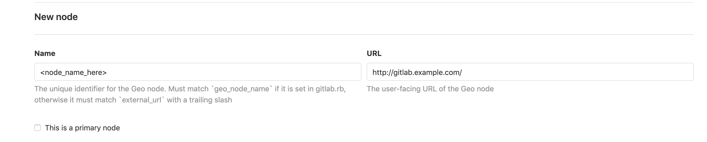
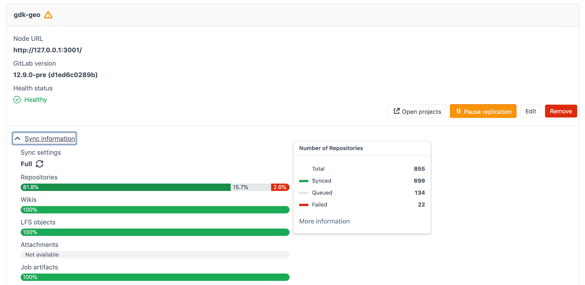

# Geo configuration

> 原文：[https://docs.gitlab.com/ee/administration/geo/replication/configuration.html](https://docs.gitlab.com/ee/administration/geo/replication/configuration.html)

*   [Configuring a new **secondary** node](#configuring-a-new-secondary-node)
    *   [Step 1\. Manually replicate secret GitLab values](#step-1-manually-replicate-secret-gitlab-values)
    *   [Step 2\. Manually replicate the **primary** node’s SSH host keys](#step-2-manually-replicate-the-primary-nodes-ssh-host-keys)
    *   [Step 3\. Add the **secondary** node](#step-3-add-the-secondary-node)
    *   [Step 4\. Enabling Hashed Storage](#step-4-enabling-hashed-storage)
    *   [Step 5\. (Optional) Configuring the **secondary** node to trust the **primary** node](#step-5-optional-configuring-the-secondary-node-to-trust-the-primary-node)
    *   [Step 6\. Enable Git access over HTTP/HTTPS](#step-6-enable-git-access-over-httphttps)
    *   [Step 7\. Verify proper functioning of the **secondary** node](#step-7-verify-proper-functioning-of-the-secondary-node)
*   [Selective synchronization](#selective-synchronization)
    *   [Git operations on unreplicated repositories](#git-operations-on-unreplicated-repositories)
*   [Upgrading Geo](#upgrading-geo)
*   [Troubleshooting](#troubleshooting)

# Geo configuration[](#geo-configuration-premium-only "Permalink")

## Configuring a new **secondary** node[](#configuring-a-new-secondary-node "Permalink")

**注意：**这是设置**辅助**地理节点的最后一步. 设置过程的各个阶段必须按记录的顺序完成. 在尝试此阶段中的步骤之前，请[完成所有之前的阶段](index.html#using-omnibus-gitlab) .

配置**辅助**节点的基本步骤是：

*   在**主**节点和**辅助**节点之间复制所需的配置.
*   在每个**辅助**节点上配置跟踪数据库.
*   在每个**辅助**节点上启动 GitLab.

我们鼓励您先阅读所有步骤，然后再在测试/生产环境中执行这些步骤.

**注意：** **不要**为**辅助**节点设置任何自定义身份验证. 这将由**主**节点处理. 任何需要访问" **管理区域"的**更改都必须在**主**节点中完成，因为**辅助**节点是只读副本.

### Step 1\. Manually replicate secret GitLab values[](#step-1-manually-replicate-secret-gitlab-values "Permalink")

GitLab 在`/etc/gitlab/gitlab-secrets.json`文件中存储了许多秘密值，这些秘密值在所有节点上都*必须*相同. 除非有一种方法可以在节点之间自动复制它们（请参阅[问题＃3789](https://gitlab.com/gitlab-org/gitlab/-/issues/3789) ），否则必须将它们手动复制到**辅助**节点.

1.  SSH 进入**主**节点，并执行以下命令：

    ```
    sudo cat /etc/gitlab/gitlab-secrets.json 
    ```

    这将以 JSON 格式显示需要复制的机密.

2.  SSH 进入**辅助**节点并以`root`用户身份登录：

    ```
    sudo -i 
    ```

3.  备份所有现有机密：

    ```
    mv /etc/gitlab/gitlab-secrets.json /etc/gitlab/gitlab-secrets.json.`date +%F` 
    ```

4.  将`/etc/gitlab/gitlab-secrets.json`从**主**节点复制到**辅助**节点，或在节点之间复制并粘贴文件内容：

    ```
    sudo editor /etc/gitlab/gitlab-secrets.json

    # paste the output of the `cat` command you ran on the primary
    # save and exit 
    ```

5.  确保文件权限正确：

    ```
    chown root:root /etc/gitlab/gitlab-secrets.json
    chmod 0600 /etc/gitlab/gitlab-secrets.json 
    ```

6.  重新配置**辅助**节点以使更改生效：

    ```
    gitlab-ctl reconfigure
    gitlab-ctl restart 
    ```

### Step 2\. Manually replicate the **primary** node’s SSH host keys[](#step-2-manually-replicate-the-primary-nodes-ssh-host-keys "Permalink")

GitLab 与系统安装的 SSH 守护程序集成，指定一个用户（通常名为`git` ）来处理所有访问请求.

在[灾难恢复](../disaster_recovery/index.html)情况下，GitLab 系统管理员会将**辅助**节点升级为**主要**节点. **主**域的 DNS 记录也应更新为指向新的**主**节点（以前是**辅助**节点）. 这样做可以避免更新 Git 遥控器和 API URL 的麻烦.

由于 SSH 主机密钥不匹配，这将导致对新提升的**主**节点的所有 SSH 请求失败. 为防止这种情况，必须将主 SSH 主机密钥手动复制到**辅助**节点.

1.  SSH 进入**辅助**节点并以`root`用户身份登录：

    ```
    sudo -i 
    ```

2.  备份所有现有的 SSH 主机密钥：

    ```
    find /etc/ssh -iname ssh_host_* -exec cp {} {}.backup.`date +%F` \; 
    ```

3.  从**主**节点复制 OpenSSH 主机密钥：

    如果可以使用**root**用户访问**主**节点：

    ```
    # Run this from the secondary node, change `<primary_node_fqdn>` for the IP or FQDN of the server
    scp root@<primary_node_fqdn>:/etc/ssh/ssh_host_*_key* /etc/ssh 
    ```

    如果您只能通过具有`sudo`特权的用户访问：

    ```
    # Run this from your primary node:
    sudo tar --transform 's/.*\///g' -zcvf ~/geo-host-key.tar.gz /etc/ssh/ssh_host_*_key*

    # Run this from your secondary node:
    scp <user_with_sudo>@<primary_node_fqdn>:geo-host-key.tar.gz .
    tar zxvf ~/geo-host-key.tar.gz -C /etc/ssh 
    ```

4.  在**辅助**节点上，确保文件权限正确：

    ```
    chown root:root /etc/ssh/ssh_host_*_key*
    chmod 0600 /etc/ssh/ssh_host_*_key* 
    ```

5.  要验证密钥指纹是否匹配，请在两个节点上执行以下命令：

    ```
    for file in /etc/ssh/ssh_host_*_key; do ssh-keygen -lf $file; done 
    ```

    您应该获得与此输出类似的输出，并且两个节点上的输出应该相同：

    ```
    1024 SHA256:FEZX2jQa2bcsd/fn/uxBzxhKdx4Imc4raXrHwsbtP0M root@serverhostname (DSA)
    256 SHA256:uw98R35Uf+fYEQ/UnJD9Br4NXUFPv7JAUln5uHlgSeY root@serverhostname (ECDSA)
    256 SHA256:sqOUWcraZQKd89y/QQv/iynPTOGQxcOTIXU/LsoPmnM root@serverhostname (ED25519)
    2048 SHA256:qwa+rgir2Oy86QI+PZi/QVR+MSmrdrpsuH7YyKknC+s root@serverhostname (RSA) 
    ```

6.  验证您对现有的私钥具有正确的公钥：

    ```
    # This will print the fingerprint for private keys:
    for file in /etc/ssh/ssh_host_*_key; do ssh-keygen -lf $file; done

    # This will print the fingerprint for public keys:
    for file in /etc/ssh/ssh_host_*_key.pub; do ssh-keygen -lf $file; done 
    ```

    **注意：**私钥和公钥命令的输出应生成相同的指纹.
7.  在**辅助**节点上重新启动`sshd` ：

    ```
    # Debian or Ubuntu installations
    sudo service ssh reload

    # CentOS installations
    sudo service sshd reload 
    ```

### Step 3\. Add the **secondary** node[](#step-3-add-the-secondary-node "Permalink")

1.  SSH 到您的 GitLab **辅助**服务器并以 root 用户身份登录：

    ```
    sudo -i 
    ```

2.  编辑`/etc/gitlab/gitlab.rb`并为您的节点添加一个**唯一的**名称. 在接下来的步骤中，您将需要此：

    ```
    # The unique identifier for the Geo node.
    gitlab_rails['geo_node_name'] = '<node_name_here>' 
    ```

3.  重新配置**辅助**节点以使更改生效：

    ```
    gitlab-ctl reconfigure 
    ```

4.  访问**主**节点的 **管理区>** 浏览器中的**地理位置** （ `/admin/geo/nodes` ）.
5.  单击**新建节点**按钮. [](img/adding_a_secondary_node.png)
6.  填写**姓名**与`gitlab_rails['geo_node_name']`在`/etc/gitlab/gitlab.rb` . 这些值必须始终*完全*匹配，一个字符一个字符.
7.  在`/etc/gitlab/gitlab.rb` `external_url`填写**URL** . 这些值必须始终匹配，但是一个以`/`结尾而另一个不以`/`无关紧要.
8.  **不要**选中" **这是主节点"**复选框.
9.  （可选）选择**辅助**节点应复制的组或存储分片. 保留空白以复制所有内容. 阅读更多有关[选择性同步的信息](#selective-synchronization) .
10.  单击**添加节点**按钮以添加**辅助**节点.
11.  SSH 到您的 GitLab **辅助**服务器并重新启动服务：

    ```
    gitlab-ctl restart 
    ```

    通过运行以下命令，检查您的地理设置是否存在任何常见问题：

    ```
    gitlab-rake gitlab:geo:check 
    ```

12.  SSH 到您的**主**服务器中，并以 root 用户身份登录以验证**辅助**节点是否可以访问或您的地理设置存在任何常见问题：

    ```
    gitlab-rake gitlab:geo:check 
    ```

一旦添加到管理面板并重新启动， **辅助**节点将在称为**backfill**的过程中自动开始从**主**节点复制丢失的数据. 同时， **主**节点将开始将每个更改通知每个**辅助**节点，以便**辅助**节点可以立即对那些通知进行操作.

确保**辅助**节点正在运行并且可访问. 您可以使用与**主**节点相同的凭据登录到**辅助**节点.

### Step 4\. Enabling Hashed Storage[](#step-4-enabling-hashed-storage "Permalink")

使用哈希存储可显着改善地理复制. 项目和组重命名不再需要节点之间的同步.

1.  访问**主**节点的 **管理区>** 浏览器中的**设置>存储库** （ `/admin/application_settings/repository` ）.
2.  在" **存储库存储"**部分中，选中" **对新创建和重命名的项目使用哈希存储路径"** .

### Step 5\. (Optional) Configuring the **secondary** node to trust the **primary** node[](#step-5-optional-configuring-the-secondary-node-to-trust-the-primary-node "Permalink")

如果您的**主**节点使用 CA 颁发的 HTTPS 证书，则可以安全地跳过此步骤.

如果**主**节点正在使用自签名证书以获得*HTTPS*支持，则需要将该证书添加到**辅助**节点的信任存储中. 从**主**节点上检索证书，然后在**辅助**节点上遵循[这些说明](https://docs.gitlab.com/omnibus/settings/ssl.html) .

### Step 6\. Enable Git access over HTTP/HTTPS[](#step-6-enable-git-access-over-httphttps "Permalink")

Geo 通过 HTTP / HTTPS 同步存储库，因此需要启用此克隆方法. 导航 **管理区>** 在**主**节点上进行**设置** （ `/admin/application_settings/general` ），并将`Enabled Git access protocols`设置为`Both SSH and HTTP(S)`或`Only HTTP(S)` .

### Step 7\. Verify proper functioning of the **secondary** node[](#step-7-verify-proper-functioning-of-the-secondary-node "Permalink")

现在已配置**辅助**节点！

您可以使用与**主**节点相同的凭据登录到**辅助**节点. 访问**辅助**节点的 **管理区>** 浏览器中的**Geo** （ `/admin/geo/nodes` ），以检查是否正确地将其标识为**辅助** Geo 节点，以及是否启用了 Geo.

初始复制或"回填"可能仍在进行中. 您可以从浏览器中**主**节点的" **地理节点"**仪表板监视每个地理节点上的同步过程.

[](img/geo_node_dashboard.png)

如果您的安装无法正常工作，请查看[故障排除文档](troubleshooting.html) .

仪表板中最明显的两个最明显的问题是：

1.  数据库复制无法正常工作.
2.  实例间实例通知不起作用. 在这种情况下，可能是以下情况：
    *   您正在使用自定义证书或自定义 CA（请参阅[故障排除文档](troubleshooting.html) ）.
    *   该实例已进行防火墙保护（请检查您的防火墙规则）.

请注意，禁用**辅助**节点将停止同步过程.

请注意，如果在**主**节点上为多个存储库分片定制了`git_data_dirs`则必须在每个**辅助**节点上复制相同的配置.

将您的用户指向["使用地理服务器"指南](using_a_geo_server.html) .

当前，这是同步的：

*   Git 存储库.
*   Wikis.
*   LFS 对象.
*   问题，合并请求，摘要和评论附件.
*   用户，组和项目化身.

## Selective synchronization[](#selective-synchronization "Permalink")

Geo 支持选择性同步，这使管理员可以选择**辅助**节点应同步哪些项目. 可以按组或按存储碎片选择项目的子集. 前者是复制属于用户子集的数据的理想选择，而后者更适合将 Geo 逐步推广到大型 GitLab 实例.

重要的是要注意选择性同步：

1.  不限制来自**辅助**节点的权限.
2.  不从**辅助**节点隐藏项目元数据.
    *   由于 Geo 当前依赖于 PostgreSQL 复制，因此所有项目元数据都将复制到**辅助**节点，但是尚未选择的存储库将为空.
3.  不减少为地理事件日志生成的事件数.
    *   只要存在任何**辅助**节点， **主**节点都会生成事件. 选择性同步限制是在**辅助**节点而非**主**节点上实现的.

### Git operations on unreplicated repositories[](#git-operations-on-unreplicated-repositories "Permalink")

在 HTTP（S）的 GitLab 12.10 和 SSH 的 GitLab 13.0 中[引入](https://gitlab.com/groups/gitlab-org/-/epics/2562) .

存在于**主**节点上但不存在于**辅助**节点上的存储库支持通过 HTTP（S）和 SSH 进行 Git 克隆，拉入和推送操作. 在以下情况下可能会发生这种情况：

*   选择性同步不包括附加到存储库的项目.
*   存储库正在积极地复制，但尚未完成.

## Upgrading Geo[](#upgrading-geo "Permalink")

请参阅[更新地理节点文档](updating_the_geo_nodes.html) .

## Troubleshooting[](#troubleshooting "Permalink")

请参阅[故障排除文档](troubleshooting.html) .