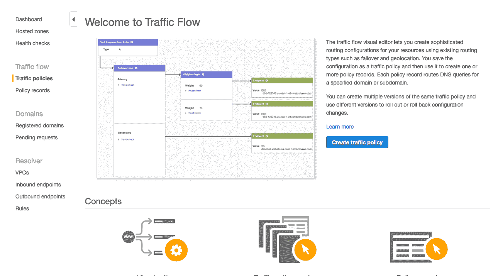
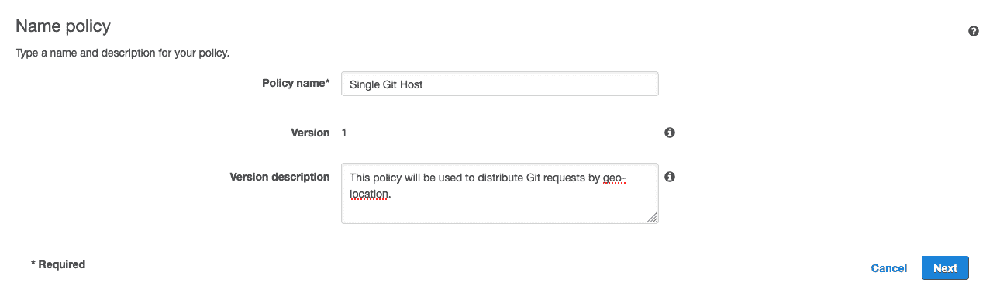
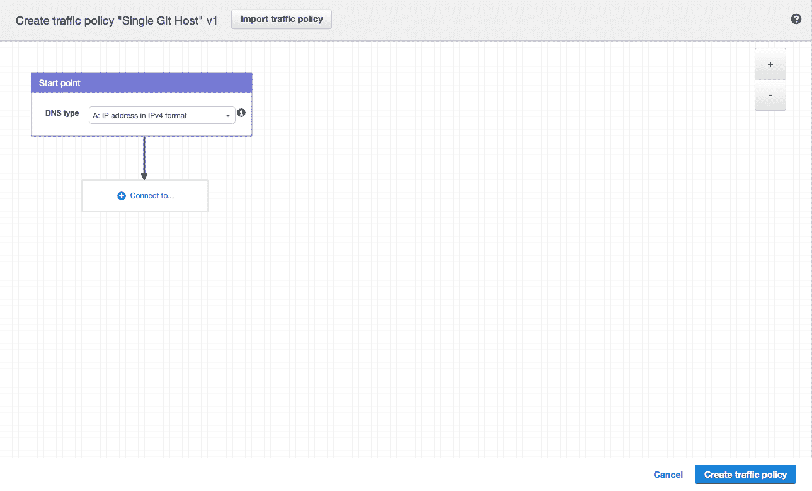
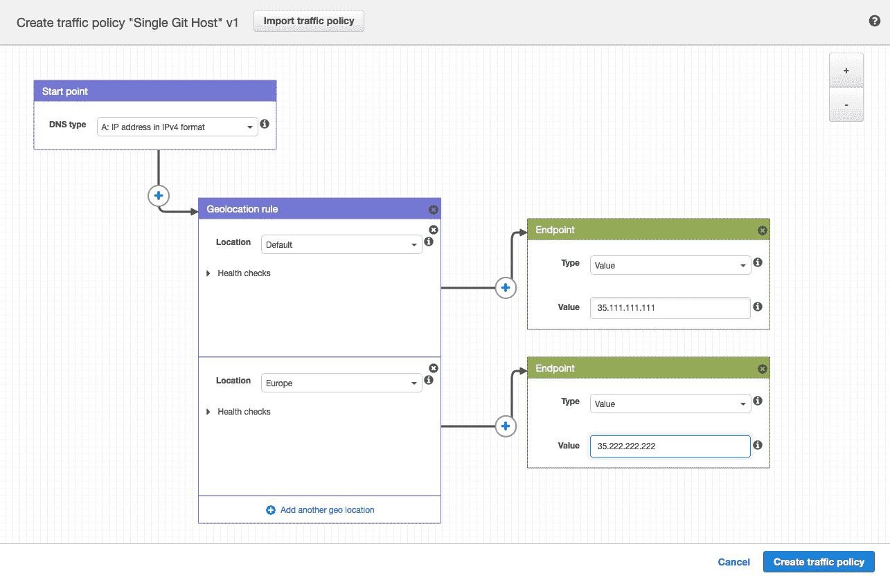
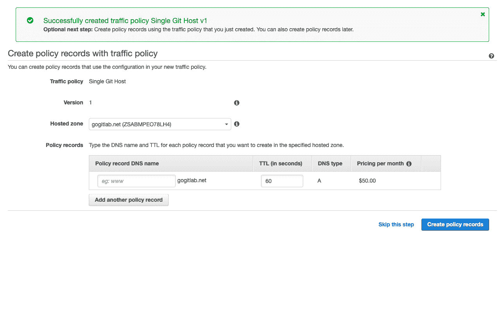
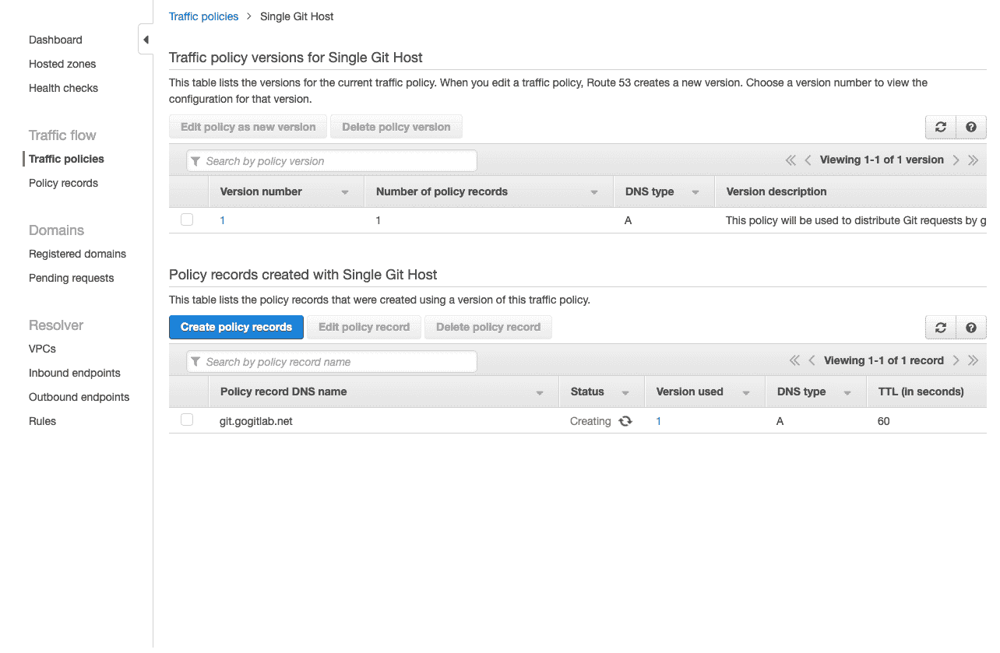
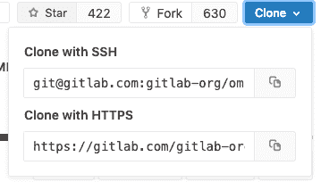

# Location-aware Git remote URL with AWS Route53

> 原文：[https://docs.gitlab.com/ee/administration/geo/replication/location_aware_git_url.html](https://docs.gitlab.com/ee/administration/geo/replication/location_aware_git_url.html)

*   [Prerequisites](#prerequisites)
*   [Create a traffic policy](#create-a-traffic-policy)
*   [Configure Git clone URLs to use the special Git URL](#configure-git-clone-urls-to-use-the-special-git-url)
*   [Example Git request handling behavior](#example-git-request-handling-behavior)

# Location-aware Git remote URL with AWS Route53

您可以为 GitLab 用户提供一个远程 URL，该 URL 自动使用距离他们最近的 Geo 节点. 这意味着用户在移动时无需更新其 Git 配置即可利用更近的 Geo 节点.

这是可能的，因为 Git 推送请求可以从**辅助**节点自动重定向（HTTP）或代理（SSH）到**主**节点.

尽管这些说明使用[AWS Route53](https://aws.amazon.com/route53/) ，但也可以使用其他服务，例如[Cloudflare](https://www.cloudflare.com/) .

**注意：**您还可以使用负载平衡器将 Web UI 或 API 流量分配到[多个 Geo **辅助**节点](../../../user/admin_area/geo_nodes.html#multiple-secondary-nodes-behind-a-load-balancer) . 重要的是，尚不能包含**主**节点. 请参阅功能请求. [支持将**主数据库**放置在 Geo 节点负载均衡器之后](https://gitlab.com/gitlab-org/gitlab/-/issues/10888) .

## Prerequisites

在此示例中，我们已经设置：

*   `primary.example.com`作为地理**主要**节点.
*   `secondary.example.com`作为地理**辅助**节点.

我们将创建一个`git.example.com`子域，该子域将自动定向请求：

*   从欧洲到**次要**节点.
*   从所有其他位置到**主**节点.

无论如何，您都需要：

*   一个可工作的 GitLab **主**节点，可以在其自己的地址访问.
*   运行中的 GitLab **辅助**节点.
*   一个 Route53 托管区域管理您的域.

如果尚未设置 Geo **主**节点和**辅助**节点，请查阅[Geo 设置说明](index.html#setup-instructions) .

## Create a traffic policy

在 Route53 托管区域中，可以使用流策略来设置各种路由配置.

1.  导航到[Route53 仪表板](https://console.aws.amazon.com/route53/home) ，然后单击" **流量策略"** .

    

2.  单击**创建流量策略**按钮.

    

3.  在`Single Git Host`填充**Policy Name**字段，然后单击**Next** .

    

4.  Leave **DNS 类型** as `A: IP Address in IPv4 format`.
5.  点击**连接到...，**然后选择**地理位置规则** .

    

6.  对于第一个**位置** ，请将其保留为`Default` .
7.  单击" **连接到..."，**然后选择" **新建端点"** .
8.  选择**类型** `value`并用`<your **primary** IP address>`填写.
9.  对于第二个**位置** ，选择" `Europe` .
10.  单击" **连接到..."，**然后选择" **新建端点"** .
11.  选择**类型** `value`并用`<your **secondary** IP address>`填写.

    

12.  Click **创建流量策略**.

    

13.  使用`git`填写**策略记录 DNS 名称** .
14.  Click **创建策略记录**.

    

您已经成功设置了一个主机，例如`git.example.com` ，它通过地理位置将流量分配到您的 Geo 节点！

## Configure Git clone URLs to use the special Git URL

用户首次克隆存储库时，通常会从项目页面复制 Git 远程 URL. 默认情况下，这些 SSH 和 HTTP URL 基于当前主机的外部 URL. 例如：

*   `git@secondary.example.com:group1/project1.git`
*   `https://secondary.example.com/group1/project1.git`

您可以自定义：

*   SSH 远程 URL 以使用可`git.example.com`位置的`git.example.com` . 为此，通过在 Web 节点的`gitlab.rb`中设置`gitlab_rails['gitlab_ssh_host']`来更改 SSH 远程 URL 的主机.
*   HTTP 远程 URL，如[HTTP（S）的 Custom Git 克隆 URL 中](../../../user/admin_area/settings/visibility_and_access_controls.html#custom-git-clone-url-for-https)所示.

## Example Git request handling behavior

完成上述配置步骤后，现在可以识别 Git 请求的位置. 要求：

*   在欧洲以外，所有请求都定向到**主**节点.
*   在欧洲范围内：
    *   HTTP：
        *   `git clone http://git.example.com/foo/bar.git`定向到**辅助**节点.
        *   `git push`最初定向到**辅助服务器** ， **辅助服务器**自动重定向到`primary.example.com` .
    *   SSH：
        *   `git clone git@git.example.com:foo/bar.git`被定向到**辅助目录** .
        *   `git push`首先指向**辅助**服务器， **辅助**服务器自动将请求代理到`primary.example.com` .