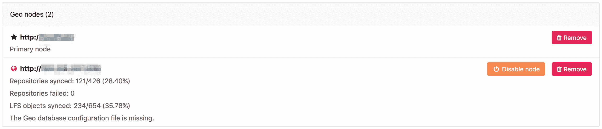

# Geo Troubleshooting

> 原文：[https://docs.gitlab.com/ee/administration/geo/replication/troubleshooting.html](https://docs.gitlab.com/ee/administration/geo/replication/troubleshooting.html)

*   [Basic troubleshooting](#basic-troubleshooting)
    *   [Check the health of the **secondary** node](#check-the-health-of-the-secondary-node)
    *   [Check if PostgreSQL replication is working](#check-if-postgresql-replication-is-working)
        *   [Are nodes pointing to the correct database instance?](#are-nodes-pointing-to-the-correct-database-instance)
        *   [Can Geo detect the current node correctly?](#can-geo-detect-the-current-node-correctly)
*   [Fixing errors found when running the Geo check Rake task](#fixing-errors-found-when-running-the-geo-check-rake-task)
*   [Fixing replication errors](#fixing-replication-errors)
    *   [Message: `ERROR: replication slots can only be used if max_replication_slots > 0`?](#message-error--replication-slots-can-only-be-used-if-max_replication_slots--0)
    *   [Message: `FATAL: could not start WAL streaming: ERROR: replication slot "geo_secondary_my_domain_com" does not exist`?](#message-fatal--could-not-start-wal-streaming-error--replication-slot-geo_secondary_my_domain_com-does-not-exist)
    *   [Message: “Command exceeded allowed execution time” when setting up replication?](#message-command-exceeded-allowed-execution-time-when-setting-up-replication)
    *   [Message: “PANIC: could not write to file `pg_xlog/xlogtemp.123`: No space left on device”](#message-panic-could-not-write-to-file-pg_xlogxlogtemp123-no-space-left-on-device)
    *   [Message: “ERROR: canceling statement due to conflict with recovery”](#message-error-canceling-statement-due-to-conflict-with-recovery)
    *   [Message: `LOG: invalid CIDR mask in address`](#message-log--invalid-cidr-mask-in-address)
    *   [Message: `LOG: invalid IP mask "md5": Name or service not known`](#message-log--invalid-ip-mask-md5-name-or-service-not-known)
    *   [Very large repositories never successfully synchronize on the **secondary** node](#very-large-repositories-never-successfully-synchronize-on-the-secondary-node)
    *   [New LFS objects are never replicated](#new-lfs-objects-are-never-replicated)
    *   [Resetting Geo **secondary** node replication](#resetting-geo-secondary-node-replication)
*   [Fixing errors during a failover or when promoting a secondary to a primary node](#fixing-errors-during-a-failover-or-when-promoting-a-secondary-to-a-primary-node)
    *   [Message: ActiveRecord::RecordInvalid: Validation failed: Name has already been taken](#message-activerecordrecordinvalid-validation-failed-name-has-already-been-taken)
    *   [Message: `NoMethodError: undefined method `secondary?' for nil:NilClass`](#message-nomethoderror-undefined-method-secondary-for-nilnilclass)
    *   [Message: `sudo: gitlab-pg-ctl: command not found`](#message-sudo-gitlab-pg-ctl-command-not-found)
*   [Fixing Foreign Data Wrapper errors](#fixing-foreign-data-wrapper-errors)
    *   [“Foreign Data Wrapper (FDW) is not configured” error](#foreign-data-wrapper-fdw-is-not-configured-error)
        *   [Checking configuration](#checking-configuration)
        *   [Manual reload of FDW schema](#manual-reload-of-fdw-schema)
    *   [“Geo database has an outdated FDW remote schema” error](#geo-database-has-an-outdated-fdw-remote-schema-error)
*   [Expired artifacts](#expired-artifacts)
*   [Fixing sign in errors](#fixing-sign-in-errors)
    *   [Message: The redirect URI included is not valid](#message-the-redirect-uri-included-is-not-valid)
*   [Fixing common errors](#fixing-common-errors)
    *   [Geo database configuration file is missing](#geo-database-configuration-file-is-missing)
    *   [An existing tracking database cannot be reused](#an-existing-tracking-database-cannot-be-reused)
    *   [Geo node has a database that is writable which is an indication it is not configured for replication with the primary node](#geo-node-has-a-database-that-is-writable-which-is-an-indication-it-is-not-configured-for-replication-with-the-primary-node)
    *   [Geo node does not appear to be replicating the database from the primary node](#geo-node-does-not-appear-to-be-replicating-the-database-from-the-primary-node)
    *   [Geo database version (…) does not match latest migration (…)](#geo-database-version--does-not-match-latest-migration-)
    *   [Geo database is not configured to use Foreign Data Wrapper](#geo-database-is-not-configured-to-use-foreign-data-wrapper)
    *   [GitLab indicates that more than 100% of repositories were synced](#gitlab-indicates-that-more-than-100-of-repositories-were-synced)
    *   [Geo Admin Area returns 404 error for a secondary node](#geo-admin-area-returns-404-error-for-a-secondary-node)

# Geo Troubleshooting[](#geo-troubleshooting-premium-only "Permalink")

设置地理位置需要仔细注意细节，有时很容易错过一个步骤.

这是您尝试解决问题应采取的步骤的列表：

*   Perform [basic troubleshooting](#basic-troubleshooting).
*   修复所有[复制错误](#fixing-replication-errors) .
*   修复任何[外部数据包装程序](#fixing-foreign-data-wrapper-errors)错误.
*   修复所有[常见](#fixing-common-errors)错误.

## Basic troubleshooting[](#basic-troubleshooting "Permalink")

在尝试更高级的故障排除之前：

*   Check [the health of the **secondary** node](#check-the-health-of-the-secondary-node).
*   Check [if PostgreSQL replication is working](#check-if-postgresql-replication-is-working).

### Check the health of the **secondary** node[](#check-the-health-of-the-secondary-node "Permalink")

访问**主**节点的 **管理区>** 浏览器中的**地理位置** （ `/admin/geo/nodes` ）. 我们在每个**辅助**节点上执行以下运行状况检查，以帮助识别是否存在问题：

*   节点是否在运行？
*   节点的辅助数据库是否已配置用于流复制？
*   是否已配置节点的辅助跟踪数据库？
*   节点的辅助跟踪数据库是否已连接？
*   节点的辅助跟踪数据库是否是最新的？

[](img/geo_node_healthcheck.png)

有关如何解决从 UI 报告的常见错误的信息，请参阅" [修复常见错误"](#fixing-common-errors) .

如果用户界面无法正常工作，或者您无法登录，则可以手动运行地理健康检查以获取此信息以及更多详细信息.

此 Rake 任务可以在**主要**或**辅助** Geo 节点中的应用程序节点上运行：

```
sudo gitlab-rake gitlab:geo:check 
```

输出示例：

```
Checking Geo ...

GitLab Geo is available ... yes
GitLab Geo is enabled ... yes
This machine's Geo node name matches a database record ... yes, found a secondary node named "Shanghai"
GitLab Geo secondary database is correctly configured ... yes
Database replication enabled? ... yes
Database replication working? ... yes
GitLab Geo tracking database is configured to use Foreign Data Wrapper? ... yes
GitLab Geo tracking database Foreign Data Wrapper schema is up-to-date? ... yes
GitLab Geo HTTP(S) connectivity ...
* Can connect to the primary node ... yes
HTTP/HTTPS repository cloning is enabled ... yes
Machine clock is synchronized ... yes
Git user has default SSH configuration? ... yes
OpenSSH configured to use AuthorizedKeysCommand ... yes
GitLab configured to disable writing to authorized_keys file ... yes
GitLab configured to store new projects in hashed storage? ... yes
All projects are in hashed storage? ... yes

Checking Geo ... Finished 
```

通过在任何**辅助**应用程序节点上运行以下 Rake 任务，可以手动找到当前同步信息：

```
sudo gitlab-rake geo:status 
```

输出示例：

```
http://secondary.example.com/
-----------------------------------------------------
                        GitLab Version: 11.10.4-ee
                              Geo Role: Secondary
                         Health Status: Healthy
                          Repositories: 289/289 (100%)
                 Verified Repositories: 289/289 (100%)
                                 Wikis: 289/289 (100%)
                        Verified Wikis: 289/289 (100%)
                           LFS Objects: 8/8 (100%)
                           Attachments: 5/5 (100%)
                      CI job artifacts: 0/0 (0%)
                  Repositories Checked: 0/289 (0%)
                         Sync Settings: Full
              Database replication lag: 0 seconds
       Last event ID seen from primary: 10215 (about 2 minutes ago)
     Last event ID processed by cursor: 10215 (about 2 minutes ago)
                Last status report was: 2 minutes ago 
```

### Check if PostgreSQL replication is working[](#check-if-postgresql-replication-is-working "Permalink")

要检查 PostgreSQL 复制是否正常，请检查：

*   [Nodes are pointing to the correct database instance](#are-nodes-pointing-to-the-correct-database-instance).
*   [Geo can detect the current node correctly](#can-geo-detect-the-current-node-correctly).

#### Are nodes pointing to the correct database instance?[](#are-nodes-pointing-to-the-correct-database-instance "Permalink")

您应确保**主**地理节点指向具有写入权限的实例.

任何**辅助**节点都应仅指向只读实例.

#### Can Geo detect the current node correctly?[](#can-geo-detect-the-current-node-correctly "Permalink")

Geo 通过以下方式在`/etc/gitlab/gitlab.rb`找到当前计算机的 Geo 节点名称：

*   使用`gitlab_rails['geo_node_name']`设置.
*   如果未定义，请使用`external_url`设置.

该名称用于在其中查找具有相同**名称**的节点 **管理区>** **地理位置** .

要检查当前计算机的节点名称是否与数据库中的节点匹配，请运行检查任务：

```
sudo gitlab-rake gitlab:geo:check 
```

它显示当前计算机的节点名称以及匹配的数据库记录是**主**节点还是**辅助**节点.

```
This machine's Geo node name matches a database record ... yes, found a secondary node named "Shanghai" 
```

```
This machine's Geo node name matches a database record ... no
  Try fixing it:
  You could add or update a Geo node database record, setting the name to "https://example.com/".
  Or you could set this machine's Geo node name to match the name of an existing database record: "London", "Shanghai"
  For more information see:
  doc/administration/geo/replication/troubleshooting.md#can-geo-detect-the-current-node-correctly 
```

## Fixing errors found when running the Geo check Rake task[](#fixing-errors-found-when-running-the-geo-check-rake-task "Permalink")

运行此 Rake 任务时，如果未正确配置节点，则可能会看到错误：

```
sudo gitlab-rake gitlab:geo:check 
```

1.  连接到数据库时，Rails 没有提供密码

    ```
    Checking Geo ...

    GitLab Geo is available ... Exception: fe_sendauth: no password supplied
    GitLab Geo is enabled ... Exception: fe_sendauth: no password supplied
    ...
    Checking Geo ... Finished 
    ```

    *   确保将`gitlab_rails['db_password']`设置为为`postgresql['sql_user_password']`创建哈希时使用的纯文本密码.
2.  Rails 无法连接到数据库

    ```
    Checking Geo ...

    GitLab Geo is available ... Exception: FATAL:  no pg_hba.conf entry for host "1.1.1.1",  user "gitlab", database "gitlabhq_production", SSL on
    FATAL:  no pg_hba.conf entry for host "1.1.1.1", user "gitlab", database "gitlabhq_production", SSL off
    GitLab Geo is enabled ... Exception: FATAL:  no pg_hba.conf entry for host "1.1.1.1", user "gitlab", database "gitlabhq_production", SSL on
    FATAL:  no pg_hba.conf entry for host "1.1.1.1", user "gitlab", database "gitlabhq_production", SSL off
    ...
    Checking Geo ... Finished 
    ```

    *   确保您具有`postgresql['md5_auth_cidr_addresses']`包含的 rails 节点的 IP 地址.
    *   确保在 IP 地址上包括子网掩码： `postgresql['md5_auth_cidr_addresses'] = ['1.1.1.1/32']` .
3.  Rails 提供了错误的密码

    ```
    Checking Geo ...
    GitLab Geo is available ... Exception: FATAL:  password authentication failed for user "gitlab"
    FATAL:  password authentication failed for user "gitlab"
    GitLab Geo is enabled ... Exception: FATAL:  password authentication failed for user "gitlab"
    FATAL:  password authentication failed for user "gitlab"
    ...
    Checking Geo ... Finished 
    ```

    *   验证正确的密码设置为`gitlab_rails['db_password']`创建中的散列时所使用`postgresql['sql_user_password']`通过运行`gitlab-ctl pg-password-md5 gitlab`并输入密码.
4.  检查返回的不是辅助节点

    ```
    Checking Geo ...

    GitLab Geo is available ... yes
    GitLab Geo is enabled ... yes
    GitLab Geo secondary database is correctly configured ... not a secondary node
    Database replication enabled? ... not a secondary node
    ...
    Checking Geo ... Finished 
    ```

    *   确保您已在**主**节点的管理区添加辅助节点.
    *   在管理节点中添加辅助节点属于**主**节点时，请确保输入了`external_url`或`gitlab_rails['geo_node_name']` .
    *   之前 GitLab 12.4，编辑中的**主**节点的管理区的二次节点，并确保有一个尾随`/`在`Name`字段中.
5.  检查返回`Exception: PG::UndefinedTable: ERROR: relation "geo_nodes" does not exist`

    ```
    Checking Geo ...

    GitLab Geo is available ... no
      Try fixing it:
      Upload a new license that includes the GitLab Geo feature
      For more information see:
      https://about.gitlab.com/features/gitlab-geo/
    GitLab Geo is enabled ... Exception: PG::UndefinedTable: ERROR:  relation "geo_nodes" does not exist
    LINE 8:                WHERE a.attrelid = '"geo_nodes"'::regclass
                                              ^
    :               SELECT a.attname, format_type(a.atttypid, a.atttypmod),
                         pg_get_expr(d.adbin, d.adrelid), a.attnotnull, a.atttypid, a.atttypmod,
                         c.collname, col_description(a.attrelid, a.attnum) AS comment
                    FROM pg_attribute a
                    LEFT JOIN pg_attrdef d ON a.attrelid = d.adrelid AND a.attnum = d.adnum
                    LEFT JOIN pg_type t ON a.atttypid = t.oid
                    LEFT JOIN pg_collation c ON a.attcollation = c.oid AND a.attcollation <> t.typcollation
                   WHERE a.attrelid = '"geo_nodes"'::regclass
                     AND a.attnum > 0 AND NOT a.attisdropped
                   ORDER BY a.attnum
    ...
    Checking Geo ... Finished 
    ```

    在执行 PostgreSQL 主版本（9> 10）时，这是预期的. 跟随：

    *   [initiate-the-replication-process](database.html#step-3-initiate-the-replication-process)
    *   [Geo database has an outdated FDW remote schema](troubleshooting.html#geo-database-has-an-outdated-fdw-remote-schema-error)

## Fixing replication errors[](#fixing-replication-errors "Permalink")

以下各节概述了解决复制错误的疑难解答步骤.

### Message: `ERROR: replication slots can only be used if max_replication_slots > 0`?[](#message-error--replication-slots-can-only-be-used-if-max_replication_slots--0 "Permalink")

这意味着需要在**主**数据库上设置`max_replication_slots` PostgreSQL 变量. 在 GitLab 9.4 中，我们将此设置默认设置为 1.如果您有更多**辅助**节点，则可能需要增加该值.

确保重新启动 PostgreSQL 才能生效. 有关更多详细信息，请参见《 [PostgreSQL 复制设置](database.html#postgresql-replication)指南》.

### Message: `FATAL: could not start WAL streaming: ERROR: replication slot "geo_secondary_my_domain_com" does not exist`?[](#message-fatal--could-not-start-wal-streaming-error--replication-slot-geo_secondary_my_domain_com-does-not-exist "Permalink")

当 PostgreSQL 没有该名称的**辅助**节点的复制插槽时，会发生这种情况.

您可能需要在**辅助**节点上重新运行[复制过程](database.html) .

### Message: “Command exceeded allowed execution time” when setting up replication?[](#message-command-exceeded-allowed-execution-time-when-setting-up-replication "Permalink")

在**辅助**节点上[启动复制过程](database.html#step-3-initiate-the-replication-process)时可能会发生这种情况，并表明您的初始数据集太大，无法在默认超时（30 分钟）内进行复制.

重新运行`gitlab-ctl replicate-geo-database` ，但是为`--backup-timeout`包含一个更大的值：

```
sudo gitlab-ctl \
   replicate-geo-database \
   --host=<primary_node_hostname> \
   --slot-name=<secondary_slot_name> \
   --backup-timeout=21600 
```

这将使初始复制最多需要六个小时才能完成，而不是默认的三十分钟. 根据安装要求进行调整.

### Message: “PANIC: could not write to file `pg_xlog/xlogtemp.123`: No space left on device”[](#message-panic-could-not-write-to-file-pg_xlogxlogtemp123-no-space-left-on-device "Permalink")

确定**主**数据库中是否有未使用的复制插槽. 这可能导致在`pg_xlog`建立大量的日志数据. 删除未使用的插槽可以减少`pg_xlog`使用的空间.

1.  启动 PostgreSQL 控制台会话：

    ```
    sudo gitlab-psql 
    ```

    注意： **注意：**使用`gitlab-rails dbconsole`无效，因为管理复制插槽需要超级用户权限.

2.  使用以下方法查看您的复制插槽：

    ```
    SELECT * FROM pg_replication_slots; 
    ```

`active`为`f`插槽不活动.

*   当该插槽应处于活动状态时，因为您已使用该插槽配置了**辅助**节点，请登录到该**辅助**节点，并检查 PostgreSQL 日志为什么复制未运行.

*   如果您不再使用该插槽（例如，您不再启用地理位置），则可以在 PostgreSQL 控制台会话中将其删除：

    ```
    SELECT pg_drop_replication_slot('<name_of_extra_slot>'); 
    ```

### Message: “ERROR: canceling statement due to conflict with recovery”[](#message-error-canceling-statement-due-to-conflict-with-recovery "Permalink")

在正常使用情况下，此错误很少会发生，并且系统具有足够的恢复能力.

但是，在某些情况下，辅助数据库上的某些数据库查询可能运行时间过长，从而增加了此错误的发生频率. 在某些时候，其中某些查询由于每次都会被取消而永远无法完成.

这些长期运行的查询[计划在将来删除](https://gitlab.com/gitlab-org/gitlab/-/issues/34269) ，但作为解决方法，我们建议启用[hot_standby_feedback](https://s0www0postgresql0org.icopy.site/docs/10/hot-standby.html) . 这增加了**主**节点上发生膨胀的可能性，因为它阻止了`VACUUM`删除最近失效的行. 但是，它已在 GitLab.com 上成功用于生产中.

要启用`hot_standby_feedback` ，请将以下内容添加到**辅助**节点上的`/etc/gitlab/gitlab.rb` ：

```
postgresql['hot_standby_feedback'] = 'on' 
```

然后重新配置 GitLab：

```
sudo gitlab-ctl reconfigure 
```

为了帮助我们解决这个问题，可以考虑在评论[这个问题](https://gitlab.com/gitlab-org/gitlab/-/issues/4489) .

### Message: `LOG: invalid CIDR mask in address`[](#message-log--invalid-cidr-mask-in-address "Permalink")

这发生在`postgresql['md5_auth_cidr_addresses']`格式错误的地址上.

```
2020-03-20_23:59:57.60499 LOG:  invalid CIDR mask in address "***"
2020-03-20_23:59:57.60501 CONTEXT:  line 74 of configuration file "/var/opt/gitlab/postgresql/data/pg_hba.conf" 
```

要解决此问题，请更新`postgresql['md5_auth_cidr_addresses']`下`/etc/gitlab/gitlab.rb`的 IP 地址，以遵守 CIDR 格式（即`1.2.3.4/32` ）.

### Message: `LOG: invalid IP mask "md5": Name or service not known`[](#message-log--invalid-ip-mask-md5-name-or-service-not-known "Permalink")

当您在`postgresql['md5_auth_cidr_addresses']`添加了没有子网掩码的 IP 地址时，就会发生这种情况.

```
2020-03-21_00:23:01.97353 LOG:  invalid IP mask "md5": Name or service not known
2020-03-21_00:23:01.97354 CONTEXT:  line 75 of configuration file "/var/opt/gitlab/postgresql/data/pg_hba.conf" 
```

要解决此问题， `/etc/gitlab/gitlab.rb`在`postgresql['md5_auth_cidr_addresses']`下`postgresql['md5_auth_cidr_addresses']`添加子网掩码，以遵守 CIDR 格式（即`1.2.3.4/32` ）.

### Very large repositories never successfully synchronize on the **secondary** node[](#very-large-repositories-never-successfully-synchronize-on-the-secondary-node "Permalink")

GitLab 对所有存储库克隆都设置了超时，包括项目导入和地理同步操作. 如果**主数据库**上的存储库的新`git clone`花费几分钟以上，则您可能会受到此影响.

要增加超时，请将以下行添加到**辅助**节点上的`/etc/gitlab/gitlab.rb` ：

```
gitlab_rails['gitlab_shell_git_timeout'] = 10800 
```

然后重新配置 GitLab：

```
sudo gitlab-ctl reconfigure 
```

这会将超时增加到三个小时（10800 秒）. 选择足够长的时间来容纳您最大的存储库的完整克隆.

### New LFS objects are never replicated[](#new-lfs-objects-are-never-replicated "Permalink")

如果新的 LFS 对象永远不会复制到辅助 Geo 节点，请检查您正在运行的 GitLab 版本. GitLab 版本 11.11.x 或 12.0.x 受[错误](https://gitlab.com/gitlab-org/gitlab/-/issues/32696)影响， [该错误导致新的 LFS 对象无法复制到 Geo 辅助节点](https://gitlab.com/gitlab-org/gitlab/-/issues/32696) .

要解决此问题，请升级到 GitLab 12.1 或更高版本.

### Resetting Geo **secondary** node replication[](#resetting-geo-secondary-node-replication "Permalink")

如果您使**辅助**节点处于损坏状态，并且想要重置复制状态（从头开始），那么可以采取以下步骤来帮助您：

1.  停止 Sidekiq 和 Geo LogCursor

    可以使 Sidekiq 正常停止，但可以使其停止获取新作业，并等到当前作业完成处理为止.

    您需要在第一阶段发送**SIGTSTP 终止**信号，并在所有作业完成后向它们发送**SIGTERM** . 否则，只需使用`gitlab-ctl stop`命令.

    ```
    gitlab-ctl status sidekiq
    # run: sidekiq: (pid 10180) <- this is the PID you will use
    kill -TSTP 10180 # change to the correct PID

    gitlab-ctl stop sidekiq
    gitlab-ctl stop geo-logcursor 
    ```

    您可以查看 Sidekiq 日志以了解 Sidekiq 作业处理何时完成：

    ```
    gitlab-ctl tail sidekiq 
    ```

2.  重命名存储库存储文件夹并创建新的. 如果您不担心可能的孤立目录和文件，则只需跳过此步骤.

    ```
    mv /var/opt/gitlab/git-data/repositories /var/opt/gitlab/git-data/repositories.old
    mkdir -p /var/opt/gitlab/git-data/repositories
    chown git:git /var/opt/gitlab/git-data/repositories 
    ```

    **提示**您可能希望将来在确认不再需要`/var/opt/gitlab/git-data/repositories.old`时将其删除，以节省磁盘空间.
3.  *（可选）*重命名其他数据文件夹并创建新的

    **警告** ： **辅助**节点上可能仍有文件已从**主**节点中删除，但未反映出删除情况. 如果您跳过此步骤，它们将永远不会从此 Geo 节点中删除.

    任何上载的内容（如文件附件，化身或 LFS 对象）都存储在以下两个路径之一的子文件夹中：

    *   `/var/opt/gitlab/gitlab-rails/shared`
    *   `/var/opt/gitlab/gitlab-rails/uploads`

    要重命名它们：

    ```
    gitlab-ctl stop

    mv /var/opt/gitlab/gitlab-rails/shared /var/opt/gitlab/gitlab-rails/shared.old
    mkdir -p /var/opt/gitlab/gitlab-rails/shared

    mv /var/opt/gitlab/gitlab-rails/uploads /var/opt/gitlab/gitlab-rails/uploads.old
    mkdir -p /var/opt/gitlab/gitlab-rails/uploads

    gitlab-ctl start geo-postgresql 
    ```

    重新配置以便重新创建文件夹并确保权限和所有权正确

    ```
    gitlab-ctl reconfigure 
    ```

4.  重置跟踪数据库

    ```
    gitlab-rake geo:db:drop  # on a secondary app node
    gitlab-ctl reconfigure   # on the tracking database node
    gitlab-rake geo:db:setup # on a secondary app node 
    ```

5.  重新启动先前停止的服务

    ```
    gitlab-ctl start 
    ```

6.  刷新外部数据包装器表

    ```
    gitlab-rake geo:db:refresh_foreign_tables 
    ```

## Fixing errors during a failover or when promoting a secondary to a primary node[](#fixing-errors-during-a-failover-or-when-promoting-a-secondary-to-a-primary-node "Permalink")

以下是故障转移期间或通过解决策略将辅助节点提升为主节点时可能遇到的错误.

### Message: ActiveRecord::RecordInvalid: Validation failed: Name has already been taken[](#message-activerecordrecordinvalid-validation-failed-name-has-already-been-taken "Permalink")

[升级**辅助**节点时](../disaster_recovery/index.html#step-3-promoting-a-secondary-node) ，您可能会遇到以下错误：

```
Running gitlab-rake geo:set_secondary_as_primary...

rake aborted!
ActiveRecord::RecordInvalid: Validation failed: Name has already been taken
/opt/gitlab/embedded/service/gitlab-rails/ee/lib/tasks/geo.rake:236:in `block (3 levels) in <top (required)>'
/opt/gitlab/embedded/service/gitlab-rails/ee/lib/tasks/geo.rake:221:in `block (2 levels) in <top (required)>'
/opt/gitlab/embedded/bin/bundle:23:in `load'
/opt/gitlab/embedded/bin/bundle:23:in `<main>'
Tasks: TOP => geo:set_secondary_as_primary
(See full trace by running task with --trace)

You successfully promoted this node! 
```

如果您在运行`gitlab-rake geo:set_secondary_as_primary`或`gitlab-ctl promote-to-primary-node`时遇到此消息，请执行`gitlab-rake geo:set_secondary_as_primary`任一操作：

*   输入 Rails 控制台并运行：

    ```
    Rails.application.load_tasks; nil
    Gitlab::Geo.expire_cache!
    Rake::Task['geo:set_secondary_as_primary'].invoke 
    ```

*   如果安全的话，升级到 GitLab 12.6.3 或更高版本. 例如，如果故障转移只是一个测试. [缓存相关的错误](https://gitlab.com/gitlab-org/gitlab/-/merge_requests/22021)是固定的.

### Message: `NoMethodError: undefined method `secondary?' for nil:NilClass`[](#message-nomethoderror-undefined-method-secondary-for-nilnilclass "Permalink")

[升级**辅助**节点时](../disaster_recovery/index.html#step-3-promoting-a-secondary-node) ，您可能会遇到以下错误：

```
sudo gitlab-rake geo:set_secondary_as_primary

rake aborted!
NoMethodError: undefined method `secondary?' for nil:NilClass
/opt/gitlab/embedded/service/gitlab-rails/ee/lib/tasks/geo.rake:232:in `block (3 levels) in <top (required)>'
/opt/gitlab/embedded/service/gitlab-rails/ee/lib/tasks/geo.rake:221:in `block (2 levels) in <top (required)>'
/opt/gitlab/embedded/bin/bundle:23:in `load'
/opt/gitlab/embedded/bin/bundle:23:in `<main>'
Tasks: TOP => geo:set_secondary_as_primary
(See full trace by running task with --trace) 
```

该命令仅应在辅助节点上执行，如果尝试在主节点上运行此命令，则会显示此错误.

### Message: `sudo: gitlab-pg-ctl: command not found`[](#message-sudo-gitlab-pg-ctl-command-not-found "Permalink")

When [promoting a **secondary** node with multiple servers](../disaster_recovery/index.html#promoting-a-secondary-node-with-multiple-servers), you need to run the `gitlab-pg-ctl` command to promote the PostgreSQL read-replica database.

在 GitLab 12.8 和更早版本中，此命令将失败，并显示以下消息：

```
sudo: gitlab-pg-ctl: command not found 
```

在这种情况下，解决方法是使用二进制文件的完整路径，例如：

```
sudo /opt/gitlab/embedded/bin/gitlab-pg-ctl promote 
```

GitLab 12.9 及更高版本[不受此错误影响](https://gitlab.com/gitlab-org/omnibus-gitlab/-/issues/5147) .

## Fixing Foreign Data Wrapper errors[](#fixing-foreign-data-wrapper-errors "Permalink")

本节介绍解决潜在的外部数据包装器错误的方法.

### “Foreign Data Wrapper (FDW) is not configured” error[](#foreign-data-wrapper-fdw-is-not-configured-error "Permalink")

When setting up Geo, you might see this warning in the `gitlab-rake gitlab:geo:check` output:

```
GitLab Geo tracking database Foreign Data Wrapper schema is up-to-date? ... foreign data wrapper is not configured 
```

有几点要记住：

1.  FDW 设置在地理**跟踪**数据库上配置.
2.  配置的外部服务器允许登录到 Geo **二级**只读数据库.

默认情况下，Geo 辅助数据库和跟踪数据库在不同端口上的同一主机上运行. 即分别是 5432 和 5431.

#### Checking configuration[](#checking-configuration "Permalink")

**注意：**以下步骤仅适用于 Omnibus 安装. 在 GitLab 11.5 中**已不建议**在基于源的安装中使用 Geo.

要检查配置：

1.  SSH 进入**辅助**节点中的应用程序节点：

    ```
    sudo -i 
    ```

    注意：应用程序节点是指至少运行以下服务之一的任何计算机：

    *   `puma`
    *   `unicorn`
    *   `sidekiq`
    *   `geo-logcursor`
2.  输入数据库控制台：

    如果跟踪数据库在同一节点上运行：

    ```
    gitlab-geo-psql 
    ```

    或者，如果跟踪数据库在其他节点上运行，则在进入数据库控制台时必须指定用户和主机：

    ```
    gitlab-geo-psql -U gitlab_geo -h <IP of tracking database> 
    ```

    系统将提示您输入`gitlab_geo`用户的密码. 您可以在`/etc/gitlab/gitlab.rb`以纯文本`/etc/gitlab/gitlab.rb`找到它：

    ```
    geo_secondary['db_password'] = '<geo_tracking_db_password>' 
    ```

    通常在[步骤 3：在辅助节点上配置跟踪数据库时在跟踪数据库上](multiple_servers.html#step-3-configure-the-tracking-database-on-the-secondary-node)设置此密码，而在[步骤 4：在辅助节点上配置前端应用程序服务器](multiple_servers.html#step-4-configure-the-frontend-application-servers-on-the-secondary-node)期间在应用程序节点上设置该密码.

3.  使用以下语句检查是否存在任何表：

    ```
    SELECT * from information_schema.foreign_tables; 
    ```

    如果一切正常，您应该看到类似以下内容：

    ```
    gitlabhq_geo_production=# SELECT * from information_schema.foreign_tables;
      foreign_table_catalog  | foreign_table_schema |               foreign_table_name                | foreign_server_catalog  | foreign_server_name
    -------------------------+----------------------+-------------------------------------------------+-------------------------+---------------------
     gitlabhq_geo_production | gitlab_secondary     | abuse_reports                                   | gitlabhq_geo_production | gitlab_secondary
     gitlabhq_geo_production | gitlab_secondary     | appearances                                     | gitlabhq_geo_production | gitlab_secondary
     gitlabhq_geo_production | gitlab_secondary     | application_setting_terms                       | gitlabhq_geo_production | gitlab_secondary
     gitlabhq_geo_production | gitlab_secondary     | application_settings                            | gitlabhq_geo_production | gitlab_secondary
    <snip> 
    ```

    但是，如果查询返回`0 rows` ，则继续进行下一步.

4.  通过`\des+`检查外部服务器映射是否正确. 结果应如下所示：

    ```
    gitlabhq_geo_production=# \des+
    List of foreign servers
    -[ RECORD 1 ]--------+------------------------------------------------------------
    Name                 | gitlab_secondary
    Owner                | gitlab-psql
    Foreign-data wrapper | postgres_fdw
    Access privileges    | "gitlab-psql"=U/"gitlab-psql"                              +
                         | gitlab_geo=U/"gitlab-psql"
    Type                 |
    Version              |
    FDW Options          | (host '0.0.0.0', port '5432', dbname 'gitlabhq_production')
    Description          | 
    ```

    **注意：请**特别注意 FDW 选项下的主机和端口. 该配置应指向地理辅助数据库.

    如果需要尝试更改主机或密码，则以下查询演示了如何：

    ```
    ALTER SERVER gitlab_secondary OPTIONS (SET host '<my_new_host>');
    ALTER SERVER gitlab_secondary OPTIONS (SET port 5432); 
    ```

    如果更改主机和/或端口，则还必须在`/etc/gitlab/gitlab.rb`调整以下设置并运行`gitlab-ctl reconfigure` ：

    *   `gitlab_rails['db_host']`
    *   `gitlab_rails['db_port']`
5.  检查通过`\deu+`是否正确配置了用户映射：

    ```
    gitlabhq_geo_production=# \deu+
                                                 List of user mappings
          Server      | User name  |                                  FDW Options
    ------------------+------------+--------------------------------------------------------------------------------
     gitlab_secondary | gitlab_geo | ("user" 'gitlab', password 'YOUR-PASSWORD-HERE')
    (1 row) 
    ```

    确保密码正确. 您可以通过运行`psql`来测试登录是否有效：

    ```
    # Connect to the tracking database as the `gitlab_geo` user
    sudo \
       -u git /opt/gitlab/embedded/bin/psql \
       -h /var/opt/gitlab/geo-postgresql \
       -p 5431 \
       -U gitlab_geo \
       -W \
       -d gitlabhq_geo_production 
    ```

    如果需要更正密码，以下查询将显示如何：

    ```
    ALTER USER MAPPING FOR gitlab_geo SERVER gitlab_secondary OPTIONS (SET password '<my_new_password>'); 
    ```

    如果更改用户或密码，则还必须在`/etc/gitlab/gitlab.rb`调整以下设置并运行`gitlab-ctl reconfigure` ：

    *   `gitlab_rails['db_username']`
    *   `gitlab_rails['db_password']`

    如果要[在辅助数据库前面](database.html#pgbouncer-support-optional)使用[PgBouncer](database.html#pgbouncer-support-optional) ，请确保更新以下设置：

    *   `geo_postgresql['fdw_external_user']`
    *   `geo_postgresql['fdw_external_password']`

#### Manual reload of FDW schema[](#manual-reload-of-fdw-schema "Permalink")

如果仍然无法使 FDW 正常工作，则可能需要尝试手动重新加载 FDW 模式. 手动重新加载 FDW 模式：

1.  在运行 Geo 跟踪数据库的节点上，通过`gitlab_geo`用户进入 PostgreSQL 控制台：

    ```
    sudo \
       -u git /opt/gitlab/embedded/bin/psql \
       -h /var/opt/gitlab/geo-postgresql \
       -p 5431 \
       -U gitlab_geo \
       -W \
       -d gitlabhq_geo_production 
    ```

    确保为您的配置调整端口和主机名. 可能会要求您输入密码.

2.  通过以下方式重新加载架构：

    ```
    DROP SCHEMA IF EXISTS gitlab_secondary CASCADE;
    CREATE SCHEMA gitlab_secondary;
    GRANT USAGE ON FOREIGN SERVER gitlab_secondary TO gitlab_geo;
    IMPORT FOREIGN SCHEMA public FROM SERVER gitlab_secondary INTO gitlab_secondary; 
    ```

3.  测试查询是否有效：

    ```
    SELECT * from information_schema.foreign_tables;
    SELECT * FROM gitlab_secondary.projects limit 1; 
    ```

### “Geo database has an outdated FDW remote schema” error[](#geo-database-has-an-outdated-fdw-remote-schema-error "Permalink")

GitLab 可能会因`Geo database has an outdated FDW remote schema`错误`Geo database has an outdated FDW remote schema`消息而出错.

例如：

```
Geo database has an outdated FDW remote schema. It contains 229 of 236 expected tables. Please refer to Geo Troubleshooting. 
```

要解决此问题，请在**辅助服务器**上运行以下命令：

```
sudo gitlab-rake geo:db:refresh_foreign_tables 
```

## Expired artifacts[](#expired-artifacts "Permalink")

如果您出于某种原因注意到，地理辅助节点上的工件比地理主节点上的工件更多，则可以使用 Rake 任务来[清理孤立的工件文件](../../../raketasks/cleanup.html#remove-orphan-artifact-files) .

在 Geo **辅助**节点上，此命令还将清除与磁盘上的孤立文件有关的所有 Geo 注册表记录.

## Fixing sign in errors[](#fixing-sign-in-errors "Permalink")

### Message: The redirect URI included is not valid[](#message-the-redirect-uri-included-is-not-valid "Permalink")

如果您能够登录到**主**节点，但是在尝试登录到**辅助**节点时收到此错误，则应检查 Geo 节点的 URL 是否与其外部 URL 匹配.

1.  首先，访问 **管理区>** **地理位置** .
2.  找到受影响的**辅助节点** ，然后单击" **编辑"** .
3.  确保**URL**字段与在**辅助**节点的前端服务器上`external_url "https://gitlab.example.com"`中的`/etc/gitlab/gitlab.rb`中找到的值匹配.

## Fixing common errors[](#fixing-common-errors "Permalink")

本部分介绍了管理界面中报告的常见错误以及如何修复它们.

### Geo database configuration file is missing[](#geo-database-configuration-file-is-missing "Permalink")

GitLab 找不到或没有访问`database_geo.yml`配置文件的权限.

在 Omnibus GitLab 安装中，该文件应位于`/var/opt/gitlab/gitlab-rails/etc` . 如果它不存在或对其进行了无意的更改，请运行`sudo gitlab-ctl reconfigure`将其恢复到正确的状态.

如果此路径安装在远程卷上，请检查您的卷配置，并具有正确的权限.

### An existing tracking database cannot be reused[](#an-existing-tracking-database-cannot-be-reused "Permalink")

Geo cannot reuse an existing tracking database.

最安全的方式是使用全新的[辅助节点](#resetting-geo-secondary-node-replication) ，或通过遵循[重置地理辅助节点复制来重置](#resetting-geo-secondary-node-replication)整个[辅助节点](#resetting-geo-secondary-node-replication) .

### Geo node has a database that is writable which is an indication it is not configured for replication with the primary node[](#geo-node-has-a-database-that-is-writable-which-is-an-indication-it-is-not-configured-for-replication-with-the-primary-node "Permalink")

此错误是指 Geo 希望**辅助**节点上的数据库副本存在问题. 它通常意味着：

*   使用了不受支持的复制方法（例如，逻辑复制）.
*   设置[地理数据库复制](database.html)的说明未正确遵循.
*   您的数据库连接详细信息不正确，即您在`/etc/gitlab/gitlab.rb`文件中指定了错误的用户.

与**辅助**节点混淆的一个常见原因是它需要两个单独的 PostgreSQL 实例：

*   **主**节点的只读副本.
*   包含复制元数据的常规可写实例. 即，地理位置跟踪数据库.

### Geo node does not appear to be replicating the database from the primary node[](#geo-node-does-not-appear-to-be-replicating-the-database-from-the-primary-node "Permalink")

导致数据库无法正确复制的最常见问题是：

*   **Secondary** nodes cannot reach the **primary** node. Check credentials, firewall rules, etc.
*   SSL 证书问题. 确保从**主**节点复制了`/etc/gitlab/gitlab-secrets.json` .
*   数据库存储磁盘已满.
*   数据库复制插槽配置错误.
*   数据库未使用复制插槽或其他替代方法，由于已清除 WAL 文件，因此无法追赶.

确保按照[地理数据库复制](database.html)说明进行支持的配置.

### Geo database version (…) does not match latest migration (…)[](#geo-database-version--does-not-match-latest-migration- "Permalink")

如果您使用的是 Omnibus GitLab 安装，则升级期间可能会失败. 您可以：

*   Run `sudo gitlab-ctl reconfigure`.
*   通过运行以下`sudo gitlab-rake geo:db:migrate`手动触发数据库迁移： `sudo gitlab-rake geo:db:migrate`作为**辅助**节点上的 root 用户.

### Geo database is not configured to use Foreign Data Wrapper[](#geo-database-is-not-configured-to-use-foreign-data-wrapper "Permalink")

此错误表示地理位置跟踪数据库未配置 FDW 服务器和凭据.

See [“Foreign Data Wrapper (FDW) is not configured” error?](#foreign-data-wrapper-fdw-is-not-configured-error).

### GitLab indicates that more than 100% of repositories were synced[](#gitlab-indicates-that-more-than-100-of-repositories-were-synced "Permalink")

这可能是由项目注册表中的孤立记录引起的. 您可以[使用 Rake 任务](../../../administration/raketasks/geo.html#remove-orphaned-project-registries)清除它们.

### Geo Admin Area returns 404 error for a secondary node[](#geo-admin-area-returns-404-error-for-a-secondary-node "Permalink")

有时`sudo gitlab-rake gitlab:geo:check`指示**辅助**节点运行`sudo gitlab-rake gitlab:geo:check` ，但是在**主**节点的地理管理区域中返回了**辅助**节点 404 错误.

解决此问题的方法：

*   尝试使用`sudo gitlab-ctl restart` **辅助** `sudo gitlab-ctl restart` .
*   检查`/var/log/gitlab/gitlab-rails/geo.log`以查看**辅助**节点是否正在使用 IPv6 将其状态发送到**主要**节点. 如果是这样，请使用`/etc/hosts`文件中的 IPv4 将条目添加到**主**节点. 或者，您应该[在**主**节点上启用 IPv6](https://docs.gitlab.com/omnibus/settings/nginx.html) .