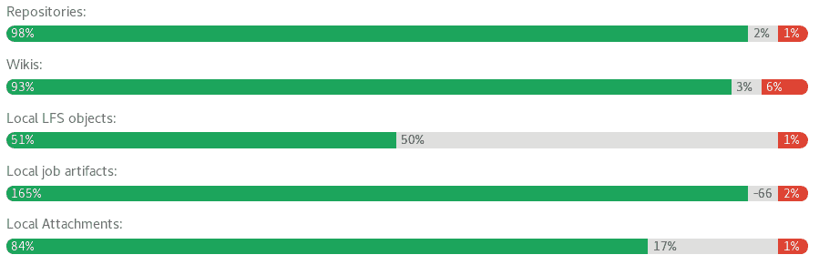

# Disaster recovery for planned failover

> 原文：[https://docs.gitlab.com/ee/administration/geo/disaster_recovery/planned_failover.html](https://docs.gitlab.com/ee/administration/geo/disaster_recovery/planned_failover.html)

*   [Not all data is automatically replicated](#not-all-data-is-automatically-replicated)
*   [Preflight checks](#preflight-checks)
    *   [Object storage](#object-storage)
    *   [Review the configuration of each **secondary** node](#review-the-configuration-of-each-secondary-node)
    *   [Run system checks](#run-system-checks)
    *   [Check that secrets match between nodes](#check-that-secrets-match-between-nodes)
    *   [Ensure Geo replication is up-to-date](#ensure-geo-replication-is-up-to-date)
    *   [Verify the integrity of replicated data](#verify-the-integrity-of-replicated-data)
    *   [Notify users of scheduled maintenance](#notify-users-of-scheduled-maintenance)
*   [Prevent updates to the **primary** node](#prevent-updates-to-the-primary-node)
*   [Finish replicating and verifying all data](#finish-replicating-and-verifying-all-data)
*   [Promote the **secondary** node](#promote-the-secondary-node)

# Disaster recovery for planned failover[](#disaster-recovery-for-planned-failover-premium-only "Permalink")

The primary use-case of Disaster Recovery is to ensure business continuity in the event of unplanned outage, but it can be used in conjunction with a planned failover to migrate your GitLab instance between regions without extended downtime.

由于 Geo 节点之间的复制是异步的，因此计划中的故障转移需要一个维护窗口，该窗口中阻止了对**主**节点的更新. 该窗口的长度取决于您的复制能力-一旦**辅助**节点与**主**节点完全同步，就可以进行故障转移而不会丢失数据.

本文档假定您已经具有完整配置的，可以正常使用的 Geo 设置. 在继续之前，请完整阅读它和[Disaster Recovery](index.html)故障转移文档. 计划内的故障转移是一项主要操作，如果执行不正确，则存在很高的数据丢失风险. 考虑对程序进行排练，直到您对必要的步骤感到满意并且对能够准确执行它们有高度的信心.

## Not all data is automatically replicated[](#not-all-data-is-automatically-replicated "Permalink")

如果您使用的是 Geo [不支持的](../replication/index.html#current-limitations)任何 GitLab 功能， [则](../replication/index.html#current-limitations)必须单独进行准备，以确保**辅助**节点具有与该功能关联的任何数据的最新副本. 这可能会大大延长所需的计划维护时间.

使文件中存储的数据的时间尽可能短的常见策略是使用`rsync`传输数据. 可以在维护窗口之前执行初始`rsync` . 随后的`rsync` s（包括维护窗口内的最终传输）将仅传输**主**节点和**辅助**节点之间的*更改* .

在[移动存储库](../../operations/moving_repositories.html)文档中可以找到有效使用`rsync`的以存储库为中心的策略. 这些策略可以调整为与任何其他基于文件的数据一起使用，例如 GitLab 页面（如果使用 Omnibus，则可在`/var/opt/gitlab/gitlab-rails/shared/pages` ）.

## Preflight checks[](#preflight-checks "Permalink")

运行此命令以列出所有预检检查，并在计划计划的故障转移之前自动检查复制和验证是否完成，以确保过程顺利进行：

```
gitlab-ctl promotion-preflight-checks 
```

即使预检检查失败，也可以以`force`模式运行此命令以升级为主要命令：

```
sudo gitlab-ctl promotion-preflight-checks --force 
```

每个步骤将在下面更详细地描述.

### Object storage[](#object-storage "Permalink")

如果您有大量的 GitLab 安装或无法忍受停机，请**在**计划计划的故障转移**之前**考虑[迁移到对象存储](../replication/object_storage.html) . 这样做既可以减少维护窗口的长度，又可以减少由于计划内故障转移执行不当而导致的数据丢失风险.

In GitLab 12.4, you can optionally allow GitLab to manage replication of Object Storage for **secondary** nodes. For more information, see [Object Storage replication](../replication/object_storage.html).

### Review the configuration of each **secondary** node[](#review-the-configuration-of-each-secondary-node "Permalink")

数据库设置会自动复制到**辅助**节点，但是`/etc/gitlab/gitlab.rb`文件必须手动设置，并且在节点之间有所不同. 如果在**主要**节点上启用了 Mattermost，OAuth 或 LDAP 集成等功能，但在**次要**节点上未启用这些功能，则它们将在故障转移期间丢失.

查看两个节点的`/etc/gitlab/gitlab.rb`文件，并确保**辅助**节点支持**主**节点**在**计划计划的故障转移**之前**所做的一切.

### Run system checks[](#run-system-checks "Permalink")

在**主**节点和**辅助**节点上运行以下命令：

```
gitlab-rake gitlab:check
gitlab-rake gitlab:geo:check 
```

如果在任一节点上报告了任何故障，则应**在**计划计划的故障转移**之前**解决这些故障.

### Check that secrets match between nodes[](#check-that-secrets-match-between-nodes "Permalink")

SSH 主机密钥和`/etc/gitlab/gitlab-secrets.json`文件在所有节点上均应相同. 通过在所有节点上运行以下命令并比较输出来进行检查：

```
sudo sha256sum /etc/ssh/ssh_host* /etc/gitlab/gitlab-secrets.json 
```

如果有任何文件不同，请用**主**节点中的内容替换**辅助**节点上的内容.

### Ensure Geo replication is up-to-date[](#ensure-geo-replication-is-up-to-date "Permalink")

直到地理复制和验证完成，维护窗口才会结束. 为了使窗口尽可能短，在使用过程中，应确保这些过程尽可能接近 100％.

导航到 **管理区>** **辅助**节点上的**地理**仪表板以查看状态. 复制的对象（以绿色显示）应接近 100％，并且不应出现故障（以红色显示）. 如果尚未复制大量对象（显示为灰色），请考虑给节点更多时间来完成

[](img/replication-status.png)

如果有任何对象无法复制，则应在安排维护窗口之前进行调查. 在计划好的故障转移之后，所有无法复制的内容都会**丢失** .

您可以使用[地理状态 API](../../../api/geo_nodes.html#retrieve-project-sync-or-verification-failures-that-occurred-on-the-current-node)查看失败的对象以及失败的原因.

复制失败的常见原因是**主**节点上缺少数据-您可以通过从备份还原数据或删除对丢失数据的引用来解决这些故障.

### Verify the integrity of replicated data[](#verify-the-integrity-of-replicated-data "Permalink")

This [content was moved to another location](background_verification.html).

### Notify users of scheduled maintenance[](#notify-users-of-scheduled-maintenance "Permalink")

在**主**节点上，导航到 **管理区>** **消息** ，添加广播消息. 你可以检查下 **管理区>** **地理位置，**以估算完成同步需要多长时间. 一个示例消息是：

> 计划的维护将在世界标准时间 XX：XX 进行. 我们预计将花费不到 1 个小时.

## Prevent updates to the **primary** node[](#prevent-updates-to-the-primary-node "Permalink")

在实施[只读模式](https://gitlab.com/gitlab-org/gitlab/-/issues/14609)之前，必须防止手动进行更新. 请注意，在维护窗口期间， **辅助**节点仍需要对**主**节点具有只读访问权限.

1.  在计划的时间，使用您的云提供商或节点的防火墙，阻止去往/来自**主**节点的所有 HTTP，HTTPS 和 SSH 通信， **但** IP 和**辅助**节点的 IP **除外** .

    例如，您可能在组成**主**节点的服务器上运行以下命令：

    ```
    sudo iptables -A INPUT -p tcp -s <secondary_node_ip> --destination-port 22 -j ACCEPT
    sudo iptables -A INPUT -p tcp -s <your_ip> --destination-port 22 -j ACCEPT
    sudo iptables -A INPUT --destination-port 22 -j REJECT

    sudo iptables -A INPUT -p tcp -s <secondary_node_ip> --destination-port 80 -j ACCEPT
    sudo iptables -A INPUT -p tcp -s <your_ip> --destination-port 80 -j ACCEPT
    sudo iptables -A INPUT --tcp-dport 80 -j REJECT

    sudo iptables -A INPUT -p tcp -s <secondary_node_ip> --destination-port 443 -j ACCEPT
    sudo iptables -A INPUT -p tcp -s <your_ip> --destination-port 443 -j ACCEPT
    sudo iptables -A INPUT --tcp-dport 443 -j REJECT 
    ```

    从这一点来看，用户将无法查看其数据或在**主**节点上进行更改. 他们也将无法登录到**辅助**节点. 但是，现有的会话将在维护期间的剩余时间内起作用，并且可以在整个维护期间访问公共数据.

2.  通过使用其他 IP 在浏览器中访问**主**节点，验证**主**节点是否受到 HTTP 流量的阻止. 服务器应拒绝连接.

3.  尝试通过使用 SSH 远程 URL 提取现有的 Git 存储库，来验证**主**节点是否已通过 SSH 流量阻止 Git. 服务器应拒绝连接.

4.  通过导航到禁用**主要**节点上的非 Geo 定期后台作业 **管理区>** **监视>后台作业> Cron** ，按`Disable All` ，然后为`geo_sidekiq_cron_config_worker` cron 作业按`Enable` . 该作业将重新启用其他几个 cron 作业，这些作业对于计划的故障转移成功完成至关重要.

## Finish replicating and verifying all data[](#finish-replicating-and-verifying-all-data "Permalink")

1.  如果您要手动复制不是由 Geo 管理的任何数据，请立即触发最终复制过程.
2.  在**主**节点上，导航到 **管理区>** **监视>后台作业>队列，**并等待所有队列（名称中带有`geo`的队列降至 0）.这些队列包含用户提交的工作； 在完成之前进行故障转移将导致工作丢失.
3.  在**主**节点上，导航到 **管理区>** **地理位置，**并等待您要故障转移到的**辅助**节点满足以下条件：

    *   所有复制计量到 100％复制，0％失败.
    *   所有验证仪表均达到 100％验证，0％失败.
    *   数据库复制滞后为 0ms.
    *   地理日志光标是最新的（落后 0 个事件）.
4.  在**辅助**节点上，导航到 **管理区>** **监视>后台作业>队列，**然后等待所有`geo`队列下降到 0 个已排队的作业和 0 个正在运行的作业.
5.  在**辅助**节点上，使用[以下说明](../../raketasks/check.html)来验证 CI 工件，LFS 对象以及文件存储中的上载的完整性.

此时， **辅助**节点将包含**主**节点拥有的所有内容的最新副本，这意味着在进行故障转移时不会丢失任何内容.

## Promote the **secondary** node[](#promote-the-secondary-node "Permalink")

最后，按照[灾难恢复文档](index.html)将**辅助**节点升级为**主要**节点. 此过程将导致**辅助**节点发生短暂中断，并且用户可能需要再次登录.

一旦完成，维护窗口就结束了！ 新的**主**节点现在开始发散，从旧的. 如果确实出现在这一点上的问题，没有回到原来的**主**节点[是可能](bring_primary_back.html)的，但可能会导致在此期间上传到新的**主**任何数据丢失.

故障转移完成后，请不要忘记删除广播消息.