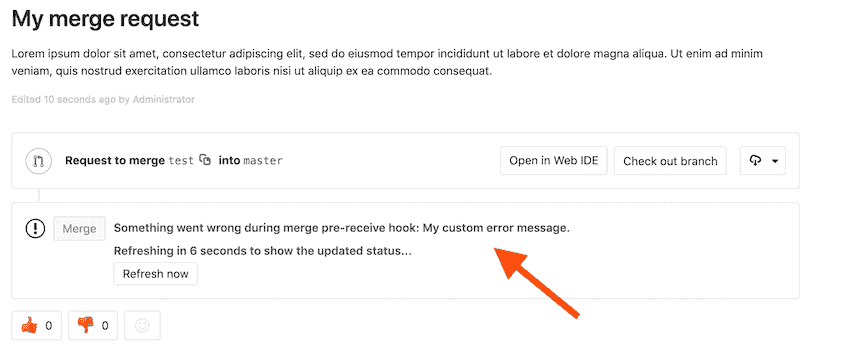

# Server hooks

> 原文：[https://docs.gitlab.com/ee/administration/server_hooks.html](https://docs.gitlab.com/ee/administration/server_hooks.html)

*   [Create a server hook for a repository](#create-a-server-hook-for-a-repository)
*   [Create a global server hook for all repositories](#create-a-global-server-hook-for-all-repositories)
*   [Chained hooks](#chained-hooks)
*   [Environment Variables](#environment-variables)
*   [Transition to Go](#transition-to-go)
*   [Custom error messages](#custom-error-messages)
    *   [Example custom error message](#example-custom-error-message)

# Server hooks[](#server-hooks-core-only "Permalink")

在 GitLab 12.8 中[引入，](https://gitlab.com/gitlab-org/gitlab/-/issues/196051)以取代"自定义挂钩".

Git 支持在不同动作上执行的钩子. 这些挂钩在服务器上运行，可用于执行特定的提交策略或基于存储库的状态执行其他任务.

Git 支持以下钩子：

*   `pre-receive`
*   `post-receive`
*   `update`

有关每种钩子类型的更多信息，请参见[Git 文档](https://git-scm.com/book/en/v2/Customizing-Git-Git-Hooks#_server_side_hooks) .

服务器端 Git 挂钩可以配置为：

*   [A single repository](#create-a-server-hook-for-a-repository).
*   [All repositories](#create-a-global-server-hook-for-all-repositories).

Note the following about server hooks:

*   必须在 GitLab 服务器的文件系统上配置服务器挂钩. 只有 GitLab 服务器管理员才能完成这些任务. 如果您没有文件系统访问权限，请参见以下替代方法：
    *   [Webhooks](../user/project/integrations/webhooks.html) .
    *   [亚搏体育 app CI / CD](../ci/README.html) .
    *   [推送规则](../push_rules/push_rules.html) ，用于用户可配置的 Git 挂钩界面.
*   服务器挂钩不会复制到[Geo](geo/replication/index.html)辅助节点.

## Create a server hook for a repository[](#create-a-server-hook-for-a-repository "Permalink")

如果您不使用[哈希存储](repository_storage_types.html#hashed-storage) ，则项目的存储库目录可能与以下说明不完全匹配. 在这种情况下：

*   对于从源进行的安装，路径通常是`/home/git/repositories/<group>/<project>.git` .
*   对于 Omnibus GitLab 安装，路径通常为`/var/opt/gitlab/git-data/repositories/<group>/<project>.git` .

请按照以下步骤为存储库设置服务器端挂钩：

1.  导航到" **管理"区域>"项目"** ，然后单击要向其添加服务器挂钩的项目.
2.  在出现的页面上找到**Gitaly 相对路径** . 这是必须实现服务器挂钩的地方. 有关解释相对路径的信息，请参阅[翻译哈希存储路径](repository_storage_types.html#translating-hashed-storage-paths) .
3.  在文件系统上，在此位置创建一个名为`custom_hooks`的新目录.
4.  在新的`custom_hooks`目录中，创建一个名称与钩子类型匹配的文件. 例如，对于预接收钩子，文件名应该是`pre-receive` ，没有扩展名.
5.  使挂钩文件可执行，并确保它由 Git 用户拥有.
6.  编写代码以使服务器挂钩功能按预期方式运行. 挂钩可以使用任何语言. 确保顶部的[" shebang"](https://en.wikipedia.org/wiki/Shebang_(Unix))正确反映语言类型. 例如，如果脚本在 Ruby 中，则 shebang 可能是`#!/usr/bin/env ruby` .

假设正确执行了挂钩代码，则将适当地执行挂钩代码.

## Create a global server hook for all repositories[](#create-a-global-server-hook-for-all-repositories "Permalink")

要创建适用于您实例中所有存储库的 Git 挂钩，请设置一个全局服务器挂钩. 默认的全局服务器挂钩目录位于 GitLab Shell 目录中. 在那里添加的任何钩子都适用于所有存储库.

默认目录：

*   对于从源代码进行的安装，通常是`/home/git/gitlab-shell/hooks` .
*   对于 Omnibus GitLab，安装通常是`/opt/gitlab/embedded/service/gitlab-shell/hooks` .

要将其他目录用于全局服务器挂钩， `custom_hooks_dir`在 Gitaly 配置中设置`custom_hooks_dir` ：

*   对于 Omnibus 安装，此设置在`gitlab.rb` .
*   对于源代码安装，配置位置取决于 GitLab 版本. 对于：
    *   GitLab 13.0 及更早版本，在`gitlab-shell/config.yml` .
    *   GitLab 13.1 及更高版本，在`[hooks]`部分的`gitaly/config.toml`进行设置.

**注意：** `gitlab-shell/config.yml`的`custom_hooks_dir`值在 GitLab 13.1 和更高版本中仍然被接受，如果`gitaly/config.toml`的值是空白或不存在.

请按照以下步骤为所有存储库设置全局服务器挂钩：

1.  在 GitLab 服务器上，导航到配置的全局服务器挂钩目录.
2.  在此位置创建一个新目录. 根据挂钩的类型，它可以是`pre-receive.d` ， `post-receive.d`或`update.d`目录.
3.  在这个新目录中，添加您的钩子. 挂钩可以使用任何语言. 确保顶部的[" shebang"](https://en.wikipedia.org/wiki/Shebang_(Unix))正确反映语言类型. 例如，如果脚本在 Ruby 中，则 shebang 可能是`#!/usr/bin/env ruby` .
4.  使挂钩文件可执行，并确保它由 Git 用户拥有.

现在，测试挂钩以检查其是否正常运行.

## Chained hooks[](#chained-hooks "Permalink")

在 GitLab Shell 4.1.0 和 GitLab 8.15 中[引入](https://gitlab.com/gitlab-org/gitlab-shell/-/merge_requests/93) .

可以按链执行[每个项目](#create-a-server-hook-for-a-repository)或[全局](#create-a-global-server-hook-for-all-repositories)设置的服务器挂钩.

搜索服务器挂钩并按以下优先级顺序执行：

*   内置的 GitLab 服务器挂钩. 这些不是用户可定制的.
*   `<project>.git/custom_hooks/<hook_name>` ：每个项目的挂钩. 保留它是为了向后兼容.
*   `<project>.git/custom_hooks/<hook_name>.d/*` ：每个项目挂钩的位置.
*   `<custom_hooks_dir>/<hook_name>.d/*` ：除编辑器备份文件之外的所有可执行全局挂钩文件的位置.

在目录中，服务器挂钩：

*   按字母顺序执行.
*   当钩子以非零值退出时，停止执行.

Note:

*   `<hook_name>.d`必须为`pre-receive.d` ， `post-receive.d`或`update.d`才能正常工作. 其他任何名称都将被忽略.
*   `.d`目录中的文件必须是可执行文件，并且与备份文件模式（ `*~` ）不匹配.
*   对于`<project>.git` ，你需要[翻译](repository_storage_types.html#translating-hashed-storage-paths)你的项目名称为散列存储格式 GitLab 用途.

## Environment Variables[](#environment-variables "Permalink")

以下环境变量集可用于服务器挂钩.

| 环境变量 | Description |
| --- | --- |
| `GL_ID` | 启动推送的用户的 GitLab 标识符. 例如， `user-2234` |
| `GL_PROJECT_PATH` | （GitLab 13.2 和更高版本）GitLab 项目路径 |
| `GL_PROTOCOL` | （GitLab 13.2 和更高版本）与 push 一起使用的协议 |
| `GL_REPOSITORY` | `project-<id>` ，其中`id`是项目的 ID |
| `GL_USERNAME` | 启动推送的用户的 GitLab 用户名 |

接收前和接收后服务器挂钩也可以访问以下 Git 环境变量.

| 环境变量 | Description |
| --- | --- |
| `GIT_ALTERNATE_OBJECT_DIRECTORIES` | 隔离环境中的备用对象目录. 请参阅[Git `receive-pack`文档](https://git-scm.com/docs/git-receive-pack#_quarantine_environment) . |
| `GIT_OBJECT_DIRECTORY` | GitLab project path in the quarantine environment. See [Git `receive-pack` documentation](https://git-scm.com/docs/git-receive-pack#_quarantine_environment). |
| `GIT_PUSH_OPTION_COUNT` | 推送选项的数量. 请参阅[Git `pre-receive`文档](https://git-scm.com/docs/githooks#pre-receive) . |
| `GIT_PUSH_OPTION_<i>` | `i`从`0`到`GIT_PUSH_OPTION_COUNT - 1`的推送选项的值. 请参阅[Git `pre-receive`文档](https://git-scm.com/docs/githooks#pre-receive) . |

**注意：**虽然其他环境变量可以传递给服务器挂钩，但是您的应用程序不应依赖它们，因为它们可以更改.

## Transition to Go[](#transition-to-go "Permalink")

在 GitLab 13.2 中使用功能标记引入.

以下服务器挂钩已在 Go 中重新实现：

*   `pre-receive` ，默认情况下使用 Go 实现. 要改用 Ruby 实现，请[禁用](../operations/feature_flags.html#enable-or-disable-feature-flag-strategies) `:gitaly_go_preceive_hook`功能标记.
*   `update` ，默认使用 Go 实现. 要改用 Ruby 实现，请[禁用](../operations/feature_flags.html#enable-or-disable-feature-flag-strategies) `:gitaly_go_update_hook`功能标志.
*   `post-receive` ，但是默认情况下使用 Ruby 实现. 要改用 Go 实现，请[启用](../operations/feature_flags.html#enable-or-disable-feature-flag-strategies) `:gitaly_go_postreceive_hook`功能标志.

## Custom error messages[](#custom-error-messages "Permalink")

在 GitLab 8.10 中[引入](https://gitlab.com/gitlab-org/gitlab-foss/-/merge_requests/5073) .

要在拒绝提交或在 Git 挂钩期间发生错误时在 GitLab 的 UI 中显示自定义错误消息，您的脚本应：

*   将自定义错误消息发送到脚本的`stdout`或`stderr` .
*   给每条消息加上`GL-HOOK-ERR:`前缀，前缀前没有字符.

### Example custom error message[](#example-custom-error-message "Permalink")

用 Bash 编写的该钩子脚本在 GitLab 的 UI 中生成以下消息：

```
#!/bin/sh
echo "GL-HOOK-ERR: My custom error message.";
exit 1 
```

[](img/custom_hooks_error_msg.png)