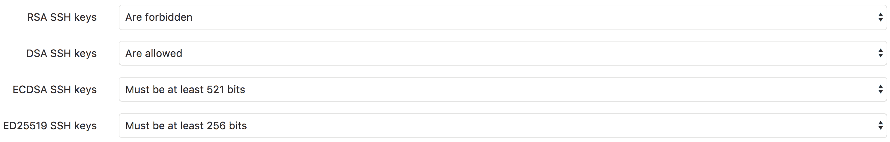
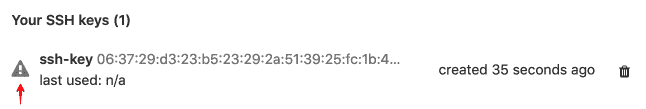

# Restrict allowed SSH key technologies and minimum length

> 原文：[https://docs.gitlab.com/ee/security/ssh_keys_restrictions.html](https://docs.gitlab.com/ee/security/ssh_keys_restrictions.html)

# Restrict allowed SSH key technologies and minimum length

`ssh-keygen`允许用户创建低至 768 位的 RSA 密钥，这远低于某些标准组（例如 US NIST）的建议. 一些部署 GitLab 的组织将需要增强最低密钥强度，以满足内部安全策略或法规遵从性.

同样，某些标准组建议在较旧的 DSA 上使用 RSA，ECDSA 或 ED25519，并且管理员可能需要限制允许的 SSH 密钥算法.

GitLab 允许您限制允许的 SSH 密钥技术，并指定每种技术的最小密钥长度.

在**管理区域>设置** （ `/admin/application_settings/general` ）中，展开**可见性和访问控制**部分：

如果对任何密钥类型施加了限制，则用户将无法上载不符合要求的新 SSH 密钥. 现有的不符合要求的键将被禁用但不会被删除，用户将无法使用它们来拉入或推入代码.

用户的个人资料的" SSH 密钥"部分中的受限密钥图标将对用户可见：

将鼠标悬停在此图标上会告诉您为什么限制按键.