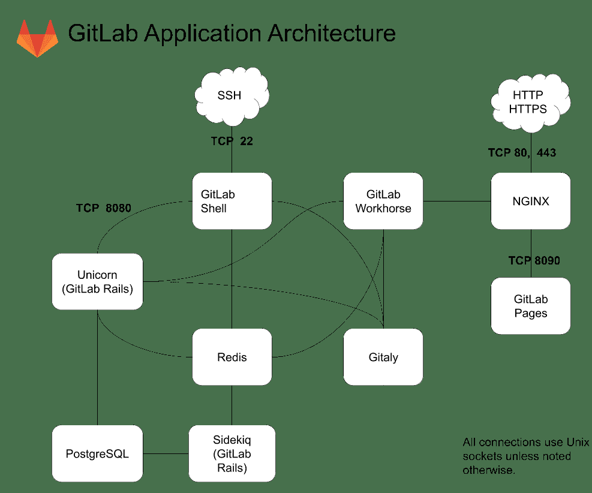

# GitLab Architecture Overview

> 原文：[https://docs.gitlab.com/ee/development/architecture.html](https://docs.gitlab.com/ee/development/architecture.html)

*   [Software delivery](#software-delivery)
*   [Components](#components)
    *   [Simplified Component Overview](#simplified-component-overview)
    *   [Component diagram](#component-diagram)
    *   [Component legend](#component-legend)
    *   [Component list](#component-list)
    *   [Component details](#component-details)
        *   [Alertmanager](#alertmanager)
        *   [Certificate management](#certificate-management)
        *   [Consul](#consul)
        *   [Database migrations](#database-migrations)
        *   [Elasticsearch](#elasticsearch)
        *   [Gitaly](#gitaly)
        *   [Praefect](#praefect)
        *   [GitLab Geo](#gitlab-geo)
        *   [GitLab Exporter](#gitlab-exporter)
        *   [GitLab Pages](#gitlab-pages)
        *   [GitLab Runner](#gitlab-runner)
        *   [GitLab Shell](#gitlab-shell)
        *   [GitLab Workhorse](#gitlab-workhorse)
        *   [Grafana](#grafana)
        *   [Jaeger](#jaeger)
        *   [Logrotate](#logrotate)
        *   [Mattermost](#mattermost)
        *   [MinIO](#minio)
        *   [NGINX](#nginx)
        *   [Node Exporter](#node-exporter)
        *   [PgBouncer](#pgbouncer)
        *   [PgBouncer Exporter](#pgbouncer-exporter)
        *   [PostgreSQL](#postgresql)
        *   [PostgreSQL Exporter](#postgresql-exporter)
        *   [Prometheus](#prometheus)
        *   [Redis](#redis)
        *   [Redis Exporter](#redis-exporter)
        *   [Registry](#registry)
        *   [Sentry](#sentry)
        *   [Sidekiq](#sidekiq)
        *   [Unicorn](#unicorn)
        *   [LDAP Authentication](#ldap-authentication)
        *   [Outbound Email](#outbound-email)
        *   [Inbound Email](#inbound-email)
        *   [GitLab Managed Apps](#gitlab-managed-apps)
*   [GitLab by Request Type](#gitlab-by-request-type)
    *   [GitLab Web HTTP Request Cycle](#gitlab-web-http-request-cycle)
    *   [GitLab Git Request Cycle](#gitlab-git-request-cycle)
    *   [Web Request (80/443)](#web-request-80443)
    *   [SSH Request (22)](#ssh-request-22)
*   [System Layout](#system-layout)
    *   [Installation Folder Summary](#installation-folder-summary)
    *   [Processes](#processes)
    *   [Repository access](#repository-access)
*   [Troubleshooting](#troubleshooting)
    *   [Init scripts of the services](#init-scripts-of-the-services)
    *   [Log locations of the services](#log-locations-of-the-services)
    *   [GitLab specific configuration files](#gitlab-specific-configuration-files)
    *   [Maintenance Tasks](#maintenance-tasks)
*   [GitLab.com](#gitlabcom)

# GitLab Architecture Overview[](#gitlab-architecture-overview "Permalink")

## Software delivery[](#software-delivery "Permalink")

GitLab 有两种软件发行[版](https://gitlab.com/gitlab-org/gitlab-foss/) ：开源[社区版](https://gitlab.com/gitlab-org/gitlab-foss/) （CE）和开放核心[企业版](https://gitlab.com/gitlab-org/gitlab/) （EE）. GitLab 在[不同的订阅下](https://about.gitlab.com/pricing/)可用.

GitLab 的新版本在稳定的分支中发布，而 master 分支则用于前沿开发.

有关信息，请参见[GitLab 发布过程](https://gitlab.com/gitlab-org/release/docs/-/tree/master#gitlab-release-process) .

EE 和 CE 都需要一些名为 GitLab Shell 和 Gitaly 的附加组件. 这些组件分别可从[GitLab Shell](https://gitlab.com/gitlab-org/gitlab-shell/-/tree/master)和[Gitaly](https://gitlab.com/gitlab-org/gitaly/-/tree/master)存储库中获得. 新版本通常是标签，但是停留在 master 分支上将为您提供最新的稳定版本. 新版本通常与 GitLab CE 发布大约相同的时间，但非正式的安全更新被认为很重要.

## Components[](#components "Permalink")

A typical install of GitLab will be on GNU/Linux. It uses NGINX or Apache as a web front end to proxypass the Unicorn web server. By default, communication between Unicorn and the front end is via a Unix domain socket but forwarding requests via TCP is also supported. The web front end accesses `/home/git/gitlab/public` bypassing the Unicorn server to serve static pages, uploads (e.g. avatar images or attachments), and pre-compiled assets. GitLab serves web pages and the [GitLab API](../api/README.html) using the Unicorn web server. It uses Sidekiq as a job queue which, in turn, uses Redis as a non-persistent database backend for job information, meta data, and incoming jobs.

我们还支持使用我们的[GitLab Helm 图表](https://docs.gitlab.com/charts/)在 Kubernetes 上部署 GitLab.

GitLab Web 应用程序将 PostgreSQL 用于持久数据库信息（例如，用户，权限，问题，其他元数据）. GitLab 默认将其服务的裸 Git 存储库存储在`/home/git/repositories` . 它还使用裸存储库保留默认的分支和挂钩信息.

通过 HTTP / HTTPS 提供存储库时，GitLab 利用 GitLab API 来解析授权和访问以及提供 Git 对象.

附加组件 GitLab Shell 通过 SSH 提供存储库. 它管理`/home/git/.ssh/authorized_keys`的 SSH 密钥，不应手动对其进行编辑. GitLab Shell 通过 Gitaly 访问裸仓库以提供 Git 对象，并与 Redis 进行通信以将作业提交给 Sidekiq，以供 GitLab 处理. GitLab Shell 查询 GitLab API 以确定授权和访问权限.

Gitaly 从 GitLab Shell 和 GitLab Web 应用程序执行 Git 操作，并向 GitLab Web 应用程序提供 API，以从 Git 获取属性（例如标题，分支，标签，其他元数据），并获取 Blob（例如 diff，commit，文件）.

您可能也[对 GitLab.com](https://about.gitlab.com/handbook/engineering/infrastructure/production/architecture/)的[生产体系结构感兴趣](https://about.gitlab.com/handbook/engineering/infrastructure/production/architecture/) .

### Simplified Component Overview[](#simplified-component-overview "Permalink")

这是一个简化的架构图，可用于了解 GitLab 的架构.

下面的[组件图](#component-diagram)中提供了完整的架构图.

[](img/architecture_simplified.png)

### Component diagram[](#component-diagram "Permalink")

图 TB HTTP [HTTP / HTTPS]-TCP 80、443-> NGINX [NGINX] SSH-TCP 22-> GitLabShell [GitLab Shell] SMTP [SMTP Gateway] Geo [GitLab Geo Node]-TCP 22， 80，443-> NGINX GitLabShell --TCP 8080-> Unicorn [" Unicorn（GitLab Rails）"] GitLabShell-> Praefect GitLabShell-> Redis Unicorn-> PgBouncer [PgBouncer] Unicorn-> Redis Unicorn- -> Praefect Sidekiq-> Redis Sidekiq-> PgBouncer Sidekiq-> Praefect GitLabWorkhorse [GitLab Workhorse]-> Unicorn GitLabWorkhorse-> Redis GitLabWorkhorse-> Praefect Praefect-> Gitaly NGINX-> GitLabWorkhorse NGINX- TCP 8090-> GitLabPages [GitLab 页面] NGINX-> Grafana [Grafana] Grafana-TCP 9090-> Prometheus [Prometheus] Prometheus-TCP 80，443-> Unicorn RedisExporter [Redis Exporter]-> Redis Prometheus-TCP 9121-> RedisExporter PostgreSQLExporter [PostgreSQL 导出器]-> PostgreSQL PgBouncerExporter [PgBouncer 导出器]-> PgBouncer Prometheus-TCP 9187-> PostgreSQLExporter Prometheus-TCP 9100-> NodeExporter [Node Exp orter] Prometheus-TCP 9168-> GitLabExporter [GitLab Exporter] Prometheus-TCP 9127-> PgBouncerExporter GitLabExporter-> PostgreSQL GitLabExporter-> GitLabShell GitLabExporter-> Sidekiq PgBouncer-> Consul PostgreSQL-> Consul PgBouncer -> PostgreSQL NGINX->注册表 Unicorn->注册表 NGINX-> Mattermost Mattermost --- Unicorn Prometheus-> Alertmanager 迁移-> PostgreSQL Runner-TCP 443-> NGINX Unicorn-TCP 9200- > Elasticsearch Sidekiq-TCP 9200-> Elasticsearch Sidekiq-TCP 80，443-> Sentry Unicorn-TCP 80，443-> Sentry Sidekiq-UDP 6831-> Jaeger Unicorn-UDP 6831-> Jaeger Gitaly-UDP 6831-> Jaeger GitLabShell-UDP 6831-> Jaeger GitLabWorkhorse-UDP 6831-> Jaeger Alertmanager-TCP 25-> SMTP Sidekiq-TCP 25-> SMTP Unicorn-TCP 25-> SMTP Unicorn-TCP 369-> LDAP Sidekiq-TCP 369-> LDAP Unicorn-TCP 443-> ObjectStorage [" Object Storage"] Sidekiq-TCP 443-> ObjectStorage GitLabWorkhorse- TCP 协议 443-> ObjectStorage 注册表-TCP 443-> ObjectStorage Geo-TCP 5432-> PostgreSQL

### Component legend[](#component-legend "Permalink")

*   ✅-默认安装
*   ⚙-需要其他配置或 GitLab 托管应用
*   ⤓-需要手动安装
*   ❌-不支持或无可用说明
*   不适用-不适用

组件状态链接到每个组件的配置文档.

### Component list[](#component-list "Permalink")

表描述链接：

*   [Omnibus GitLab](https://docs.gitlab.com/omnibus/)
*   [GitLab chart](https://docs.gitlab.com/charts/)
*   [Minikube Minimal](https://docs.gitlab.com/charts/development/minikube/)
*   [GitLab.com](https://gitlab.com)
*   [Source](../install/installation.html)
*   [GDK](https://gitlab.com/gitlab-org/gitlab-development-kit)

| Component | Description | 所有的 GitLab | GitLab 图表 | Minikube 最小 | GitLab.com | Source | GDK | CE/EE |
| --- | --- | --- | --- | --- | --- | --- | --- | --- |
| [Certificate Management](#certificate-management) | TLS 设置，让我们加密 | ✅ | ✅ | ⚙ | ✅ | ⚙ | ⚙ | CE 和 EE |
| [Consul](#consul) | 数据库节点发现，故障转移 | ⚙ | ❌ | ❌ | ✅ | ❌ | ❌ | 仅 EE |
| [Database Migrations](#database-migrations) | 数据库迁移 | ✅ | ✅ | ✅ | ✅ | ⚙ | ✅ | CE 和 EE |
| [Elasticsearch](#elasticsearch) | 改进了 GitLab 中的搜索 | ⤓ | ⤓ | ⤓ | ❌ | ⤓ | ⤓ | 仅 EE |
| [Gitaly](#gitaly) | Git RPC 服务，用于处理 GitLab 进行的所有 Git 调用 | ✅ | ✅ | ✅ | ✅ | ⚙ | ✅ | CE 和 EE |
| [GitLab Exporter](#gitlab-exporter) | 生成各种 GitLab 指标 | ✅ | ✅ | ✅ | ✅ | ❌ | ❌ | CE 和 EE |
| [GitLab Geo Node](#gitlab-geo) | 地理分布的 GitLab 节点 | ⚙ | ⚙ | ❌ | ✅ | ❌ | ⚙ | 仅 EE |
| [GitLab Managed Apps](#gitlab-managed-apps) | 将 Helm，Ingress，Cert-Manager，Prometheus，Runner，JupyterHub 或 Knative 部署到集群 | ⤓ | ⤓ | ⤓ | ⤓ | ⤓ | ⤓ | CE 和 EE |
| [GitLab Pages](#gitlab-pages) | 托管静态网站 | ⚙ | ❌ | ❌ | ✅ | ⚙ | ⚙ | CE 和 EE |
| [GitLab self-monitoring: Alertmanager](#alertmanager) | 来自 Prometheus 的重复数据删除，分组和路由警报 | ⚙ | ✅ | ⚙ | ✅ | ❌ | ❌ | CE 和 EE |
| [GitLab self-monitoring: Grafana](#grafana) | 指标仪表板 | ✅ | ⚙ | ⤓ | ✅ | ❌ | ❌ | CE & EE |
| [GitLab self-monitoring: Jaeger](#jaeger) | 查看由 GitLab 实例生成的跟踪 | ❌ | ⚙ | ❌ | ❌ | ⤓ | ⚙ | CE 和 EE |
| [GitLab self-monitoring: Prometheus](#prometheus) | 时间序列数据库，指标收集和查询服务 | ✅ | ✅ | ⚙ | ✅ | ❌ | ❌ | CE 和 EE |
| [GitLab self-monitoring: Sentry](#sentry) | 跟踪 GitLab 实例生成的错误 | ⤓ | ⤓ | ❌ | ✅ | ⤓ | ⤓ | CE 和 EE |
| [GitLab Shell](#gitlab-shell) | 通过 SSH 会话处理`git` | ✅ | ✅ | ✅ | ✅ | ⚙ | ✅ | CE 和 EE |
| [GitLab Workhorse](#gitlab-workhorse) | 智能反向代理，处理大型 HTTP 请求 | ✅ | ✅ | ✅ | ✅ | ⚙ | ✅ | CE & EE |
| [Inbound email (SMTP)](#inbound-email) | 接收消息以更新问题 | ⤓ | ⚙ | ⤓ | ✅ | ⤓ | ⤓ | CE 和 EE |
| [Jaeger integration](#jaeger) | 部署的应用程序的分布式跟踪 | ⤓ | ⤓ | ⤓ | ⤓ | ⤓ | ⤓ | 仅 EE |
| [LDAP Authentication](#ldap-authentication) | 根据集中的 LDAP 目录对用户进行身份验证 | ⤓ | ⤓ | ⤓ | ❌ | ⤓ | ⤓ | CE 和 EE |
| [Mattermost](#mattermost) | 开源 Slack 替代方案 | ⚙ | ⤓ | ⤓ | ⤓ | ❌ | ❌ | CE 和 EE |
| [MinIO](#minio) | 对象存储服务 | ⤓ | ✅ | ✅ | ✅ | ❌ | ⚙ | CE 和 EE |
| [NGINX](#nginx) | 将请求路由到适当的组件，终止 SSL | ✅ | ✅ | ⚙ | ✅ | ⤓ | ❌ | CE 和 EE |
| [Node Exporter](#node-exporter) | 具有系统指标的 Prometheus 端点 | ✅ | N/A | N/A | ✅ | ❌ | ❌ | CE 和 EE |
| [Outbound email (SMTP)](#outbound-email) | 向用户发送电子邮件 | ⤓ | ⚙ | ⤓ | ✅ | ⤓ | ⤓ | CE 和 EE |
| [PgBouncer Exporter](#pgbouncer-exporter) | 具有 PgBouncer 指标的 Prometheus 端点 | ⚙ | ❌ | ❌ | ✅ | ❌ | ❌ | CE 和 EE |
| [PgBouncer](#pgbouncer) | 数据库连接池，故障转移 | ⚙ | ❌ | ❌ | ✅ | ❌ | ❌ | 仅 EE |
| [PostgreSQL Exporter](#postgresql-exporter) | 带有 PostgreSQL 指标的 Prometheus 端点 | ✅ | ✅ | ✅ | ✅ | ❌ | ❌ | CE 和 EE |
| [PostgreSQL](#postgresql) | Database | ✅ | ✅ | ✅ | ✅ | ⤓ | ✅ | CE 和 EE |
| [Praefect](#praefect) | 任何 Git 客户端和 Gitaly 存储节点之间的透明代理. | ✅ | ⚙ | ❌ | ✅ | ⚙ | ✅ | CE 和 EE |
| [Redis Exporter](#redis-exporter) | 具有 Redis 指标的 Prometheus 端点 | ✅ | ✅ | ✅ | ✅ | ❌ | ❌ | CE 和 EE |
| [Redis](#redis) | 缓存服务 | ✅ | ✅ | ✅ | ✅ | ⤓ | ✅ | CE 和 EE |
| [Registry](#registry) | 容器注册表，允许推和拉图像 | ⚙ | ✅ | ✅ | ✅ | ⤓ | ⚙ | CE 和 EE |
| [Runner](#gitlab-runner) | 执行 GitLab CI / CD 作业 | ⤓ | ✅ | ⚙ | ✅ | ⚙ | ⚙ | CE 和 EE |
| [Sentry integration](#sentry) | 跟踪已部署应用程序的错误 | ⤓ | ⤓ | ⤓ | ⤓ | ⤓ | ⤓ | CE 和 EE |
| [Sidekiq](#sidekiq) | 后台作业处理器 | ✅ | ✅ | ✅ | ✅ | ✅ | ✅ | CE 和 EE |
| [Unicorn (GitLab Rails)](#unicorn) | 处理对 Web 界面和 API 的请求 | ✅ | ✅ | ✅ | ✅ | ⚙ | ✅ | CE 和 EE |

### Component details[](#component-details "Permalink")

本文档供系统管理员和 GitLab 支持工程师使用，他们希望进一步了解 GitLab 的内部结构以及如何协同工作.

部署后，应将 GitLab 视为以下过程的合并. 在进行故障排除或调试时，请尽可能明确地指出要引用的组件. 那应该增加清晰度并减少混乱.

**Layers**

从流程的角度来看，可以认为 GitLab 具有两层：

*   **监视** ：不需要任何层来交付 GitLab 应用程序，但是它将允许管理员更深入地了解他们的基础结构以及整个服务在做什么.
*   **核心** ：对 GitLab 作为平台交付至关重要的任何过程. 如果这些过程中的任何一个停止，都将导致 GitLab 中断. 对于核心层，您可以进一步分为：
    *   **处理器** ：这些进程负责实际执行操作并提供服务.
    *   **数据** ：这些服务为 GitLab 服务存储/公开结构化数据.

#### Alertmanager[](#alertmanager "Permalink")

*   [Project page](https://github.com/prometheus/alertmanager/blob/master/README.md)
*   Configuration:
    *   [Omnibus](https://gitlab.com/gitlab-org/omnibus-gitlab/blob/master/files/gitlab-config-template/gitlab.rb.template)
    *   [Charts](https://github.com/helm/charts/tree/master/stable/prometheus)
*   层：监控
*   Process: `alertmanager`
*   GitLab.com: [Monitoring of GitLab.com](https://about.gitlab.com/handbook/engineering/monitoring/)

[警报管理器](https://s0prometheus0io.icopy.site/docs/alerting/latest/alertmanager/)是 Prometheus 提供的工具，用于*"处理由客户端应用程序（例如 Prometheus 服务器）发送的警报.* *它负责将重复数据删除，分组和路由到正确的接收者集成，例如电子邮件，PagerDuty 或 Opsgenie.* *它还负责沉默和禁止警报."* 您可以在[问题＃45740 中](https://gitlab.com/gitlab-org/gitlab-foss/-/issues/45740)阅读更多有关我们将要[发出](https://gitlab.com/gitlab-org/gitlab-foss/-/issues/45740)警报的内容.

#### Certificate management[](#certificate-management "Permalink")

*   项目页面：
    *   [综合巴士](https://github.com/certbot/certbot/blob/master/README.rst)
    *   [图表](https://github.com/jetstack/cert-manager/blob/master/README.md)
*   Configuration:
    *   [Omnibus](https://docs.gitlab.com/omnibus/settings/ssl.html)
    *   [Charts](https://docs.gitlab.com/charts/installation/tls.html)
    *   [Source](../install/installation.html#using-https)
    *   [GDK](https://gitlab.com/gitlab-org/gitlab-development-kit/blob/master/doc/howto/https.md)
*   层：核心服务（处理器）
*   GitLab.com: [Secrets Management](https://about.gitlab.com/handbook/engineering/infrastructure/production/architecture/#secrets-management)

#### Consul[](#consul "Permalink")

*   [Project page](https://github.com/hashicorp/consul/blob/master/README.md)
*   Configuration:
    *   [Omnibus](../administration/high_availability/consul.html)
    *   [Charts](https://docs.gitlab.com/charts/installation/deployment.html)
*   层：核心服务（数据）
*   GitLab.com: [Consul](../user/gitlab_com/index.html#consul)

Consul 是用于服务发现和配置的工具. Consul 是分布式的，高度可用的，并且具有极高的可伸缩性.

#### Database migrations[](#database-migrations "Permalink")

*   Configuration:
    *   [Omnibus](https://docs.gitlab.com/omnibus/settings/database.html)
    *   [Charts](https://docs.gitlab.com/charts/charts/gitlab/migrations/)
    *   [Source](../update/upgrading_from_source.html#13-install-libraries-migrations-etc)
*   Layer: Core Service (Data)

#### Elasticsearch[](#elasticsearch "Permalink")

*   [Project page](https://github.com/elastic/elasticsearch/)
*   Configuration:
    *   [Omnibus](../integration/elasticsearch.html)
    *   [Charts](../integration/elasticsearch.html)
    *   [Source](../integration/elasticsearch.html)
    *   [GDK](https://gitlab.com/gitlab-org/gitlab-development-kit/blob/master/doc/howto/elasticsearch.md)
*   层：核心服务（数据）
*   GitLab.com: [Get Advanced Global Search working on GitLab.com](https://gitlab.com/groups/gitlab-org/-/epics/153) epic.

Elasticsearch 是为云构建的分布式 RESTful 搜索引擎.

#### Gitaly[](#gitaly "Permalink")

*   [Project page](https://gitlab.com/gitlab-org/gitaly/blob/master/README.md)
*   Configuration:
    *   [Omnibus](../administration/gitaly/index.html)
    *   [Charts](https://docs.gitlab.com/charts/charts/gitlab/gitaly/)
    *   [Source](../install/installation.html#install-gitaly)
*   层：核心服务（数据）
*   Process: `gitaly`
*   GitLab.com: [Service Architecture](https://about.gitlab.com/handbook/engineering/infrastructure/production/architecture/#service-architecture)

Gitaly 是一项由 GitLab 设计的服务，旨在消除我们在 GitLab 的分布式部署（请考虑 GitLab.com 或高可用性部署）中对 Git 存储使用 NFS 的需求. 从 11.3.0 开始，此服务处理 GitLab 中的所有 Git 级别访问. 您可以[在项目的 README 中](https://gitlab.com/gitlab-org/gitaly)阅读有关该项目的更多信息.

#### Praefect[](#praefect "Permalink")

*   [Project page](https://gitlab.com/gitlab-org/gitaly/blob/master/README.md)
*   Configuration:
    *   [Omnibus](../administration/gitaly/index.html)
    *   [Source](../install/installation.html#install-gitaly)
*   层：核心服务（数据）
*   Process: `praefect`
*   GitLab.com: [Service Architecture](https://about.gitlab.com/handbook/engineering/infrastructure/production/architecture/#service-architecture)

Praefect 是每个 Git 客户端和 Gitaly 之间的透明代理，用于协调将存储库更新复制到辅助节点.

#### GitLab Geo[](#gitlab-geo "Permalink")

*   Configuration:
    *   [Omnibus](../administration/geo/replication/index.html#setup-instructions)
    *   [Charts](https://docs.gitlab.com/charts/advanced/geo/)
    *   [GDK](https://gitlab.com/gitlab-org/gitlab-development-kit/blob/master/doc/howto/geo.md)
*   层：核心服务（处理器）

#### GitLab Exporter[](#gitlab-exporter "Permalink")

*   [Project page](https://gitlab.com/gitlab-org/gitlab-exporter)
*   Configuration:
    *   [Omnibus](../administration/monitoring/prometheus/gitlab_exporter.html)
    *   [Charts](https://docs.gitlab.com/charts/charts/gitlab/gitlab-exporter/index.html)
*   层：监控
*   Process: `gitlab-exporter`
*   GitLab.com: [Monitoring of GitLab.com](https://about.gitlab.com/handbook/engineering/monitoring/)

GitLab Exporter 是一个内部设计的流程，允许我们将有关 GitLab 应用程序内部的度量导出到 Prometheus. 您可以[在项目的 README 中](https://gitlab.com/gitlab-org/gitlab-exporter)阅读更多内容.

#### GitLab Pages[](#gitlab-pages "Permalink")

*   Configuration:
    *   [Omnibus](../administration/pages/index.html)
    *   [Charts](https://gitlab.com/gitlab-org/charts/gitlab/-/issues/37)
    *   [Source](../install/installation.html#install-gitlab-pages)
    *   [GDK](https://gitlab.com/gitlab-org/gitlab-development-kit/blob/master/doc/howto/pages.md)
*   层：核心服务（处理器）
*   GitLab.com: [GitLab Pages](../user/gitlab_com/index.html#gitlab-pages)

GitLab 页面是一项功能，可让您直接从 GitLab 中的存储库发布静态网站.

您可以将其用于个人或企业网站，例如投资组合，文档，清单和业务演示. 您还可以将任何许可证归于您的内容.

#### GitLab Runner[](#gitlab-runner "Permalink")

*   [Project page](https://gitlab.com/gitlab-org/gitlab-runner/blob/master/README.md)
*   Configuration:
    *   [Omnibus](https://docs.gitlab.com/runner/)
    *   [Charts](https://docs.gitlab.com/runner/install/kubernetes.html)
    *   [Source](https://docs.gitlab.com/runner/)
    *   [GDK](https://gitlab.com/gitlab-org/gitlab-development-kit/blob/master/doc/howto/runner.md)
*   层：核心服务（处理器）
*   GitLab.com: [Runner](../user/gitlab_com/index.html#shared-runners)

GitLab Runner 运行作业并将结果发送到 GitLab.

GitLab CI / CD 是 GitLab 附带的开源持续集成服务，用于协调测试. 该项目的旧名称是`GitLab CI Multi Runner`但从现在开始，请使用`GitLab Runner` （不带 CI）.

#### GitLab Shell[](#gitlab-shell "Permalink")

*   [Project page](https://gitlab.com/gitlab-org/gitlab-shell/blob/master/README.md)
*   Configuration:
    *   [Omnibus](https://gitlab.com/gitlab-org/omnibus-gitlab/blob/master/files/gitlab-config-template/gitlab.rb.template)
    *   [Charts](https://docs.gitlab.com/charts/charts/gitlab/gitlab-shell/)
    *   [Source](../install/installation.html#install-gitlab-shell)
    *   [GDK](https://gitlab.com/gitlab-org/gitlab/blob/master/config/gitlab.yml.example)
*   层：核心服务（处理器）
*   GitLab.com: [Service Architecture](https://about.gitlab.com/handbook/engineering/infrastructure/production/architecture/#service-architecture)

[GitLab Shell](https://gitlab.com/gitlab-org/gitlab-shell)是[GitLab](https://gitlab.com/gitlab-org/gitlab-shell)设计的程序，用于处理基于 SSH 的`git`会话，并修改授权密钥的列表. GitLab Shell 不是 Unix Shell，也不是 Bash 或 Zsh 的替代品.

#### GitLab Workhorse[](#gitlab-workhorse "Permalink")

*   [Project page](https://gitlab.com/gitlab-org/gitlab-workhorse/blob/master/README.md)
*   Configuration:
    *   [Omnibus](https://gitlab.com/gitlab-org/omnibus-gitlab/blob/master/files/gitlab-config-template/gitlab.rb.template)
    *   [Charts](https://docs.gitlab.com/charts/charts/gitlab/unicorn/)
    *   [Source](../install/installation.html#install-gitlab-workhorse)
*   层：核心服务（处理器）
*   Process: `gitlab-workhorse`
*   GitLab.com: [Service Architecture](https://about.gitlab.com/handbook/engineering/infrastructure/production/architecture/#service-architecture)

[GitLab Workhorse](https://gitlab.com/gitlab-org/gitlab-workhorse)是由 GitLab 设计的程序，可帮助缓解 Unicorn 的压力. 您可以阅读有关发展的[历史原因的](https://about.gitlab.com/blog/2016/04/12/a-brief-history-of-gitlab-workhorse/)更多信息. 它旨在充当智能反向代理，以帮助整体上加快 GitLab 的速度.

#### Grafana[](#grafana "Permalink")

*   [Project page](https://github.com/grafana/grafana/blob/master/README.md)
*   Configuration:
    *   [Omnibus](../administration/monitoring/performance/grafana_configuration.html)
    *   [Charts](https://docs.gitlab.com/charts/charts/globals)
*   层：监控
*   GitLab.com: [GitLab triage Grafana dashboard](https://dashboards.gitlab.com/d/RZmbBr7mk/gitlab-triage?refresh=30s)

Grafana 是适用于 Graphite，Elasticsearch，OpenTSDB，Prometheus 和 InfluxDB 的开源，功能丰富的指标仪表板和图形编辑器.

#### Jaeger[](#jaeger "Permalink")

*   [Project page](https://github.com/jaegertracing/jaeger/blob/master/README.md)
*   Configuration:
    *   [Omnibus](https://gitlab.com/gitlab-org/omnibus-gitlab/-/issues/4104)
    *   [Charts](https://docs.gitlab.com/charts/charts/globals)
    *   [Source](../development/distributed_tracing.html#enabling-distributed-tracing)
    *   [GDK](../development/distributed_tracing.html#using-jaeger-in-the-gitlab-development-kit)
*   层：监控
*   GitLab.com: [Configuration to enable Tracing for a GitLab instance](https://gitlab.com/gitlab-org/omnibus-gitlab/-/issues/4104) issue.

受到 Dapper 和 OpenZipkin 启发的 Jaeger 是一个分布式跟踪系统. 它可以用于监视基于微服务的分布式系统.

有关监视已部署的应用程序，请参阅[Jaeger 跟踪文档.](../operations/tracing.html)

#### Logrotate[](#logrotate "Permalink")

*   [Project page](https://github.com/logrotate/logrotate/blob/master/README.md)
*   Configuration:
    *   [Omnibus](https://docs.gitlab.com/omnibus/settings/logs.html)
*   层：核心服务
*   Process: `logrotate`

GitLab 包含大量全部记录的服务. 从 7.4 开始，我们开始捆绑自己的 logrotate，以确保我们负责任地进行日志记录. 这只是普通开源产品的打包版本.

#### Mattermost[](#mattermost "Permalink")

*   [Project page](https://github.com/mattermost/mattermost-server/blob/master/README.md)
*   Configuration:
    *   [Omnibus](https://docs.gitlab.com/omnibus/gitlab-mattermost/)
    *   [Charts](https://docs.mattermost.com/install/install-mmte-helm-gitlab-helm.html)
*   层：核心服务（处理器）
*   GitLab.com: [Mattermost](../user/project/integrations/mattermost.html)

Mattermost 是一种开放源代码的私有云，是[https://mattermost.com 上的](https://mattermost.com) Slack 替代品.

#### MinIO[](#minio "Permalink")

*   [Project page](https://github.com/minio/minio/blob/master/README.md)
*   Configuration:
    *   [Omnibus](https://min.io/download)
    *   [Charts](https://docs.gitlab.com/charts/charts/minio/)
    *   [GDK](https://gitlab.com/gitlab-org/gitlab-development-kit/blob/master/doc/howto/object_storage.md)
*   层：核心服务（数据）
*   GitLab.com: [Storage Architecture](https://about.gitlab.com/handbook/engineering/infrastructure/production/architecture/#storage-architecture)

MinIO 是根据 Apache License v2.0 发布的对象存储服务器. 它与 Amazon S3 云存储服务兼容. 它最适合存储非结构化数据，例如照片，视频，日志文件，备份和容器/ VM 映像. 一个对象的大小范围可以从几个 KB 到最大 5TB.

#### NGINX[](#nginx "Permalink")

*   项目页面：
    *   [综合巴士](https://github.com/nginx/nginx)
    *   [图表](https://github.com/kubernetes/ingress-nginx/blob/master/README.md)
*   Configuration:
    *   [Omnibus](https://docs.gitlab.com/omnibus/settings/)
    *   [Charts](https://docs.gitlab.com/charts/charts/nginx/)
    *   [Source](../install/installation.html#9-nginx)
*   层：核心服务（处理器）
*   Process: `nginx`
*   GitLab.com: [Service Architecture](https://about.gitlab.com/handbook/engineering/infrastructure/production/architecture/#service-architecture)

NGINX 有一个用于所有 HTTP 请求的 Ingress 端口，并将它们路由到 GitLab 中的相应子系统. 我们捆绑了流行的开源 Web 服务器的未修改版本.

#### Node Exporter[](#node-exporter "Permalink")

*   [Project page](https://github.com/prometheus/node_exporter/blob/master/README.md)
*   Configuration:
    *   [Omnibus](../administration/monitoring/prometheus/node_exporter.html)
    *   [Charts](https://gitlab.com/gitlab-org/charts/gitlab/-/issues/1332)
*   层：监控
*   Process: `node-exporter`
*   GitLab.com: [Monitoring of GitLab.com](https://about.gitlab.com/handbook/engineering/monitoring/)

[Node Exporter](https://github.com/prometheus/node_exporter)是 Prometheus 工具，可为我们提供底层计算机的指标（以 CPU /磁盘/负载为例）. 它只是 Prometheus 项目中常见开源产品的打包版本.

#### PgBouncer[](#pgbouncer "Permalink")

*   [Project page](https://github.com/pgbouncer/pgbouncer/blob/master/README.md)
*   Configuration:
    *   [Omnibus](../administration/high_availability/pgbouncer.html)
    *   [Charts](https://docs.gitlab.com/charts/installation/deployment.html)
*   层：核心服务（数据）
*   GitLab.com: [Database Architecture](https://about.gitlab.com/handbook/engineering/infrastructure/production/architecture/#database-architecture)

PostgreSQL 的轻量级连接池.

#### PgBouncer Exporter[](#pgbouncer-exporter "Permalink")

*   [Project page](https://github.com/prometheus-community/pgbouncer_exporter/blob/master/README.md)
*   Configuration:
    *   [Omnibus](../administration/monitoring/prometheus/pgbouncer_exporter.html)
    *   [Charts](https://docs.gitlab.com/charts/installation/deployment.html)
*   层：监控
*   GitLab.com: [Monitoring of GitLab.com](https://about.gitlab.com/handbook/engineering/monitoring/)

Prometheus PgBouncer 的出口商. 导出指标为 9127 / metrics.

#### PostgreSQL[](#postgresql "Permalink")

*   [Project page](https://github.com/postgres/postgres/blob/master/README)
*   Configuration:
    *   [Omnibus](https://docs.gitlab.com/omnibus/settings/database.html)
    *   [Charts](https://docs.gitlab.com/charts/installation/deployment.html)
    *   [Source](../install/installation.html#6-database)
*   层：核心服务（数据）
*   Process: `postgresql`
*   GitLab.com: [PostgreSQL](../user/gitlab_com/index.html#postgresql)

GitLab 打包了流行的数据库，以存储应用程序元数据和用户信息.

#### PostgreSQL Exporter[](#postgresql-exporter "Permalink")

*   [Project page](https://github.com/wrouesnel/postgres_exporter/blob/master/README.md)
*   Configuration:
    *   [Omnibus](../administration/monitoring/prometheus/postgres_exporter.html)
    *   [Charts](https://docs.gitlab.com/charts/installation/deployment.html)
*   层：监控
*   Process: `postgres-exporter`
*   GitLab.com: [Monitoring of GitLab.com](https://about.gitlab.com/handbook/engineering/monitoring/)

[`postgres_exporter`](https://github.com/wrouesnel/postgres_exporter)是社区提供的 Prometheus 导出器，它将 PostgreSQL 的有关数据传递给 Prometheus，以在 Grafana 仪表板中使用.

#### Prometheus[](#prometheus "Permalink")

*   [Project page](https://github.com/prometheus/prometheus/blob/master/README.md)
*   Configuration:
    *   [Omnibus](../administration/monitoring/prometheus/index.html)
    *   [Charts](https://docs.gitlab.com/charts/installation/deployment.html)
*   层：监控
*   Process: `prometheus`
*   GitLab.com: [Prometheus](../user/gitlab_com/index.html#prometheus)

Prometheus 是一个时序工具，可帮助 GitLab 管理员公开有关用于向 GitLab 提供服务的各个流程的指标.

#### Redis[](#redis "Permalink")

*   [Project page](https://github.com/antirez/redis/blob/unstable/README.md)
*   Configuration:
    *   [Omnibus](https://docs.gitlab.com/omnibus/settings/redis.html)
    *   [Charts](https://docs.gitlab.com/charts/installation/deployment.html)
    *   [Source](../install/installation.html#7-redis)
*   层：核心服务（数据）
*   Process: `redis`
*   GitLab.com: [Service Architecture](https://about.gitlab.com/handbook/engineering/infrastructure/production/architecture/#service-architecture)

Redis 被打包以提供存储位置：

*   会话数据
*   临时缓存信息
*   后台作业队列

#### Redis Exporter[](#redis-exporter "Permalink")

*   [Project page](https://github.com/oliver006/redis_exporter/blob/master/README.md)
*   Configuration:
    *   [Omnibus](../administration/monitoring/prometheus/redis_exporter.html)
    *   [Charts](https://docs.gitlab.com/charts/installation/deployment.html)
*   层：监控
*   Process: `redis-exporter`
*   GitLab.com: [Monitoring of GitLab.com](https://about.gitlab.com/handbook/engineering/monitoring/)

[Redis Exporter](https://github.com/oliver006/redis_exporter)旨在向 Prometheus 提供有关 Redis 流程的特定指标，以便我们可以在 Grafana 中绘制这些指标.

#### Registry[](#registry "Permalink")

*   [Project page](https://github.com/docker/distribution/blob/master/README.md)
*   Configuration:
    *   [Omnibus](../update/upgrading_from_source.html#13-install-libraries-migrations-etc)
    *   [Charts](https://docs.gitlab.com/charts/charts/registry/)
    *   [Source](../administration/packages/container_registry.html#enable-the-container-registry)
    *   [GDK](https://gitlab.com/gitlab-org/gitlab-development-kit/blob/master/doc/howto/registry.md)
*   层：核心服务（处理器）
*   GitLab.com: [GitLab Container Registry](../user/packages/container_registry/index.html#build-and-push-images-using-gitlab-cicd)

用户使用注册表来存储自己的 Docker 映像. 捆绑的注册表使用 NGINX 作为负载平衡器，并使用 Gi​​tLab 作为身份验证管理器. 每当客户端请求从注册表中拉出或推送图像时，客户端都会返回`401`响应以及标头，其中详细说明了从何处获取身份验证令牌（在本例中为 GitLab 实例）. 然后，客户端将向 GitLab 请求"拉"或"推"身份验证令牌，然后将原始请求重试到注册表. 了解有关[令牌认证的](https://docs.docker.com/registry/spec/auth/token/)更多信息.

也可以将外部注册表配置为将 GitLab 用作身份验证端点.

#### Sentry[](#sentry "Permalink")

*   [Project page](https://github.com/getsentry/sentry/)
*   Configuration:
    *   [Omnibus](https://docs.gitlab.com/omnibus/settings/configuration.html)
    *   [Charts](https://docs.gitlab.com/charts/charts/globals)
    *   [Source](https://gitlab.com/gitlab-org/gitlab/blob/master/config/gitlab.yml.example)
    *   [GDK](https://gitlab.com/gitlab-org/gitlab/blob/master/config/gitlab.yml.example)
*   层：监控
*   GitLab.com: [Searching Sentry](https://about.gitlab.com/handbook/support/workflows/500_errors.html#searching-sentry)

从根本上说，Sentry 是一项服务，可帮助您实时监视和修复崩溃. 该服务器使用 Python，但是它包含用于在任何应用程序中从任何语言发送事件的完整 API.

有关监视已部署的应用程序，请参阅[Sentry 集成文档](../user/project/operations/error_tracking.html)

#### Sidekiq[](#sidekiq "Permalink")

*   [Project page](https://github.com/mperham/sidekiq/blob/master/README.md)
*   Configuration:
    *   [Omnibus](https://gitlab.com/gitlab-org/omnibus-gitlab/blob/master/files/gitlab-config-template/gitlab.rb.template)
    *   [Charts](https://docs.gitlab.com/charts/charts/gitlab/sidekiq/)
    *   [Minikube Minimal](https://docs.gitlab.com/charts/charts/gitlab/sidekiq/index.html)
    *   [Source](https://gitlab.com/gitlab-org/gitlab/blob/master/config/gitlab.yml.example)
    *   [GDK](https://gitlab.com/gitlab-org/gitlab/blob/master/config/gitlab.yml.example)
*   层：核心服务（处理器）
*   Process: `sidekiq`
*   GitLab.com: [Sidekiq](../user/gitlab_com/index.html#sidekiq)

Sidekiq 是 Ruby 后台作业处理器，可从 Redis 队列中提取作业并进行处理. 后台作业使 GitLab 通过将工作移至后台来提供更快的请求/响应周期.

#### Unicorn[](#unicorn "Permalink")

*   [Project page](https://gitlab.com/gitlab-org/gitlab/blob/master/README.md)
*   Configuration:
    *   [Omnibus](https://docs.gitlab.com/omnibus/settings/unicorn.html)
    *   [Charts](https://docs.gitlab.com/charts/charts/gitlab/webservice/)
    *   [Source](../install/installation.html#configure-it)
    *   [GDK](https://gitlab.com/gitlab-org/gitlab/blob/master/config/gitlab.yml.example)
*   层：核心服务（处理器）
*   Process: `unicorn`
*   GitLab.com: [Unicorn](../user/gitlab_com/index.html#unicorn)

[Unicorn](https://yhbt.net/unicorn/)是一个 Ruby 应用程序服务器，用于运行核心的 Rails 应用程序，该应用程序在 GitLab 中提供面向用户的功能. 通常，根据 GitLab 版本，您会看到此输出为`bundle`或`config.ru` .

#### LDAP Authentication[](#ldap-authentication "Permalink")

*   Configuration:
    *   [Omnibus](../administration/auth/ldap/index.html)
    *   [Charts](https://docs.gitlab.com/charts/charts/globals.html)
    *   [Source](https://gitlab.com/gitlab-org/gitlab/blob/master/config/gitlab.yml.example)
    *   [GDK](https://gitlab.com/gitlab-org/gitlab-development-kit/blob/master/doc/howto/ldap.md)
*   层：核心服务（处理器）
*   GitLab.com: [Product Tiers](https://about.gitlab.com/pricing/#gitlab-com)

#### Outbound Email[](#outbound-email "Permalink")

*   Configuration:
    *   [Omnibus](https://docs.gitlab.com/omnibus/settings/smtp.html)
    *   [Charts](https://docs.gitlab.com/charts/installation/command-line-options.html)
    *   [Source](https://gitlab.com/gitlab-org/gitlab/blob/master/config/gitlab.yml.example)
    *   [GDK](https://gitlab.com/gitlab-org/gitlab/blob/master/config/gitlab.yml.example)
*   层：核心服务（处理器）
*   GitLab.com: [Mail configuration](../user/gitlab_com/index.html#mail-configuration)

#### Inbound Email[](#inbound-email "Permalink")

*   Configuration:
    *   [Omnibus](../administration/incoming_email.html)
    *   [Charts](https://docs.gitlab.com/charts/installation/command-line-options.html)
    *   [Source](https://gitlab.com/gitlab-org/gitlab/blob/master/config/gitlab.yml.example)
    *   [GDK](https://gitlab.com/gitlab-org/gitlab/blob/master/config/gitlab.yml.example)
*   层：核心服务（处理器）
*   GitLab.com: [Mail configuration](../user/gitlab_com/index.html#mail-configuration)

#### GitLab Managed Apps[](#gitlab-managed-apps "Permalink")

*   Configuration:
    *   [Omnibus](../user/project/clusters/index.html#installing-applications)
    *   [Charts](../user/project/clusters/index.html#installing-applications)
    *   [Source](../user/project/clusters/index.html#installing-applications)
    *   [GDK](../user/project/clusters/index.html#installing-applications)
*   层：核心服务（处理器）

GitLab 提供[GitLab 托管应用程序](../user/project/clusters/index.html#installing-applications) ，一键安装各种应用程序，可以直接将其添加到配置的集群中. 使用 Auto DevOps 时，Review Apps 和部署需要这些应用程序. 您可以在创建集群后安装它们. 这包括：

*   [Helm](https://helm.sh/docs/)
*   [Ingress](https://kubernetes.io/docs/concepts/services-networking/ingress/)
*   [Cert-Manager](https://cert-manager.io/docs/)
*   [Prometheus](https://s0prometheus0io.icopy.site/docs/introduction/overview/)
*   a [Runner](https://docs.gitlab.com/runner/)
*   [JupyterHub](https://jupyter.org)
*   [Knative](https://cloud.google.com/knative/)

## GitLab by Request Type[](#gitlab-by-request-type "Permalink")

GitLab 为最终用户提供了两个"接口"来访问服务：

*   Web HTTP 请求（查看 UI / API）
*   Git HTTP / SSH 请求（推/拉 Git 数据）

了解两者之间的区别很重要，因为某些过程在两种过程中都使用，而另一些过程则是特定请求类型所独有的.

### GitLab Web HTTP Request Cycle[](#gitlab-web-http-request-cycle "Permalink")

向 HTTP 端点发出请求（认为`/users/sign_in` ）时，请求将通过 GitLab 服务采用以下路径：

*   NGINX-充当我们的第一线反向代理.
*   GitLab Workhorse-确定是否需要转到 Rails 应用程序或其他地方以减少 Unicorn 上的负载.
*   Unicorn-由于这是一个 Web 请求，并且需要访问该应用程序，因此它将转到 Unicorn.
*   PostgreSQL / Gitaly / Redis-根据请求的类型，它可能会通过这些服务来存储或检索数据.

### GitLab Git Request Cycle[](#gitlab-git-request-cycle "Permalink")

下面我们描述 HTTP 与 SSH Git 请求将采用的不同路径. Web 请求周期有一些重叠，但也有一些差异.

### Web Request (80/443)[](#web-request-80443 "Permalink")

通过 HTTP 进行的 Git 操作使用[Git 文档中](https://git-scm.com/docs/http-protocol)描述的无状态"智能"协议，但处理这些操作的职责分散在多个 GitLab 组件中.

这是`git fetch`的序列图. 请注意，所有请求都会通过 NGINX 以及任何其他 HTTP 负载平衡器传递，但不会以任何方式进行转换. 所有路径都相对于`/namespace/project.git` URL 呈现.

sequenceDiagram 参与者客户端参与者上的 Git NGINX 参与者 Workhorse 参与者 Rails 参与者 Gitaly 参与者服务器上的 Git 注意客户端上的 Git 左侧：git fetch
客户端上的 info-refs Git->> + Workhorse：GET / info / refs？service = git-upload-pack Workhorse->> + Rails：GET / info / refs？service = git-upload-pack 注意 Rails 的右侧：验证检查 Rails->>-Workhorse：Gitlab :: Workhorse.git_http_ok​​ Workhorse->> + Gitaly：SmartHTTPService.InfoRefsUploadPack 请求服务器上的 Gitaly->> + Git：git upload-pack --stateless-rpc --advertise-refs 服务器上的 Git->>-Gitaly：git upload-pack 响应 Gitaly->>-工作马：SmartHTTPService.InfoRefsUploadPack 响应 Workhorse->>-客户端上的 Git：200 OK 注意客户端上的 Git 左侧：git fetch
在客户端上获取包装 Git->> + Workhorse：POST / git-upload-pack Workhorse->> + Rails：POST / git-upload-pack 注意 Rails 的权利：Auth check Rails->>-Workhorse：Gitlab： ：Workhorse.git_http_ok​​ Workhorse->> + Gitaly：SmartHTTPService.PostUploadPack 请求 Gitaly->> + Git 在服务器上：git upload-pack --stateless-rpc 服务器上的 Git->>-Gitaly：git upload-pack 响应 Gitaly- ->>-Workhorse：SmartHTTPService.PostUploadPack 响应 Workhorse->>-客户端上的 Git：200 OK

该序列与`git push`相似，除了使用`git-receive-pack`代替`git-upload-pack` .

### SSH Request (22)[](#ssh-request-22 "Permalink")

通过 SSH 进行的 Git 操作可以使用[Git 文档中](https://git-scm.com/docs/pack-protocol#_ssh_transport)描述的有状态协议，但是处理它们的职责分散在多个 GitLab 组件中.

没有任何 GitLab 组件直接使用 SSH-所有 SSH 连接都是在客户端计算机上的 Git 与 SSH 服务器之间建立的，从而终止了连接. 对于 SSH 服务器，所有连接均以`git`用户身份进行身份验证； GitLab 用户通过客户端提供的 SSH 密钥来区分.

这是`git fetch`的序列图，假设启用了[快速 SSH 密钥查找](../administration/operations/fast_ssh_key_lookup.html) . 请注意， `AuthorizedKeysCommand`是[GitLab Shell](#gitlab-shell)提供的可执行文件：

sequenceDiagram 参与者客户端参与者上的 Git SSH 服务器参与者 AuthorizedKeysCommand 参与者 GitLab Shell 参与者 Rails 参与者 Gitaly 参与者服务器上的 Git 注意客户端上的 Git 左侧：git fetch 客户端上的 Git->> + SSH 服务器：ssh git fetch-pack request SSH 服务器-> > + AuthorizedKeysCommand：gitlab-shell-authorized-keys-check git AAAA ... AuthorizedKeysCommand->> + Rails：GET / internal / api / authorized_keys？key = AAAA ...注意 Rails 的右边：查找密钥 ID Rails-- >>-AuthorizedKeysCommand：200 OK，command =" gitlab-shell upload-pack key_id = 1" AuthorizedKeysCommand->>-SSH 服务器：command =" gitlab-shell upload-pack key_id = 1" SSH 服务器->> + GitLab Shell：gitlab-shell upload-pack key_id = 1 GitLab Shell->> + Rails：GET / internal / api / allowed？action = upload_pack＆key_id = 1 注意 Rails 的权利：Auth check Rails->>-GitLab Shell：200 OK ，{gitaly：...} GitLab Shell->> + Gitaly：SSHService.SSHUploadPack 请求服务器上的 Gitaly->> + Git：git upload-pack 请求注意客户端上的 Git，Git on 服务器：Git 客户端和服务器上服务器 Git 之间的双向通信->>-Gitaly：git upload-pack 响应 Gitaly->>-GitLab Shell：SSHService.SSHUploadPack 响应 GitLab Shell->>-SSH 服务器：gitlab-shell 上载 SSH 伺服器的上载回应->>-Git 使用者：ssh git fetch-pack 回应

`git push`操作非常相似，除了使用`git receive-pack`代替`git upload-pack` .

如果未启用快速 SSH 密钥查找，则 SSH 服务器将从`~git/.ssh/authorized_keys`文件读取，以确定为给定的 SSH 会话运行什么命令. 它由 Rails 中的[`AuthorizedKeysWorker`](https://gitlab.com/gitlab-org/gitlab/blob/master/app/workers/authorized_keys_worker.rb)保持最新状态，并计划在用户修改 SSH 密钥时运行.

可以使用[SSH 证书](../administration/operations/ssh_certificates.html)代替密钥. 在这种情况下， `AuthorizedKeysCommand`替换为`AuthorizedPrincipalsCommand` . 这将从证书中提取用户名，而无需使用 Rails 内部 API，该 API 稍后将代替`/api/internal/allowed`调用中的`key_id`使用.

GitLab Shell 还具有一些不涉及 Gitaly 的操作，例如重置两因素身份验证代码. 这些操作以相同的方式处理，除了没有往返 Gitaly 的往返-Rails 作为[内部 API](internal_api.html)调用的一部分执行操作，并且 GitLab Shell 将响应直接流回用户.

## System Layout[](#system-layout "Permalink")

在图片中引用`~git`时，它表示 Git 用户的主目录，通常是`/home/git` .

GitLab 主要以`git`用户身份安装在`/home/git`用户主目录中. GitLab 服务器软件以及存储库都位于主目录中（尽管存储库位置是可配置的）.

裸存储库位于`/home/git/repositories` . GitLab 是 Ruby on Rails 应用程序，因此可以通过研究 Ruby on Rails 应用程序的工作方式来了解内部工作的细节.

为了通过 SSH 提供存储库，有一个名为 GitLab Shell 的附加应用程序，它安装在`/home/git/gitlab-shell` .

### Installation Folder Summary[](#installation-folder-summary "Permalink")

总结一下，这里是[`git`用户主目录](../install/structure.html)的[目录结构](../install/structure.html) .

### Processes[](#processes "Permalink")

```
ps aux | grep '^git' 
```

GitLab 有几个要运行的组件. 它需要一个持久数据库（PostgreSQL）和 Redis 数据库，并使用 Apache `httpd`或 NGINX 代理传递 Unicorn. 所有这些组件都应以与 GitLab 不同的系统用户身份运行（例如， `postgres` ， `redis`和`www-data` ，而不是`git` ）.

作为`git`用户，它将启动 Sidekiq 和 Unicorn（默认情况下在端口`8080`上运行的简单 Ruby HTTP 服务器）. 在 GitLab 用户下，通常有 4 个进程： `unicorn_rails master` （1 个进程）， `unicorn_rails worker` （2 个进程）， `sidekiq` （1 个进程）.

### Repository access[](#repository-access "Permalink")

可以通过 HTTP 或 SSH 访问存储库. HTTP 克隆/推/拉使用 GitLab API，而 SSH 克隆由 GitLab Shell 处理（先前已说明）.

## Troubleshooting[](#troubleshooting "Permalink")

有关更多信息，请参见自述文件.

### Init scripts of the services[](#init-scripts-of-the-services "Permalink")

GitLab 初始化脚本启动和停止 Unicorn 和 Sidekiq：

```
/etc/init.d/gitlab
Usage: service gitlab {start|stop|restart|reload|status} 
```

Redis（键值存储/非持久数据库）：

```
/etc/init.d/redis
Usage: /etc/init.d/redis {start|stop|status|restart|condrestart|try-restart} 
```

SSH daemon:

```
/etc/init.d/sshd
Usage: /etc/init.d/sshd {start|stop|restart|reload|force-reload|condrestart|try-restart|status} 
```

Web 服务器（以下之一）：

```
/etc/init.d/httpd
Usage: httpd {start|stop|restart|condrestart|try-restart|force-reload|reload|status|fullstatus|graceful|help|configtest}

$ /etc/init.d/nginx
Usage: nginx {start|stop|restart|reload|force-reload|status|configtest} 
```

永久数据库：

```
$ /etc/init.d/postgresql
Usage: /etc/init.d/postgresql {start|stop|restart|reload|force-reload|status} [version ..] 
```

### Log locations of the services[](#log-locations-of-the-services "Permalink")

GitLab（包括 Unicorn 和 Sidekiq 日志）：

*   `/home/git/gitlab/log/` contains `application.log`, `production.log`, `sidekiq.log`, `unicorn.stdout.log`, `git_json.log` and `unicorn.stderr.log` normally.

GitLab 外壳：

*   `/home/git/gitlab-shell/gitlab-shell.log`

SSH:

*   `/var/log/auth.log`身份验证日志（在 Ubuntu 上）.
*   `/var/log/secure`身份验证日志（在 RHEL 上）.

NGINX:

*   `/var/log/nginx/`包含错误和访问日志.

Apache `httpd`:

*   [Explanation of Apache logs](https://httpd.apache.org/docs/2.2/logs.html).
*   `/var/log/apache2/`包含错误和输出日志（在 Ubuntu 上）.
*   `/var/log/httpd/`包含错误和输出日志（在 RHEL 上）.

Redis:

*   `/var/log/redis/redis.log`那里还有日志循环日志.

PostgreSQL:

*   `/var/log/postgresql/*`

### GitLab specific configuration files[](#gitlab-specific-configuration-files "Permalink")

GitLab 的配置文件位于`/home/git/gitlab/config/*` . 常用的配置文件包括：

*   `gitlab.yml` -GitLab 配置.
*   `unicorn.rb` -Unicorn Web 服务器设置.
*   `database.yml`数据库连接设置.

GitLab Shell 在`/home/git/gitlab-shell/config.yml`有一个配置文件.

### Maintenance Tasks[](#maintenance-tasks "Permalink")

[GitLab](https://gitlab.com/gitlab-org/gitlab/tree/master)提供 Rake 任务，您可以在其中查看版本信息，并对配置进行快速检查以确保在应用程序中正确配置了它. 请参阅[维护 Rake 任务](../raketasks/maintenance.html) . 简而言之，请执行以下操作：

```
sudo -i -u git
cd gitlab
bundle exec rake gitlab:env:info RAILS_ENV=production
bundle exec rake gitlab:check RAILS_ENV=production 
```

注意：建议使用`sudo -i -u git`或`sudo su - git`登录`git`用户. 尽管 GitLab 提供的 sudo 命令可在 Ubuntu 中运行，但它们并不总是在 RHEL 中运行.

## GitLab.com[](#gitlabcom "Permalink")

我们还详细介绍[了 GitLab.com 的体系结构，](https://about.gitlab.com/handbook/engineering/infrastructure/production/architecture/)但是除非您拥有数百万的用户，否则这可能是最重要的.