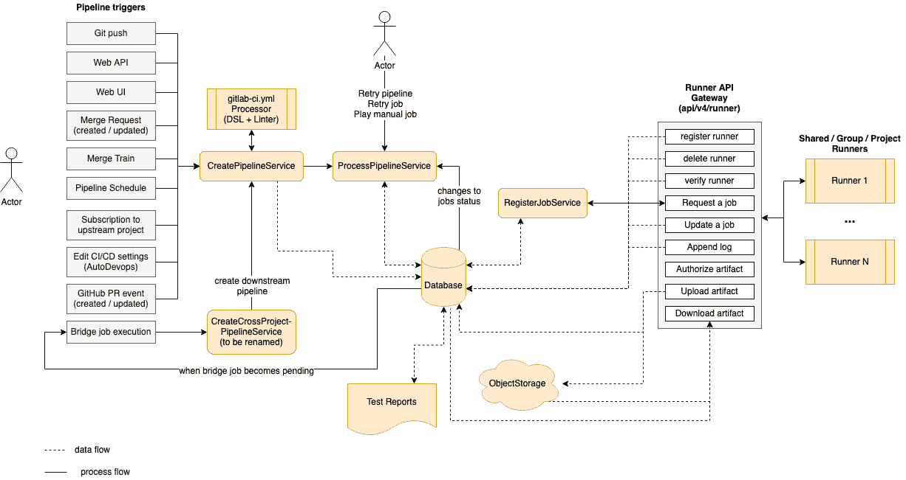

# CI/CD development documentation

> 原文：[https://docs.gitlab.com/ee/development/cicd/](https://docs.gitlab.com/ee/development/cicd/)

*   [CI Architecture overview](#ci-architecture-overview)
*   [Job scheduling](#job-scheduling)
    *   [Communication between Runner and GitLab server](#communication-between-runner-and-gitlab-server)
    *   [`Ci::RegisterJobService`](#ciregisterjobservice)

# CI/CD development documentation

此处列出了特定于 CI / CD 的开发指南.

如果要创建新的 CI / CD 模板，请阅读[GitLab CI / CD 模板的开发指南](templates.html) .

## CI Architecture overview

以下是 CI 体系结构的简化图. 为了集中在主要组件上，省略了一些细节.

在左侧，我们有一些事件可以根据各种事件触发管道（由用户或自动化触发）：

*   `git push`是触发管道的最常见事件.
*   The [Web API](../../api/pipelines.html#create-a-new-pipeline).
*   用户单击 UI 中的"运行管道"按钮.
*   [创建或更新合并请求时](../../ci/merge_request_pipelines/index.html#pipelines-for-merge-requests) .
*   将 MR 添加到[合并列车时](../../ci/merge_request_pipelines/pipelines_for_merged_results/merge_trains/index.html#merge-trains-premium) .
*   A [scheduled pipeline](../../ci/pipelines/schedules.html#pipeline-schedules).
*   当项目被[订阅到上游项目时](../../ci/multi_project_pipelines.html#trigger-a-pipeline-when-an-upstream-project-is-rebuilt) .
*   启用[自动 DevOps 时](../../topics/autodevops/index.html) .
*   当 GitHub 集成用于[外部请求请求时](../../ci/ci_cd_for_external_repos/index.html#pipelines-for-external-pull-requests) .
*   当上游管道包含[桥接作业时](../../ci/yaml/README.html#trigger) ，该[作业](../../ci/yaml/README.html#trigger)会触发下游管道.

触发任何这些事件将调用[`CreatePipelineService`](https://gitlab.com/gitlab-org/gitlab/-/blob/master/app/services/ci/create_pipeline_service.rb) ，后者将输入事件数据并触发用户，然后尝试创建管道.

`CreatePipelineService`很大程度上依赖于[`YAML Processor`](https://gitlab.com/gitlab-org/gitlab/-/blob/master/lib/gitlab/ci/yaml_processor.rb)组件，该组件负责将 YAML Blob 作为输入并返回管道的抽象数据结构（包括阶段和所有作业）. 该组件还可以在处理 YAML 时验证其结构，并返回任何语法或语义错误. 在`YAML Processor`组件中，我们定义了[所有](../../ci/yaml/README.html)可用于构建管道[的关键字](../../ci/yaml/README.html) .

`CreatePipelineService`接收`YAML Processor`返回的抽象数据结构，然后将其转换为持久化模型（管道，阶段，作业等）. 之后，就可以处理管道了. 处理管道意味着按执行顺序（阶段或 DAG）运行作业，直到以下任一情况为止：

*   所有预期的作业均已执行.
*   故障会中断管道执行.

处理管道的组件是[`ProcessPipelineService`](https://gitlab.com/gitlab-org/gitlab/-/blob/master/app/services/ci/process_pipeline_service.rb) ，它负责将所有管道的作业移至完成状态. 创建管道时，其所有作业最初都处于`created`状态. 该服务根据流水线结构查看在`created`阶段可以处理哪些作业. 然后，它们将它们移到`pending`状态，这意味着它们现在[可以被 Runner 拾取](#job-scheduling) . 执行作业后，它可以成功完成或失败. 管道中作业的每个状态转换都会再次触发此服务，该服务会寻找下一个要转换为完成的作业. 在此过程中， `ProcessPipelineService`更新作业，阶段和整个管道的状态.

在图的右侧，我们有一个列表[运动员](../../ci/runners/README.html#configuring-gitlab-runners)连接到 GitLab 实例. 这些可以是共享运行者，组运行者或项目特定的运行者. Runners 与 Rails 服务器之间的通信通过一组 API 端点（称为`Runner API Gateway` .

我们可以注册，删除和验证运行器，这也将导致对数据库的读/写查询. 连接了 Runner 之后，它会继续询问要执行的下一个作业. 这将调用[`RegisterJobService`](https://gitlab.com/gitlab-org/gitlab/blob/master/app/services/ci/register_job_service.rb) ，后者将选择下一个作业并将其分配给 Runner. 此时，作业将转换为`running`状态，由于状态更改，该状态再次触发`ProcessPipelineService` . 有关更多详细信息，请参阅" [作业调度"](#job-scheduling) .

在执行作业时，运行程序将日志以及任何可能需要存储的工件发送回服务器. 此外，作业可能依赖于先前作业中的工件才能运行. 在这种情况下，Runner 将使用专用的 API 端点下载它们.

工件存储在对象存储中，而元数据保留在数据库中. 工件的重要示例是报表（JUnit，SAST，DAST 等），这些报表在合并请求中进行了解析和呈现.

作业状态转换并非全部自动化. 用户可以运行[手动作业](../../ci/yaml/README.html#whenmanual) ，取消管道，重试特定的失败作业或整个管道. 导致作业更改状态的任何事件都将触发`ProcessPipelineService` ，因为它负责跟踪整个管道的状态.

一种特殊类型的作业是[桥接作业](../../ci/yaml/README.html#trigger) ，当过渡到`pending`状态时，该[作业](../../ci/yaml/README.html#trigger)在服务器端执行. 这项工作负责创建下游管道，例如多项目或子管道. 每次触发下游管道时，工作流程循环都将从`CreatePipelineService`重新开始.

## Job scheduling

创建管道时，将为所有阶段一次创建所有作业，初始状态为`created` . 这使得可视化管道的全部内容成为可能.

跑步者将不会看到具有`created`状态的作业. 为了能够将作业分配给 Runner，该作业必须首先转换为`pending`状态，这在以下情况下可能发生：

1.  作业是在管道的第一阶段创建的.
2.  该作业需要手动启动，并且已被触发.
3.  前一阶段的所有作业均已成功完成. 在这种情况下，我们将所有工作从下一阶段过渡到`pending` .
4.  该作业使用`needs:`指定了 DAG 依赖项`needs:`并且所有依赖项都已完成.

连接了 Runner 时，它将通过连续轮询服务器来请求下一个`pending`作业运行.

**注意：** Runner 用于与 GitLab 交互的 API 端点在[`lib/api/runner.rb`](https://gitlab.com/gitlab-org/gitlab/blob/master/lib/api/runner.rb)中定义

服务器收到请求后，将根据[`Ci::RegisterJobService`算法](#ciregisterjobservice)选择`pending`作业，然后将其分配并发送给 Runner.

在当前阶段完成所有作业后，服务器通过将其状态更改为" `pending` "，从下一阶段"解锁"所有作业. 现在，当 Runner 请求新作业时，可以由调度算法选择这些内容，并像这样继续进行，直到完成所有阶段.

### Communication between Runner and GitLab server

使用注册令牌[注册](https://docs.gitlab.com/runner/register/)了 Runner 之后，服务器便知道其可以执行的作业类型. 这取决于：

*   它注册的赛跑者类型为：
    *   共享跑步者
    *   团体赛跑者
    *   项目特定的跑步者
*   任何关联的标签.

跑步者通过请求作业执行`POST /api/v4/jobs/request`来启动通信. 尽管轮询通常每隔几秒钟发生一次，但如果作业队列不变，我们将通过 HTTP 标头利用缓存来减少服务器端的工作量.

该 API 端点运行[`Ci::RegisterJobService`](https://gitlab.com/gitlab-org/gitlab/blob/master/app/services/ci/register_job_service.rb) ，该命令：

1.  从`pending`作业池中选择要运行的下一个作业
2.  分配给跑步者
3.  通过 API 响应将其呈现给 Runner

### `Ci::RegisterJobService`

此服务使用 3 个顶级查询来收集大多数作业，并且根据 Runner 注册到的级别选择它们：

*   选择共享的 Runner（实例级别）的作业
*   选择组级别运行器的作业
*   选择项目亚军的工作

This list of jobs is then filtered further by matching tags between job and Runner tags.

**注意：**如果作业包含标签，则与**所有**标签都不匹配的跑步者将不会选择该作业. 跑步者可能具有比该工作定义的标签更多的标签，但反之则没有.

最后，如果 Runner 仅能选择带标签的作业，则所有未带标签的作业都会被过滤掉.

在这一点上，我们遍历剩余的`pending`作业，然后尝试根据其他策略分配"可以选择" Runner 可以选择的第一个作业. 例如，标记为`protected`运行者只能选择针对受保护的分支（例如生产部署）运行的作业.

当我们增加池中的"奔跑者"数量时，如果将同一工作分配给不同"奔跑者"，也会增加发生冲突的机会. 为防止这种情况，我们会适当地挽救冲突错误并在列表中分配下一个作业.