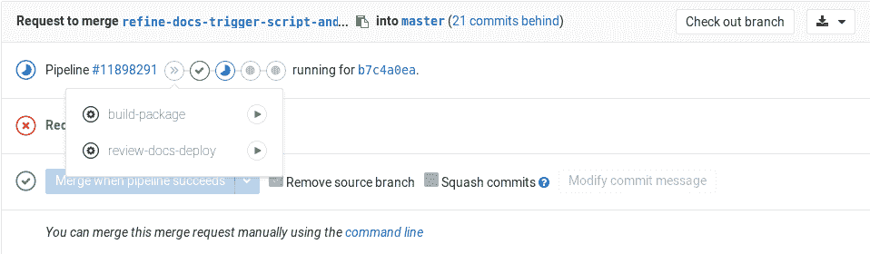

# GitLab Documentation guidelines

> 原文：[https://docs.gitlab.com/ee/development/documentation/](https://docs.gitlab.com/ee/development/documentation/)

*   [Source files and rendered web locations](#source-files-and-rendered-web-locations)
    *   [Branch naming](#branch-naming)
*   [Contributing to docs](#contributing-to-docs)
*   [Markdown and styles](#markdown-and-styles)
*   [Folder structure and files](#folder-structure-and-files)
*   [Metadata](#metadata)
    *   [Stage and group metadata](#stage-and-group-metadata)
    *   [Page type metadata](#page-type-metadata)
    *   [Redirection metadata](#redirection-metadata)
    *   [Comments metadata](#comments-metadata)
    *   [Additional page metadata](#additional-page-metadata)
*   [Changing document location](#changing-document-location)
    *   [Redirections for pages with Disqus comments](#redirections-for-pages-with-disqus-comments)
*   [Merge requests for GitLab documentation](#merge-requests-for-gitlab-documentation)
*   [GitLab `/help`](#gitlab-help)
    *   [Linking to `/help`](#linking-to-help)
    *   [GitLab `/help` tests](#gitlab-help-tests)
*   [Docs site architecture](#docs-site-architecture)
    *   [Global navigation](#global-navigation)
*   [Previewing the changes live](#previewing-the-changes-live)
    *   [Troubleshooting review apps](#troubleshooting-review-apps)
    *   [Technical aspects](#technical-aspects)
*   [Testing](#testing)
    *   [Running tests](#running-tests)
        *   [Nanoc tests](#nanoc-tests)
        *   [Lint checks](#lint-checks)
    *   [Local linters](#local-linters)
        *   [markdownlint](#markdownlint)
        *   [Vale](#vale)
        *   [Install linters](#install-linters)
        *   [Configure editors](#configure-editors)
        *   [Disable Vale tests](#disable-vale-tests)
*   [Danger Bot](#danger-bot)

# GitLab Documentation guidelines[](#gitlab-documentation-guidelines "Permalink")

GitLab 的文档[旨在作为唯一的真实来源（SSOT）](https://about.gitlab.com/handbook/documentation/) ，提供有关如何配置，使用 GitLab 以及对其进行故障排除的信息. 该文档包含按产品领域和主题组织的每个 GitLab 功能的用例和使用说明. 这包括跨多个 GitLab 功能的主题和工作流程，以及将 GitLab 与其他应用程序一起使用.

除了此页面之外，以下资源还可以帮助您编写文档并做出贡献：

*   [样式指南](styleguide.html) -文档，语言指南，要遵循的 Markdown 标准，链接等内容.
*   [结构和模板](structure.html) -了解文档页面的典型部分以及如何编写每一部分.
*   [Documentation process](workflow.html).
*   [Markdown 指南](../../user/markdown.html) -有关 GitLab 支持的所有 Markdown 语法的参考.
*   [网站架构](site_architecture/index.html) -https [://docs.gitlab.com](https://s0docs0gitlab0com.icopy.site)的构建方式.
*   [功能标记的文档](feature_flags.html) -如何编写和更新部署在功能标记后面的 GitLab 功能的文档.

## Source files and rendered web locations[](#source-files-and-rendered-web-locations "Permalink")

有关 GitLab，GitLab Runner，Omnibus GitLab 和 Charts 的文档已发布到[https://docs.gitlab.com](https://s0docs0gitlab0com.icopy.site) . GitLab 的文档也发布在 GitLab 实例域的`/help`内的应用程序中. 在`/help` ，仅包含当前版本和版本的帮助. 有关其他版本的帮助，请访问[https://docs.gitlab.com/archives/](https://docs.gitlab.com/archives/) .

文档的源位于以下仓库位置的每个 GitLab 应用程序的代码库中：

| Project | Path |
| --- | --- |
| [GitLab](https://gitlab.com/gitlab-org/gitlab/) | [`/doc`](https://gitlab.com/gitlab-org/gitlab/tree/master/doc) |
| [GitLab Runner](https://gitlab.com/gitlab-org/gitlab-runner/) | [`/docs`](https://gitlab.com/gitlab-org/gitlab-runner/tree/master/docs) |
| [Omnibus GitLab](https://gitlab.com/gitlab-org/omnibus-gitlab/) | [`/doc`](https://gitlab.com/gitlab-org/omnibus-gitlab/tree/master/doc) |
| [Charts](https://gitlab.com/gitlab-org/charts/gitlab) | [`/doc`](https://gitlab.com/gitlab-org/charts/gitlab/tree/master/doc) |

文档问题和合并请求是它们各自存储库的一部分，都带有标签`Documentation` .

### Branch naming[](#branch-naming "Permalink")

[GitLab 主项目](../pipelines.html)的[CI 管道](../pipelines.html)配置为仅自动运行与贡献类型匹配的作业. 如果您的贡献**仅**包含文档更改，那么将仅运行与文档相关的作业，并且管道的完成将比代码贡献更快.

如果要向 Runner，Omnibus 或 Charts 提交仅文档更改，则不会自动确定快速管道. 相反，请使用以下指南为仅文档合并请求创建分支：

| 分店名称 | 有效的例子 |
| --- | --- |
| 从`docs/`开始 | `docs/update-api-issues` |
| 从`docs-`开始 | `docs-update-api-issues` |
| 以`-docs` | `123-update-api-issues-docs` |

## Contributing to docs[](#contributing-to-docs "Permalink")

整个 GitLab 社区都欢迎[对 GitLab 文档做出贡献](workflow.html) .

为确保 GitLab 文档是最新的，所有[功能更改](feature-change-workflow.html)都有特殊的流程和职责，即影响功能外观，使用或管理的开发工作.

但是，任何人都可以贡献与功能更改无关的[文档改进](improvement-workflow.html) . 例如，添加有关如何完成用例的新文档，这可以通过 GitLab 或第三方工具和 GitLab 完成.

## Markdown and styles[](#markdown-and-styles "Permalink")

[GitLab 文档](https://gitlab.com/gitlab-org/gitlab-docs)使用[GitLab Kramdown](https://gitlab.com/gitlab-org/gitlab_kramdown)作为其 Markdown 渲染引擎. 有关完整的 Kramdown 参考，请参阅《 [GitLab Markdown 指南》](https://about.gitlab.com/handbook/markdown-guide/) .

遵守[文档样式指南](styleguide.html) . 如果缺少样式标准，欢迎您通过合并请求提出建议.

## Folder structure and files[](#folder-structure-and-files "Permalink")

请参阅" [文档样式指南"](styleguide.html)的" [结构"](styleguide.html#structure)部分.

## Metadata[](#metadata "Permalink")

为了提供其他指令或有用的信息，我们将 YAML 格式的元数据添加到每个产品文档页面的开头（YAML 开头）. 所有值均视为字符串，仅用于[docs 网站](site_architecture/index.html) .

### Stage and group metadata[](#stage-and-group-metadata "Permalink")

理想情况下，每个页面都应具有与其所属的阶段和组相关的元数据，以及如下所述的信息块：

*   `stage` ：页面大部分内容所属的[Stage](https://about.gitlab.com/handbook/product/product-categories/#devops-stages) .
*   `group` ：页面大部分内容所属的[Group](https://about.gitlab.com/company/team/structure/#product-groups) .
*   `info` ：下一行，为与该页面的舞台和小组相关的技术作家联系提供指导，以帮助参与者：

    ```
    To determine the technical writer assigned to the Stage/Group
    associated with this page, see
    https://about.gitlab.com/handbook/engineering/ux/technical-writing/#designated-technical-writers 
    ```

例如，以下元数据将位于产品文档页面的开始，其内容主要与"审核事件"功能相关：

```
---
stage: Monitor
group: APM
info: To determine the technical writer assigned to the Stage/Group associated with this page, see https://about.gitlab.com/handbook/engineering/ux/technical-writing/#designated-technical-writers
--- 
```

### Page type metadata[](#page-type-metadata "Permalink")

最初在[此史诗中](https://gitlab.com/groups/gitlab-org/-/epics/1280)讨论过，每个页面应该具有`type`元数据. 可以是以下一项或多项：

*   `index` ：索引/概述页面. 它们充当其他页面的列表. 不一定意味着页面应命名为`index.md` . [示例页面](../../install/README.html) .
*   `concepts` ：使用产品之前需要了解的内容. 信息性的，非指导性的. 例如，抽象的想法，解释含义或收益，支持对任务的理解. 阅读它们以获取背景信息，例如"为什么 X 很重要". [示例页面](../../topics/autodevops/index.html) .
*   `howto` ：特定用例说明. [示例页面](../../ssh/README.html) .
*   `tutorial` ：边做边学过程/概念. [示例页面](../../gitlab-basics/start-using-git.html) .
*   `reference` ：介绍什么是/做什么. 诸如特定设置，没有太多解释的事实之类的东西可以阅读以获取详细信息. [示例页面](../../ci/yaml/README.html) .

### Redirection metadata[](#redirection-metadata "Permalink")

将页面移到另一个位置时，应添加以下元数据：

*   `redirect_to` ：访问者应将移动页面重定向到的相对路径和文件名（扩展名为`.md` ）. [了解更多](#changing-document-location) .
*   `disqus_identifier` ：Disqus 评论系统的标识符. 用于保留已被移至新 URL 的页面的注释. [了解更多](#redirections-for-pages-with-disqus-comments) .

### Comments metadata[](#comments-metadata "Permalink")

[docs 网站](site_architecture/index.html)上默认启用了注释（由 Disqus 提供）. 如果要禁用它们（例如在索引页面中），请将其设置为`false` ：

```
---
comments: false
--- 
```

### Additional page metadata[](#additional-page-metadata "Permalink")

每个页面可以具有其他（可选）元数据（在[default.html](https://gitlab.com/gitlab-org/gitlab-docs/-/blob/fc3577921343173d589dfa43d837b4307e4e620f/layouts/default.html#L30-52) Nanoc 布局中设置），如果定义，这些元数据将显示在页面顶部：

*   `author` ：页面`author`的名称，通常是教程. 它需要`author_gitlab`才能显示.
*   `author_gitlab` ：GitLab.com 上作者的用户名. 它需要`author`才能显示.
*   `date` ：页面的创建日期，通常用于教程.
*   `article_type` ：文章的类型. 可以是`tutorial`或`user guide` .
*   `level` ：操作方法或教程的复杂程度. 可以是`beginner` ， `advanced`或`intermediate` .
*   `last_updated` ：页面上次更新时的 ISO 格式日期. 例如`2020-02-14` .
*   `reading_time` ：如果要添加页面的大概阅读时间的指示，可以将`reading_time`设置为`true` . 这使用简单的[算法](https://gitlab.com/gitlab-org/gitlab-docs/-/blob/master/lib/helpers/reading_time.rb)根据单词数计算阅读时间.

## Changing document location[](#changing-document-location "Permalink")

更改文档的位置需要特定的步骤，以确保用户可以无缝访问新的文档页面，无论他们是通过`/help`还是通过[https://docs.gitlab.com](https://s0docs0gitlab0com.icopy.site)访问 GitLab 实例域上的内容. 如果您在此过程中有任何疑问（例如是否需要搬迁），请务必指派一名技术作家，并确保在合并之前技术作家会对此更改进行审查.

如果确实需要更改文档的位置，请不要删除旧文档，而应将所有内容替换为以下内容：

```
---
redirect_to: '../path/to/file/index.md'
---

This document was moved to [another location](../path/to/file/index.md). 
```

其中`../path/to/file/index.md`通常是旧文档的相对路径.

所述`redirect_to`变量同时支持完整或相对 URL，例如`https://docs.gitlab.com/ee/path/to/file.html` ， `../path/to/file.html` ， `path/to/file.md` . 它确保重定向将对[https://docs.gitlab.com](https://s0docs0gitlab0com.icopy.site)起作用，并且任何`*.md`路径都将编译为`*.html` . 前部事项下方的新行通知用户文档已更改位置，对于从存储库浏览该文件的用户而言非常有用.

例如，如果将`doc/workflow/lfs/index.md`移到`doc/administration/lfs.md` ，则步骤将是：

1.  Copy `doc/workflow/lfs/index.md` to `doc/administration/lfs.md`
2.  将`doc/workflow/lfs/index.md`的内容替换为：

    ```
    ---
    redirect_to: '../../administration/lfs.md'
    ---

    This document was moved to [another location](../../administration/lfs.md). 
    ```

3.  查找并用新位置替换所有出现的旧位置. 查找它们的快速方法是在将文件从以下位置更改的存储库中使用`git grep` ：

    ```
    git grep -n "workflow/lfs/lfs_administration"
    git grep -n "lfs/lfs_administration" 
    ```

**注意：**如果要移动的文档上有任何 Disqus 评论，则要执行的其他步骤[如下所示](#redirections-for-pages-with-disqus-comments) .

注意事项：

*   由于除了文档本身以外，我们还使用内联文档，因此该文档也可能在访问`/help`时将呈现的 GitLab（ `app/` ）视图中引用，有时甚至在测试套件（ `spec/` ）中也会引用. 您必须在这些路径中搜索对文档的引用并进行更新.
*   上面的`git grep`命令将在您在其中运行它的目录中以递归方式搜索`workflow/lfs/lfs_administration`和`lfs/lfs_administration` ，并将打印文件和提及该文件的行. 您可能会问为什么这两次抱怨. 由于[我们使用相对路径链接到文档](styleguide.html#links) ，因此有时更深入地搜索路径可能很有用.
*   当文档链接到 GitLab 的内置帮助页面时，不使用`*.md`扩展名，这就是为什么我们在`git grep`忽略它.
*   使用"更改文档位置" MR 描述模板上的清单.

### Redirections for pages with Disqus comments[](#redirections-for-pages-with-disqus-comments "Permalink")

如果要重定位的文档页面已经包含 Disqus 评论，则我们需要保留 Disqus 线程.

Disqus 使用每页标识符，对于[https://docs.gitlab.com](https://s0docs0gitlab0com.icopy.site) ，页面标识符被配置为页面 URL. 因此，当我们更改文档位置时，我们需要将旧的 URL 保留为相同的 Disqus 标识符.

为此，将变量`disqus_identifier`添加到`disqus_identifier` ，使用旧的 URL 作为值. 例如，假设我们将`https://docs.gitlab.com/my-old-location/README.html`下可用的文档移到了新位置`https://docs.gitlab.com/my-new-location/index.html` .

在**新文档的**开头部分，我们添加了以下内容：

```
---
disqus_identifier: 'https://docs.gitlab.com/my-old-location/README.html'
--- 
```

注：有必要在文件名中`disqus_identifier` URL，即使它`index.html`或`README.html` .

## Merge requests for GitLab documentation[](#merge-requests-for-gitlab-documentation "Permalink")

在开始之前，请确保您已阅读上面的" [为文档做贡献](#contributing-to-docs) "介绍性部分和[文档工作流程](workflow.html) .

*   使用当前的[合并请求描述模板](https://gitlab.com/gitlab-org/gitlab/blob/master/.gitlab/merge_request_templates/Documentation.md)
*   标记 MR `Documentation` （只能由具有`developer`访问权限的`developer` （例如，GitLab 团队成员）完成）
*   在下面的每个注释中分配正确的里程碑（只能由具有`developer`访问权限的人（例如，GitLab 团队成员）完成）

如果对现有内容进行了改进，文档将被合并，这代表了遵循模板和样式标准的真诚努力，并且被认为是准确的.

对于进一步完善文档的进一步需求，应在后续的 MR 或问题中立即解决.

**注意：**如果要添加文档的发行版已经冻结或发行，请使用标签`~"Pick into XY"`将其合并到正确的发行版中. 尽量避免选择过去的发行版，因为这样做会增加发行版管理器的工作量.

## GitLab `/help`[](#gitlab-help "Permalink")

每个 GitLab 实例都包含文档，该文档可从`/help` （ `https://gitlab.example.com/help` ）获得. 例如， [https://gitlab.com/help](https://gitlab.com/help) .

[https://docs.gitlab.com](https://s0docs0gitlab0com.icopy.site)上在线提供的文档每隔四个小时从 GitLab，Omnibus 和 Runner 的`master`分支进行部署. 因此，合并请求合并后，它将在同一天在线可用. 但是，它将在分配给 MR 的里程碑内发货（并在`/help`上可用）.

例如，假设您的合并请求的里程碑设置为 11.3，该里程碑将于 2018-09-22 发布. 如果在 2018-09-15 合并，它将在 2018-09-15 联机提供，但是，随着功能冻结日期的过去，如果 MR 没有`~"Pick into 11.3"`标签，那么该里程碑必须更改为 11.4，并且仅在 2018-10-22 以及 GitLab 11.4 中将与所有 GitLab 软件包一起提供. 这意味着，它将仅在 GitLab 11.4 及更高版本的`/help`下提供，但在合并的同一天在[https://docs.gitlab.com/](https://docs.gitlab.com/)上提供.

### Linking to `/help`[](#linking-to-help "Permalink")

构建新功能时，可能需要从应用程序 GitLab 链接文档. 通常，这是通过`help_page_path` helper 方法在`app/views/`目录内的文件中完成的.

以最简单的形式，用于生成到`/help`页面的链接的 HAML 代码为：

```
= link_to 'Help page', help_page_path('user/permissions') 
```

`help_page_path`使用以下约定包含要链接到的文档的路径：

*   它相对于 GitLab 存储库中的`doc/`目录
*   `.md`扩展名必须省略
*   它不能以斜杠（ `/` ）结尾

以下是根据情况应使用的一些特殊情况. 您可以结合以下一项或多项：

1.  **链接到锚链接.** 使用`anchor`作为`help_page_path`方法的一部分：

    ```
    = link_to 'Help page', help_page_path('user/permissions', anchor: 'anchor-link') 
    ```

2.  **在新标签页中打开链接.** 这应该是默认行为：

    ```
    = link_to 'Help page', help_page_path('user/permissions'), target: '_blank' 
    ```

3.  **链接到圆圈图标.** 通常用于无法使用长描述的设置，例如复选框旁边. 您基本上可以使用任何字体超赞的图标，但更喜欢使用`question-circle` ：

    ```
    = link_to icon('question-circle'), help_page_path('user/permissions') 
    ```

4.  **使用按钮链接.** 在文本与页面布局其余部分脱离上下文的地方很有用：

    ```
    = link_to 'Help page', help_page_path('user/permissions'),  class: 'btn btn-info' 
    ```

5.  **使用内联某些文本的链接.**

    ```
    Description to #{link_to 'Help page', help_page_path('user/permissions')}. 
    ```

6.  **在句子末尾添加句点.** Useful when you don’t want the period to be part of the link:

    ```
    = succeed '.' do
      Learn more in the
      = link_to 'Help page', help_page_path('user/permissions') 
    ```

### GitLab `/help` tests[](#gitlab-help-tests "Permalink")

运行了一些[RSpec 测试](https://gitlab.com/gitlab-org/gitlab/blob/master/spec/features/help_pages_spec.rb)以确保 GitLab 文档能够呈现并正常工作. 特别是，该[主要文档的登录页面](../../README.html)将从`/help`正确运行. 例如， [GitLab.com 的`/help`](https://gitlab.com/help) .

## Docs site architecture[](#docs-site-architecture "Permalink")

请参阅" [文档"网站的体系结构](site_architecture/index.html)页面，以了解我们如何在[https://docs.gitlab.com 上](https://s0docs0gitlab0com.icopy.site)构建和部署该网站，并查看所有正在使用的资产和库.

### Global navigation[](#global-navigation "Permalink")

有关如何构建和更新左侧导航菜单的信息，请参阅[全局导航](site_architecture/global_nav.html)文档.

## Previewing the changes live[](#previewing-the-changes-live "Permalink")

**注意：**要在本地预览对文档的更改，请遵循本[开发指南](https://gitlab.com/gitlab-org/gitlab-docs/blob/master/README.md#development-when-contributing-to-gitlab-documentation)或[GDK 的这些说明](https://gitlab.com/gitlab-org/gitlab-development-kit/blob/master/doc/howto/gitlab_docs.md) .

当前为以下项目启用了实时预览：

*   [`gitlab`](https://gitlab.com/gitlab-org/gitlab)
*   [`gitlab-runner`](https://gitlab.com/gitlab-org/gitlab-runner)

如果您的合并请求中有 docs 更改，则可以使用手动`review-docs-deploy`作业为合并请求部署 docs review 应用. 您将至少需要维护者权限才能运行它.

[](img/manual_build_docs.png)

**注意：**您将需要将分支推送到这些存储库，它不适用于 fork.

`review-docs-deploy*`工作将：

1.  在[`gitlab-docs`](https://gitlab.com/gitlab-org/gitlab-docs)项目中创建一个以该方案命名的新分支： `docs-preview-$DOCS_GITLAB_REPO_SUFFIX-$CI_MERGE_REQUEST_IID` ，其中`DOCS_GITLAB_REPO_SUFFIX`是每个产品的后缀，例如`ee`表示 EE， `omnibus`表示 Omnibus `CI_MERGE_REQUEST_IID` ， `CI_MERGE_REQUEST_IID`等，相应合并请求的 ID.
2.  触发跨项目管道，并使用您的更改构建文档站点.

如果评论应用程序 URL 返回 404，则意味着该站点尚未部署，或者远程管道出了点问题. 给它几分钟，它应该在线显示，否则，您可以从合并请求的作业输出中的链接检查远程管道的状态. 如果管道失败或阻塞，请在`#docs`聊天频道中添加一行.

**提示：**对 GitLab 项目没有合并权限的人（想想贡献者的分支）不能运行手动作业. 在这种情况下，您可以请 GitLab 团队的某人授权为您执行此操作.**注意：**确保始终删除正在处理的合并请求的分支. 如果您不这样做，那么远程 docs 分支也不会被删除，并且承载 Review Apps 的服务器最终将没有磁盘空间.

### Troubleshooting review apps[](#troubleshooting-review-apps "Permalink")

如果评论应用程序 URL 返回 404，请按照以下步骤进行调试：

1.  **您是否遵循了合并请求小部件中的 URL？** 如果是，则检查链接是否与作业输出中的链接相同.
2.  **您是否遵循作业输出中的 URL？** 如果是，则意味着该站点尚未部署或远程管道出了点问题. 给它几分钟，它应该在线显示，否则，您可以从作业输出中的链接检查远程管道的状态. 如果管道失败或阻塞，请在`#docs`聊天频道中添加一行.

### Technical aspects[](#technical-aspects "Permalink")

如果您想了解更深入的细节，这就是实际发生的事情：

1.  您在合并请求中手动运行`review-docs-deploy`作业.
2.  The job runs the [`scripts/trigger-build-docs`](https://gitlab.com/gitlab-org/gitlab/blob/master/scripts/trigger-build-docs) script with the `deploy` flag, which in turn:
    1.  使用您的分支名称并应用以下内容：
        *   `docs-preview-`前缀已添加.
        *   产品信息用于了解评论应用所源自的项目.
        *   添加了合并请求的编号，以便您可以通过`gitlab-docs`分支名称知道其源自的合并请求.
    2.  The remote branch is then created if it doesn’t exist (meaning you can re-run the manual job as many times as you want and this step will be skipped).
    3.  在 docs 项目中触发了新的跨项目管道.
    4.  预览 URL 显示在作业输出和合并请求小部件中. 您还将获得到远程管道的链接.
3.  在 docs 项目中，创建了管道，它[跳过了测试作业](https://gitlab.com/gitlab-org/gitlab-docs/blob/8d5d5c750c602a835614b02f9db42ead1c4b2f5e/.gitlab-ci.yml#L50-55)以减少构建时间.
4.  构建了 docs 网站之后，HTML 文件即作为工件上传.
5.  仅与 docs 项目相关联的特定 Runner，运行 Review App 作业，该作业下载工件，并使用`rsync`将文件传输到 NGINX 为它们提供文件的位置.

The following GitLab features are used among others:

*   [Manual actions](../../ci/yaml/README.html#whenmanual)
*   [Multi project pipelines](../../ci/multi_project_pipeline_graphs.html)
*   [Review Apps](../../ci/review_apps/index.html)
*   [Artifacts](../../ci/yaml/README.html#artifacts)
*   [Specific Runner](../../ci/runners/README.html#prevent-a-specific-runner-from-being-enabled-for-other-projects)
*   [Pipelines for merge requests](../../ci/merge_request_pipelines/index.html)

## Testing[](#testing "Permalink")

我们将文档视为代码，因此在 CI 管道中使用测试来维护文档的标准和质量. 提交带有新文档或更改文档的合并请求时，当前测试在 CI 作业中运行，它们是：

*   [`docs lint`](https://gitlab.com/gitlab-org/gitlab/blob/master/.gitlab/ci/docs.gitlab-ci.yml#L48) ：对 docs 本身的内容运行一些测试：
    *   [`lint-doc.sh`脚本](https://gitlab.com/gitlab-org/gitlab/blob/master/scripts/lint-doc.sh)运行以下检查和操作：
        *   所有 cURL 示例都使用长标记（例如：-- `--header` ，而不是`-H` ）.
        *   `CHANGELOG.md`不包含重复的版本.
        *   `doc/`中没有文件是可执行文件.
        *   没有添加新的`README.md` .
        *   [markdownlint](#markdownlint) .
        *   [谷](#vale)
    *   Nanoc 测试：
        *   [`internal_links`](https://gitlab.com/gitlab-org/gitlab/blob/master/.gitlab/ci/docs.gitlab-ci.yml#L67)检查所有内部链接（例如： `[link](../index.md)` ）是否有效.
        *   [`internal_anchors`](https://gitlab.com/gitlab-org/gitlab/blob/master/.gitlab/ci/docs.gitlab-ci.yml#L69)检查所有内部锚点（例如： `[link](../index.md#internal_anchor)` ）是否有效.

### Running tests[](#running-tests "Permalink")

除了在[本地预览更改](#previewing-the-changes-live)之外，您还可以[在本地](#previewing-the-changes-live)运行所有棉绒检查和 Nanoc 测试.

#### Nanoc tests[](#nanoc-tests "Permalink")

要在本地执行 Nanoc 测试：

1.  导航到[`gitlab-docs`](https://gitlab.com/gitlab-org/gitlab-docs)目录.
2.  Run:

    ```
    # Check for broken internal links
    bundle exec nanoc check internal_links

    # Check for broken external links (might take a lot of time to complete).
    # This test is set to be allowed to fail and is run only in the gitlab-docs project CI
    bundle exec nanoc check internal_anchors 
    ```

#### Lint checks[](#lint-checks "Permalink")

Lint 检查由[`lint-doc.sh`](https://gitlab.com/gitlab-org/gitlab/blob/master/scripts/lint-doc.sh)脚本执行，可以按以下方式执行：

1.  导航到`gitlab`目录.
2.  Run:

    ```
    MD_DOC_PATH=path/to/my_doc.md scripts/lint-doc.sh 
    ```

`MD_DOC_PATH`指向您要运行 lint 检查的文件或目录的位置. 如果完全省略它，它将默认为`doc/`目录. 输出应类似于：

```
=> Linting documents at path /path/to/gitlab as <user>...
=> Checking for cURL short options...
=> Checking for CHANGELOG.md duplicate entries...
=> Checking /path/to/gitlab/doc for executable permissions...
=> Checking for new README.md files...
=> Linting markdown style...
=> Linting prose...
✔ 0 errors, 0 warnings and 0 suggestions in 1 file.
✔ Linting passed 
```

请注意，这要求您要么在计算机上安装了必需的 lint 工具，要么在运行的 Docker 安装中，在这种情况下，将使用预安装了这些工具的映像.

### Local linters[](#local-linters "Permalink")

为了帮助您遵守[文档样式指南](styleguide.html) ，并改善添加到文档中的内容， [请安装文档短绒](#install-linters) ， [并将其与代码编辑器集成](#configure-editors) .

在 GitLab，我们主要使用：

*   [markdownlint](#markdownlint)
*   [Vale](#vale)

#### markdownlint[](#markdownlint "Permalink")

[markdownlint](https://github.com/DavidAnson/markdownlint)检查 Markdown 语法是否遵循[某些规则](https://github.com/DavidAnson/markdownlint/blob/master/doc/Rules.md#rules) ，并由[`docs-lint`测试使用](#testing) .

我们的[文档样式指南](styleguide.html#markdown)和[Markdown 指南](https://about.gitlab.com/handbook/markdown-guide/)详细说明了为 GitLab 文档选择 Markdown 语法时必须进行哪些选择. 该工具有助于发现与这些准则的偏差.

在以下项目中找到 markdownlint 配置：

*   [`gitlab`](https://gitlab.com/gitlab-org/gitlab/blob/master/.markdownlint.json)
*   [`gitlab-runner`](https://gitlab.com/gitlab-org/gitlab-runner/blob/master/.markdownlint.json)
*   [`omnibus-gitlab`](https://gitlab.com/gitlab-org/omnibus-gitlab/blob/master/.markdownlint.json)
*   [`charts`](https://gitlab.com/gitlab-org/charts/gitlab/-/blob/master/.markdownlint.json)
*   [`gitlab-development-kit`](https://gitlab.com/gitlab-org/gitlab-development-kit/-/blob/master/.markdownlint.json)

在构建管道中也使用此配置.

您可以使用 markdownlint：

*   [On the command line](https://github.com/igorshubovych/markdownlint-cli#markdownlint-cli--).
*   [Within a code editor](#configure-editors).

#### Vale[](#vale "Permalink")

[淡水河谷](https://errata-ai.gitbook.io/vale/)是英语的语法，样式和单词用法惯用语. Vale 的配置存储在项目根目录下的[`.vale.ini`](https://gitlab.com/gitlab-org/gitlab/blob/master/.vale.ini)文件中.

Vale 支持创建可扩展多种检查类型的[自定义测试](https://errata-ai.github.io/vale/styles/) ，我们将这些检查存储在项目文档目录的`.linting/vale/styles/gitlab`目录中.

在以下项目中找到 Vale 配置：

*   [`gitlab`](https://gitlab.com/gitlab-org/gitlab/-/tree/master/doc/.vale/gitlab)
*   [`gitlab-runner`](https://gitlab.com/gitlab-org/gitlab-runner/-/tree/master/docs/.vale/gitlab)
*   [`omnibus-gitlab`](https://gitlab.com/gitlab-org/omnibus-gitlab/-/tree/master/doc/.vale/gitlab)
*   [`charts`](https://gitlab.com/gitlab-org/charts/gitlab/-/tree/master/doc/.vale/gitlab)
*   [`gitlab-development-kit`](https://gitlab.com/gitlab-org/gitlab-development-kit/-/tree/master/doc/.vale/gitlab)

在构建管道中也使用此配置.

您可以使用 Vale：

*   [On the command line](https://errata-ai.gitbook.io/vale/getting-started/usage).
*   [Within a code editor](#configure-editors).

#### Install linters[](#install-linters "Permalink")

至少要安装[markdownlint](#markdownlint)和[Vale](#vale)以匹配在构建管道中运行的检查：

1.  使用以下任一方法安装`markdownlint-cli` ：

    *   `npm`:

        ```
        npm install -g markdownlint-cli 
        ```

    *   `yarn`:

        ```
        yarn global add markdownlint-cli 
        ```

        我们建议安装 linting [Docker image](https://gitlab.com/gitlab-org/gitlab-docs/-/blob/master/dockerfiles/Dockerfile.gitlab-docs-lint#L38)文档中当前使用的`markdownlint-cli`版本.

2.  安装[`vale`](https://github.com/errata-ai/vale/releases) . 例如，要使用`brew` for macOS 安装，请运行：

    ```
    brew install vale 
    ```

    We recommend installing the version of Vale currently used in the documentation linting [Docker image](https://gitlab.com/gitlab-org/gitlab-docs/-/blob/master/dockerfiles/Dockerfile.gitlab-docs-lint#L16).

除了在命令行上使用 markdownlint 和 Vale 之外，这些工具还可以[与代码编辑器集成](#configure-editors) .

#### Configure editors[](#configure-editors "Permalink")

要在编辑器中配置 markdownlint，请根据需要安装以下之一：

*   [Sublime Text](https://packagecontrol.io/packages/SublimeLinter-contrib-markdownlint)
*   [Visual Studio Code](https://marketplace.visualstudio.com/items?itemName=DavidAnson.vscode-markdownlint)
*   [Atom](https://atom.io/packages/linter-node-markdownlint)

要在编辑器中配置 Vale，请根据需要安装以下任一程序：

*   Sublime Text [`SublimeLinter-contrib-vale`插件](https://packagecontrol.io/packages/SublimeLinter-contrib-vale)
*   Visual Studio Code [`testthedocs.vale`扩展](https://marketplace.visualstudio.com/items?itemName=testthedocs.vale)

我们不使用[Vale Server](https://errata-ai.github.io/vale/#using-vale-with-a-text-editor-or-another-third-party-application) .

#### Disable Vale tests[](#disable-vale-tests "Permalink")

您可以为文档的任何部分禁用特定的 Vale 棉绒规则或所有 Vale 棉绒规则：

*   要禁用特定规则，添加`<!-- vale gitlab.rulename = NO -->`文本之前标记和`<!-- vale gitlab.rulename = YES -->`后的文字标签，更换`rulename`与[GitLab 样式](https://gitlab.com/gitlab-org/gitlab/-/tree/master/doc/.linting/vale/styles/gitlab)目录中测试的文件名.
*   要禁用所有淡水河谷棉绒规则，请在文本前添加`<!-- vale off -->`淡水`<!-- vale off -->`标签，并在文本后添加`<!-- vale off -->`淡水`<!-- vale on -->`标签.

只要有可能，仅排除有问题的规则和行. 在某些情况下，例如列表项，您可能需要禁用整个列表的绒毛，直到[Vale 问题＃175](https://github.com/errata-ai/vale/issues/175)得到解决.

有关更多信息，请参见[Vale 的文档](https://errata-ai.gitbook.io/vale/getting-started/markup#markup-based-configuration) .

## Danger Bot[](#danger-bot "Permalink")

GitLab 在代码审查中的某些元素上使用了[Danger](https://github.com/danger/danger) . 对于文档在合并请求中的更改，每当对`/doc`下的文件进行更改时，Danger Bot 都会在注释中留下有关文档处理的进一步说明. 这是在 GitLab 存储库中的`Dangerfile`中[/ danger / documentation /下配置的](https://gitlab.com/gitlab-org/gitlab/tree/master/danger/documentation) .