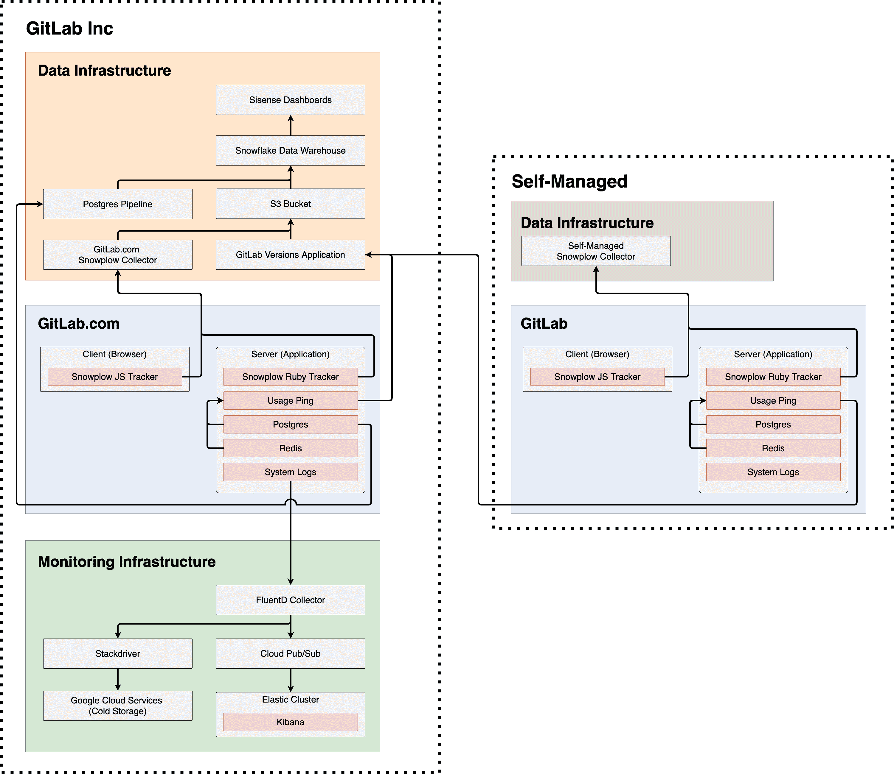

# Telemetry Guide

> 原文：[https://docs.gitlab.com/ee/development/telemetry/](https://docs.gitlab.com/ee/development/telemetry/)

*   [Our tracking tools](#our-tracking-tools)
    *   [Snowplow JS (Frontend)](#snowplow-js-frontend)
    *   [Snowplow Ruby (Backend)](#snowplow-ruby-backend)
    *   [Usage Ping](#usage-ping)
    *   [Database import](#database-import)
    *   [Log system](#log-system)
*   [What data can be tracked](#what-data-can-be-tracked)
    *   [Database counts](#database-counts)
    *   [Pageview events](#pageview-events)
    *   [UI Events](#ui-events)
    *   [CRUD or API events](#crud-or-api-events)
    *   [Event funnels](#event-funnels)
    *   [PostgreSQL data](#postgresql-data)
    *   [Logs](#logs)
    *   [External services](#external-services)
*   [Telemetry systems overview](#telemetry-systems-overview)
    *   [GitLab Inc](#gitlab-inc)
    *   [Self-managed](#self-managed)
    *   [Differences between GitLab Inc and Self-managed](#differences-between-gitlab-inc-and-self-managed)
*   [Snowflake data warehouse](#snowflake-data-warehouse)
    *   [Data sources](#data-sources)

# Telemetry Guide

在 GitLab，我们收集遥测信息，以帮助我们构建更好的 GitLab. 收集有关如何使用 GitLab 的数据，以更好地了解 GitLab 的哪些部分需要改进以及下一步要构建的功能. 遥测还可以帮助我们的团队更好地理解人们使用 GitLab 的原因，并且借助这一知识，我们能够做出更好的产品决策.

我们还鼓励用户启用跟踪功能，并且我们的跟踪方法完全透明，因此可以轻松理解和信任它. 通过启用跟踪，用户可以：

*   回馈更广泛的社区.
*   帮助 GitLab 改进产品.

本文档包含三个指南，概述了 GitLab 的遥测.

遥测指南：

1.  [Our tracking tools](#our-tracking-tools)
2.  [What data can be tracked](#what-data-can-be-tracked)
3.  [Telemetry systems overview](#telemetry-systems-overview)
4.  [Snowflake data warehouse](#snowflake-data-warehouse)

[Usage Ping Guide](usage_ping.html)

1.  [What is Usage Ping](usage_ping.html#what-is-usage-ping)
2.  [Usage Ping payload](usage_ping.html#usage-ping-payload)
3.  [Disable Usage Ping](usage_ping.html#disable-usage-ping)
4.  [Usage Ping request flow](usage_ping.html#usage-ping-request-flow)
5.  [How Usage Ping works](usage_ping.html#how-usage-ping-works)
6.  [Implementing Usage Ping](usage_ping.html#implementing-usage-ping)
7.  [Developing and testing Usage Ping](usage_ping.html#developing-and-testing-usage-ping)

[Snowplow Guide](snowplow.html)

1.  [What is Snowplow](snowplow.html#what-is-snowplow)
2.  [Snowplow schema](snowplow.html#snowplow-schema)
3.  [Enabling Snowplow](snowplow.html#enabling-snowplow)
4.  [Snowplow request flow](snowplow.html#snowplow-request-flow)
5.  [Implementing Snowplow JS (Frontend) tracking](snowplow.html#implementing-snowplow-js-frontend-tracking)
6.  [Implementing Snowplow Ruby (Backend) tracking](snowplow.html#implementing-snowplow-ruby-backend-tracking)
7.  [Developing and testing Snowplow](snowplow.html#developing-and-testing-snowplow)

更有用的链接：

*   [Telemetry Direction](https://about.gitlab.com/direction/telemetry/)
*   [Data Analysis Process](https://about.gitlab.com/handbook/business-ops/data-team/#data-analysis-process/)
*   [Data for Product Managers](https://about.gitlab.com/handbook/business-ops/data-team/programs/data-for-product-managers/)
*   [Data Infrastructure](https://about.gitlab.com/handbook/business-ops/data-team/platform/infrastructure/)

## Our tracking tools

我们使用几种不同的技术来收集产品使用数据.

### Snowplow JS (Frontend)

Snowplow 是企业级营销和产品分析平台，可帮助跟踪用户与我们的网站和应用程序互动的方式. [Snowplow JS](https://github.com/snowplow/snowplow/wiki/javascript-tracker)是客户端事件的前端跟踪器.

### Snowplow Ruby (Backend)

Snowplow 是企业级营销和产品分析平台，可帮助跟踪用户与我们的网站和应用程序互动的方式. [Snowplow Ruby](https://github.com/snowplow/snowplow/wiki/ruby-tracker)是服务器端事件的后端跟踪器.

### Usage Ping

用法 Ping 是 GitLab Inc 收集 GitLab 实例上的用法数据的一种方法. 用法 Ping 主要由实例数据库中不同表的行数组成. 通过逐月比较这些计数（或逐周比较），我们可以大致了解实例如何使用产品中的不同功能. 这些高级数据用于帮助我们的产品，支持和销售团队.

有关更多详细信息，请阅读《 [用法](usage_ping.html)说明》指南.

### Database import

数据库导入是将数据完全导入到 GitLab 的数据仓库中. 对于 GitLab.com，每 6 小时将 PostgreSQL 数据库加载到 Snowflake 数据仓库中. 有关更多详细信息，请参见[数据团队手册](https://about.gitlab.com/handbook/business-ops/data-team/platform/#extract-and-load) .

### Log system

系统日志是通过运行 GitLab Rails 应用程序生成的应用程序日志. 有关更多详细信息，请参阅[日志系统](../../administration/logs.html)和[日志记录基础结构](https://gitlab.com/gitlab-com/runbooks/tree/master/logging/doc#logging-infrastructure-overview) .

## What data can be tracked

我们不同的跟踪工具使我们能够跟踪不同类型的事件. 下面概述了事件类型和可以跟踪哪些数据的示例.

| 事件类型 | 扫雪机 JS（前端） | 扫雪机 Ruby（后端） | 使用情况 | 数据库导入 | 日志系统 |
| --- | --- | --- | --- | --- | --- |
| 数据库计数 |  |  |  |  |  |
| 浏览量事件 |  |  |  |  |  |
| UI 事件 |  |  |  |  |  |
| CRUD 和 API 事件 |  |  |  |  |  |
| 活动渠道 |  |  |  |  |  |
| PostgreSQL 数据 |  |  |  |  |  |
| Logs |  |  |  |  |  |
| 外部服务 |  |  |  |  |  |

### Database counts

*   唯一用户创建的项目数
*   Number of users logged in the past 28 day

数据库计数是实例数据库中不同表的行计数. 这些是经过过滤，分组或聚合的 SQL 计数查询，可提供高级使用情况数据. 可用表的完整列表可以在[structure.sql 中](https://gitlab.com/gitlab-org/gitlab/-/blob/master/db/structure.sql)找到.

### Pageview events

*   访问/ dashboard / groups 页面的会话数

### UI Events

*   单击按钮或链接的会话数
*   关闭模式的会话数

UI 事件是浏览器中任何界面驱动的动作，包括点击数据.

### CRUD or API events

*   Git 推送次数
*   GraphQL 查询数
*   对 Rails 操作或控制器的请求数

这些是后端事件，包括记录的创建，读取，更新，删除以及其他可能从界面中可用层以外的层触发的事件.

### Event funnels

*   依次执行操作 A，B 和 C 的会话数
*   从步骤 A 到步骤 B 的转化率

### PostgreSQL data

这些是原始数据库记录，可使用 Sisense 等商业智能工具进行浏览. 可用表的完整列表可以在[structure.sql 中](https://gitlab.com/gitlab-org/gitlab/-/blob/master/db/structure.sql)找到.

### Logs

这些是原始日志，例如[生产日志](../../administration/logs.html#production_jsonlog) ， [API 日志](../../administration/logs.html#api_jsonlog)或[Sidekiq 日志](../../administration/logs.html#sidekiqlog) . 有关更多详细信息，请参见[日志记录基础结构概述](https://gitlab.com/gitlab-com/runbooks/tree/master/logging/doc#logging-infrastructure-overview) .

### External services

这些是 GitLab 实例与之交互的外部服务，例如[外部存储提供程序](../../administration/static_objects_external_storage.html)或[外部容器注册表](../../administration/packages/container_registry.html#use-an-external-container-registry-with-gitlab-as-an-auth-endpoint) . 这些服务必须能够将数据发送回 GitLab 实例，以便跟踪数据.

## Telemetry systems overview

系统概述是一个简化的图，显示了 GitLab Inc 与自我管理实例之间的交互.

[Source file](https://app.diagrams.net/#G13DVpN-XnhWGz9tqReIj8pp1UE4ehk_EC)

### GitLab Inc

为了进行遥测，GitLab Inc 具有三个主要组件：

1.  [数据基础架构](https://about.gitlab.com/handbook/business-ops/data-team/platform/infrastructure/) ：包含我们数据团队管理的所有内容，包括用于可视化的 Sisense 仪表板，用于数据仓库的 Snowflake，传入数据源（例如 PostgreSQL Pipeline 和 S3 Bucket）以及最后是数据收集器[GitLab.com 的 Snowplow Collector](https://about.gitlab.com/handbook/engineering/infrastructure/library/snowplow/)和 GitLab 的 Versions 应用程序.
2.  GitLab.com：这是生产的 GitLab 应用程序，由客户端和服务器组成. 在客户端或浏览器端，使用 Snowplow JS 跟踪器（前端）来跟踪客户端事件. 在服务器或应用程序端，使用 Snowplow Ruby 跟踪器（后端）来跟踪服务器端事件. 该服务器还包含使用率 Ping，它利用 PostgreSQL 数据库和 Redis 内存数据存储来报告使用率数据. 最后，服务器还包含通过运行 GitLab 应用程序生成的系统日志.
3.  [监视基础结构](https://about.gitlab.com/handbook/engineering/monitoring/) ：这是用于确保 GitLab.com 正常运行的基础结构. 系统日志从 GitLab.com 发送到我们的监视基础结构，并由 FluentD 收集器收集. 从 FluentD，日志可以通过 Stackdriver 发送到长期的 Google Cloud Services 冷存储，或者通过 Cloud Pub / Sub 发送到我们的 Elastic Cluster，可以使用 Kibana 进行实时浏览.

### Self-managed

出于遥测目的，自我管理实例具有两个主要组成部分：

1.  数据基础结构：在自助式实例上，设置数据基础结构是可选的. 如果您想为自己管理的实例收集 Snowplow 跟踪事件，则可以设置自己的自我管理 Snowplow 收集器，并将 Snowplow 事件配置为指向自己的收集器.
2.  GitLab：一个自我管理的 GitLab 实例包含与上述 GitLab.com 相同的所有组件.

### Differences between GitLab Inc and Self-managed

如橙色线所示，在 GitLab.com 上，Snowplow JS，Snowplow Ruby，Using Ping 和 PostgreSQL 数据库将所有流导入到 GitLab Inc 的数据基础结构中. 但是，在自我管理上，只有 Usage Ping 流入 GitLab Inc 的数据基础架构.

如绿线所示，在 GitLab.com 上的系统日志流进入 GitLab Inc 的监视基础结构. 在自我管理下，没有日志发送到 GitLab Inc 的监视基础结构.

GitLab.com 和自我管理之间的区别总结如下：

| Environment | 扫雪机 JS（前端） | 扫雪机 Ruby（后端） | 使用情况 | 数据库导入 | 日志系统 |
| --- | --- | --- | --- | --- | --- |
| GitLab.com |  |  |  |  |  |
| Self-Managed | (1) | (1) |  |  |  |

注意（1）：Snowplow JS 和 Snowplow Ruby 在自我管理上可用，但是，Snowplow Collector 端点设置为 GitLab Inc 无法访问的自我管理 Snowplow Collector.

## Snowflake data warehouse

Snowflake 数据仓库是我们保存 GitLab Inc 所有数据的地方.

### Data sources

Snowflake 和 Sisense 中有多个数据源可用，每个数据源代表沿转换管道的数据的不同视图.

| Source | Description | Access |
| --- | --- | --- |
| raw | 这些表是原始数据源 | Access via Snowflake |
| analytics_staging | 这些表几乎没有经过任何数据转换，这意味着它们基本上是原始数据源的克隆. | 通过雪花或 Sisense 访问 |
| analytics | 这些表通常经历了更多的数据转换. 它们通常以`_xf`以表示它们已转换的事实 | 通过雪花或 Sisense 访问 |

如果您是对原始数据感兴趣的产品经理，则可能会关注于`analytics`和`analytics_staging`源. 原始资源仅限于数据和基础架构团队. 有关更多信息，请参阅[产品经理数据：analytics_staging 和 analytics 之间有什么区别？](https://about.gitlab.com/handbook/business-ops/data-team/programs/data-for-product-managers/#whats-the-difference-between-analytics_staging-and-analytics)