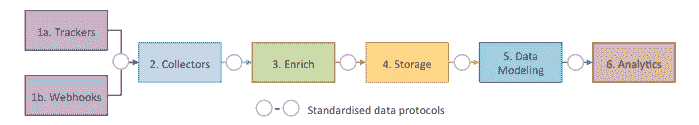

# Snowplow Guide

> 原文：[https://docs.gitlab.com/ee/development/telemetry/snowplow.html](https://docs.gitlab.com/ee/development/telemetry/snowplow.html)

*   [What is Snowplow](#what-is-snowplow)
*   [Snowplow schema](#snowplow-schema)
*   [Enabling Snowplow](#enabling-snowplow)
*   [Snowplow request flow](#snowplow-request-flow)
*   [Implementing Snowplow JS (Frontend) tracking](#implementing-snowplow-js-frontend-tracking)
    *   [Tracking in HAML (or Vue Templates)](#tracking-in-haml-or-vue-templates)
    *   [Tracking within Vue components](#tracking-within-vue-components)
    *   [Tracking in raw JavaScript](#tracking-in-raw-javascript)
    *   [Tests and test helpers](#tests-and-test-helpers)
*   [Implementing Snowplow Ruby (Backend) tracking](#implementing-snowplow-ruby-backend-tracking)
    *   [Performance](#performance)
*   [Developing and testing Snowplow](#developing-and-testing-snowplow)
    *   [Snowplow Analytics Debugger Chrome Extension](#snowplow-analytics-debugger-chrome-extension)
    *   [Snowplow Inspector Chrome Extension](#snowplow-inspector-chrome-extension)
    *   [Snowplow Micro](#snowplow-micro)
    *   [Snowplow Mini](#snowplow-mini)

# Snowplow Guide[](#snowplow-guide "Permalink")

本指南概述了 Snowplow 的工作原理以及实施细节.

有关遥测的更多信息，请参见：

*   [Telemetry Guide](index.html)
*   [Usage Ping Guide](usage_ping.html)

更有用的链接：

*   [Telemetry Direction](https://about.gitlab.com/direction/telemetry/)
*   [Data Analysis Process](https://about.gitlab.com/handbook/business-ops/data-team/#data-analysis-process/)
*   [Data for Product Managers](https://about.gitlab.com/handbook/business-ops/data-team/programs/data-for-product-managers/)
*   [Data Infrastructure](https://about.gitlab.com/handbook/business-ops/data-team/platform/infrastructure/)

## What is Snowplow[](#what-is-snowplow "Permalink")

Snowplow 是企业级营销和产品分析平台，可帮助跟踪用户与我们的网站和应用程序互动的方式.

[扫雪机](https://github.com/snowplow/snowplow)由以下松耦合子系统组成：

*   **Trackers** fire Snowplow events. Snowplow has 12 trackers, covering web, mobile, desktop, server, and IoT.
*   **收集器**从跟踪**器**接收 Snowplow 事件. 我们有三个不同的事件收集器，可将事件同步到 Amazon S3，Apache Kafka 或 Amazon Kinesis.
*   **Enrich**清理原始的 Snowplow 事件，丰富它们并将其存储. 我们有一个基于 Hadoop 的扩充流程，以及一个基于 Kinesis 或基于 Kafka 的流程.
*   扫雪机事件所在的位置是**存储** . 我们将 Snowplow 事件存储在 S3 上的平面文件结构中以及 Redshift 和 PostgreSQL 数据库中.
*   **数据建模**是将事件级别的数据与其他数据集合并在一起，并聚合为较小的数据集，然后应用业务逻辑. 这将产生一组干净的表，从而使对数据的分析更加容易. 我们有 Redshift 和 Looker 的数据模型.
*   在 Snowplow 事件或汇总表上执行**分析** .

[](../img/snowplow_flow.png)

## Snowplow schema[](#snowplow-schema "Permalink")

我们有 Snowplow 模式的许多定义. 我们有一个积极的问题要[对此模式](https://gitlab.com/gitlab-org/gitlab/-/issues/207930)进行[标准化，](https://gitlab.com/gitlab-org/gitlab/-/issues/207930)包括以下定义：

*   前端和后端分类法如下所示
*   [Feature instrumentation taxonomy](https://about.gitlab.com/handbook/product/product-processes/#taxonomy)
*   [Self describing events](https://github.com/snowplow/snowplow/wiki/Custom-events#self-describing-events)
*   [Iglu schema](https://gitlab.com/gitlab-org/iglu/)
*   [Snowplow authored events](https://github.com/snowplow/snowplow/wiki/Snowplow-authored-events)

## Enabling Snowplow[](#enabling-snowplow "Permalink")

可以在以下位置启用跟踪：

*   实例级别，可以在前端层和后端层上进行跟踪.
*   用户级别，尽管可以按用户禁用用户跟踪. GitLab 跟踪遵循["不跟踪"](https://www.eff.org/issues/do-not-track)标准，因此不会在用户级别跟踪浏览器中启用了"不跟踪"选项的任何用户.

我们将 Snowplow 用作大多数跟踪策略，并且已在 GitLab.com 上启用了它. 在自我管理的实例上，可以通过导航到以下地址来启用 Snowplow：

*   用户界面中的**管理区域>设置>集成** .
*   浏览器中的`admin/application_settings/integrations` .

需要以下配置：

| Name | Value |
| --- | --- |
| Collector | `snowplow.trx.gitlab.net` |
| Site ID | `gitlab` |
| Cookie 域 | `.gitlab.com` |

## Snowplow request flow[](#snowplow-request-flow "Permalink")

下面的示例显示以下组件之间的基本请求/响应流：

*   GitLab.com 上的 Snowplow JS / Ruby Trackers
*   [GitLab.com Snowplow Collector](https://gitlab.com/gitlab-com/gl-infra/readiness/-/blob/master/library/snowplow/index.md)
*   亚搏体育 app 的 S3 桶
*   GitLab 的 Snowflake 数据仓库
*   Sisense:

sequenceDiagram 参与者 Snowplow JS（前端）参与者 Snowplow Ruby（后端）参与者 GitLab.com Snowplow Collector 参与者 S3 Bucket 参与者 Snowflake DW 参与者 Sisense Dashboards Snowplow JS（前端）->> GitLab.com Snowplow Collector：FE 跟踪事件 Snowplow Ruby（后端） ->> GitLab.com Snowplow 收集器：使用 Kinesis Stream 跟踪事件循环过程 GitLab.com Snowplow 收集器->> GitLab.com Snowplow 收集器：记录原始事件 GitLab.com Snowplow 收集器->> GitLab.com Snowplow 收集器：丰富事件 GitLab.com 扫雪机-> GitLab.com 扫雪机：写入磁盘端 GitLab.com 扫雪机->> S3 桶：K​​inesis Firehose S3 桶->>雪花 DW：导入数据 Snowflake DW->> Snowflake DW：转换 dbt Snowflake DW->> Sisense 仪表盘获取数据：可用于查询的数据

## Implementing Snowplow JS (Frontend) tracking[](#implementing-snowplow-js-frontend-tracking "Permalink")

GitLab 提供了`Tracking` ，该接口包装了[Snowplow JavaScript Tracker](https://github.com/snowplow/snowplow/wiki/javascript-tracker)以跟踪自定义事件. 有几种利用跟踪的方法，但是每种方法通常至少需要一个`category`和一个`action` . 可以提供符合我们[功能仪表分类法的](https://about.gitlab.com/handbook/product/product-processes/#taxonomy)其他数据.

| field | type | 默认值 | description |
| --- | --- | --- | --- |
| `category` | string | document.body.dataset.page | 在其中捕获事件的页面或页面的子部分. |
| `action` | string | ‘generic’ | 用户正在采取的行动. 单击应该是`click` ，应该`activate` ，因此，例如，聚焦表单字段将是`activate_form_input` ，单击按钮将是`click_button` . |
| `data` | object | {} | 如[我们的功能仪表分类法中](https://about.gitlab.com/handbook/product/product-processes/#taxonomy)所述的其他数据，例如`label` ， `property` ， `value`和`context` . |

### Tracking in HAML (or Vue Templates)[](#tracking-in-haml-or-vue-templates "Permalink")

在 HAML（或 Vue 模板）中工作时，我们可以向感兴趣的元素添加`data-track-*`属性. 具有`data-track-event`属性的所有元素都会自动对点击绑定事件跟踪.

以下是分配给按钮的`data-track-*`属性的示例：

```
%button.btn{ data: { track: { event: "click_button", label: "template_preview", property: "my-template" } } } 
```

```
<button class="btn"
  data-track-event="click_button"
  data-track-label="template_preview"
  data-track-property="my-template"
/> 
```

事件侦听器在文档级别绑定，以处理具有这些数据属性的元素上或元素内的单击事件. 这样可以在重新渲染和更改 DOM 时正确处理它们. 请注意，由于绑定了这些事件的方式，不应阻止 click 事件传播 DOM 树. 如果出于某种原因阻止了点击事件的传播，则需要实现自己的侦听器，并按照[原始 JavaScript](#tracking-in-raw-javascript)中的[跟踪中](#tracking-in-raw-javascript)的说明进行操作.

Below is a list of supported `data-track-*` attributes:

| attribute | required | description |
| --- | --- | --- |
| `data-track-event` | true | 用户正在采取的行动. 点击次数必须预先考虑`click`并激活必须预先考虑`activate` . 例如，聚焦表单字段将是`activate_form_input` ，单击按钮将是`click_button` . |
| `data-track-label` | false | 如[我们的功能仪表分类中](https://about.gitlab.com/handbook/product/product-processes/#taxonomy)所述的`label` . |
| `data-track-property` | false | 如[我们的功能仪表分类中](https://about.gitlab.com/handbook/product/product-processes/#taxonomy)所述的`property` . |
| `data-track-value` | false | [我们的功能仪表分类法中](https://about.gitlab.com/handbook/product/product-processes/#taxonomy)描述的`value` . 如果省略，则为元素的`value`属性或空字符串. 对于复选框，默认值为元素的选中属性，否则为`false` . |
| `data-track-context` | false | [我们的功能仪表分类法中](https://about.gitlab.com/handbook/product/product-processes/#taxonomy)描述的`context` . |

### Tracking within Vue components[](#tracking-within-vue-components "Permalink")

如果需要更复杂的跟踪，可以在组件中使用跟踪 Vue mixin. 要使用它，请首先导入`Tracking`库并请求一个混合.

```
import Tracking from '~/tracking';
const trackingMixin = Tracking.mixin({ label: 'right_sidebar' }); 
```

您可以提供在组件中跟踪事件时都会传递的默认选项. 例如，如果应使用给定`label`跟踪组件中的所有事件，则此时可以提供一个. 可用的默认值是`category` ， `label` ， `property`和`value` . 如果未指定类别，则将`document.body.dataset.page`用作默认值.

然后，您可以通过`mixin` Vue 声明在组件中正常使用 mixin. mixin 还提供了在`data`或`computed`指定跟踪选项的`data` . 这些将覆盖所有默认值，并允许这些值从 props 或基于状态是动态的.

```
export default {
  mixins: [trackingMixin],
  // ...[component implementation]...
  data() {
    return {
      expanded: false,
      tracking: {
        label: 'left_sidebar'
      }
    };
  },
} 
```

mixin 提供了可以在模板中或从组件方法中调用的`track`方法. 整个实现的示例可能如下所示.

```
export default {
  mixins: [Tracking.mixin({ label: 'right_sidebar' })],
  data() {
    return {
      expanded: false,
    };
  },
  methods: {
    toggle() {
      this.expanded = !this.expanded;
      this.track('click_toggle', { value: this.expanded })
    }
  }
}; 
```

而且，如果需要模板中的内容，也可以直接使用`track`方法.

```
<template>
  <div>
    <a class="toggle" @click.prevent="toggle">Toggle</a>
    <div v-if="expanded">
      <p>Hello world!</p>
      <a @click.prevent="track('click_action')">Track an event</a>
    </div>
  </div>
</template> 
```

### Tracking in raw JavaScript[](#tracking-in-raw-javascript "Permalink")

可以通过直接调用`Tracking.event`静态函数来添加自定义事件跟踪和检测. 下面的示例演示如何通过手动调用`Tracking.event`按钮的单击.

```
import Tracking from '~/tracking';

const button = document.getElementById('create_from_template_button');
button.addEventListener('click', () => {
  Tracking.event('dashboard:projects:index', 'click_button', {
    label: 'create_from_template',
    property: 'template_preview',
    value: 'rails',
  });
}) 
```

### Tests and test helpers[](#tests-and-test-helpers "Permalink")

在 Jest 中，尤其是在 Vue 测试中，可以使用以下命令：

```
import { mockTracking } from 'helpers/tracking_helper';

describe('MyTracking', () => {
  let spy;

  beforeEach(() => {
    spy = mockTracking('_category_', wrapper.element, jest.spyOn);
  });

  it('tracks an event when clicked on feedback', () => {
    wrapper.find('.discover-feedback-icon').trigger('click');

    expect(spy).toHaveBeenCalledWith('_category_', 'click_button', {
      label: 'security-discover-feedback-cta',
      property: '0',
    });
  });
}); 
```

在过时的 Karma 测试中，其用法如下：

```
import { mockTracking, triggerEvent } from 'spec/helpers/tracking_helper';

describe('my component', () => {
  let trackingSpy;

  beforeEach(() => {
    trackingSpy = mockTracking('_category_', vm.$el, spyOn);
  });

  const triggerEvent = () => {
    // action which should trigger a event
  };

  it('tracks an event when toggled', () => {
    expect(trackingSpy).not.toHaveBeenCalled();

    triggerEvent('a.toggle');

    expect(trackingSpy).toHaveBeenCalledWith('_category_', 'click_edit_button', {
      label: 'right_sidebar',
      property: 'confidentiality',
    });
  });
}); 
```

## Implementing Snowplow Ruby (Backend) tracking[](#implementing-snowplow-ruby-backend-tracking "Permalink")

GitLab 提供`Gitlab::Tracking` ，该接口包装[Snowplow Ruby Tracker](https://github.com/snowplow/snowplow/wiki/ruby-tracker)以跟踪自定义事件.

可以通过直接调用`GitLab::Tracking.event`类方法来添加自定义事件跟踪和检测，该方法接受以下参数：

| argument | type | 默认值 | description |
| --- | --- | --- | --- |
| `category` | string | ‘application’ | 应用程序的区域或方面. 例如，这可以是`HealthCheckController`或`Lfs::FileTransformer` . |
| `action` | string | ‘generic’ | 正在执行的操作，可以是从控制器操作（如`create`到 Active Record 回调之类的任何内容. |
| `data` | object | {} | 如[我们的功能仪表分类法中](https://about.gitlab.com/handbook/product/feature-instrumentation/#taxonomy)所述的其他数据，例如`label` ， `property` ， `value`和`context` . 如果不提供，则将它们设置为空字符串. |

跟踪既可以看作是跟踪用户的行为，也可以用于检测和监视代码区域或方面随时间变化的性能.

例如：

```
class Projects::CreateService < BaseService
  def execute
    project = Project.create(params)

    Gitlab::Tracking.event('Projects::CreateService', 'create_project',
      label: project.errors.full_messages.to_sentence,
      value: project.valid?
    )
  end
end 
```

### Performance[](#performance "Permalink")

跟踪事件时，我们使用[AsyncEmitter](https://github.com/snowplow/snowplow/wiki/Ruby-Tracker#52-the-asyncemitter-class) ，它允许在后台线程中运行检测调用. 这仍然是一个活跃的发展领域.

## Developing and testing Snowplow[](#developing-and-testing-snowplow "Permalink")

有几种工具可以开发和测试 Snowplow Event

| 测试工具 | 前端追踪 | 后端追踪 | 当地发展环境 | 生产环境 |
| --- | --- | --- | --- | --- |
| Snowplow Analytics 调试器 Chrome 扩展 |  |  |  |  |
| Snowplow Inspector Chrome 扩展程序 |  |  |  |  |
| 扫雪机 |  |  |  |  |
| 扫雪机 Mini |  |  |  |  |

### Snowplow Analytics Debugger Chrome Extension[](#snowplow-analytics-debugger-chrome-extension "Permalink")

Snowplow Analytics Debugger 是用于测试前端事件的浏览器扩展. 这适用于生产，暂存和本地开发环境.

1.  安装[Snowplow Analytics Debugger](https://chrome.google.com/webstore/detail/snowplow-analytics-debugg/jbnlcgeengmijcghameodeaenefieedm) Chrome 浏览器扩展程序.
2.  将 Chrome DevTools 打开到 Snowplow Analytics 调试器选项卡.
3.  在[Igloo Analytics 上](https://www.iglooanalytics.com/blog/snowplow-analytics-debugger-chrome-extension.html)了解更多信息.

### Snowplow Inspector Chrome Extension[](#snowplow-inspector-chrome-extension "Permalink")

Snowplow Inspector Chrome 扩展程序是用于测试前端事件的浏览器扩展程序. 这适用于生产，暂存和本地开发环境.

1.  Install [Snowplow Inspector](https://chrome.google.com/webstore/detail/snowplow-inspector/maplkdomeamdlngconidoefjpogkmljm?hl=en).
2.  按下地址栏旁边的 Snowplow Inspector 图标，打开 Chrome 扩展程序.
3.  单击带有 Snowplow 的网页，您应该会在检查器窗口中看到触发 JavaScript 事件.

### Snowplow Micro[](#snowplow-micro "Permalink")

Snowplow Micro 是完整 Snowplow 数据收集管道的非常小版本：足够小，可以由测试套件启动. 就像完整的 Snowplow 管道一样，事件可以记录到 Snowplow Micro 中. Micro 然后公开了可以查询的 API.

Snowplow Micro 是基于 Docker 的解决方案，用于在本地开发环境中测试前端和后端事件. 您需要按照以下说明修改 GDK 进行设置.

*   Read [Introducing Snowplow Micro](https://snowplowanalytics.com/blog/2019/07/17/introducing-snowplow-micro/)
*   查看[Snowplow Micro 存储库](https://github.com/snowplow-incubator/snowplow-micro)
*   观看我们的[安装指南记录](https://www.youtube.com/watch?v=OX46fo_A0Ag)

1.  Install [Snowplow Micro](https://github.com/snowplow-incubator/snowplow-micro):

    ```
    docker run --mount type=bind,source=$(pwd)/example,destination=/config -p 9090:9090 snowplow/snowplow-micro:latest --collector-config /config/micro.conf --iglu /config/iglu.json 
    ```

2.  通过克隆[此项目中](https://gitlab.com/a_akgun/snowplow-micro)的设置来安装 Snowplow micro：

    ```
    git clone git@gitlab.com:a_akgun/snowplow-micro.git
    ./snowplow-micro.sh 
    ```

3.  在 SQL 中更新端口以设置`9090` ：

    ```
    gdk psql -d gitlabhq_development
    update application_settings set snowplow_collector_hostname='localhost:9090', snowplow_enabled=true, snowplow_cookie_domain='.gitlab.com'; 
    ```

4.  Update `app/assets/javascripts/tracking.js` to [remove this line](https://gitlab.com/snippets/1918635):

    ```
    forceSecureTracker: true 
    ```

5.  Update `lib/gitlab/tracking.rb` to [add these lines](https://gitlab.com/snippets/1918635):

    ```
    protocol: 'http',
    port: 9090, 
    ```

6.  Update `lib/gitlab/tracking.rb` to [change async emitter from https to http](https://gitlab.com/snippets/1918635):

    ```
    SnowplowTracker::AsyncEmitter.new(Gitlab::CurrentSettings.snowplow_collector_hostname, protocol: 'http'), 
    ```

7.  在管理区域 Settings :: Integrations :: Snowplow 中启用 Snowplow，以指向： `http://localhost:3000/admin/application_settings/integrations#js-snowplow-settings` .

8.  重新启动 GDK：

    ```
    `gdk restart` 
    ```

9.  从 Rails 控制台发送测试 Snowplow 事件：

    ```
    Gitlab::Tracking.self_describing_event('iglu:com.gitlab/pageview_context/jsonschema/1-0-0', { page_type: ‘MY_TYPE' }, context: nil ) 
    ```

### Snowplow Mini[](#snowplow-mini "Permalink")

[Snowplow Mini](https://github.com/snowplow/snowplow-mini)是[Snowplow](https://github.com/snowplow/snowplow-mini)的易于部署的单实例版本.

Snowplow Mini 可用于在生产，暂存和本地开发环境上测试前端和后端事件.

对于 GitLab.com，我们正在使用 Snowplow Mini 设置[质量检查和测试环境](https://gitlab.com/gitlab-org/telemetry/-/issues/266) .