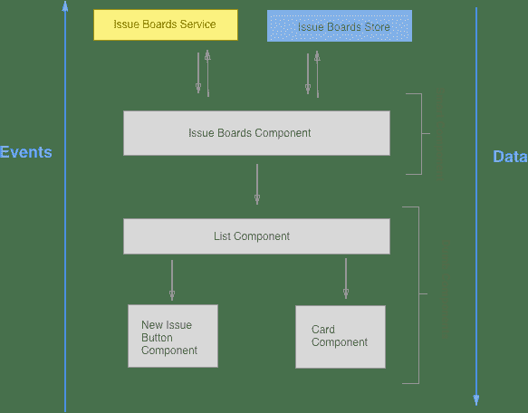

# Frontend Development Process

> 原文：[https://docs.gitlab.com/ee/development/fe_guide/development_process.html](https://docs.gitlab.com/ee/development/fe_guide/development_process.html)

*   [Development Checklist](#development-checklist)
    *   [Merge Request Review](#merge-request-review)
    *   [Share your work early](#share-your-work-early)
    *   [Vue features](#vue-features)

# Frontend Development Process[](#frontend-development-process "Permalink")

您可以在[手册中](https://about.gitlab.com/handbook/engineering/frontend/)找到有关前端团队组织的更多信息.

## Development Checklist[](#development-checklist "Permalink")

这个想法是在构建新功能或启动某些东西时提醒我们有关特定主题的信息. 这是其他行业（如飞行员）的常见做法，这些行业也使用标准化清单来尽早减少问题.

将内容复制到您的问题或合并请求中，如果不适用，则将其从当前列表中删除.

此清单旨在在开发更大的功能/重构时为我们提供帮助，而不是"始终使用它，并且每个点始终匹配"列表.

请在使用时做出最好的判断，如果有想法请通过合并请求贡献新的积分.

```
### Frontend development

#### Planning development
 - [ ] Check the current set weight of the issue, does it fit your estimate?
- [ ] Are all [departments](https://about.gitlab.com/handbook/engineering/#engineering-teams) that are needed from your perspective already involved in the issue? (For example is UX missing?)
- [ ] Is the specification complete? Are you missing decisions? How about error handling/defaults/edge cases? Take your time to understand the needed implementation and go through its flow.
- [ ] Are all necessary UX specifications available that you will need in order to implement? Are there new UX components/patterns in the designs? Then contact the UI component team early on. How should error messages or validation be handled?
- [ ] **Library usage** Use Vuex as soon as you have even a medium state to manage, use Vue router if you need to have different views internally and want to link from the outside. Check what libraries we already have for which occasions.
- [ ] **Plan your implementation:**
 - [ ] **Architecture plan:** Create a plan aligned with GitLab's architecture, how you are going to do the implementation, for example Vue application setup and its components (through [onion skinning](https://gitlab.com/gitlab-org/gitlab-foss/-/issues/35873#note_39994091)), Store structure and data flow, which existing Vue components can you reuse. It's a good idea to go through your plan with another engineer to refine it.
 - [ ] **Backend:** The best way is to kickoff the implementation in a call and discuss with the assigned Backend engineer what you will need from the backend and also when. Can you reuse existing API's? How is the performance with the planned architecture? Maybe create together a JSON mock object to already start with development.
 - [ ] **Communication:** It also makes sense to have for bigger features an own slack channel (normally called #f_{feature_name}) and even weekly demo calls with all people involved.
 - [ ] **Dependency Plan:** Are there big dependencies in the plan between you and others, then maybe create an execution diagram to show what is blocking which part and the order of the different parts.
 - [ ] **Task list:** Create a simple checklist of the subtasks that are needed for the implementation, also consider creating even sub issues. (for example show a comment, delete a comment, update a comment, etc.). This helps you and also everyone else following the implementation
- [ ] **Keep it small** To make it easier for you and also all reviewers try to keep merge requests small and merge into a feature branch if needed. To accomplish that you need to plan that from the start. Different methods are:
 - [ ] **Skeleton based plan** Start with an MR that has the skeleton of the components with placeholder content. In following MRs you can fill the components with interactivity. This also makes it easier to spread out development on multiple people.
 - [ ] **Cookie Mode** Think about hiding the feature behind a cookie flag if the implementation is on top of existing features
 - [ ] **New route** Are you refactoring something big then you might consider adding a new route where you implement the new feature and when finished delete the current route and rename the new one. (for example 'merge_request' and 'new_merge_request')
- [ ] **Setup** Is there any specific setup needed for your implementation (for example a kubernetes cluster)? Then let everyone know if it is not already mentioned where they can find documentation (if it doesn't exist - create it)
- [ ] **Security** Are there any new security relevant implementations? Then please contact the security team for an app security review. If you are not sure ask our [domain expert](https://about.gitlab.com/handbook/engineering/frontend/#frontend-domain-experts)

#### During development
 - [ ] Check off tasks on your created task list to keep everyone updated on the progress
- [ ] [Share your work early with reviewers/maintainers](#share-your-work-early)
- [ ] Share your work with UXer and Product Manager with Screenshots and/or [GIF's](https://about.gitlab.com/handbook/product/making-gifs/). They are easy to create for you and keep them up to date.
- [ ] If you are blocked on something let everyone on the issue know through a comment.
- [ ] Are you unable to work on this issue for a longer period of time, also let everyone know.
- [ ] **Documentation** Update/add docs for the new feature, see `docs/`. Ping one of the documentation experts/reviewers

#### Finishing development + Review
 - [ ] **Keep it in the scope** Try to focus on the actual scope and avoid a scope creep during review and keep new things to new issues.
- [ ] **Performance** Have you checked performance? For example do the same thing with 500 comments instead of 1\. Document the tests and possible findings in the MR so a reviewer can directly see it.
- [ ] Have you tested with a variety of our [supported browsers](../../install/requirements.md#supported-web-browsers)? You can use [browserstack](https://www.browserstack.com/) to be able to access a wide variety of browsers and operating systems.
- [ ] Did you check the mobile view?
- [ ] Check the built webpack bundle (For the report run `WEBPACK_REPORT=true gdk run`, then open `webpack-report/index.html`) if we have unnecessary bloat due to wrong references, including libraries multiple times, etc.. If you need help contact the webpack [domain expert](https://about.gitlab.com/handbook/engineering/frontend/#frontend-domain-experts)
- [ ] **Tests** Not only greenfield tests - Test also all bad cases that come to your mind.
- [ ] If you have multiple MR's then also smoke test against the final merge.
- [ ] Are there any big changes on how and especially how frequently we use the API then let production know about it
- [ ] Smoke test of the RC on dev., staging., canary deployments and .com
- [ ] Follow up on issues that came out of the review. Create issues for discovered edge cases that should be covered in future iterations. 
```

### Merge Request Review[](#merge-request-review "Permalink")

为了[尊重他人的时间，](https://about.gitlab.com/handbook/values/#be-respectful-of-others-time)在进行审核[时，](https://about.gitlab.com/handbook/values/#be-respectful-of-others-time)请遵循以下准则：

*   确保您的合并请求：
    *   里程碑已设定
    *   至少设置了危险机器人建议的标签
    *   有清晰的描述
    *   如果 UI 发生更改，则包括屏幕截图之前/之后
    *   管道是绿色的
    *   包括测试
    *   包括变更日志条目（必要时）
*   在分配给维护者之前，请分配给审阅者.
*   如果您分配了合并请求或直接对某人执行 ping 操作，请耐心等待，因为我们在不同时区且异步工作. 除非紧急合并请求（例如修复损坏的主服务器），否则请不要 DM 或重新分配合并请求，然后再等待 24 小时窗口.
*   如果您对合并请求/问题有疑问，请在合并请求/问题中提出. 当我们彼此进行 DM 交流时，我们将不再拥有 SSOT，并且[其他人也无法做出贡献](https://about.gitlab.com/handbook/values/#public-by-default) .
*   如果您有一个包含许多更改的大型**Draft**合并请求，建议您在添加/删除重要代码之前开始审阅. 确保在发布截止日期之前就已对其进行了分配，因为审阅者/维护者将始终优先于**草稿中**优先审阅已完成的 MR.
*   确保在上一轮审核之前删除" `Draft:`标题.

### Share your work early[](#share-your-work-early "Permalink")

1.  在编写代码之前，请确保您对体系结构的了解与 GitLab 的体系结构保持一致.
2.  Add a diagram to the issue and ask a frontend maintainer in the Slack channel `#frontend_maintainers` about it.

    [](img/boards_diagram.png)

3.  从开始一项功能到与审阅者或维护者共享"合并请求"之间的时间不要超过一周.

### Vue features[](#vue-features "Permalink")

1.  请遵循[Vue.js 最佳做法中](vue.html)的步骤
2.  遵循样式指南.
3.  仅有少数几个人可以合并 Vue 相关功能. 在此过程的早期，请一位 Vue 专家联系.