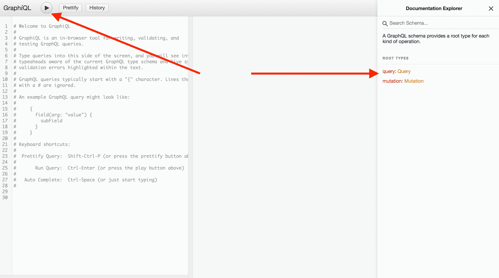

# GraphQL

> 原文：[https://docs.gitlab.com/ee/development/fe_guide/graphql.html](https://docs.gitlab.com/ee/development/fe_guide/graphql.html)

*   [Getting Started](#getting-started)
    *   [Helpful Resources](#helpful-resources)
    *   [Libraries](#libraries)
    *   [Tooling](#tooling)
        *   [Apollo GraphQL VS Code extension](#apollo-graphql-vs-code-extension)
    *   [Exploring the GraphQL API](#exploring-the-graphql-api)
*   [Apollo Client](#apollo-client)
*   [GraphQL Queries](#graphql-queries)
    *   [Fragments](#fragments)
*   [Usage in Vue](#usage-in-vue)
    *   [Local state with Apollo](#local-state-with-apollo)
        *   [Mocking API response with local Apollo cache](#mocking-api-response-with-local-apollo-cache)
    *   [Using with Vuex](#using-with-vuex)
    *   [Feature flags in queries](#feature-flags-in-queries)
    *   [Manually triggering queries](#manually-triggering-queries)
    *   [Working with pagination](#working-with-pagination)
        *   [Using `fetchMore` method in components](#using-fetchmore-method-in-components)
    *   [Testing](#testing)
        *   [Mocking response as component data](#mocking-response-as-component-data)
        *   [Testing loading state](#testing-loading-state)
        *   [Testing Apollo components](#testing-apollo-components)
*   [Handling errors](#handling-errors)
    *   [Top-level errors](#top-level-errors)
        *   [Handling top-level errors](#handling-top-level-errors)
    *   [Errors-as-data](#errors-as-data)
        *   [Handling errors-as-data](#handling-errors-as-data)
*   [Usage outside of Vue](#usage-outside-of-vue)

# GraphQL[](#graphql "Permalink")

## Getting Started[](#getting-started "Permalink")

### Helpful Resources[](#helpful-resources "Permalink")

**一般资源**:

*   [📚 Official Introduction to GraphQL](https://s0graphql0org.icopy.site/learn/)
*   [📚 Official Introduction to Apollo](https://www.apollographql.com/docs/tutorial/introduction/)

**GitLab 上的 GraphQL**:

*   [🎬 GitLab Unfiltered GraphQL playlist](https://www.youtube.com/watch?v=wHPKZBDMfxE&list=PL05JrBw4t0KpcjeHjaRMB7IGB2oDWyJzv)
*   [GitLab 上的 GraphQL：深潜](../api_graphql_styleguide.html#deep-dive) （视频）作者 Nick Thomas
    *   GitLab 上 GraphQL 的历史概述（不是特定于前端的）
*   [使用 GraphQL 和 Vue Apollo 进行 GitLab 功能演练](https://www.youtube.com/watch?v=6yYp2zB7FrM) （视频），作者 Natalia Tepluhina
    *   使用 GraphQL 在 GitLab 中实现前端功能的真实示例
*   [GitLab 上的客户端 GraphQL 的历史](https://www.youtube.com/watch?v=mCKRJxvMnf0) （视频）Illya Klymov 和 Natalia Tepluhina
*   Natalia Tepluhina [从 Vuex 到 Apollo](https://www.youtube.com/watch?v=9knwu87IfU8) （视频）
    *   关于何时阿波罗可能比 Vuex 更好的选择以及如何进行过渡的有用概述
*   [🛠 Vuex -> Apollo Migration: a proof-of-concept project](https://gitlab.com/ntepluhina/vuex-to-apollo/blob/master/README.md)
    *   一系列示例展示了使用 Vue + GraphQL +（Vuex 或 Apollo）应用进行状态管理的可能方法

### Libraries[](#libraries "Permalink")

当使用 GraphQL 进行前端开发时，我们使用[Apollo](https://www.apollographql.com/) （特别是[Apollo Client](https://www.apollographql.com/docs/react/) ）和[Vue Apollo](https://github.com/vuejs/vue-apollo) .

如果在 Vue 应用程序中使用 GraphQL，则" Vue 中的[用法"](#usage-in-vue)部分可以帮助您学习如何集成 Vue Apollo.

对于其他用例，请查看[Vue 外部](#usage-outside-of-vue)的[用法](#usage-outside-of-vue)部分.

### Tooling[](#tooling "Permalink")

*   [Apollo Client Devtools](https://github.com/apollographql/apollo-client-devtools)

#### [Apollo GraphQL VS Code extension](https://marketplace.visualstudio.com/items?itemName=apollographql.vscode-apollo)[](#apollo-graphql-vs-code-extension "Permalink")

如果使用 VS Code，则 Apollo GraphQL 扩展名支持`.graphql`文件中的自动完成. 若要设置 GraphQL 扩展，请按照下列步骤操作：

1.  将`apollo.config.js`文件添加到`gitlab`本地目录的根目录中.
2.  用以下内容填充文件：

    ```
     module.exports = {
       client: {
         includes: ['./app/assets/javascripts/**/*.graphql', './ee/app/assets/javascripts/**/*.graphql'],
         service: {
           name: 'GitLab',
           localSchemaFile: './doc/api/graphql/reference/gitlab_schema.graphql',
         },
       },
     }; 
    ```

3.  重新启动 VS Code.

### Exploring the GraphQL API[](#exploring-the-graphql-api "Permalink")

我们 GraphQL API 可以通过 GraphiQL 在您的实例的探索`/-/graphql-explorer`或[GitLab.com](https://gitlab.com/-/graphql-explorer) . 如有需要，请查阅《 [GitLab GraphQL API 参考》文档](../../api/graphql/reference) .

您可以在 GraphiQL 的**文档浏览器**的右侧检查所有现有的查询和变异. 也可以直接在左选项卡上编写查询和变异，然后单击左上角的**执行查询**按钮来检查其执行情况：

[](img/graphiql_explorer_v12_4.png)

## Apollo Client[](#apollo-client "Permalink")

为了保存在不同的应用程序中创建的重复客户端，我们使用[默认客户端](https://gitlab.com/gitlab-org/gitlab/blob/master/app/assets/javascripts/lib/graphql.js) . 这将使用正确的 URL 设置 Apollo 客户端，并设置 CSRF 标头.

默认客户端接受两个参数： `resolvers`和`config` .

*   创建`resolvers`参数以接受用于[本地状态管理](#local-state-with-apollo)查询和突变的 resolvers 对象
*   `config`参数采用配置设置的对象：
    *   `cacheConfig`字段接受设置的可选对象以[自定义 Apollo 缓存](https://www.apollographql.com/docs/react/caching/cache-configuration/#configuring-the-cache)
    *   `baseUrl`允许我们传递与主端点不同的 GraphQL 端点的 URL（即`${gon.relative_url_root}/api/graphql` ）
    *   `assumeImmutableResults` （默认设置为`false` ）-此设置为`true` ，将假定更新 Apollo Cache 时的每个操作都是不可变的. 它还将`freezeResults`设置为`true` ，因此任何尝试`freezeResults` Apollo Cache 的尝试都会在开发环境中引发控制台警告. 在将此选项设置为`true`之前，请确保在缓存更新操作中遵循不变性模式.

## GraphQL Queries[](#graphql-queries "Permalink")

为了在运行时保存查询编译，webpack 可以直接导入`.graphql`文件. 这使 webpack 可以在编译时对查询进行预处理，而不是由客户端进行查询的编译.

为了将查询与突变和片段区分开来，建议使用以下命名约定：

*   `all_users.query.graphql`用于查询；
*   `add_user.mutation.graphql`进行突变；
*   片段的`basic_user.fragment.graphql` .

### Fragments[](#fragments "Permalink")

[片段](https://s0graphql0org.icopy.site/learn/queries/)是使复杂的 GraphQL 查询更具可读性和可重用性的一种方式. 这是 GraphQL 片段的示例：

```
fragment DesignListItem on Design {
  id
  image
  event
  filename
  notesCount
} 
```

片段可以存储在单独的文件中，可以导入并用于查询，突变或其他片段.

```
#import "./design_list.fragment.graphql"
#import "./diff_refs.fragment.graphql"

fragment DesignItem on Design {
  ...DesignListItem
  fullPath
  diffRefs {
    ...DesignDiffRefs
  }
} 
```

有关片段的更多信息： [GraphQL Docs](https://s0graphql0org.icopy.site/learn/queries/)

## Usage in Vue[](#usage-in-vue "Permalink")

要使用 Vue Apollo，请导入[Vue Apollo](https://github.com/vuejs/vue-apollo)插件以及默认客户端. 这应该在安装 Vue 应用程序的同一时间创建.

```
import Vue from 'vue';
import VueApollo from 'vue-apollo';
import createDefaultClient from '~/lib/graphql';
Vue.use(VueApollo);

const apolloProvider = new VueApollo({
  defaultClient: createDefaultClient(),
});

new Vue({
  ...,
  apolloProvider,
  ...
}); 
```

在[Vue Apollo 文档中](https://vue-apollo.netlify.app/guide/)阅读有关[Vue Apollo 的](https://github.com/vuejs/vue-apollo)更多信息.

### Local state with Apollo[](#local-state-with-apollo "Permalink")

创建默认客户端时，可以通过传入 resolvers 对象来使用 Apollo 管理应用程序状态. 设置默认客户端后，可以通过写入缓存来设置默认状态.

```
import Vue from 'vue';
import VueApollo from 'vue-apollo';
import createDefaultClient from '~/lib/graphql';
Vue.use(VueApollo);

const defaultClient = createDefaultClient({
  resolvers: {}
});

defaultClient.cache.writeData({
  data: {
    user: {
      name: 'John',
      surname: 'Doe',
      age: 30
    },
  },
});

const apolloProvider = new VueApollo({
  defaultClient,
}); 
```

我们可以使用`@client` Apollo 指令查询本地数据：

```
// user.query.graphql

query User {
  user @client {
    name
    surname
    age
  }
} 
```

除了创建本地数据，我们还可以使用`@client`字段扩展现有的 GraphQL 类型. 当我们需要为尚未添加到 GraphQL API 中的字段模拟 API 响应时，这非常有用.

#### Mocking API response with local Apollo cache[](#mocking-api-response-with-local-apollo-cache "Permalink")

当我们需要在本地模拟某些 GraphQL API 响应，查询或变异时（例如，当它们仍未添加到我们的实际 API 中时），使用本地 Apollo 缓存非常方便.

例如，我们在查询中使用了有关`DesignVersion`的[片段](#fragments) ：

```
fragment VersionListItem on DesignVersion {
  id
  sha
} 
```

我们还需要获取版本作者和'created at'属性，以在版本下拉列表中显示它们，但这些更改仍未在我们的 API 中实现. 我们可以更改现有片段，以针对这些新字段获得模拟的响应：

```
fragment VersionListItem on DesignVersion {
  id
  sha
  author @client {
    avatarUrl
    name
  }
  createdAt @client
} 
```

现在，Apollo 将尝试为每个标有`@client`指令的字段查找*解析器* . 让我们为`DesignVersion`类型创建一个解析器（为什么要使用`DesignVersion` ？，因为我们的片段是在这种类型上创建的）.

```
// resolvers.js

const resolvers = {
  DesignVersion: {
    author: () => ({
      avatarUrl:
        'https://www.gravatar.com/avatar/e64c7d89f26bd1972efa854d13d7dd61?s=80&d=identicon',
      name: 'Administrator',
      __typename: 'User',
    }),
    createdAt: () => '2019-11-13T16:08:11Z',
  },
};

export default resolvers; 
```

我们需要将解析器对象传递给我们现有的 Apollo Client：

```
// graphql.js

import createDefaultClient from '~/lib/graphql';
import resolvers from './graphql/resolvers';

const defaultClient = createDefaultClient(
  {},
  resolvers,
); 
```

现在，每次尝试获取版本时，我们的客户端都会从远程 API 端点获取`id`和`sha` ，并将我们的硬编码值分配给`author`和`createdAt`版本属性. 有了这些数据，前端开发人员就可以在 UI 部件上工作，而不会被后端阻塞. 将实际响应添加到 API 后，可以快速删除自定义本地解析器，并且对查询/片段的唯一更改是`@client`指令删除.

在[Vue Apollo 文档中](https://vue-apollo.netlify.app/guide/local-state.html#local-state)阅读有关使用 Apollo 进行本地状态管理的更多信息.

### Using with Vuex[](#using-with-vuex "Permalink")

When Apollo Client is used within Vuex and fetched data is stored in the Vuex store, there is no need in keeping Apollo Client cache enabled. Otherwise we would have data from the API stored in two places - Vuex store and Apollo Client cache. More to say, with Apollo’s default settings, a subsequent fetch from the GraphQL API could result in fetching data from Apollo cache (in the case where we have the same query and variables). To prevent this behavior, we need to disable Apollo Client cache passing a valid `fetchPolicy` option to its constructor:

```
import fetchPolicies from '~/graphql_shared/fetch_policy_constants';

export const gqClient = createGqClient(
  {},
  {
    fetchPolicy: fetchPolicies.NO_CACHE,
  },
); 
```

### Feature flags in queries[](#feature-flags-in-queries "Permalink")

有时在 GraphQL 查询中的功能标志后面放置一个实体可能会很有用. 例如，当处理后端已经合并但前端没有合并的功能时，您可能希望将 GraphQL 实体放在功能标记后面，以允许创建和合并较小的合并请求.

为此， `if`语句通过，我们可以使用`@include`指令排除实体.

```
query  getAuthorData($authorNameEnabled:  Boolean  =  false)  {  username  name  @include(if:  $authorNameEnabled)  } 
```

然后，在对查询的 Vue（或 JavaScript）调用中，我们可以传递功能标记. 此功能标志将需要已经正确设置. 有关正确方法，请参阅[功能部件标志文档](../feature_flags/development.html) .

```
export default {
  apollo: {
    user: {
      query: QUERY_IMPORT,
      variables() {
        return {
          authorNameEnabled: gon?.features?.authorNameEnabled,
        };
      },
    }
  },
}; 
```

### Manually triggering queries[](#manually-triggering-queries "Permalink")

创建组件时，将自动对组件的`apollo`属性进行查询. 某些组件反而希望按需发出网络请求，例如，带有延迟加载项的下拉列表.

有两种方法可以做到这一点：

1.  Use the `skip` property

```
export default {
  apollo: {
    user: {
      query: QUERY_IMPORT,
      skip() {
        // only make the query when dropdown is open
        return !this.isOpen;
      },
    }
  },
}; 
```

1.  Using `addSmartQuery`

您可以在您的方法中手动创建智能查询.

```
handleClick() {
  this.$apollo.addSmartQuery('user', {
    // this takes the same values as you'd have in the `apollo` section
    query: QUERY_IMPORT,
  }),
}; 
```

### Working with pagination[](#working-with-pagination "Permalink")

GitLab 的 GraphQL API 对连接类型使用[中继样式的游标分页](https://www.apollographql.com/docs/react/data/pagination/#cursor-based) . 这意味着使用"游标"来跟踪应从中提取下一项的数据集中的位置. [GraphQL Ruby Connection Concepts](https://graphql-ruby.org/pagination/connection_concepts.html)是对连接的良好概述和介绍.

每个连接类型（例如`DesignConnection`和`DiscussionConnection` ）都有一个字段`pageInfo` ，其中包含分页所需的信息：

```
pageInfo {
  endCursor
  hasNextPage
  hasPreviousPage
  startCursor
} 
```

Here:

*   `startCursor`和`endCursor`显示第一项和最后一项的光标.
*   `hasPreviousPage`和`hasNextPage`允许我们检查当前页面之前或之后是否还有更多页面可用.

当我们以连接类型获取数据时，我们可以`before`参数的`after`或`before`传递游标，以指示分页的起点或终点. 应该分别在它们的后跟`first`或`last`参数，以指示我们要在给定端点之后或之前获取*多少个*项目.

例如，这里我们在光标之后获取 10 个设计：

```
query {
  project(fullPath: "root/my-project") {
    id
    issue(iid: "42") {
      designCollection {
        designs(atVersion: null, after: "Ihwffmde0i", first: 10) {
          edges {
            node {
              id
            }
          }
        }
      }
    }
  }
} 
```

#### Using `fetchMore` method in components[](#using-fetchmore-method-in-components "Permalink")

进行初始抓取时，我们通常希望从头开始进行分页. 在这种情况下，我们可以：

*   跳过传递光标.
*   将`null`明确传递给`after` .

提取数据后，我们应该保存一个`pageInfo`对象. 假设我们将其存储到 Vue 组件`data` ：

```
data() {
  return {
    pageInfo: null,
  }
},
apollo: {
  designs: {
    query: projectQuery,
    variables() {
      return {
        // rest of design variables
        ...
        first: 10,
      };
    },
    result(res) {
      this.pageInfo = res.data?.project?.issue?.designCollection?.designs?.pageInfo;
    },
  },
}, 
```

当我们想移至下一页时，我们使用 Apollo `fetchMore`方法，在该方法中传递一个新的游标（以及可选的新变量）. 在`updateQuery`挂钩中，我们必须在获取下一页之后返回要在 Apollo 缓存中看到的结果.

```
fetchNextPage() {
  // as a first step, we're checking if we have more pages to move forward
  if (this.pageInfo?.hasNextPage) {
    this.$apollo.queries.designs.fetchMore({
      variables: {
        // rest of design variables
        ...
        first: 10,
        after: this.pageInfo?.endCursor,
      },
      updateQuery(previousResult, { fetchMoreResult }) {
        // here we can implement the logic of adding new designs to fetched one (for example, if we use infinite scroll)
        // or replacing old result with the new one if we use numbered pages

        const newDesigns = fetchMoreResult.project.issue.designCollection.designs;
        previousResult.project.issue.designCollection.designs.push(...newDesigns)

        return previousResult;
      },
    });
  }
} 
```

请注意，我们不必再保存`pageInfo`了； `fetchMore`触发查询`result`挂钩.

### Testing[](#testing "Permalink")

#### Mocking response as component data[](#mocking-response-as-component-data "Permalink")

使用[Vue 测试工具](https://vue-test-utils.vuejs.org/) ，可以轻松快速地测试获取 GraphQL 查询的组件. 最简单的方法是使用`shallowMount` ，然后在组件上设置数据

```
it('tests apollo component', () => {
  const vm = shallowMount(App);

  vm.setData({
    ...mock data
  });
}); 
```

#### Testing loading state[](#testing-loading-state "Permalink")

如果需要测试当 GraphQL API 的结果仍在加载时组件的呈现方式，我们可以将加载状态模拟到相应的 Apollo 查询/突变中：

```
 function createComponent({
    loading = false,
  } = {}) {
    const $apollo = {
      queries: {
        designs: {
          loading,
        },
    };

    wrapper = shallowMount(Index, {
      sync: false,
      mocks: { $apollo }
    });
  }

  it('renders loading icon', () => {
  createComponent({ loading: true });

  expect(wrapper.element).toMatchSnapshot();
}) 
```

#### Testing Apollo components[](#testing-apollo-components "Permalink")

如果我们在组件中使用`ApolloQuery`或`ApolloMutation` ，为了测试其功能，我们需要先添加一个存根：

```
import { ApolloMutation } from 'vue-apollo';

function createComponent(props = {}) {
  wrapper = shallowMount(MyComponent, {
    sync: false,
    propsData: {
      ...props,
    },
    stubs: {
      ApolloMutation,
    },
  });
} 
```

`ApolloMutation`组件通过作用域插槽公开了`mutate`方法. 如果要测试此方法，则需要将其添加到模拟中：

```
const mutate = jest.fn().mockResolvedValue();
const $apollo = {
  mutate,
};

function createComponent(props = {}) {
  wrapper = shallowMount(MyComponent, {
    sync: false,
    propsData: {
      ...props,
    },
    stubs: {
      ApolloMutation,
    },
    mocks: {
      $apollo:
    }
  });
} 
```

然后我们可以检查是否使用正确的变量调用了`mutate` ：

```
const mutationVariables = {
  mutation: createNoteMutation,
  update: expect.anything(),
  variables: {
    input: {
      noteableId: 'noteable-id',
      body: 'test',
      discussionId: '0',
    },
  },
};

it('calls mutation on submitting form ', () => {
  createComponent()
  findReplyForm().vm.$emit('submitForm');

  expect(mutate).toHaveBeenCalledWith(mutationVariables);
}); 
```

## Handling errors[](#handling-errors "Permalink")

目前，GitLab 的 GraphQL 突变具有两种不同的错误模式： [顶级](#top-level-errors)和[数据错误](#errors-as-data) .

利用 GraphQL 突变时，我们必须考虑处理**这两种错误模式，**以确保用户在发生错误时能够收到适当的反馈.

### Top-level errors[](#top-level-errors "Permalink")

这些错误位于 GraphQL 响应的"顶级". 这些是不可恢复的错误，包括参数错误和语法错误，因此不应直接呈现给用户.

#### Handling top-level errors[](#handling-top-level-errors "Permalink")

Apollo 意识到顶级错误，因此我们能够利用 Apollo 的各种错误处理机制来处理这些错误（例如，在调用[`mutate`](https://www.apollographql.com/docs/react/api/apollo-client/#ApolloClient.mutate)方法之后处理 Promise 拒绝，或处理从[`ApolloMutation`](https://apollo.vuejs.org/api/apollo-mutation.html#events)组件发出的`error`事件）.

由于这些错误不是针对用户的，因此应在客户端定义顶级错误的错误消息.

### Errors-as-data[](#errors-as-data "Permalink")

这些错误嵌套在 GraphQL 响应的`data`对象中. 这些是可恢复的错误，理想情况下，可以直接向用户显示.

#### Handling errors-as-data[](#handling-errors-as-data "Permalink")

首先，我们必须向我们的变异对象添加`errors` ：

```
mutation createNoteMutation($input: String!) {
  createNoteMutation(input: $input) {
    note {
      id
+     errors
    }
  } 
```

现在，当我们提交此突变并发生错误时，响应中将包含`errors`供我们处理：

```
{
  data: {
    mutationName: {
      errors: ["Sorry, we were not able to update the note."]
    }
  }
} 
```

处理数据错误时，请根据您的最佳判断来确定是将错误消息显示在响应中，还是将另一条客户端定义的消息显示给用户.

## Usage outside of Vue[](#usage-outside-of-vue "Permalink")

通过直接导入默认客户端并将其与查询一起使用，还可以在 Vue 之外使用 GraphQL.

```
import createDefaultClient from '~/lib/graphql';
import query from './query.graphql';

const defaultClient = createDefaultClient();

defaultClient.query({ query })
  .then(result => console.log(result)); 
```

[使用 Vuex 时](#Using-with-Vuex) ，在以下情况下禁用缓存：

*   数据正在其他地方缓存
*   如果数据正在其他地方缓存，或者对于给定的用例完全不需要，则用例不需要缓存.

```
import createDefaultClient from '~/lib/graphql';
import fetchPolicies from '~/graphql_shared/fetch_policy_constants';

const defaultClient = createDefaultClient(
  {},
  {
    fetchPolicy: fetchPolicies.NO_CACHE,
  },
); 
```