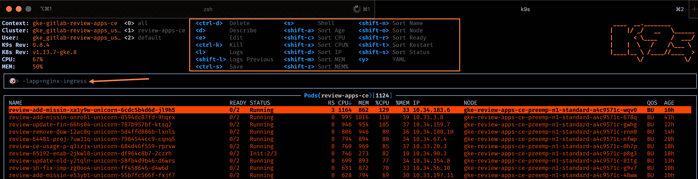

# Review Apps

> 原文：[https://docs.gitlab.com/ee/development/testing_guide/review_apps.html](https://docs.gitlab.com/ee/development/testing_guide/review_apps.html)

*   [How does it work?](#how-does-it-work)
    *   [CI/CD architecture diagram](#cicd-architecture-diagram)
    *   [Detailed explanation](#detailed-explanation)
    *   [Auto-stopping of Review Apps](#auto-stopping-of-review-apps)
*   [QA runs](#qa-runs)
*   [Performance Metrics](#performance-metrics)
*   [Cluster configuration](#cluster-configuration)
    *   [Node pools](#node-pools)
    *   [Helm](#helm)
*   [How to](#how-to)
    *   [Get access to the GCP Review Apps cluster](#get-access-to-the-gcp-review-apps-cluster)
    *   [Log into my Review App](#log-into-my-review-app)
    *   [Enable a feature flag for my Review App](#enable-a-feature-flag-for-my-review-app)
    *   [Find my Review App slug](#find-my-review-app-slug)
    *   [Run a Rails console](#run-a-rails-console)
    *   [Dig into a Pod’s logs](#dig-into-a-pods-logs)
*   [Diagnosing unhealthy Review App releases](#diagnosing-unhealthy-review-app-releases)
    *   [Release failed with `ImagePullBackOff`](#release-failed-with-imagepullbackoff)
    *   [Node count is always increasing (i.e. never stabilizing or decreasing)](#node-count-is-always-increasing-ie-never-stabilizing-or-decreasing)
    *   [p99 CPU utilization is at 100% for most of the nodes and/or many components](#p99-cpu-utilization-is-at-100-for-most-of-the-nodes-andor-many-components)
    *   [The `logging/user/events/FailedMount` chart is going up](#the-loggingusereventsfailedmount-chart-is-going-up)
    *   [Using K9s](#using-k9s)
    *   [Troubleshoot a pending `dns-gitlab-review-app-external-dns` Deployment](#troubleshoot-a-pending-dns-gitlab-review-app-external-dns-deployment)
        *   [Finding the problem](#finding-the-problem)
        *   [Solving the problem](#solving-the-problem)
        *   [Mitigation steps taken to avoid this problem in the future](#mitigation-steps-taken-to-avoid-this-problem-in-the-future)
*   [Frequently Asked Questions](#frequently-asked-questions)
*   [Other resources](#other-resources)
    *   [Helpful command line tools](#helpful-command-line-tools)

# Review Apps[](#review-apps "Permalink")

Review Apps 由[管道](https://gitlab.com/gitlab-org/gitlab/-/merge_requests/6665)自动部署.

## How does it work?[](#how-does-it-work "Permalink")

### CI/CD architecture diagram[](#cicd-architecture-diagram "Permalink")

图 TD A [" build-qa-image，编译生产资产
（仅适用于规范的默认参考）"]; B [review-build-cng]; C [review-deploy]; D [CNG-mirror]; E [review-qa-smoke]; A-> |一旦准备`阶段已完成| BB -.-> |触发 CNG 镜像管道并等待其完成| DD -.-> |轮询直到完成| BB-> |一旦完成`view-build-cng`工作完成| CC-> |完成"审查-部署"工作| E 子图" 1\. gitlab`prepare` stage"结束子图" 2\. gitlab`review-prepare`阶段" B 结束子图" 3\. gitlab`review` stage" C [" review-deploy

Helm 使用云部署 Review App
由 CNG 镜像管道构建的本机映像.

Cloud Native 映像已部署到" review-apps"
Kubernetes（GKE）集群，位于 GCP`gitlab-review-apps`项目中."]结束子图" 4\. gitlab`qa` stage" E [review-qa-smoke

gitlab-qa 对 Review App 运行冒烟套件.]结束子图" CNG 镜像管道" D>构建了 Cloud Native 图像]； 结束

### Detailed explanation[](#detailed-explanation "Permalink")

1.  在`prepare`阶段的每个[管道](https://gitlab.com/gitlab-org/gitlab/pipelines/125315730)上，都会自动启动[`compile-production-assets`](https://gitlab.com/gitlab-org/gitlab/-/jobs/641770154)作业.
    *   完成后， [`review-build-cng`](https://gitlab.com/gitlab-org/gitlab/-/jobs/467724808)作业开始，因为在后续步骤中触发的[`CNG-mirror`](https://gitlab.com/gitlab-org/build/CNG-mirror)管道依赖[`review-build-cng`](https://gitlab.com/gitlab-org/gitlab/-/jobs/467724808) .
2.  完成`compile-production-assets`后， [`review-build-cng`](https://gitlab.com/gitlab-org/gitlab/-/jobs/467724808)作业[将触发](https://gitlab.com/gitlab-org/build/CNG-mirror/pipelines/44364657) [`CNG-mirror`](https://gitlab.com/gitlab-org/build/CNG-mirror)项目中[的管道](https://gitlab.com/gitlab-org/build/CNG-mirror/pipelines/44364657) .
    *   仅当您的 MR 包括[CI 或前端更改时](../pipelines.html#changes-patterns) ， `review-build-cng`作业才会自动开始. 在其他情况下，该工作是手动的.
    *   [`CNG-mirror`](https://gitlab.com/gitlab-org/build/CNG-mirror/pipelines/44364657)管道基于[GitLab 管道](https://gitlab.com/gitlab-org/gitlab/pipelines/125315730)的提交创建每个组件（例如`gitlab-rails-ee` ， `gitlab-shell` ， `gitaly`等）的 Docker 映像，并将它们存储在其[注册表中](https://gitlab.com/gitlab-org/build/CNG-mirror/container_registry) .
    *   我们使用[`CNG-mirror`](https://gitlab.com/gitlab-org/build/CNG-mirror)项目，以便`CNG` （Cloud Native GitLab）项目的注册表不会因大量临时 Docker 映像而过载.
    *   请注意，官方的 CNG 图像是由`cloud-native-image`作业构建的，该作业仅针对标签运行，并自身触发[`CNG`](https://gitlab.com/gitlab-org/build/CNG)管道.
3.  完成`review-build-cng`后， [`review-deploy`](https://gitlab.com/gitlab-org/gitlab/-/jobs/467724810)作业使用[官方的 GitLab Helm 图表](https://gitlab.com/gitlab-org/charts/gitlab/)将 Review App 部署到 GCP 上的[`review-apps`](https://console.cloud.google.com/kubernetes/clusters/details/us-central1-b/review-apps?project=gitlab-review-apps) Kubernetes 集群.
    *   可以在[`scripts/review_apps/review-apps.sh`](https://gitlab.com/gitlab-org/gitlab/-/blob/master/scripts/review_apps/review-apps.sh)找到用于部署 Review App 的实际脚本.
    *   这些脚本基本上是[我们的官方 Auto DevOps 脚本](https://gitlab.com/gitlab-org/gitlab/-/blob/master/lib/gitlab/ci/templates/Auto-DevOps.gitlab-ci.yml) ，其中默认的 CNG 映像会被构建并存储在[`CNG-mirror`项目注册表中](https://gitlab.com/gitlab-org/build/CNG-mirror/container_registry)的映像覆盖.
    *   由于我们使用的[是官方的 GitLab Helm 图表](https://gitlab.com/gitlab-org/charts/gitlab/) ，这意味着您将为分支机构获得一个专用的环境，该环境非常接近生产环境.
4.  一旦[`review-deploy`](https://gitlab.com/gitlab-org/gitlab/-/jobs/467724810)作业成功，您应该可以使用您的 Review App，这要归功于 MR 小部件与它的直接链接. 要登录 Review App，请参阅"登录我的 Review App？". 下面.

**补充笔记：**

*   如果`review-deploy`工作持续失败（请注意，我们已经试了两次），请在发布消息`#g_qe_engineering_productivity`通道和/或创建`~"Engineering Productivity"` `~"ep::review apps"` `~bug`的问题有链接到您的合并请求. 请注意，部署失败可能会揭示合并请求中引入的实际问题（即，这不一定是暂时性失败）！
*   如果`review-qa-smoke`作业仍然失败（请注意，我们已经重试了两次），请检查该作业的日志：您可能会发现合并请求中引入的实际问题. 您也可以下载工件，以查看发生故障时页面的屏幕截图. 如果您找不到失败的原因，或者看起来与更改无关，请在`#quality`频道中发布一条消息和/或创建`#quality`问题，并带有指向合并请求的链接.
*   手动`review-stop`可用于手动停止复查应用，一旦合并请求的分支在合并后被删除，GitLab 也将启动手动`review-stop` .
*   使用[GitLab 的 Kubernetes 集成](../../user/project/clusters/index.html)将 Kubernetes 集群连接到`gitlab`项目. 这基本上允许直接从合并请求窗口小部件链接到 Review App.

### Auto-stopping of Review Apps[](#auto-stopping-of-review-apps "Permalink")

借助[环境自动停止](../../ci/environments/index.html#environments-auto-stop)功能，Review Apps 在上次部署后 2 天会自动停止.

If you need your Review App to stay up for a longer time, you can [pin its environment](../../ci/environments/index.html#auto-stop-example) or retry the `review-deploy` job to update the “latest deployed at” time.

The `review-cleanup` job that automatically runs in scheduled pipelines (and is manual in merge request) stops stale Review Apps after 5 days, deletes their environment after 6 days, and cleans up any dangling Helm releases and Kubernetes resources after 7 days.

自动在计划的管道中运行的`review-gcp-cleanup`作业（在合并请求中手动执行）将删除所有未与 Kubernetes 资源一起删除的悬空 GCP 网络资源.

## QA runs[](#qa-runs "Permalink")

在`qa`阶段（在`review`阶段之后）的每个[管道](https://gitlab.com/gitlab-org/gitlab/pipelines/125315730)上， `review-qa-smoke`作业都会自动启动，并运行 QA 烟雾套件.

您也可以手动启动`review-qa-all` ：它运行完整的质量检查套件.

## Performance Metrics[](#performance-metrics "Permalink")

在每一个[管道](https://gitlab.com/gitlab-org/gitlab/pipelines/125315730)在`qa`阶段， `review-performance`作业自动启动：这项工作确实使用基本的浏览器性能测试[Sitespeed.io 集装箱](../../user/project/merge_requests/browser_performance_testing.html) .

## Cluster configuration[](#cluster-configuration "Permalink")

### Node pools[](#node-pools "Permalink")

目前， `review-apps`集群使用以下节点池进行设置：

*   具有自动`e2-highcpu-16` （16 vCPU，16 GB 内存）可抢占节点

### Helm[](#helm "Permalink")

使用的 Helm 版本在[`registry.gitlab.com/gitlab-org/gitlab-build-images:gitlab-helm3-kubectl1.14`映像中](https://gitlab.com/gitlab-org/gitlab-build-images/-/blob/master/Dockerfile.gitlab-helm3-kubectl1.14#L7)定义，由`review-deploy`和`review-stop`作业使用.

## How to[](#how-to "Permalink")

### Get access to the GCP Review Apps cluster[](#get-access-to-the-gcp-review-apps-cluster "Permalink")

您需要[打开](https://gitlab.com/gitlab-com/access-requests/-/issues/new) `gcp-review-apps-sg` GCP 组[的访问请求（内部链接）](https://gitlab.com/gitlab-com/access-requests/-/issues/new) . 为了加入群组，您必须在访问请求中指定所需的 GCP 角色. 该角色将授予您特定的权限，以便与 Review App 容器进行交互.

Here are some permissions you may want to have, and the roles that grant them:

*   `container.pods.getLogs` [检索 pod 日志所](#dig-into-a-pods-logs)必需. 由[查看者（ `roles/viewer` ）](https://cloud.google.com/iam/docs/understanding-roles#kubernetes-engine-roles)授予.
*   `container.pods.exec` [运行 Rails 控制台](#run-a-rails-console)所需. 由[Kubernetes Engine 开发人员（ `roles/container.developer` ）](https://cloud.google.com/iam/docs/understanding-roles#kubernetes-engine-roles)授予.

### Log into my Review App[](#log-into-my-review-app "Permalink")

默认用户名是`root` ，其密码可以在名为`gitlab-{ce,ee} Review App's root password`的 1Password 安全注释中找到.

### Enable a feature flag for my Review App[](#enable-a-feature-flag-for-my-review-app "Permalink")

1.  打开您的 Review App 并按照上述说明登录.
2.  创建一个个人访问令牌.
3.  使用[Feature 标志 API](../../api/features.html)启用[功能标志](../../api/features.html) .

### Find my Review App slug[](#find-my-review-app-slug "Permalink")

1.  打开`review-deploy`作业.
2.  查找" `Checking for previous deployment of review-*` .
3.  例如，对于`Checking for previous deployment of review-qa-raise-e-12chm0`在这种情况下，您的 Review App `Checking for previous deployment of review-qa-raise-e-12chm0`将为`review-qa-raise-e-12chm0` .

### Run a Rails console[](#run-a-rails-console "Permalink")

1.  确保首先[具有访问群集](#get-access-to-the-gcp-review-apps-cluster)和`container.pods.exec`权限的权限.
2.  [根据您的 Review App](https://console.cloud.google.com/kubernetes/workload?project=gitlab-review-apps) `review-qa-raise-e-12chm0` [过滤工作量](https://console.cloud.google.com/kubernetes/workload?project=gitlab-review-apps) ，例如`review-qa-raise-e-12chm0` .
3.  查找并打开`task-runner`部署，例如`review-qa-raise-e-12chm0-task-runner` .
4.  单击"托管窗格"部分中的 Pod，例如`review-qa-raise-e-12chm0-task-runner-d5455cc8-2lsvz` .
5.  点击`KUBECTL`下拉菜单，然后`Exec` - > `task-runner` .
6.  从默认命令`-it -- gitlab-rails console` `-c task-runner -- ls`替换为`-it -- gitlab-rails console` ，或者
    *   运行`kubectl exec --namespace review-apps review-qa-raise-e-12chm0-task-runner-d5455cc8-2lsvz -it -- gitlab-rails console`和
        *   用您的 Pod 名称替换`review-qa-raise-e-12chm0-task-runner-d5455cc8-2lsvz` .

### Dig into a Pod’s logs[](#dig-into-a-pods-logs "Permalink")

1.  确保首先[有权访问集群](#get-access-to-the-gcp-review-apps-cluster)和`container.pods.getLogs`权限.
2.  [根据您的 Review App](https://console.cloud.google.com/kubernetes/workload?project=gitlab-review-apps) `review-qa-raise-e-12chm0` [过滤工作量](https://console.cloud.google.com/kubernetes/workload?project=gitlab-review-apps) ，例如`review-qa-raise-e-12chm0` .
3.  查找并打开`migrations`部署，例如`review-qa-raise-e-12chm0-migrations.1` .
4.  单击"托管窗格"部分中的 Pod，例如`review-qa-raise-e-12chm0-migrations.1-nqwtx` .
5.  单击`Container logs`链接.

## Diagnosing unhealthy Review App releases[](#diagnosing-unhealthy-review-app-releases "Permalink")

如果[Review App Stability](https://app.periscopedata.com/app/gitlab/496118/Engineering-Productivity-Sandbox?widget=6690556&udv=785399)下降，则可能表明[Review](https://app.periscopedata.com/app/gitlab/496118/Engineering-Productivity-Sandbox?widget=6690556&udv=785399) `review-apps-ce/ee`集群不健康. 领先的指标可能是导致重新启动的运行状况检查失败或 Review App 部署的多数失败.

[Review Apps Overview 仪表板可](https://console.cloud.google.com/monitoring/classic/dashboards/6798952013815386466?project=gitlab-review-apps&timeDomain=1d)帮助确定群集上的负载峰值，以及节点是否有问题或整个群集是否趋于不正常.

### Release failed with `ImagePullBackOff`[](#release-failed-with-imagepullbackoff "Permalink")

**潜在原因：**

如果看到`ImagePullBackoff`状态，请检查缺少的 Docker 映像.

**在哪里寻找进一步的调试：**

要检查是否已创建 Docker 映像，请运行以下 Docker 命令：

```
`DOCKER_CLI_EXPERIMENTAL=enabled docker manifest repository:tag` 
```

此命令的输出指示 Docker 映像是否存在. 例如：

```
DOCKER_CLI_EXPERIMENTAL=enabled docker manifest inspect registry.gitlab.com/gitlab-org/build/cng-mirror/gitlab-rails-ee:39467-allow-a-release-s-associated-milestones-to-be-edited-thro 
```

如果 Docker 映像不存在：

*   验证`helm upgrade --install`命令中的`image.repository`和`image.tag`选项是否与 CNG-mirror 管道使用的存储库名称匹配.
*   在`review-build-cng`作业中进一步查看相应的下游 CNG 镜像管道.

### Node count is always increasing (i.e. never stabilizing or decreasing)[](#node-count-is-always-increasing-ie-never-stabilizing-or-decreasing "Permalink")

**潜在原因：**

这可能表明`review-cleanup`作业未能清除过时的审查应用和 Kubernetes 资源.

**在哪里寻找进一步的调试：**

查看最新的`review-cleanup`作业日志，并确定是否存在任何意外故障.

### p99 CPU utilization is at 100% for most of the nodes and/or many components[](#p99-cpu-utilization-is-at-100-for-most-of-the-nodes-andor-many-components "Permalink")

**潜在原因：**

这可能表明 Helm 无法部署 Review Apps. 当 Helm 有很多`FAILED`版本发布时，CPU 利用率似乎正在增加，这可能是由于 Helm 或 Kubernetes 试图重新创建组件所致.

**在哪里寻找进一步的调试：**

查看最近的`review-deploy`作业日志.

**有用的命令：**

```
# Identify if node spikes are common or load on specific nodes which may get rebalanced by the Kubernetes scheduler
kubectl top nodes | sort --key 3 --numeric

# Identify pods under heavy CPU load
kubectl top pods | sort --key 2 --numeric 
```

### The `logging/user/events/FailedMount` chart is going up[](#the-loggingusereventsfailedmount-chart-is-going-up "Permalink")

**潜在原因：**

这可能表明存在太多过时的机密和/或配置图.

**在哪里寻找进一步的调试：**

查看[配置列表](https://console.cloud.google.com/kubernetes/config?project=gitlab-review-apps)或`kubectl get secret,cm --sort-by='{.metadata.creationTimestamp}' | grep 'review-'` `kubectl get secret,cm --sort-by='{.metadata.creationTimestamp}' | grep 'review-'` .

怀疑任何超过 5 天的机密或配置图，应将其删除.

**有用的命令：**

```
# List secrets and config maps ordered by created date
kubectl get secret,cm --sort-by='{.metadata.creationTimestamp}' | grep 'review-'

# Delete all secrets that are 5 to 9 days old
kubectl get secret --sort-by='{.metadata.creationTimestamp}' | grep '^review-' | grep '[5-9]d$' | cut -d' ' -f1 | xargs kubectl delete secret

# Delete all secrets that are 10 to 99 days old
kubectl get secret --sort-by='{.metadata.creationTimestamp}' | grep '^review-' | grep '[1-9][0-9]d$' | cut -d' ' -f1 | xargs kubectl delete secret

# Delete all config maps that are 5 to 9 days old
kubectl get cm --sort-by='{.metadata.creationTimestamp}' | grep 'review-' | grep -v 'dns-gitlab-review-app' | grep '[5-9]d$' | cut -d' ' -f1 | xargs kubectl delete cm

# Delete all config maps that are 10 to 99 days old
kubectl get cm --sort-by='{.metadata.creationTimestamp}' | grep 'review-' | grep -v 'dns-gitlab-review-app' | grep '[1-9][0-9]d$' | cut -d' ' -f1 | xargs kubectl delete cm 
```

### Using K9s[](#using-k9s "Permalink")

[K9s](https://github.com/derailed/k9s)是功能强大的命令行仪表板，可让您按标签过滤. 这可以帮助确定趋势超过[审阅应用程序资源请求的应用程序](https://gitlab.com/gitlab-org/gitlab/-/blob/master/scripts/review_apps/base-config.yaml) . Kubernetes 将根据资源请求将 Pod 调度到节点，并允许 CPU 使用量达到上限.

*   在 K9s 中，您可以通过输入`/`字符来排序或添加过滤器
    *   `-lrelease=<review-app-slug>` -过滤所有发布的 Pod. 这有助于确定单个部署中存在的问题
    *   `-lapp=<app>` -筛选特定应用程序的所有 pod. 这有助于确定应用程序的资源使用情况.
*   您可以滚动到 Kubernetes 资源并按`d` （描述）， `s` （shell）， `l` （日志）进行更深入的检查

[](img/k9s.png)

### Troubleshoot a pending `dns-gitlab-review-app-external-dns` Deployment[](#troubleshoot-a-pending-dns-gitlab-review-app-external-dns-deployment "Permalink")

#### Finding the problem[](#finding-the-problem "Permalink")

[过去](https://gitlab.com/gitlab-org/gitlab-foss/-/issues/62834) ，发生了`dns-gitlab-review-app-external-dns`部署处于挂起状态的情况，有效地阻止了所有 Review App 分配 DNS 记录，从而使它们无法通过域名访问.

反过来，这阻止了 Review App 的其他组件正常启动（例如`gitlab-runner` ）.

经过一番挖掘后，我们发现在使用`systemd-mount`瞬时作用域（例如 pod）执行新安装时，新安装失败：

```
MountVolume.SetUp failed for volume "dns-gitlab-review-app-external-dns-token-sj5jm" : mount failed: exit status 1
Mounting command: systemd-run
Mounting arguments: --description=Kubernetes transient mount for /var/lib/kubelet/pods/06add1c3-87b4-11e9-80a9-42010a800107/volumes/kubernetes.io~secret/dns-gitlab-review-app-external-dns-token-sj5jm --scope -- mount -t tmpfs tmpfs /var/lib/kubelet/pods/06add1c3-87b4-11e9-80a9-42010a800107/volumes/kubernetes.io~secret/dns-gitlab-review-app-external-dns-token-sj5jm
Output: Failed to start transient scope unit: Connection timed out 
```

这可能是因为 GitLab 图表创建了 67 个资源，导致在基础 GCP 节点上创建了许多安装点.

在[根本的问题似乎是一个`systemd`错误](https://github.com/kubernetes/kubernetes/issues/57345#issuecomment-359068048)是固定在`systemd` `v237` . 不幸的是，我们的 GCP 节点当前正在使用`v232` .

记录下来，找出此问题的调试步骤是：

1.  将 kubectl 上下文切换到 review-apps-ce（我们建议使用[kubectx](https://github.com/ahmetb/kubectx/) ）
2.  `kubectl get pods | grep dns`
3.  `kubectl describe pod <pod name>`并确认确切的错误消息
4.  在兔子洞中找到[相关的 Kubernetes 错误报告后](https://github.com/kubernetes/kubernetes/issues/57345) ，在网上搜索确切的错误消息
5.  通过 GCP 控制台通过 SSH 访问节点（ **计算机引擎> VM 实例，**然后单击`dns-gitlab-review-app-external-dns` pod 运行的节点的" SSH"按钮）
6.  In the node: `systemctl --version` => `systemd 232`
7.  收集更多信息：
    *   `mount | grep kube | wc -l` `mount | grep kube | wc -l` =>例如 290
    *   `systemctl list-units --all | grep -i var-lib-kube | wc -l` `systemctl list-units --all | grep -i var-lib-kube | wc -l` =>例如 142
8.  检查多少个 Pod 处于不良状态：
    *   获取运行给定节点的所有 Pod： `kubectl get pods --field-selector=spec.nodeName=NODE_NAME`
    *   获取给定节点上的所有`Running` pods： `kubectl get pods --field-selector=spec.nodeName=NODE_NAME | grep Running` `kubectl get pods --field-selector=spec.nodeName=NODE_NAME | grep Running`
    *   在给定节点上获取所有处于不良状态的 Pod： `kubectl get pods --field-selector=spec.nodeName=NODE_NAME | grep -v 'Running' | grep -v 'Completed'` `kubectl get pods --field-selector=spec.nodeName=NODE_NAME | grep -v 'Running' | grep -v 'Completed'`

#### Solving the problem[](#solving-the-problem "Permalink")

为了解决该问题，我们需要（强制）耗尽一些节点：

1.  在运行`dns-gitlab-review-app-external-dns` pod 的节点上尝试正常排水，以使 Kubernetes 自动将其移动到另一个节点： `kubectl drain NODE_NAME`
2.  如果那不起作用，您还可以通过删除所有吊舱来强制"排水"节点： `kubectl delete pods --field-selector=spec.nodeName=NODE_NAME`
3.  在节点中：
    *   执行`systemctl daemon-reload`以删除无效/无效的单元
    *   如果那不能解决问题，请执行硬重启： `sudo systemctl reboot`
4.  取消封锁所有封锁的节点： `kubectl uncordon NODE_NAME`封锁`kubectl uncordon NODE_NAME`

同时，由于大多数 Review App 处于损坏状态，因此我们将其删除以清理非`Running` Pod 列表. 以下是一个命令，用于根据其上次部署日期（当前日期为当时的 6 月 6 日）删除 Review Apps，

```
helm ls -d | grep "Jun  4" | cut -f1 | xargs helm delete --purge 
```

#### Mitigation steps taken to avoid this problem in the future[](#mitigation-steps-taken-to-avoid-this-problem-in-the-future "Permalink")

我们用较小的计算机创建了一个新的节点池，这样一来，将来计算机就不太可能遇到"装载点过多"的问题.

## Frequently Asked Questions[](#frequently-asked-questions "Permalink")

**在每次测试运行时触发 CNG 映像生成是否过多？ 这将创建数千个未使用的 Docker 映像.**

> 我们必须从某个地方开始，以后再改进. 另外，我们正在使用 CNG-mirror 项目来存储这些 Docker 映像，以便我们可以在某个时候清除注册表，并使用一个新的，空的注册表.

**我们如何确保它免受滥用？ 应用程序向世界开放，因此我们需要找到一种方法将其限制为仅限我们自己.**

> This isn’t enabled for forks.

## Other resources[](#other-resources "Permalink")

*   [Review Apps integration for CE/EE (presentation)](https://docs.google.com/presentation/d/1QPLr6FO4LduROU8pQIPkX1yfGvD13GEJIBOenqoKxR8/edit?usp=sharing)
*   [Stability issues](https://gitlab.com/gitlab-org/quality/team-tasks/-/issues/212)

### Helpful command line tools[](#helpful-command-line-tools "Permalink")

*   [K9s-](https://github.com/derailed/k9s)启用跨 Pod 的 CLI 仪表板并启用按标签过滤
*   [船尾](https://github.com/wercker/stern) -基于标签/字段选择器启用跨 Pod 日志拖尾

* * *

[Return to Testing documentation](index.html)