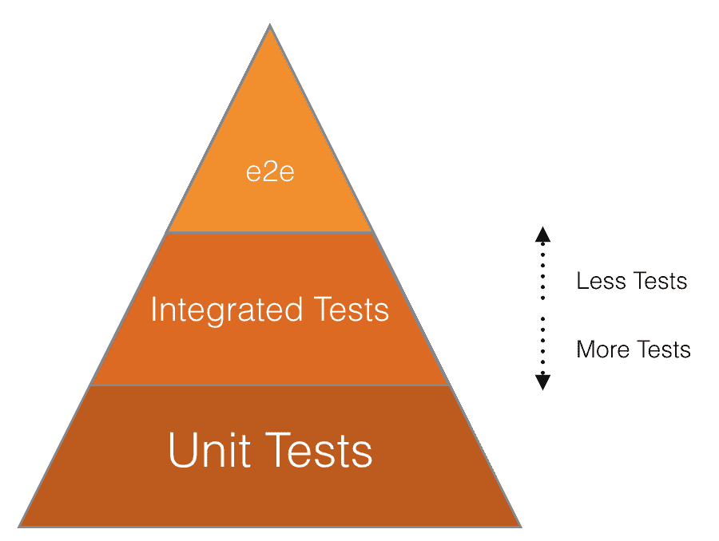

# Testing levels

> 原文：[https://docs.gitlab.com/ee/development/testing_guide/testing_levels.html](https://docs.gitlab.com/ee/development/testing_guide/testing_levels.html)

*   [Unit tests](#unit-tests)
    *   [Frontend unit tests](#frontend-unit-tests)
        *   [When to use unit tests](#when-to-use-unit-tests)
        *   [When *not* to use unit tests](#when-not-to-use-unit-tests)
        *   [What to mock in unit tests](#what-to-mock-in-unit-tests)
        *   [What *not* to mock in unit tests](#what-not-to-mock-in-unit-tests)
    *   [Frontend component tests](#frontend-component-tests)
        *   [When to use component tests](#when-to-use-component-tests)
        *   [When *not* to use component tests](#when-not-to-use-component-tests)
        *   [What to mock in component tests](#what-to-mock-in-component-tests)
        *   [What *not* to mock in component tests](#what-not-to-mock-in-component-tests)
*   [Integration tests](#integration-tests)
    *   [Frontend integration tests](#frontend-integration-tests)
        *   [When to use integration tests](#when-to-use-integration-tests)
        *   [What to mock in integration tests](#what-to-mock-in-integration-tests)
        *   [What *not* to mock in integration tests](#what-not-to-mock-in-integration-tests)
    *   [About controller tests](#about-controller-tests)
    *   [About Karma](#about-karma)
*   [White-box tests at the system level (formerly known as System / Feature tests)](#white-box-tests-at-the-system-level-formerly-known-as-system--feature-tests)
    *   [Frontend feature tests](#frontend-feature-tests)
        *   [When to use feature tests](#when-to-use-feature-tests)
        *   [Relevant notes](#relevant-notes)
    *   [Consider **not** writing a system test](#consider-not-writing-a-system-test)
*   [Black-box tests at the system level, aka end-to-end tests](#black-box-tests-at-the-system-level-aka-end-to-end-tests)
    *   [Smoke tests](#smoke-tests)
    *   [GitLab QA orchestrator](#gitlab-qa-orchestrator)
*   [EE-specific tests](#ee-specific-tests)
*   [How to test at the correct level?](#how-to-test-at-the-correct-level)
    *   [Frontend-related tests](#frontend-related-tests)

# Testing levels[](#testing-levels "Permalink")

[](img/testing_triangle.png)

*此图说明了我们使用的每种测试类型的相对优先级. `e2e`代表端到端.*

截至 2019-05-01，我们每个级别的测试分布如下：

| 测试等级 | 社区版 | 企业版 | 社区+企业版 |
| --- | --- | --- | --- |
| 系统级别的黑盒测试（也称为端到端或 QA 测试） | 68 (0.14%) | 31 (0.2%) | 99 (0.17%) |
| 系统级别的白盒测试（也称为系统或功能测试） | 5,471 (11.9%) | 969 (7.4%) | 6440 (10.9%) |
| 整合测试 | 8,333 (18.2%) | 2,244 (17.2%) | 10,577 (17.9%) |
| 单元测试 | 32,031 (69.7%) | 9,778 (75.1%) | 41,809 (71%) |

## Unit tests[](#unit-tests "Permalink")

正式定义： [https](https://en.wikipedia.org/wiki/Unit_testing) : [//en.wikipedia.org/wiki/Unit_testing](https://en.wikipedia.org/wiki/Unit_testing)

这类测试可确保单个代码单元（一种方法）按预期工作（给定输入，它具有可预测的输出）. 这些测试应尽可能隔离. 例如，对数据库不做任何事情的模型方法不需要数据库记录. 不需要数据库记录的类应尽可能使用存根/双精度数.

| 代码路径 | 测试路径 | 测试引擎 | Notes |
| --- | --- | --- | --- |
| `app/assets/javascripts/` | `spec/javascripts/`, `spec/frontend/` | 因果 | " [前端测试指南"](frontend_testing.html)部分中的更多详细信息. |
| `app/finders/` | `spec/finders/` | RSpec |   |
| `app/graphql/` | `spec/graphql/` | RSpec |   |
| `app/helpers/` | `spec/helpers/` | RSpec |   |
| `app/models/` | `spec/models/` | RSpec |   |
| `app/policies/` | `spec/policies/` | RSpec |   |
| `app/presenters/` | `spec/presenters/` | RSpec |   |
| `app/serializers/` | `spec/serializers/` | RSpec |   |
| `app/services/` | `spec/services/` | RSpec |   |
| `app/uploaders/` | `spec/uploaders/` | RSpec |   |
| `app/validators/` | `spec/validators/` | RSpec |   |
| `app/views/` | `spec/views/` | RSpec |   |
| `app/workers/` | `spec/workers/` | RSpec |   |
| `bin/` | `spec/bin/` | RSpec |   |
| `config/` | `spec/config/` | RSpec |   |
| `config/initializers/` | `spec/initializers/` | RSpec |   |
| `config/routes.rb`, `config/routes/` | `spec/routing/` | RSpec |   |
| `config/puma.example.development.rb`, `config/unicorn.rb.example` | `spec/rack_servers/` | RSpec |   |
| `db/` | `spec/db/` | RSpec |   |
| `db/{post_,}migrate/` | `spec/migrations/` | RSpec | 更多信息，请参见《 [Testing Rails 迁移指南》](testing_migrations_guide.html) . |
| `Gemfile` | `spec/dependencies/`, `spec/sidekiq/` | RSpec |   |
| `lib/` | `spec/lib/` | RSpec |   |
| `lib/tasks/` | `spec/tasks/` | RSpec |   |
| `rubocop/` | `spec/rubocop/` | RSpec |   |
| `spec/factories` | `spec/factories_spec.rb` | RSpec |   |

### Frontend unit tests[](#frontend-unit-tests "Permalink")

Unit tests are on the lowest abstraction level and typically test functionality that is not directly perceivable by a user.

图 RL plain [普通 JavaScript]; Vue [Vue 组件]; feature-flags [功能标志]; 许可证检查[许可证检查]； 普通--Vuex; 普通--GraphQL; Vue--简单 Vue --- Vuex； Vue--GraphQL; 浏览器-普通 浏览器--- Vue； 普通-后端; Vuex-后端; GraphQL--后端; Vue-后端； 后端-数据库 后端-功能标记; 后端-许可证检查； 普通测试 经过 Vuex 类测试； classDef 节点颜色：＃909090，填充：＃f0f0f0，笔划宽度：2px，笔划：＃909090 classDef 标签 stroke-width：0; classDef 测试的颜色：＃000000，填充：＃a0c0ff，笔划：＃6666ff，笔划宽度：2px，笔划数组：5、5; 经过测试的子图； 嘲笑 等级测试 结束

#### When to use unit tests[](#when-to-use-unit-tests "Permalink")

*   **导出的函数和类** ：导出的所有内容都可以以您无法控制的方式在各个地方重复使用. 您应该用测试记录公共接口的预期行为.
*   **Vuex 操作** ：任何 Vuex 操作都必须以一致的方式工作，而不依赖于触发它的组件.
*   **Vuex 突变** ：对于复杂的 Vuex 突变，您应该将测试与 Vuex 存储的其他部分分开，以简化问题解决的过程.

#### When *not* to use unit tests[](#when-not-to-use-unit-tests "Permalink")

*   **非导出的函数或类** ：任何未从模块导出的东西都可以视为私有或实现细节，不需要进行测试.
*   **常量** ：测试**常量**的值意味着将其复制，从而导致额外的工作，而又没有信心确保该值正确.
*   **Vue 组件** ：计算出的属性，方法和生命周期挂钩可被视为组件的实现细节，它们被组件测试隐式涵盖，并且不需要进行测试. 有关更多信息，请参见[官方 Vue 指南](https://vue-test-utils.vuejs.org/guides/#getting-started) .

#### What to mock in unit tests[](#what-to-mock-in-unit-tests "Permalink")

*   **被测类**的状态：直接修改**被测类**的状态而不是使用类的方法可以避免测试设置中的副作用.
*   **其他导出的类** ：必须隔离测试每个类，以防止测试方案成倍增长.
*   **如果将单个 DOM 元素作为参数传递** ：对于仅在单个 DOM 元素而不是整个页面上运行的测试，创建这些元素比加载整个 HTML 固定工具便宜.
*   **所有服务器请求** ：在运行前端单元测试时，后端可能无法访问，因此需要模拟所有传出的请求.
*   **异步后台操作** ：后台操作无法停止或等待，因此它们将在以下测试中继续运行并产生副作用.

#### What *not* to mock in unit tests[](#what-not-to-mock-in-unit-tests "Permalink")

*   **非导出的函数或类** ：可以将未导出的所有内容视为该模块的私有内容，并将通过导出的类和函数进行隐式测试.
*   **被测类的方法** ：通过模拟**被测类的**方法，将对模拟进行测试，而不是对实际方法进行测试.
*   **实用程序功能（纯功能或仅修改参数**的功能**）** ：如果某个功能由于没有状态而没有副作用，则可以在测试中不对其进行模拟.
*   **完整的 HTML 页面** ：避免在单元测试中加载整个页面的 HTML，因为这会减慢测试速度.

### Frontend component tests[](#frontend-component-tests "Permalink")

组件测试涵盖了用户可以根据外部信号（例如用户输入，从其他组件触发的事件或应用程序状态）感知到的单个组件的状态.

图 RL plain [普通 JavaScript]; Vue [Vue 组件]; feature-flags [功能标志]; 许可证检查[许可证检查]； 普通--Vuex; 普通--GraphQL; Vue--简单 Vue --- Vuex； Vue--GraphQL; 浏览器-普通 浏览器--- Vue； 普通-后端; Vuex-后端; GraphQL--后端; Vue-后端； 后端-数据库 后端-功能标记; 后端-许可证检查； 经过 Vue 测试； classDef 节点颜色：＃909090，填充：＃f0f0f0，笔划宽度：2px，笔划：＃909090 classDef 标签 stroke-width：0; classDef 测试的颜色：＃000000，填充：＃a0c0ff，笔划：＃6666ff，笔划宽度：2px，笔划数组：5、5; 经过测试的子图； 嘲笑 等级测试 结束

#### When to use component tests[](#when-to-use-component-tests "Permalink")

*   **组件视图**

#### When *not* to use component tests[](#when-not-to-use-component-tests "Permalink")

*   **Vue 应用程序** ：Vue 应用程序可能包含许多组件. 在组件级别测试它们需要太多的工作. 因此，它们在前端集成级别进行了测试.
*   **HAML 模板** ：HAML 模板仅包含标记，不包含前端逻辑. 因此，它们不是完整的组件.

#### What to mock in component tests[](#what-to-mock-in-component-tests "Permalink")

*   **DOM** ：在真实 DOM 上操作要比在虚拟 DOM 上慢得多.
*   **被测组件的属性和状态** ：与测试类类似，直接修改属性（而不是依赖组件的方法）可以避免副作用.
*   **Vuex 存储库** ：为了避免副作用并简化组件测试，Vuex 存储库被模拟代替.
*   **所有服务器请求** ：与单元测试类似，在运行组件测试时，后端可能无法访问，因此需要模拟所有传出的请求.
*   **异步后台操作** ：与单元测试类似，后台操作无法停止或等待. 这意味着它们将在以下测试中继续运行并产生副作用.
*   **子组件** ：每个组件都经过单独测试，因此要模拟子组件. 另请参见[`shallowMount()`](https://vue-test-utils.vuejs.org/api/#shallowmount)

#### What *not* to mock in component tests[](#what-not-to-mock-in-component-tests "Permalink")

*   **被测组件的方法或计算属性** ：通过模拟**被测组件的**一部分，将对模拟进行测试，而不是实际组件.
*   **独立于 Vue 的函数和类** ：单元测试已经涵盖了所有普通的 JavaScript 代码，无需在组件测试中进行模拟.

## Integration tests[](#integration-tests "Permalink")

正式定义： [https](https://en.wikipedia.org/wiki/Integration_testing) : [//en.wikipedia.org/wiki/Integration_testing](https://en.wikipedia.org/wiki/Integration_testing)

这些测试可确保应用程序的各个部分可以很好地协同工作，而不会造成实际应用程序环境（即浏览器）的开销. 这些测试应在请求/响应级别进行声明：状态码，标头，正文. 它们对于测试权限，重定向，呈现的视图等很有用.

| Code path | 测试路径 | 测试引擎 | Notes |
| --- | --- | --- | --- |
| `app/controllers/` | `spec/controllers/` | RSpec | 对于 N + 1 测试，请使用[请求规范](../query_recorder.html#use-request-specs-instead-of-controller-specs) |
| `app/mailers/` | `spec/mailers/` | RSpec |   |
| `lib/api/` | `spec/requests/api/` | RSpec |   |
| `app/assets/javascripts/` | `spec/javascripts/`, `spec/frontend/` | 因果 | [More details below](#frontend-integration-tests) |

### Frontend integration tests[](#frontend-integration-tests "Permalink")

集成测试涵盖单个页面上所有组件之间的交互. 它们的抽象级别可与用户与 UI 交互的方式进行比较.

图 RL plain [普通 JavaScript]; Vue [Vue 组件]; feature-flags [功能标志]; 许可证检查[许可证检查]； 普通--Vuex; 普通--GraphQL; Vue--简单 Vue --- Vuex； Vue--GraphQL; 浏览器-普通 浏览器--- Vue； 普通-后端; Vuex-后端; GraphQL--后端; Vue-后端； 后端-数据库 后端-功能标记; 后端-许可证检查； 普通测试 经过 Vue 测试； 经过 Vuex 类测试； 经过 GraphQL 类测试； 经过类浏览器测试； linkStyle 0、1、2、3、4、5、6 笔画：＃6666ff，笔画宽度：2px，笔划数组：5、5; classDef 节点颜色：＃909090，填充：＃f0f0f0，笔划宽度：2px，笔划：＃909090 classDef 标签 stroke-width：0; classDef 测试的颜色：＃000000，填充：＃a0c0ff，笔划：＃6666ff，笔划宽度：2px，笔划数组：5、5; 经过测试的子图； 嘲笑 等级测试 结束

#### When to use integration tests[](#when-to-use-integration-tests "Permalink")

*   **页面捆绑包（ `app/assets/javascripts/pages/` `index.js`文件）** ：测试页面捆绑包可确保相应的前端组件很好地集成.
*   **页面捆绑之外的 Vue 应用程序** ：对 Vue 应用程序进行整体测试可确保相应的前端组件很好地集成.

#### What to mock in integration tests[](#what-to-mock-in-integration-tests "Permalink")

*   **HAML 视图（改为使用夹具）** ：渲染 HAML 视图需要一个 Rails 环境，其中包括一个正在运行的数据库，您不能在前端测试中依赖它.
*   **所有服务器请求** ：类似于单元测试和组件测试，在运行组件测试时，后端可能无法访问，因此必须模拟所有传出的请求.
*   **页面上无法感知的异步后台操作** ：影响页面的后台操作必须在此级别上进行测试. 所有其他后台操作都无法停止或等待，因此它们将在以下测试中继续运行并产生副作用.

#### What *not* to mock in integration tests[](#what-not-to-mock-in-integration-tests "Permalink")

*   **DOM** ：在真实的 DOM 上进行测试可确保您的组件在预期的环境中工作. DOM 测试的一部分委托给[跨浏览器测试](https://gitlab.com/gitlab-org/quality/team-tasks/-/issues/45) .
*   **组件的属性或状态** ：在此级别上，所有测试只能执行用户将要执行的操作. 例如：要更改组件的状态，将触发 click 事件.
*   **Vuex 存储** ：整体上测试页面的前端代码时，还将涵盖 Vue 组件与 Vuex 存储之间的交互.

### About controller tests[](#about-controller-tests "Permalink")

在理想的世界中，控制器应该很薄. 但是，如果不是这种情况，则可以编写不使用 JavaScript 而不是控制器测试的系统或功能测试. 测试胖控制器通常涉及很多桩工作，例如：

```
controller.instance_variable_set(:@user, user) 
```

并使用 Rails 5（ [＃23768](https://gitlab.com/gitlab-org/gitlab/-/issues/16260) ）中不推荐使用的方法.

### About Karma[](#about-karma "Permalink")

业力同时在单元测试和集成测试类别中. 业力提供了运行 JavaScript 测试的环境，因此您可以运行单元测试（例如，测试单个 JavaScript 方法）或集成测试（例如，测试由多个组件组成的组件）.

## White-box tests at the system level (formerly known as System / Feature tests)[](#white-box-tests-at-the-system-level-formerly-known-as-system--feature-tests "Permalink")

正式定义：

*   [https://en.wikipedia.org/wiki/System_testing](https://en.wikipedia.org/wiki/System_testing)
*   [https://en.wikipedia.org/wiki/White-box_testing](https://en.wikipedia.org/wiki/White-box_testing)

这些测试可确保 GitLab *Rails*应用程序（例如`gitlab-foss` / `gitlab` ）从*浏览器的*角度正常工作.

注意：

*   仍需要了解应用程序内部的知识
*   测试所需的数据通常是使用 RSpec 工厂直接创建的
*   期望通常在数据库或对象状态上设置

这些测试仅在以下情况下使用：

*   被测试的功能/组件很小
*   对象/数据库的内部状态*需要*测试
*   它不能在较低的水平上进行测试

例如，要测试给定页面上的面包屑，编写系统测试很有意义，因为它是一个很小的组件，无法在单元或控制器级别进行测试.

仅测试幸福的道路，但要确保为使用更好的测试无法在较低级别上捕获到的任何回归添加测试用例（例如，如果找到了回归，则应在可能的最低级别上添加回归测试）.

| 测试路径 | 测试引擎 | Notes |
| --- | --- | --- |
| `spec/features/` | [Capybara](https://github.com/teamcapybara/capybara) + [RSpec](https://github.com/rspec/rspec-rails#feature-specs) | If your test has the `:js` metadata, the browser driver will be [Poltergeist](https://github.com/teamcapybara/capybara#poltergeist), otherwise it’s using [RackTest](https://github.com/teamcapybara/capybara#racktest). |

### Frontend feature tests[](#frontend-feature-tests "Permalink")

与[前端集成测试](#frontend-integration-tests)相反，功能测试针对真正的后端而不是使用固定装置发出请求. 这也意味着将执行数据库查询，这将大大降低该类别的速度.

也可以看看：

*   The [RSpec testing guidelines](../testing_guide/best_practices.html#rspec).
*   [测试最佳实践](best_practices.html#system--feature-tests)中的系统/功能测试.
*   [第 26159 期](https://gitlab.com/gitlab-org/gitlab/-/issues/26159) ，旨在将这些准则与本页面结合在一起.

图 RL plain [普通 JavaScript]; Vue [Vue 组件]; feature-flags [功能标志]; 许可证检查[许可证检查]； 普通--Vuex; 普通--GraphQL; Vue--简单 Vue --- Vuex； Vue--GraphQL; 浏览器-普通 浏览器--- Vue； 普通-后端; Vuex-后端; GraphQL--后端; Vue-后端； 后端-数据库 后端-功能标记; 后端-许可证检查； 经过类后端测试； 普通测试 经过 Vue 测试； 经过 Vuex 类测试； 经过 GraphQL 类测试； 经过类浏览器测试； linkStyle 0、1、2、3、4、5、6、7、8、9、10 笔画：＃6666ff，笔划宽度：2px，笔划数组：5、5; classDef 节点颜色：＃909090，填充：＃f0f0f0，笔划宽度：2px，笔划：＃909090 classDef 标签 stroke-width：0; classDef 测试的颜色：＃000000，填充：＃a0c0ff，笔划：＃6666ff，笔划宽度：2px，笔划数组：5、5; 经过测试的子图； 嘲笑 等级测试 结束

#### When to use feature tests[](#when-to-use-feature-tests "Permalink")

*   需要后端并且无法使用固定装置进行测试的用例.
*   行为不是页面捆绑的一部分，而是全局定义的.

#### Relevant notes[](#relevant-notes "Permalink")

`:js`标志已添加到测试中，以确保已加载完整环境：

```
scenario 'successfully', :js do
  sign_in(create(:admin))
end 
```

每个测试的步骤都是使用（ [水豚法](https://www.rubydoc.info/gems/capybara) ）编写的.

XHR（XMLHttpRequest）调用可能要求您在步骤之间使用`wait_for_requests` ，例如：

```
find('.form-control').native.send_keys(:enter)

wait_for_requests

expect(page).not_to have_selector('.card') 
```

### Consider **not** writing a system test[](#consider-not-writing-a-system-test "Permalink")

如果我们有信心低级组件可以正常工作（如果我们有足够的单元和集成测试，那就应该如此），我们就不需要在系统测试级别重复它们的全面测试.

添加测试非常容易，但是删除或改进测试却要困难得多，因此应该注意不要引入太多（缓慢和重复的）测试.

我们遵循这些最佳做法的原因如下：

*   系统测试运行缓慢，因为它们会在无头浏览器中启动整个应用程序堆栈，而在集成 JS 驱动程序时甚至会更慢
*   当系统测试使用 JavaScript 驱动程序运行时，测试将在与应用程序不同的线程中运行. 这意味着它不共享数据库连接，并且您的测试将必须提交事务才能使正在运行的应用程序看到数据（反之亦然）. 在那种情况下，我们需要在每个规范之后截断数据库，而不是简单地回滚事务（用于其他类型测试的更快策略）. 但是，这比事务处理要慢，因此我们只想在必要时使用截断.

## Black-box tests at the system level, aka end-to-end tests[](#black-box-tests-at-the-system-level-aka-end-to-end-tests "Permalink")

正式定义：

*   [https://en.wikipedia.org/wiki/System_testing](https://en.wikipedia.org/wiki/System_testing)
*   [https://en.wikipedia.org/wiki/Black-box_testing](https://en.wikipedia.org/wiki/Black-box_testing)

GitLab 由[多个组件](../architecture.html#components)组成，例如[GitLab Shell](https://gitlab.com/gitlab-org/gitlab-shell) ， [GitLab Workhorse](https://gitlab.com/gitlab-org/gitlab-workhorse) ， [Gitaly](https://gitlab.com/gitlab-org/gitaly) ， [GitLab Pages](https://gitlab.com/gitlab-org/gitlab-pages) ， [GitLab Runner](https://gitlab.com/gitlab-org/gitlab-runner)和 GitLab Rails. 所有这些部件均由[Omnibus GitLab](https://gitlab.com/gitlab-org/omnibus-gitlab)进行配置和包装.

QA 框架和实例级场景是[GitLab Rails 的一部分，](https://gitlab.com/gitlab-org/gitlab-foss/tree/master/qa)因此它们始终与代码库（尤其是视图）保持同步.

注意：

*   不需要了解应用程序内部
*   测试所需的数据只能使用 GUI 或 API 创建
*   只能针对浏览器页面和 API 响应做出期望

每个新功能都应附带[测试计划](https://gitlab.com/gitlab-org/gitlab/tree/master/.gitlab/issue_templates/Test plan.md) .

| 测试路径 | 测试引擎 | Notes |
| --- | --- | --- |
| `qa/qa/specs/features/` | [Capybara](https://github.com/teamcapybara/capybara) + [RSpec](https://github.com/rspec/rspec-rails#feature-specs) +自定义质量检查框架 | 测试应放在相应的[产品类别下](https://about.gitlab.com/handbook/product/product-categories/) |

> 有关更多信息，请参见[端对端测试](end_to_end/index.html) .

请注意， `qa/spec`包含 QA 框架本身的[单元测试](#unit-tests) ，请勿与应用程序的[单元测试](#unit-tests)或[端到端](#black-box-tests-at-the-system-level-aka-end-to-end-tests) [测试](#unit-tests)相混淆.

### Smoke tests[](#smoke-tests "Permalink")

冒烟测试是可以随时运行的快速测试（尤其是在部署前迁移之后）.

这些测试针对 UI 运行，并确保基本功能正常运行.

> 有关更多信息，请参见[烟雾测试](smoke.html) .

### GitLab QA orchestrator[](#gitlab-qa-orchestrator "Permalink")

[GitLab QA 协调器](https://gitlab.com/gitlab-org/gitlab-qa)是一种工具，可以通过为给定版本的 GitLab Rails 构建 Docker 映像并对其进行端到端测试（即使用 Capybara）来测试所有这些部分是否集成良好.

在[GitLab 质量检查协调器自述文件中](https://gitlab.com/gitlab-org/gitlab-qa/tree/master/README.md)了解更多信息.

## EE-specific tests[](#ee-specific-tests "Permalink")

特定于 EE 的测试遵循相同的组织，但位于`ee/spec`文件夹下.

## How to test at the correct level?[](#how-to-test-at-the-correct-level "Permalink")

与生活中的许多事情一样，决定在每个测试级别上测试什么是一个权衡：

*   单元测试通常很便宜，您应该将它们视为房子的地下室：您需要它们来确保您的代码行为正确. 但是，如果仅运行单元测试而不进行集成/系统测试，则可能会[错过](https://twitter.com/ThePracticalDev/status/850748070698651649) [大局](https://twitter.com/timbray/status/822470746773409794) / [大局](https://twitter.com/withzombies/status/829716565834752000) ！
*   集成测试要贵一些，但是请不要滥用它们. 系统测试通常比集成测试要好得多.
*   系统测试非常昂贵（与单元测试相比），如果它们需要 JavaScript 驱动程序，则价格甚至更高. 确保遵循" [速度"](best_practices.html#test-speed)部分中的准则.

另一种看待它的方式是考虑"测试成本"，本文对此进行了很好的解释[，](https://medium.com/table-xi/high-cost-tests-and-high-value-tests-a86e27a54df#.2ulyh3a4e)基本思想是测试成本包括：

*   编写测试所需的时间
*   套件每次运行都需要运行测试的时间
*   了解测试所需的时间
*   如果测试失败并且基础代码正常，则修复测试所花费的时间
*   也许，更改代码以使其可测试所需的时间.

### Frontend-related tests[](#frontend-related-tests "Permalink")

在某些情况下，要测试的行为不值得花时间运行整个应用程序，例如，如果要测试样式，动画，边缘情况或不涉及后端的小动作，则应编写集成测试使用茉莉花.

* * *

[Return to Testing documentation](index.html)