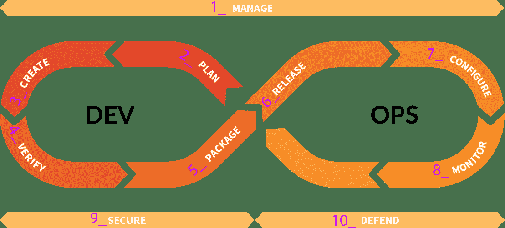

# Beginner's guide to writing end-to-end tests

> 原文：[https://docs.gitlab.com/ee/development/testing_guide/end_to_end/beginners_guide.html](https://docs.gitlab.com/ee/development/testing_guide/end_to_end/beginners_guide.html)

*   [Before you write a test](#before-you-write-a-test)
*   [Determine if end-to-end tests are needed](#determine-if-end-to-end-tests-are-needed)
*   [Identify the DevOps stage](#identify-the-devops-stage)
*   [Create a skeleton test](#create-a-skeleton-test)
    *   [The outer `context` block](#the-outer-context-block)
    *   [The outer `RSpec.describe` block](#the-outer-rspecdescribe-block)
    *   [The `describe` block](#the-describe-block)
    *   [The `it` blocks (examples)](#the-it-blocks-examples)
*   [Write the test](#write-the-test)
*   [De-duplicate your code](#de-duplicate-your-code)
*   [Test setup using resources and page objects](#test-setup-using-resources-and-page-objects)
*   [Write the page object](#write-the-page-object)
*   [Run the spec](#run-the-spec)

# Beginner’s guide to writing end-to-end tests[](#beginners-guide-to-writing-end-to-end-tests "Permalink")

在本教程中，您将学习如何为[GitLab 社区版](https://about.gitlab.com/install/?version=ce)和[GitLab 企业版](https://about.gitlab.com/install/)创建端到端（ *e2e* ）测试.

在本教程结束时，您将能够：

*   确定是否需要端到端测试.
*   Understand the directory structure within `qa/`.
*   编写一个基本的端到端测试，以验证登录功能.
*   开发任何缺少的[页面对象](page_objects.html)库.

## Before you write a test[](#before-you-write-a-test "Permalink")

在编写测试之前，必须将您的[GitLab 开发套件（GDK）](https://gitlab.com/gitlab-org/gitlab-development-kit)配置为运行规范. 端到端测试：

*   包含在`qa/`目录中.
*   应该是独立和[幂等的](https://en.wikipedia.org/wiki/Idempotence#Computer_science_meaning) .
*   临时创建[资源](resources.html) （例如项目，问题，用户）.
*   Test the UI and API interfaces, and use the API to efficiently set up the UI tests.

**提示：**有关更多信息，请参阅[端到端测试最佳实践](best_practices.html) .

## Determine if end-to-end tests are needed[](#determine-if-end-to-end-tests-are-needed "Permalink")

在编写端到端测试之前，请为[GitLab 社区版](https://gitlab-org.gitlab.io/gitlab-foss/coverage-ruby/#_AllFiles)和[GitLab 企业版](https://gitlab-org.gitlab.io/gitlab/coverage-ruby/#_AllFiles)项目检查特定功能的代码覆盖率. 在单元，功能或集成级别上是否存在足够的测试范围？ 如果回答*是肯定的* ，那么你*就*需要一个终端到终端的测试.

有关 GitLab 中每个级别的测试分布的信息，请参见[测试级别](https://gitlab.com/gitlab-org/gitlab/blob/master/doc/development/testing_guide/testing_levels.md) .

*   请参阅[如何以正确的级别进行测试？](https://gitlab.com/gitlab-org/gitlab/blob/master/doc/development/testing_guide/testing_levels.md#how-to-test-at-the-correct-level) " [测试级别"](https://gitlab.com/gitlab-org/gitlab/blob/master/doc/development/testing_guide/testing_levels.md)文档的"部分".
*   查看功能更改的频率. 如果较低级别的测试中已经包含了稳定的特性，那么这些特性不会经常更改，那么端到端测试可能就不值得考虑.
*   最后，与参与实现功能和较低级别测试的开发人员讨论建议的测试.

**注意：**检查[GitLab 社区版](https://gitlab-org.gitlab.io/gitlab-foss/coverage-ruby/#_AllFiles)和[GitLab 企业版](https://gitlab-org.gitlab.io/gitlab/coverage-ruby/#_AllFiles)覆盖率项目，以检查是否为此功能编写了以前的测试. 为了分析代码覆盖率，您必须了解哪些应用程序文件实现了特定功能.**注意：**在本教程中，我们将编写一个登录端到端测试，即使它已经被较低级别的测试所覆盖，因为这是大多数端到端流的第一步，并且最容易理解.

## Identify the DevOps stage[](#identify-the-devops-stage "Permalink")

GitLab QA 端到端测试是由[DevOps 生命周期](https://gitlab.com/gitlab-org/gitlab-foss/tree/master/qa/qa/specs/features/browser_ui)的不同[阶段](https://gitlab.com/gitlab-org/gitlab-foss/tree/master/qa/qa/specs/features/browser_ui)组织的. 确定应按[阶段](https://about.gitlab.com/handbook/product/product-categories/#devops-stages)放置测试的位置，确定该测试属于哪个功能，然后将其放置在该阶段下的子目录中.

[](img/gl-devops-lifecycle-by-stage-numbers_V12_10.png)

**注意：**如果该测试仅是企业版，则将在`features/ee`目录中创建该测试，但遵循相同的 DevOps 生命周期格式.

## Create a skeleton test[](#create-a-skeleton-test "Permalink")

在本教程的第一部分中，我们将测试由 Manage 阶段拥有的登录名. 在`qa/specs/features/browser_ui/1_manage/login` ，创建文件`basic_login_spec.rb` .

### The outer `context` block[](#the-outer-context-block "Permalink")

参见[`RSpec.describe`外部块](#the-outer-rspecdescribe-block)

**弃用声明：**遵循 RSpec 4.0 规范在`13.2`中[弃用](https://gitlab.com/gitlab-org/quality/team-tasks/-/issues/550)了外部`context` . 请改用`RSpec.describe` .

### The outer `RSpec.describe` block[](#the-outer-rspecdescribe-block "Permalink")

规格具有外部`RSpec.describe`指示 DevOps 阶段.

```
# frozen_string_literal: true

module QA
  RSpec.describe 'Manage' do

  end
end 
```

### The `describe` block[](#the-describe-block "Permalink")

在我们的外部`RSpec.describe`内部，描述要测试的功能. 在这种情况下，请`Login` .

```
# frozen_string_literal: true

module QA
  RSpec.describe 'Manage' do
    describe 'Login' do

    end
  end
end 
```

### The `it` blocks (examples)[](#the-it-blocks-examples "Permalink")

每个测试套件包含至少一个`it`阻断（实施例）. 一个好方法，开始写终端到终端的测试是编写测试用例描述为`it`块：

```
module QA
  RSpec.describe 'Manage' do
    describe 'Login' do
      it 'can login' do

      end

      it 'can logout' do

      end
    end
  end
end 
```

## Write the test[](#write-the-test "Permalink")

一个重要的问题是"我们要测试什么？" 更重要的是，"我们如何测试？"

首先登录.

```
# frozen_string_literal: true

module QA
  RSpec.describe 'Manage' do
    describe 'Login' do
      it 'can login' do
        Flow::Login.sign_in

      end

      it 'can logout' do
        Flow::Login.sign_in

      end
    end
  end
end 
```

[运行规范后](#run-the-spec) ，我们的测试应登录并结束； 那么我们应该回答"我们要测试什么？"这个问题.

```
# frozen_string_literal: true

module QA
  RSpec.describe 'Manage' do
    describe 'Login' do
      it 'can login' do
        Flow::Login.sign_in

        Page::Main::Menu.perform do |menu|
          expect(menu).to be_signed_in
        end
      end

      it 'can logout' do
        Flow::Login.sign_in

        Page::Main::Menu.perform do |menu|
          menu.sign_out

          expect(menu).not_to be_signed_in
        end
      end
    end
  end
end 
```

**我们要测试什么？**

1.  我们可以登录吗？
2.  我们可以注销吗？

**我们如何测试？**

1.  检查用户头像是否出现在顶部导航中.
2.  检查用户头像*是否未*出现在顶部导航中.

**注意：**在幕后， `be_signed_in`是一个[谓词匹配器](https://relishapp.com/rspec/rspec-expectations/v/3-8/docs/built-in-matchers/predicate-matchers) ，可[实现对用户头像的检查](https://gitlab.com/gitlab-org/gitlab/-/blob/master/qa/qa/page/main/menu.rb#L74) .

## De-duplicate your code[](#de-duplicate-your-code "Permalink")

将测试重构为使用`before`块进行测试设置，因为它复制了对`sign_in`的调用.

```
# frozen_string_literal: true

module QA
  RSpec.describe 'Manage' do
    describe 'Login' do
      before do
        Flow::Login.sign_in
      end

      it 'can login' do
        Page::Main::Menu.perform do |menu|
          expect(menu).to be_signed_in
        end
      end

      it 'can logout' do
        Page::Main::Menu.perform do |menu|
          menu.sign_out

          expect(menu).not_to be_signed_in
        end
      end
    end
  end
end 
```

`before`块本质上是一个`before(:each)`并且在每个示例之前运行，确保我们现在在每个测试的开始处登录.

## Test setup using resources and page objects[](#test-setup-using-resources-and-page-objects "Permalink")

接下来，让我们测试登录以外的其他功能. 让我们测试"计划"阶段拥有的"问题"，因此在`qa/specs/features/browser_ui/3_create/issues` [创建一个](#identify-the-devops-stage)名为`issues_spec.rb` .

```
# frozen_string_literal: true

module QA
  RSpec.describe 'Plan' do
    describe 'Issues' do
      let(:issue) do
        Resource::Issue.fabricate_via_api! do |issue|
          issue.title = 'My issue'
          issue.description = 'This is an issue specific to this test'
        end
      end

      before do
        Flow::Login.sign_in
        issue.visit!
      end

      it 'can close an issue' do
        Page::Project::Issue::Show.perform do |show|
          show.click_close_issue_button

          expect(show).to be_closed
        end
      end
    end
  end
end 
```

请注意以下要点：

*   在我们的示例开始时，我们将在`page/issue/show.rb` [页面](page_objects.html) .
*   我们的测试仅在需要时制造需要的东西.
*   该问题是通过 API 伪造的，以节省时间.
*   GitLab 更喜欢`let()`不是实例变量. 查看[最佳做法](../best_practices.html#let-variables) .
*   `be_closed`尚未在`page/project/issue/show.rb`中实现，但将在下一步中实现.

该问题被伪装成[Resource](resources.html) ，它是您可以通过 UI 或 API 创建的 GitLab 实体. 其他示例包括：

*   A [Merge Request](https://gitlab.com/gitlab-org/gitlab/-/blob/master/qa/qa/resource/merge_request.rb).
*   A [User](https://gitlab.com/gitlab-org/gitlab/-/blob/master/qa/qa/resource/user.rb).
*   A [Project](https://gitlab.com/gitlab-org/gitlab/-/blob/master/qa/qa/resource/project.rb).
*   A [Group](https://gitlab.com/gitlab-org/gitlab/-/blob/master/qa/qa/resource/group.rb).

## Write the page object[](#write-the-page-object "Permalink")

[Page Object](page_objects.html)是我们套件中的一个类，代表 GitLab 中的一个页面. **登录**页面就是一个例子. 由于我们的" **问题显示"**页面的页面对象已经存在，请添加`closed?` 方法.

```
module Page::Project::Issue
  class Show
    view 'app/views/projects/issues/show.html.haml' do
      element :closed_status_box
    end

    def closed?
      has_element?(:closed_status_box)
    end
  end
end 
```

接下来，在视图中定义元素`closed_status_box` ，以便页面对象可以看到它.

```
-#=> app/views/projects/issues/show.html.haml .issuable-status-box.status-box.status-box-issue-closed{ ..., data: { qa_selector: 'closed_status_box' } } 
```

## Run the spec[](#run-the-spec "Permalink")

在运行规范之前，请确认：

*   GDK 已安装.
*   GDK 在本地 3000 端口上运行.
*   尚未应用其他[RSpec 元数据标签](rspec_metadata_tests.html) .
*   您的工作目录是 GDK GitLab 安装中的`qa/` .

要运行该规范，请运行以下命令：

```
bundle exec bin/qa Test::Instance::All http://localhost:3000 -- <test_file> 
```

Where `<test_file>` is:

*   运行"登录"示例时，请输入`qa/specs/features/browser_ui/1_manage/login/login_spec.rb` .
*   运行"问题"示例时，请执行`qa/specs/features/browser_ui/2_plan/issues/issue_spec.rb` .