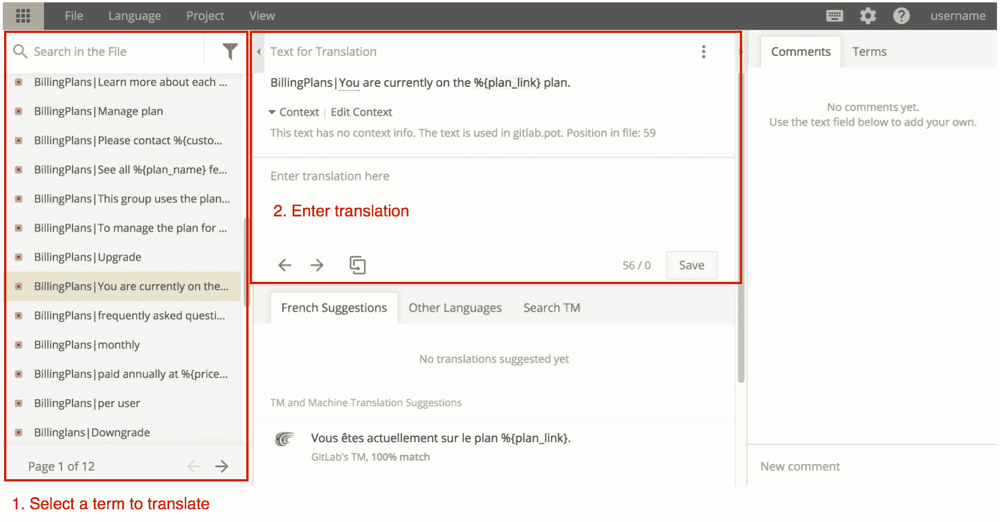

# Translating GitLab

> 原文：[https://docs.gitlab.com/ee/development/i18n/translation.html](https://docs.gitlab.com/ee/development/i18n/translation.html)

*   [Using CrowdIn](#using-crowdin)
    *   [Sign In](#sign-in)
    *   [Language Selections](#language-selections)
    *   [Translation Editor](#translation-editor)
*   [General Translation Guidelines](#general-translation-guidelines)
    *   [Namespaced strings](#namespaced-strings)
    *   [Technical terms](#technical-terms)
    *   [Formality](#formality)
    *   [Inclusive language](#inclusive-language)
    *   [Updating the glossary](#updating-the-glossary)
*   [French Translation Guidelines](#french-translation-guidelines)
    *   [Inclusive language in French](#inclusive-language-in-french)

# Translating GitLab

为了管理翻译过程，我们使用[CrowdIn](https://crowdin.com) .

## Using CrowdIn

第一步是熟悉 CrowdIn.

### Sign In

要在[https://translate.gitlab.com 上](https://translate.gitlab.com)提供翻译，您必须创建一个 CrowdIn 帐户. 您可以创建一个新帐户或使用其任何受支持的登录服务.

### Language Selections

manbetx 客户端打不开被翻译成多种语言.

1.  通过单击标志来选择您想要贡献翻译的语言
2.  您将看到文件和文件夹的列表. 单击`gitlab.pot`打开翻译编辑器.

### Translation Editor

The online translation editor is the easiest way to contribute translations.

1.  用于翻译的字符串列在左侧面板中
2.  翻译输入到中央面板中. 包含复数的字符串将需要多次翻译. 上面显示了要翻译的字符串，并突出显示了词汇表术语. 如果要翻译的字符串不清楚，则可以"请求上下文"

单击右侧的术语，可以在右侧面板中找到常用术语的词汇表. 可以添加评论以与社区讨论翻译.

记住要**保存**每个翻译.

## General Translation Guidelines

转换任何字符串之前，请务必检查以下准则.

### Namespaced strings

当外部字符串带有名称空间（例如`s_('OpenedNDaysAgo|Opened')` ，应从最终转换中删除该名称空间. 例如，用法语`OpenedNDaysAgo|Opened`将被翻译为`Ouvert•e` ，而不是`OpenedNDaysAgo|Ouvert•e` .

### Technical terms

某些技术术语应像专有名词一样对待，不要翻译.

使用[https://translate.gitlab.com](https://translate.gitlab.com)时，在词汇表中会注明应始终为英语的技术术语.

这有助于维护工具（例如`git`客户端）和 GitLab 之间的逻辑连接和一致性.

### Formality

软件中使用的形式级别因语言而异：

| Language | Formality | Example |
| --- | --- | --- |
| French | formal | `vous` for `you` |
| German | informal | `du` for `you` |

您可以参考词汇表中其他翻译的字符串和注释，以帮助确定适当的形式水平.

### Inclusive language

[多样性](https://about.gitlab.com/handbook/values/#diversity)是 GitLab 的价值之一. 我们要求您避免翻译将性别或族裔排除在外的人. 在区分男女形式的语言中，请同时使用或选择中性的表述.

例如，德语中的"用户"一词可以翻译成" Benutzer"（男性）或" Benutzerin"（女性）. 因此，"创建新用户"将翻译为" Benutzer（in）anlegen".

### Updating the glossary

要提出对词汇表的补充，请[打开一期](https://gitlab.com/gitlab-org/gitlab/-/issues?scope=all&utf8=✓&state=all&label_name[]=Category:Internationalization) .

## French Translation Guidelines

### Inclusive language in French

在法语中，"包容所有法律"已结束（请参见[Legifrance](https://www.legifrance.gouv.fr/affichTexte.do?cidTexte=JORFTEXT000036068906&categorieLien=id) ）. 因此，要包括两个性别，请写上" Utilisateurs et utilisatrices"，而不是" Utilisateur·rice·s". 如果缺少空间，则应单独使用男性.