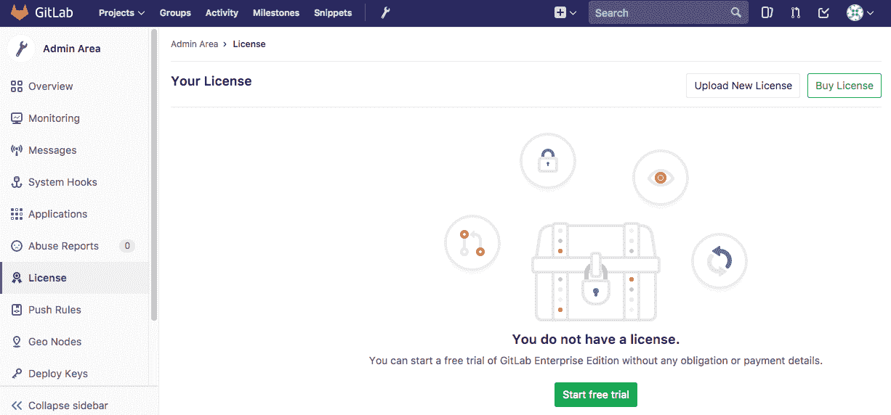
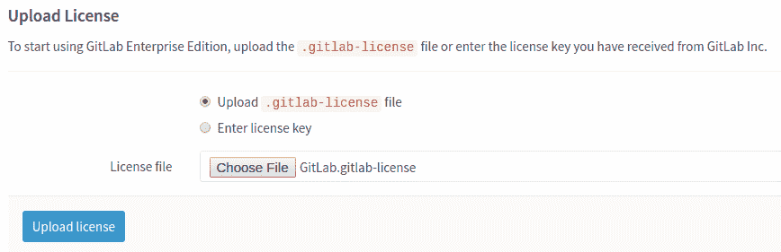
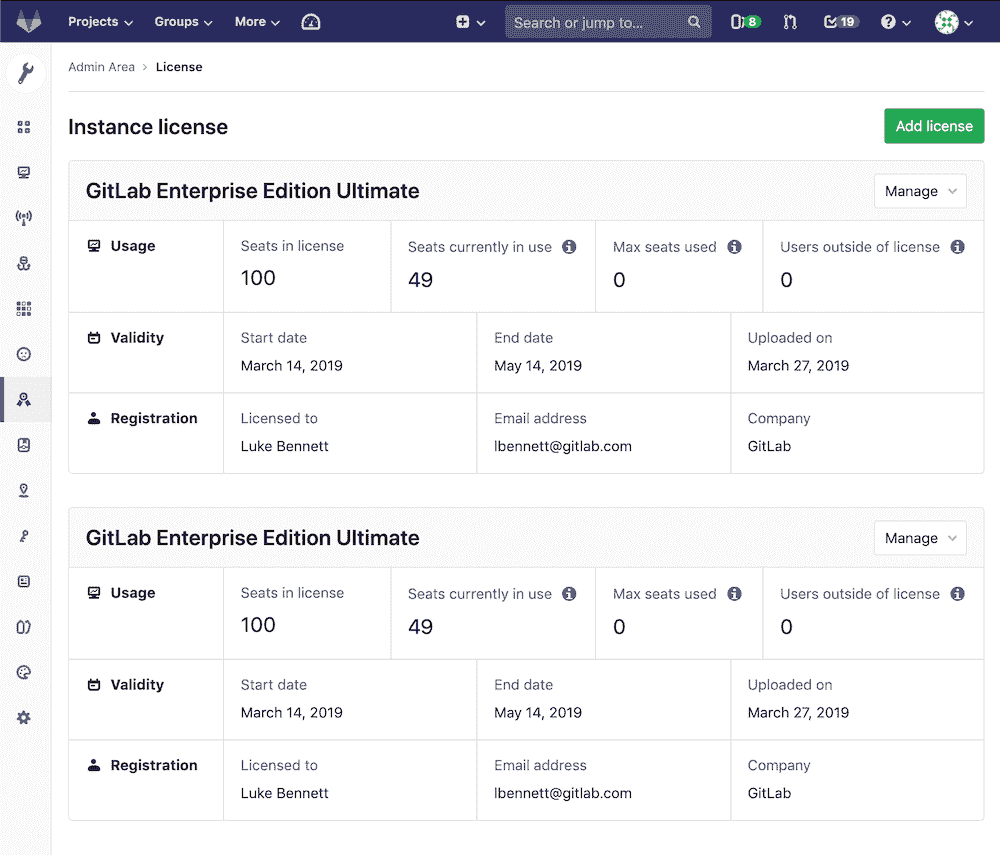

# Activate GitLab EE with a license

> 原文：[https://docs.gitlab.com/ee/user/admin_area/license.html](https://docs.gitlab.com/ee/user/admin_area/license.html)

*   [Uploading your license](#uploading-your-license)
*   [Add your license at install time](#add-your-license-at-install-time)
*   [Notification before the license expires](#notification-before-the-license-expires)
*   [What happens when your license expires](#what-happens-when-your-license-expires)
*   [License history](#license-history)
*   [Troubleshooting](#troubleshooting)
    *   [There is no License tab in the Admin Area](#there-is-no-license-tab-in-the-admin-area)
    *   [Users exceed license limit upon renewal](#users-exceed-license-limit-upon-renewal)

# Activate GitLab EE with a license[](#activate-gitlab-ee-with-a-license-starter-only "Permalink")

要激活所有 GitLab 企业版（EE）功能，您需要上传许可证. 从 GitLab Inc.获得许可证后，您可以通过**以管理员身份登录到 GitLab 实例**或在安装时添加许可证来上载许可证.

许可证的形式为 base64 编码的 ASCII 文本，扩展名为`.gitlab-license` ，可以在[购买](https://about.gitlab.com/pricing/) `.gitlab-license`或注册[免费试用时获得](https://about.gitlab.com/free-trial/) .

**注意：**从 GitLab Enterprise Edition 9.4.0 开始，没有上载许可证的新安装实例将仅具有核心功能. 试用许可证将激活所有 Ultimate 功能，但是[试用期满后](#what-happens-when-your-license-expires) ，某些功能将被锁定.

## Uploading your license[](#uploading-your-license "Permalink")

首次访问以 admin 身份登录的 GitLab EE 安装时，您会看到一条注释，敦促您上传许可证，并带有一个链接，该链接可直接转到**Admin Area> License** .

否则，您可以：

1.  通过单击菜单栏中的扳手图标，手动导航到**管理区域** .

    [](img/admin_wrench.png)

2.  然后转到" **许可证"**选项卡，然后单击"上**载新许可证"** .

    [](img/license_admin_area.png)

3.  如果您收到`.gitlab-license`文件，则应该已经将其下载到本地计算机中. 然后，您可以通过选择许可证文件并单击"上**载许可证"**按钮直接上载它. 在下图中，您可以看到所选的许可证文件名为`GitLab.gitlab-license` .

    [](img/license_upload.png)

    如果您以纯文本格式收到许可证，则需要选择"输入许可证密钥"选项，复制许可证，将其粘贴到"许可证密钥"字段中，然后点击**上传许可证** .

## Add your license at install time[](#add-your-license-at-install-time "Permalink")

通过将名为`Gitlab.gitlab-license`的文件放置在`/etc/gitlab/`对于 Omnibus）或`config/`对于源代码安装，可以在安装时自动导入`Gitlab.gitlab-license` .

还可以为许可证指定自定义位置和文件名.

源代码安装应使用有效的 GitLab Enterprise Edition 许可证的路径设置`GITLAB_LICENSE_FILE`环境变量.

```
export GITLAB_LICENSE_FILE="/path/to/license/file" 
```

Omnibus 安装应将此条目添加到`gitlab.rb` ：

```
gitlab_rails['initial_license_file'] = "/path/to/license/file" 
```

**警告：**这些方法只会在安装时添加许可证. 使用 Web 用户界面中的"管理区域"来续订或升级许可证.

* * *

许可证上载后，所有 GitLab 企业版功能都将处于激活状态，直到许可证期结束. 该时间段结束后，该实例将[恢复](#what-happens-when-your-license-expires)为仅 Core 功能.

您可以随时在"管理区域"的"许可证"部分中查看许可证详细信息.

[](img/license_details.png)

## Notification before the license expires[](#notification-before-the-license-expires "Permalink")

许可证到期前一个月，GitLab 管理员将开始看到一条消息，通知到期时间. 确保您更新了许可证，否则，如果许可证过期，您将错过所有付费功能.

## What happens when your license expires[](#what-happens-when-your-license-expires "Permalink")

万一您的许可证过期，GitLab 将锁定某些功能，如 Git 推送，问题创建等，并且将向所有管理员显示一条消息，告知已过期的许可证.

为了恢复所有以前的功能，必须上载新的许可证. 要退回到仅激活核心功能，您需要删除过期的许可证.

## License history[](#license-history "Permalink")

可以上传和查看多个许可证，但是只有最新的许可证将用作活动许可证.

## Troubleshooting[](#troubleshooting "Permalink")

### There is no License tab in the Admin Area[](#there-is-no-license-tab-in-the-admin-area "Permalink")

如果您最初安装的是 Community Edition，而不是 Enterprise Edition，则需要在[升级](../../update/README.html#community-to-enterprise-edition)许可证之前[升级到 Enterprise Edition](../../update/README.html#community-to-enterprise-edition) .

GitLab.com 用户无法上传和使用自我管理的许可证. 如果您希望在 GitLab.com 上使用付费功能，则可以[购买](../../subscriptions/index.html#subscribe-to-gitlabcom)单独的订阅.

### Users exceed license limit upon renewal[](#users-exceed-license-limit-upon-renewal "Permalink")

如果您在续订之前将新用户添加到您的 GitLab 实例中，则可能需要购买额外的席位来覆盖这些用户. 如果是这种情况，并且上传了没有足够用户的许可证，则会显示一条消息，提示您购买其他用户. 有关如何确定所需用户数以及如何增加其他席位的更多信息，请参见[许可常见问题解答](https://about.gitlab.com/pricing/licensing-faq/) .